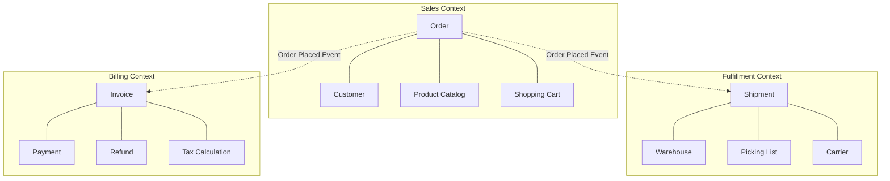

# How to Implement Domain-Driven Design Bounded Contexts as Microservices on GCP

Author: [nawazdhandala](https://www.github.com/nawazdhandala)

Tags: GCP, Domain-Driven Design, Microservices, Bounded Contexts, Cloud Run, Architecture

Description: Learn how to map Domain-Driven Design bounded contexts to microservices on Google Cloud Platform, with practical examples of context mapping and inter-service communication.

---

The biggest mistake teams make when building microservices is splitting by technical layers - a service for the database, a service for the API, a service for notifications. This creates tight coupling and leads to distributed monoliths. Domain-Driven Design (DDD) offers a better approach: split by business capability. Each microservice maps to a bounded context - a self-contained area of the business with its own model, its own language, and its own data.

In this post, I will walk through identifying bounded contexts in a real-world domain and implementing them as independent microservices on GCP.

## Identifying Bounded Contexts

Let us work with an e-commerce platform. At first glance, "Order" seems like a single concept. But different parts of the business think about orders differently. The sales team cares about the customer and what they bought. The warehouse team cares about items to pick and ship. The finance team cares about payments and invoices. Each of these is a separate bounded context with its own model of what an "order" is.



## Context Mapping

Before writing code, map the relationships between your bounded contexts. There are several patterns for how contexts interact.

```yaml
# context-map.yaml - Documents how bounded contexts relate
contexts:
  sales:
    type: core  # This is a core domain - competitive advantage
    services: [order-service, catalog-service, cart-service]
    database: cloud-sql-sales
    team: sales-engineering

  fulfillment:
    type: core
    services: [shipping-service, warehouse-service]
    database: cloud-sql-fulfillment
    team: logistics-engineering

  billing:
    type: supporting  # Important but not a differentiator
    services: [payment-service, invoice-service]
    database: cloud-sql-billing
    team: finance-engineering

  identity:
    type: generic  # Use off-the-shelf solution
    services: [identity-platform]
    provider: google-identity-platform

relationships:
  - upstream: sales
    downstream: fulfillment
    pattern: published-language  # Shared events with a defined schema
    channel: pubsub-topic-order-events

  - upstream: sales
    downstream: billing
    pattern: published-language
    channel: pubsub-topic-order-events

  - upstream: billing
    downstream: sales
    pattern: conformist  # Sales conforms to billing's payment model
    channel: pubsub-topic-payment-events
```

## Implementing the Sales Context

Each bounded context has its own data model. The sales context's model of a product is different from the catalog context's model. Sales cares about the price the customer sees, while the catalog cares about descriptions and images.

```python
# sales-context/models.py
from dataclasses import dataclass, field
from typing import List
from datetime import datetime

@dataclass
class OrderItem:
    """An item within an order - the Sales context's view."""
    product_id: str
    product_name: str  # Denormalized - we do not query the catalog for this
    quantity: int
    unit_price: float
    discount: float = 0.0

    @property
    def line_total(self):
        return (self.unit_price - self.discount) * self.quantity

@dataclass
class Order:
    """Order as understood by the Sales bounded context."""
    order_id: str
    customer_id: str
    customer_email: str
    items: List[OrderItem] = field(default_factory=list)
    status: str = 'draft'
    created_at: datetime = field(default_factory=datetime.utcnow)

    @property
    def total(self):
        return sum(item.line_total for item in self.items)

    def place(self):
        """Place the order - this is a domain operation with business rules."""
        if not self.items:
            raise ValueError('Cannot place an empty order')
        if self.total <= 0:
            raise ValueError('Order total must be positive')
        self.status = 'placed'
        # Return a domain event
        return OrderPlacedEvent(
            order_id=self.order_id,
            customer_id=self.customer_id,
            total=self.total,
            items=[{
                'product_id': item.product_id,
                'quantity': item.quantity,
                'unit_price': item.unit_price,
            } for item in self.items],
        )

@dataclass
class OrderPlacedEvent:
    """Domain event published when an order is placed."""
    order_id: str
    customer_id: str
    total: float
    items: list
    event_type: str = 'order.placed'
    occurred_at: datetime = field(default_factory=datetime.utcnow)
```

## Publishing Domain Events Between Contexts

Bounded contexts communicate through domain events. The sales context publishes events when business-significant things happen. Other contexts subscribe to the events they care about.

```python
# sales-context/event_publisher.py
import json
from google.cloud import pubsub_v1
from dataclasses import asdict

publisher = pubsub_v1.PublisherClient()

def publish_domain_event(project_id, event):
    """Publish a domain event to the shared event bus."""
    topic_path = publisher.topic_path(project_id, 'domain-events')

    # Serialize the event, converting datetime objects to strings
    event_data = asdict(event)
    event_data['occurred_at'] = event_data['occurred_at'].isoformat()

    future = publisher.publish(
        topic_path,
        data=json.dumps(event_data).encode('utf-8'),
        # Use attributes for filtering so consumers only get events they want
        event_type=event.event_type,
        source_context='sales',
    )

    return future.result()
```

## Implementing the Fulfillment Context

The fulfillment context has its own model. It does not care about prices or discounts - it cares about physical items and shipping addresses. It translates the sales context's OrderPlaced event into its own domain concepts.

```python
# fulfillment-context/models.py
from dataclasses import dataclass, field
from typing import List
from datetime import datetime

@dataclass
class ShipmentItem:
    """An item to ship - the Fulfillment context's view."""
    product_id: str
    quantity: int
    weight_kg: float = 0.0
    warehouse_location: str = ''

@dataclass
class Shipment:
    """Shipment as understood by the Fulfillment bounded context."""
    shipment_id: str
    order_id: str  # Reference to the sales context's order
    items: List[ShipmentItem] = field(default_factory=list)
    status: str = 'pending'
    carrier: str = ''
    tracking_number: str = ''

    def assign_to_warehouse(self, warehouse_id):
        self.status = 'assigned'
        # Determine warehouse locations for each item
        return ShipmentAssignedEvent(
            shipment_id=self.shipment_id,
            warehouse_id=warehouse_id,
        )

@dataclass
class ShipmentAssignedEvent:
    shipment_id: str
    warehouse_id: str
    event_type: str = 'shipment.assigned'
```

The anti-corruption layer translates events from the sales context into the fulfillment context's language.

```python
# fulfillment-context/anti_corruption_layer.py
from models import Shipment, ShipmentItem
import uuid

def translate_order_placed(sales_event):
    """Translate a sales order.placed event into a fulfillment Shipment.

    This is the anti-corruption layer - it prevents the sales context's
    model from leaking into the fulfillment context.
    """
    items = []
    for sales_item in sales_event['items']:
        # We only take what we need - no prices, no discounts
        items.append(ShipmentItem(
            product_id=sales_item['product_id'],
            quantity=sales_item['quantity'],
        ))

    return Shipment(
        shipment_id=f'ship-{uuid.uuid4().hex[:8]}',
        order_id=sales_event['order_id'],
        items=items,
        status='pending',
    )
```

## Deploying Each Context as Independent Services

Each bounded context is deployed independently with its own database.

```bash
# Deploy the Sales context services
gcloud run deploy order-service \
  --source=./sales-context \
  --region=us-central1 \
  --set-env-vars="DB_NAME=sales_db,PROJECT_ID=my-project"

# Deploy the Fulfillment context services
gcloud run deploy shipping-service \
  --source=./fulfillment-context \
  --region=us-central1 \
  --set-env-vars="DB_NAME=fulfillment_db,PROJECT_ID=my-project"

# Deploy the Billing context services
gcloud run deploy payment-service \
  --source=./billing-context \
  --region=us-central1 \
  --set-env-vars="DB_NAME=billing_db,PROJECT_ID=my-project"

# Create separate databases for each context
gcloud sql databases create sales_db --instance=context-dbs
gcloud sql databases create fulfillment_db --instance=context-dbs
gcloud sql databases create billing_db --instance=context-dbs
```

## Setting Up Event Subscriptions

Each context subscribes only to the events it cares about, using Pub/Sub message filtering.

```bash
# Create the shared domain events topic
gcloud pubsub topics create domain-events

# Fulfillment context subscribes to order events
gcloud pubsub subscriptions create fulfillment-orders-sub \
  --topic=domain-events \
  --filter='attributes.source_context = "sales" AND attributes.event_type = "order.placed"' \
  --push-endpoint=https://shipping-service-xxxx.run.app/events

# Billing context subscribes to order events
gcloud pubsub subscriptions create billing-orders-sub \
  --topic=domain-events \
  --filter='attributes.source_context = "sales" AND attributes.event_type = "order.placed"' \
  --push-endpoint=https://payment-service-xxxx.run.app/events
```

## Handling Cross-Context Queries

Sometimes you need data from multiple contexts. Never reach directly into another context's database. Instead, use an API gateway or a dedicated read model.

```python
# api-gateway/main.py - Compose data from multiple contexts
import aiohttp
import asyncio
from flask import Flask, jsonify

app = Flask(__name__)

SERVICES = {
    'sales': 'https://order-service-xxxx.run.app',
    'fulfillment': 'https://shipping-service-xxxx.run.app',
    'billing': 'https://payment-service-xxxx.run.app',
}

@app.route('/api/orders/<order_id>/details', methods=['GET'])
def get_order_details(order_id):
    """Compose a complete order view from multiple bounded contexts."""
    loop = asyncio.new_event_loop()
    results = loop.run_until_complete(fetch_all_contexts(order_id))

    return jsonify({
        'order': results.get('sales'),
        'shipment': results.get('fulfillment'),
        'payment': results.get('billing'),
    }), 200

async def fetch_all_contexts(order_id):
    """Fetch data from all contexts in parallel."""
    async with aiohttp.ClientSession() as session:
        tasks = {
            'sales': fetch(session, f'{SERVICES["sales"]}/orders/{order_id}'),
            'fulfillment': fetch(session, f'{SERVICES["fulfillment"]}/shipments?order_id={order_id}'),
            'billing': fetch(session, f'{SERVICES["billing"]}/payments?order_id={order_id}'),
        }

        results = {}
        for name, task in tasks.items():
            try:
                results[name] = await task
            except Exception as e:
                results[name] = {'error': str(e)}

        return results

async def fetch(session, url):
    async with session.get(url) as response:
        return await response.json()
```

## Key Principles

Each bounded context owns its data and its behavior. Never let one context directly access another context's database. Communicate through domain events and well-defined APIs. Use an anti-corruption layer when translating between contexts. Name things using the language of each context - a "Shipment" in fulfillment is not an "Order" even though they relate to the same business transaction.

Monitoring each bounded context independently is essential. OneUptime lets you create separate monitoring dashboards for each context, tracking the health, latency, and error rates of the services within each boundary. This matches your team structure and makes it clear which team owns which alerts.
