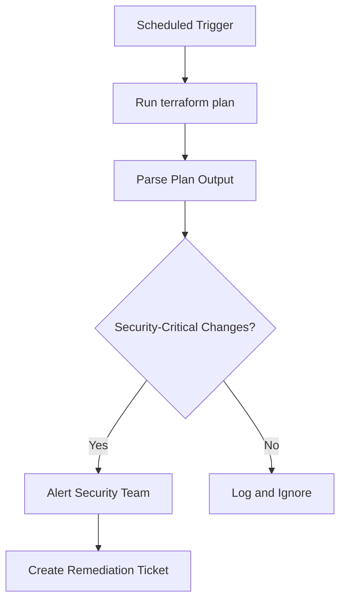

# How to Implement Drift Detection for Security Configurations with Terraform and GCP

Author: [nawazdhandala](https://www.github.com/nawazdhandala)

Tags: GCP, Terraform, Drift Detection, Security, Infrastructure as Code

Description: Detect and alert on security configuration drift in your Google Cloud environment using Terraform state comparison and automated monitoring.

---

You have carefully defined your infrastructure in Terraform. Every firewall rule, IAM binding, and encryption setting is exactly how it should be. Then someone logs into the console and makes a quick change, and suddenly your actual infrastructure no longer matches your code. This is configuration drift, and when it happens to security settings, it can be dangerous.

Drift detection is about finding those gaps between what your Terraform says should exist and what actually exists in GCP. In this post, I will show you how to build an automated drift detection system focused on security-critical configurations.

## Why Security Drift Matters

Not all drift is equal. If someone changes a VM's machine type through the console, that is annoying but not dangerous. If someone opens a firewall rule to 0.0.0.0/0 or removes an IAM condition, that is a security incident waiting to happen.

We are going to focus detection on the configurations that matter most:
- Firewall rules
- IAM policies and bindings
- Encryption settings
- Audit log configurations
- VPC Service Controls
- Cloud Armor policies

## The Detection Approach

The simplest way to detect drift is to run terraform plan and check for differences. But we need to be smarter about it - we only want to alert on security-relevant changes, not every cosmetic difference.



## Setting Up Automated Plan Runs

Use Cloud Build to run terraform plan on a schedule against your production state:

```yaml
# cloudbuild-drift-detection.yaml
# Runs terraform plan to detect configuration drift
steps:
  # Initialize Terraform with the production backend
  - name: 'hashicorp/terraform:1.7'
    entrypoint: 'sh'
    args:
      - '-c'
      - |
        terraform init \
          -backend-config="bucket=${_STATE_BUCKET}" \
          -backend-config="prefix=production"

  # Run plan and save JSON output for analysis
  - name: 'hashicorp/terraform:1.7'
    entrypoint: 'sh'
    args:
      - '-c'
      - |
        # Plan will exit 2 if there are changes, which is expected
        terraform plan -detailed-exitcode -out=tfplan 2>&1 || true
        terraform show -json tfplan > plan.json

  # Analyze the plan for security-relevant drift
  - name: 'python:3.11'
    entrypoint: 'sh'
    args:
      - '-c'
      - |
        pip install google-cloud-pubsub
        python drift_analyzer.py plan.json

  # Store the plan output for historical tracking
  - name: 'gcr.io/google.com/cloudsdktool/cloud-sdk'
    entrypoint: 'sh'
    args:
      - '-c'
      - |
        gsutil cp plan.json \
          gs://${PROJECT_ID}-drift-reports/$(date +%Y-%m-%dT%H:%M:%S).json

substitutions:
  _STATE_BUCKET: 'my-terraform-state-bucket'
```

## The Drift Analyzer

This Python script parses the Terraform plan JSON and identifies security-critical changes:

```python
# drift_analyzer.py
# Analyzes Terraform plan output for security-critical drift
import json
import sys
from google.cloud import pubsub_v1
import os

# Resource types and attributes that are security-critical
SECURITY_CRITICAL_RESOURCES = {
    "google_compute_firewall": {
        "attributes": [
            "source_ranges", "allowed", "denied",
            "direction", "disabled", "priority"
        ],
        "severity": "HIGH"
    },
    "google_project_iam_binding": {
        "attributes": ["role", "members"],
        "severity": "CRITICAL"
    },
    "google_project_iam_member": {
        "attributes": ["role", "member"],
        "severity": "CRITICAL"
    },
    "google_organization_iam_binding": {
        "attributes": ["role", "members"],
        "severity": "CRITICAL"
    },
    "google_kms_crypto_key": {
        "attributes": ["rotation_period", "purpose"],
        "severity": "HIGH"
    },
    "google_sql_database_instance": {
        "attributes": [
            "settings.ip_configuration",
            "settings.backup_configuration"
        ],
        "severity": "HIGH"
    },
    "google_storage_bucket": {
        "attributes": [
            "uniform_bucket_level_access",
            "public_access_prevention",
            "encryption"
        ],
        "severity": "MEDIUM"
    },
    "google_project_iam_audit_config": {
        "attributes": ["audit_log_config"],
        "severity": "HIGH"
    },
    "google_access_context_manager_service_perimeter": {
        "attributes": ["status", "spec"],
        "severity": "CRITICAL"
    },
}


def analyze_plan(plan_file):
    """Parse Terraform plan and identify security drift."""
    with open(plan_file, 'r') as f:
        plan = json.load(f)

    resource_changes = plan.get("resource_changes", [])
    security_drifts = []

    for change in resource_changes:
        resource_type = change.get("type", "")
        actions = change.get("change", {}).get("actions", [])

        # Skip if no actual changes
        if actions == ["no-op"]:
            continue

        # Check if this resource type is security-critical
        if resource_type not in SECURITY_CRITICAL_RESOURCES:
            continue

        config = SECURITY_CRITICAL_RESOURCES[resource_type]
        critical_attrs = config["attributes"]
        severity = config["severity"]

        # Compare before and after values for critical attributes
        before = change.get("change", {}).get("before", {}) or {}
        after = change.get("change", {}).get("after", {}) or {}

        changed_attrs = []
        for attr in critical_attrs:
            before_val = get_nested_value(before, attr)
            after_val = get_nested_value(after, attr)

            if before_val != after_val:
                changed_attrs.append({
                    "attribute": attr,
                    "before": before_val,
                    "after": after_val,
                })

        if changed_attrs:
            security_drifts.append({
                "resource": change.get("address", ""),
                "type": resource_type,
                "actions": actions,
                "severity": severity,
                "changed_security_attributes": changed_attrs,
            })

    return security_drifts


def get_nested_value(data, key_path):
    """Get a value from a nested dictionary using dot notation."""
    keys = key_path.split(".")
    current = data
    for key in keys:
        if isinstance(current, dict):
            current = current.get(key)
        else:
            return None
    return current


def publish_alert(drifts):
    """Publish drift alerts to Pub/Sub."""
    publisher = pubsub_v1.PublisherClient()
    project_id = os.environ.get("PROJECT_ID", "")
    topic_path = publisher.topic_path(project_id, "security-drift-alerts")

    for drift in drifts:
        message = json.dumps(drift, default=str)
        publisher.publish(
            topic_path,
            data=message.encode("utf-8"),
            severity=drift["severity"]
        )
        print(f"Alert published: {drift['resource']} ({drift['severity']})")


def generate_report(drifts):
    """Generate a human-readable drift report."""
    if not drifts:
        print("No security-critical drift detected.")
        return

    print(f"\n{'='*60}")
    print(f"SECURITY DRIFT REPORT - {len(drifts)} issues found")
    print(f"{'='*60}\n")

    # Sort by severity
    severity_order = {"CRITICAL": 0, "HIGH": 1, "MEDIUM": 2}
    drifts.sort(key=lambda d: severity_order.get(d["severity"], 3))

    for drift in drifts:
        print(f"[{drift['severity']}] {drift['resource']}")
        print(f"  Type: {drift['type']}")
        print(f"  Actions: {', '.join(drift['actions'])}")
        for attr in drift['changed_security_attributes']:
            print(f"  Changed: {attr['attribute']}")
            print(f"    Before: {attr['before']}")
            print(f"    After:  {attr['after']}")
        print()


if __name__ == "__main__":
    plan_file = sys.argv[1] if len(sys.argv) > 1 else "plan.json"
    drifts = analyze_plan(plan_file)
    generate_report(drifts)

    if drifts:
        publish_alert(drifts)
        # Exit with non-zero code to indicate drift found
        sys.exit(1)
```

## Scheduling Regular Checks

Run drift detection every hour for critical environments:

```hcl
# scheduler.tf
# Schedule drift detection runs

resource "google_cloud_scheduler_job" "drift_detection" {
  name        = "security-drift-detection"
  description = "Hourly security configuration drift detection"
  schedule    = "0 * * * *"  # Every hour
  project     = var.project_id
  region      = var.region

  http_target {
    http_method = "POST"
    uri         = "https://cloudbuild.googleapis.com/v1/projects/${var.project_id}/triggers/${google_cloudbuild_trigger.drift_detection.trigger_id}:run"

    oauth_token {
      service_account_email = google_service_account.drift_detector.email
    }

    body = base64encode(jsonencode({
      branchName = "main"
    }))
  }
}
```

## Auto-Remediation for Known Drift Patterns

For certain types of drift, you can automatically revert the change by re-applying Terraform:

```python
# drift_remediator.py
# Automatically fixes known-safe drift patterns

def should_auto_remediate(drift):
    """Determine if a drift can be safely auto-remediated."""
    # Only auto-remediate specific known-safe patterns
    safe_patterns = {
        # Firewall rules opened wider than expected
        "google_compute_firewall": [
            "source_ranges",
            "disabled",
        ],
        # Audit logging disabled
        "google_project_iam_audit_config": [
            "audit_log_config",
        ],
        # Encryption settings changed
        "google_storage_bucket": [
            "public_access_prevention",
        ],
    }

    resource_type = drift["type"]
    if resource_type not in safe_patterns:
        return False

    safe_attrs = safe_patterns[resource_type]
    changed_attrs = [
        a["attribute"]
        for a in drift["changed_security_attributes"]
    ]

    # Only auto-remediate if all changed attributes are in the safe list
    return all(attr in safe_attrs for attr in changed_attrs)


def trigger_remediation(project_id, trigger_id):
    """Trigger a Cloud Build run of terraform apply to fix drift."""
    from google.cloud.devtools import cloudbuild_v1

    client = cloudbuild_v1.CloudBuildClient()
    client.run_build_trigger(
        request={
            "project_id": project_id,
            "trigger_id": trigger_id,
        }
    )
```

## Tracking Drift Over Time

Store drift detection results in BigQuery to identify patterns:

```sql
-- Find which resources drift most frequently
-- Helps identify areas where console access should be restricted
SELECT
  resource_type,
  resource_address,
  COUNT(*) as drift_count,
  ARRAY_AGG(DISTINCT severity) as severities,
  MIN(detected_at) as first_detected,
  MAX(detected_at) as last_detected
FROM `project.drift_tracking.security_drift_events`
WHERE detected_at > TIMESTAMP_SUB(CURRENT_TIMESTAMP(), INTERVAL 30 DAY)
GROUP BY resource_type, resource_address
HAVING drift_count > 3
ORDER BY drift_count DESC;
```

## Wrapping Up

Drift detection is not just a nice-to-have for security configurations - it is essential. Without it, you are trusting that nobody will ever make a manual change that weakens your security posture. That trust will eventually be broken, whether by accident or intent. Set up automated detection, focus on the resources that matter most, and build a culture where drift is treated as a bug that needs to be fixed, not just logged and forgotten.
