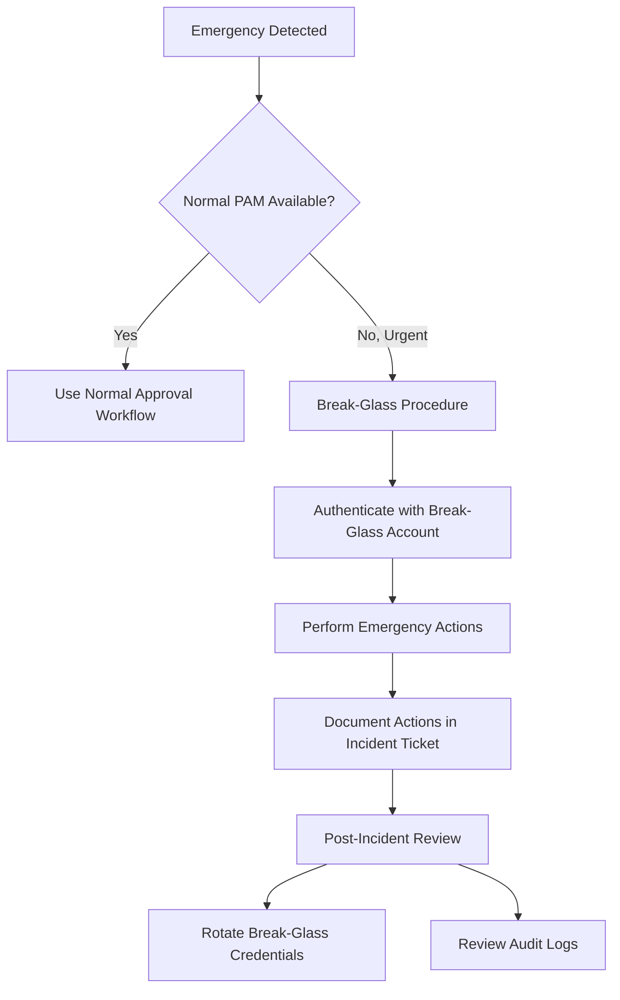

# How to Implement Emergency Break-Glass Access Procedures for Google Cloud

Author: [nawazdhandala](https://www.github.com/nawazdhandala)

Tags: GCP, Google Cloud, Break Glass, Emergency Access, IAM, Security, Incident Response

Description: Learn how to implement emergency break-glass access procedures for Google Cloud that provide rapid elevated access during incidents while maintaining security controls.

---

You have locked down your Google Cloud environment. Nobody has standing admin access. All elevated privileges go through approval workflows. Then at 3 AM, your production database is down, customers are affected, and the on-call engineer needs Owner-level access to diagnose and fix the issue. The approval chain is asleep. What happens next?

This is where break-glass procedures come in. They provide a documented, auditable way to get emergency access that bypasses normal approval workflows while still maintaining accountability and security controls. The name comes from the fire alarm analogy - break the glass to pull the alarm, but breaking the glass leaves evidence.

## Designing Your Break-Glass Strategy

A good break-glass procedure balances speed (getting access quickly during an emergency) with security (preventing misuse and maintaining an audit trail).



## Prerequisites

- Organization-level admin access for initial setup
- A secure credential storage solution (hardware security keys, HSM, or secret manager with strict access controls)
- An incident management process
- Cloud Audit Logs enabled (always on for Admin Activity)

## Step 1: Create Break-Glass Service Accounts

Create dedicated service accounts for emergency access. These accounts should be separate from everyday accounts and have their own security controls:

```bash
# Create a break-glass project that is separate from production
gcloud projects create break-glass-project \
    --name="Break Glass Access" \
    --organization=ORG_ID

# Create a break-glass service account with organization-level access
gcloud iam service-accounts create break-glass-admin \
    --project=break-glass-project \
    --display-name="Emergency Break-Glass Admin" \
    --description="Used only during P0/P1 incidents when normal access is unavailable"

# Grant organization admin role to the break-glass account
gcloud organizations add-iam-policy-binding ORG_ID \
    --member="serviceAccount:break-glass-admin@break-glass-project.iam.gserviceaccount.com" \
    --role="roles/resourcemanager.organizationAdmin"

# Grant project-level Owner on critical projects
gcloud projects add-iam-policy-binding prod-project \
    --member="serviceAccount:break-glass-admin@break-glass-project.iam.gserviceaccount.com" \
    --role="roles/owner"
```

## Step 2: Create Break-Glass User Accounts

In addition to service accounts, create dedicated user accounts (in Cloud Identity) for situations where a human needs interactive access:

```bash
# Create break-glass user accounts in your Cloud Identity domain
# These should be created through the Google Admin Console or Directory API

# The naming convention should be obvious
# Example: break-glass-1@example.com, break-glass-2@example.com

# Grant organization-level roles
gcloud organizations add-iam-policy-binding ORG_ID \
    --member="user:break-glass-1@example.com" \
    --role="roles/resourcemanager.organizationAdmin"

gcloud organizations add-iam-policy-binding ORG_ID \
    --member="user:break-glass-1@example.com" \
    --role="roles/owner"
```

## Step 3: Secure the Break-Glass Credentials

The credentials for break-glass accounts must be stored securely and accessed only during emergencies:

```bash
# Option 1: Store credentials in Secret Manager with strict access
gcloud secrets create break-glass-admin-key \
    --project=break-glass-project \
    --replication-policy=automatic

# Store the service account key (generate one specifically for break-glass)
gcloud iam service-accounts keys create /tmp/break-glass-key.json \
    --iam-account=break-glass-admin@break-glass-project.iam.gserviceaccount.com

# Upload to Secret Manager
gcloud secrets versions add break-glass-admin-key \
    --project=break-glass-project \
    --data-file=/tmp/break-glass-key.json

# Delete the local copy immediately
rm /tmp/break-glass-key.json

# Restrict access to the secret to only the break-glass accessor group
gcloud secrets add-iam-policy-binding break-glass-admin-key \
    --project=break-glass-project \
    --member="group:break-glass-holders@example.com" \
    --role="roles/secretmanager.secretAccessor"
```

For user account credentials:

```
Option 2: Physical credential storage
- Print the credentials on paper
- Store in a sealed envelope in a physical safe
- The safe requires two people to open (dual control)
- Document the safe location and access procedure

Option 3: Hardware security keys
- Register hardware security keys (YubiKeys) with the break-glass accounts
- Store the keys in a locked cabinet accessible to on-call managers
- Keep a log of when keys are checked out and returned
```

## Step 4: Exempt Break-Glass Accounts from Normal Controls

Break-glass accounts need to be exempt from the security controls that might prevent emergency access:

```bash
# Exempt break-glass accounts from IAM deny policies
# In your deny policy JSON, add exception principals:
# "exceptionPrincipals": [
#     "principal://iam.googleapis.com/projects/break-glass-project/serviceAccounts/break-glass-admin@break-glass-project.iam.gserviceaccount.com",
#     "principal://goog/subject/break-glass-1@example.com"
# ]

# Exempt from organization policies that might block emergency actions
gcloud resource-manager org-policies disable-enforce \
    iam.disableServiceAccountKeyCreation \
    --project=break-glass-project
```

## Step 5: Set Up Automatic Alerting When Break-Glass Is Used

Every use of a break-glass account should trigger immediate alerts to security and management:

```bash
# Create a log-based metric for break-glass account usage
gcloud logging metrics create break-glass-usage \
    --project=break-glass-project \
    --description="Detects any activity from break-glass accounts" \
    --log-filter='
        protoPayload.authenticationInfo.principalEmail:(
            "break-glass-admin@break-glass-project.iam.gserviceaccount.com"
            OR "break-glass-1@example.com"
            OR "break-glass-2@example.com"
        )
    '

# Create an alert that fires immediately
gcloud monitoring policies create \
    --project=break-glass-project \
    --display-name="CRITICAL: Break-Glass Account Used" \
    --condition-display-name="Break-glass account activity detected" \
    --condition-filter='metric.type="logging.googleapis.com/user/break-glass-usage"' \
    --condition-threshold-value=0 \
    --condition-threshold-comparison=COMPARISON_GT \
    --notification-channels=SECURITY_CHANNEL_ID,MANAGEMENT_CHANNEL_ID \
    --combiner=OR \
    --duration=0s
```

Also set up a Pub/Sub pipeline for real-time Slack/PagerDuty notifications:

```bash
# Route break-glass activity to a dedicated topic
gcloud logging sinks create break-glass-alert-sink \
    "pubsub.googleapis.com/projects/break-glass-project/topics/break-glass-alerts" \
    --project=break-glass-project \
    --log-filter='
        protoPayload.authenticationInfo.principalEmail:(
            "break-glass-admin@break-glass-project.iam.gserviceaccount.com"
            OR "break-glass-1@example.com"
            OR "break-glass-2@example.com"
        )
    '
```

## Step 6: Document the Break-Glass Procedure

Create a runbook that on-call engineers can follow during an emergency:

```
BREAK-GLASS ACCESS PROCEDURE

WHEN TO USE:
- P0 or P1 incident requiring immediate admin access
- Normal PAM approval workflow is unavailable or too slow
- Authorized by: On-call manager or incident commander

PROCEDURE:
1. Open an incident ticket (if not already open)
2. Record the reason for break-glass access in the ticket
3. Retrieve credentials:
   a. Service account: Run `gcloud secrets versions access latest
      --secret=break-glass-admin-key --project=break-glass-project`
   b. User account: Retrieve hardware key from secure cabinet,
      sign the checkout log
4. Authenticate:
   gcloud auth activate-service-account \
     --key-file=/tmp/break-glass-key.json
5. Perform only the actions necessary to resolve the incident
6. Document all actions taken in the incident ticket
7. When done, deactivate:
   gcloud auth revoke break-glass-admin@break-glass-project.iam.gserviceaccount.com
   rm /tmp/break-glass-key.json
8. Return hardware key to secure cabinet (if used)
9. Notify security team that break-glass was used

POST-INCIDENT (within 24 hours):
- Security team reviews all actions taken with the break-glass account
- Rotate the break-glass credentials
- Conduct post-incident review
- Document any improvements to the procedure
```

## Step 7: Implement Credential Rotation After Use

After every use of a break-glass account, rotate the credentials:

```bash
#!/bin/bash
# rotate-break-glass-credentials.sh
# Run this after every break-glass usage

PROJECT="break-glass-project"
SA="break-glass-admin@${PROJECT}.iam.gserviceaccount.com"

echo "Rotating break-glass credentials..."

# Delete all existing service account keys
KEYS=$(gcloud iam service-accounts keys list \
    --iam-account=${SA} \
    --managed-by=user \
    --format="value(name)")

for KEY in ${KEYS}; do
    gcloud iam service-accounts keys delete ${KEY} \
        --iam-account=${SA} \
        --quiet
    echo "Deleted key: ${KEY}"
done

# Create a new key
gcloud iam service-accounts keys create /tmp/new-break-glass-key.json \
    --iam-account=${SA}

# Update the secret in Secret Manager
gcloud secrets versions add break-glass-admin-key \
    --project=${PROJECT} \
    --data-file=/tmp/new-break-glass-key.json

# Clean up
rm /tmp/new-break-glass-key.json

echo "Credentials rotated successfully"
echo "Remember to also rotate user account passwords if used"
```

## Step 8: Test the Procedure Regularly

Run break-glass drills at least quarterly:

```bash
# Quarterly break-glass drill checklist
# 1. Simulate a scenario where normal access is unavailable
# 2. Have the on-call engineer follow the break-glass procedure
# 3. Time how long it takes to get access
# 4. Verify the alerts fired correctly
# 5. Verify audit logs captured all actions
# 6. Rotate credentials after the drill
# 7. Document the drill results and any improvements needed
```

Track drill metrics over time - access time should be under 5 minutes, and alerts should fire within 60 seconds of account use.

## Summary

Break-glass access procedures are the safety net for when your carefully constructed security controls become an obstacle during an emergency. The implementation involves creating dedicated break-glass accounts, securing their credentials with physical and logical controls, setting up automatic alerting for any use, documenting clear procedures, and rotating credentials after every use. The goal is not to make break-glass easy - it should feel deliberate and have a cost (the post-incident review and credential rotation). But it should be reliable and fast when you genuinely need it. Test the procedure regularly so you know it works before you need it at 3 AM.
