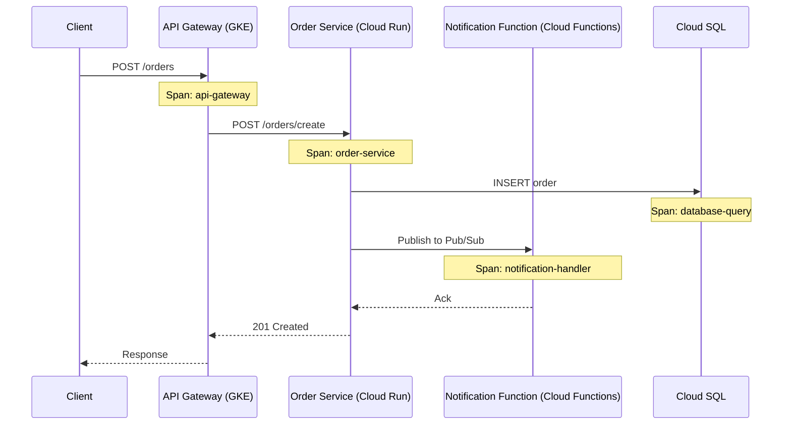
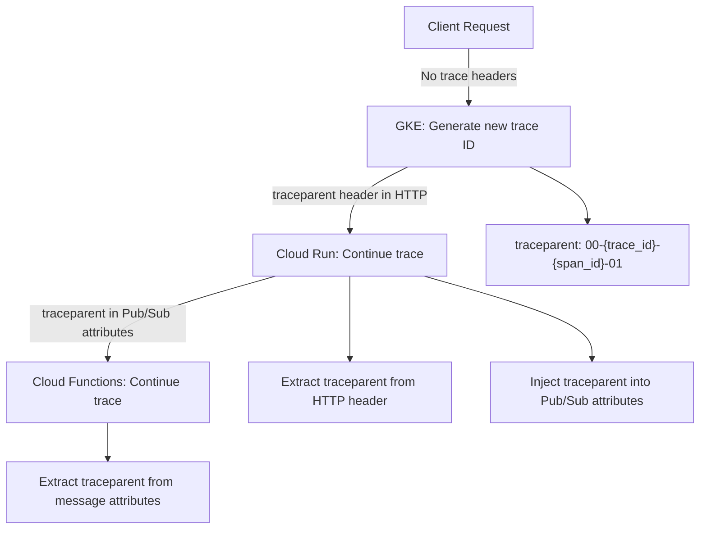

# How to Implement End-to-End Distributed Tracing Across GKE Cloud Run and Cloud Functions on GCP

Author: [nawazdhandala](https://www.github.com/nawazdhandala)

Tags: GCP, Distributed Tracing, GKE, Cloud Run, Cloud Functions, Cloud Trace, Google Cloud

Description: Learn how to implement end-to-end distributed tracing across GKE, Cloud Run, and Cloud Functions on Google Cloud for full request visibility.

---

Modern applications on Google Cloud rarely live on a single platform. You might have your main API on GKE, some microservices on Cloud Run, and event-driven processing on Cloud Functions. When a user request flows through all three, you need a way to trace it end to end. Without distributed tracing, debugging is like reading a mystery novel with chapters missing. In this post, I will show you how to set up tracing that follows requests across GKE, Cloud Run, and Cloud Functions seamlessly.

## The Challenge

Each GCP compute platform has different runtime environments, different ways to handle HTTP headers, and different default instrumentation. The key to making distributed tracing work across all of them is context propagation - passing a trace ID from one service to the next so all the spans get linked into a single trace.

## Architecture

Here is the request flow we will be tracing.



All of these spans should appear in a single trace in Cloud Trace.

## Step 1: Set Up Tracing in the GKE Service

The GKE service is our entry point. It receives HTTP requests and needs to start a trace or continue one if a trace header is present.

```python
# gke_api/app.py - Flask API running on GKE

from flask import Flask, request, jsonify
from opentelemetry import trace
from opentelemetry.sdk.trace import TracerProvider
from opentelemetry.sdk.trace.export import BatchSpanProcessor
from opentelemetry.exporter.cloud_trace import CloudTraceSpanExporter
from opentelemetry.propagate import inject
from opentelemetry.instrumentation.flask import FlaskInstrumentor
from opentelemetry.instrumentation.requests import RequestsInstrumentor
import requests
import os

app = Flask(__name__)

# Set up the tracer with Cloud Trace exporter
def init_tracing():
    exporter = CloudTraceSpanExporter(project_id=os.getenv("GOOGLE_CLOUD_PROJECT"))
    provider = TracerProvider()
    provider.add_span_processor(BatchSpanProcessor(exporter))
    trace.set_tracer_provider(provider)

    # Auto-instrument Flask to capture incoming request spans
    FlaskInstrumentor().instrument_app(app)
    # Auto-instrument requests library to propagate trace context
    RequestsInstrumentor().instrument()

init_tracing()
tracer = trace.get_tracer(__name__)

@app.route("/orders", methods=["POST"])
def create_order():
    with tracer.start_as_current_span("process-order-request") as span:
        order_data = request.json
        span.set_attribute("order.type", order_data.get("type", "unknown"))

        # Call the Cloud Run order service
        # The requests instrumentation automatically injects trace headers
        response = requests.post(
            os.getenv("ORDER_SERVICE_URL") + "/orders/create",
            json=order_data,
            timeout=30,
        )

        return jsonify(response.json()), response.status_code

if __name__ == "__main__":
    app.run(host="0.0.0.0", port=8080)
```

## Step 2: Set Up Tracing in the Cloud Run Service

The Cloud Run service receives the request with trace context in the HTTP headers and continues the trace.

```python
# cloud_run_orders/main.py - Order service on Cloud Run

from flask import Flask, request, jsonify
from opentelemetry import trace
from opentelemetry.sdk.trace import TracerProvider
from opentelemetry.sdk.trace.export import BatchSpanProcessor
from opentelemetry.exporter.cloud_trace import CloudTraceSpanExporter
from opentelemetry.instrumentation.flask import FlaskInstrumentor
from opentelemetry.instrumentation.sqlalchemy import SQLAlchemyInstrumentor
from google.cloud import pubsub_v1
from opentelemetry.propagate import inject
import sqlalchemy
import os
import json

app = Flask(__name__)

def init_tracing():
    exporter = CloudTraceSpanExporter(project_id=os.getenv("GOOGLE_CLOUD_PROJECT"))
    provider = TracerProvider()
    provider.add_span_processor(BatchSpanProcessor(exporter))
    trace.set_tracer_provider(provider)

    FlaskInstrumentor().instrument_app(app)

init_tracing()
tracer = trace.get_tracer(__name__)

# Set up database connection
engine = sqlalchemy.create_engine(os.getenv("DATABASE_URL"))
# Instrument SQLAlchemy to trace database queries
SQLAlchemyInstrumentor().instrument(engine=engine)

# Set up Pub/Sub client
publisher = pubsub_v1.PublisherClient()
topic_path = publisher.topic_path(
    os.getenv("GOOGLE_CLOUD_PROJECT"), "order-notifications"
)

@app.route("/orders/create", methods=["POST"])
def create_order():
    # Flask instrumentation picks up the trace context from incoming headers
    with tracer.start_as_current_span("create-order") as span:
        order_data = request.json

        # Insert into database - automatically traced by SQLAlchemy instrumentation
        with engine.connect() as conn:
            result = conn.execute(
                sqlalchemy.text(
                    "INSERT INTO orders (type, data) VALUES (:type, :data) RETURNING id"
                ),
                {"type": order_data["type"], "data": json.dumps(order_data)},
            )
            order_id = result.fetchone()[0]
            conn.commit()

        span.set_attribute("order.id", order_id)

        # Publish to Pub/Sub with trace context in message attributes
        # This is how we propagate the trace to Cloud Functions
        headers = {}
        inject(headers)  # Injects traceparent header into the dict

        publisher.publish(
            topic_path,
            json.dumps({"order_id": order_id, "type": order_data["type"]}).encode(),
            # Pass trace context as Pub/Sub message attributes
            traceparent=headers.get("traceparent", ""),
        )

        return jsonify({"order_id": order_id, "status": "created"}), 201

if __name__ == "__main__":
    app.run(host="0.0.0.0", port=8080)
```

## Step 3: Set Up Tracing in Cloud Functions

The Cloud Function is triggered by Pub/Sub. It needs to extract the trace context from the message attributes and continue the trace.

```python
# cloud_function_notify/main.py - Notification handler on Cloud Functions

import functions_framework
from opentelemetry import trace, context
from opentelemetry.sdk.trace import TracerProvider
from opentelemetry.sdk.trace.export import BatchSpanProcessor
from opentelemetry.exporter.cloud_trace import CloudTraceSpanExporter
from opentelemetry.propagate import extract
import base64
import json
import os

# Initialize tracing once when the function cold starts
def init_tracing():
    exporter = CloudTraceSpanExporter(project_id=os.getenv("GOOGLE_CLOUD_PROJECT"))
    provider = TracerProvider()
    provider.add_span_processor(BatchSpanProcessor(exporter))
    trace.set_tracer_provider(provider)

init_tracing()
tracer = trace.get_tracer(__name__)

@functions_framework.cloud_event
def handle_notification(cloud_event):
    # Extract the Pub/Sub message
    message_data = base64.b64decode(cloud_event.data["message"]["data"])
    attributes = cloud_event.data["message"].get("attributes", {})
    order = json.loads(message_data)

    # Extract trace context from Pub/Sub message attributes
    # This links our function span to the parent trace
    ctx = extract(attributes)

    # Start a span that is a child of the span from the Cloud Run service
    with tracer.start_as_current_span(
        "process-notification",
        context=ctx,
        attributes={
            "order.id": order["order_id"],
            "notification.type": "order_created",
        },
    ):
        # Send notification logic
        send_email_notification(order)
        send_push_notification(order)

def send_email_notification(order):
    with tracer.start_as_current_span("send-email") as span:
        span.set_attribute("email.type", "order_confirmation")
        # Actual email sending logic here
        pass

def send_push_notification(order):
    with tracer.start_as_current_span("send-push") as span:
        span.set_attribute("push.type", "order_update")
        # Actual push notification logic here
        pass
```

## Step 4: Deploy Everything

Deploy the services to their respective platforms.

```bash
# Deploy the GKE API service
kubectl apply -f gke-api-deployment.yaml

# Deploy the Cloud Run order service
gcloud run deploy order-service \
    --source=./cloud_run_orders \
    --region=us-central1 \
    --set-env-vars="GOOGLE_CLOUD_PROJECT=my-project,DATABASE_URL=..." \
    --allow-unauthenticated

# Deploy the Cloud Function
gcloud functions deploy notification-handler \
    --gen2 \
    --runtime=python312 \
    --source=./cloud_function_notify \
    --entry-point=handle_notification \
    --trigger-topic=order-notifications \
    --region=us-central1 \
    --set-env-vars="GOOGLE_CLOUD_PROJECT=my-project"
```

## Step 5: Verify the End-to-End Trace

Send a test request and check Cloud Trace.

```bash
# Send a test order
curl -X POST https://my-api.example.com/orders \
    -H "Content-Type: application/json" \
    -d '{"type": "premium", "items": ["item1", "item2"]}'
```

In the Cloud Trace console, you should see a single trace containing spans from all three services: the GKE API gateway, the Cloud Run order service (including the database query), and the Cloud Function notification handler.

## Trace Context Propagation Flow

Here is how the trace context flows between services.



## Common Pitfalls

**Pub/Sub context propagation requires manual work.** Unlike HTTP where instrumentation libraries automatically propagate trace headers, Pub/Sub messages need manual injection and extraction of trace context via message attributes. This is the step most people miss.

**Cloud Functions cold starts can cause gaps.** If a Cloud Function has a cold start, there might be a timing gap in the trace. The span will still be linked correctly via the trace ID, but the waterfall view might show a gap between the Pub/Sub publish and the function execution.

**Use the same project ID everywhere.** All services must export traces to the same Google Cloud project for the trace to appear as a single unit. If your services span multiple projects, configure them all to export to a central project.

**gRPC needs separate instrumentation.** If your services communicate via gRPC instead of HTTP, use the `opentelemetry-instrumentation-grpc` package instead of the requests instrumentation.

## Wrapping Up

End-to-end distributed tracing across GKE, Cloud Run, and Cloud Functions is achievable with OpenTelemetry and Cloud Trace. The key insight is that HTTP-based communication between services gets trace propagation almost for free through instrumentation libraries, while message-based communication (like Pub/Sub) requires manual injection and extraction of trace context. Once you have this set up, you can follow a single user request from the moment it hits your API gateway through every service call, database query, and async event handler. That visibility is invaluable when something goes wrong at 2 AM.
