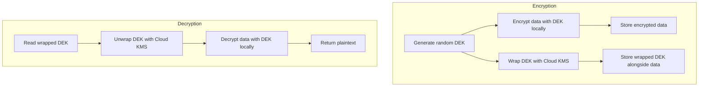

# How to Implement Envelope Encryption with Cloud KMS in GCP

Author: [nawazdhandala](https://www.github.com/nawazdhandala)

Tags: GCP, Cloud KMS, Envelope Encryption, Security, Cryptography

Description: A developer's guide to implementing envelope encryption with Google Cloud KMS, including generating data encryption keys, wrapping them with KMS, and building a practical encryption layer.

---

Cloud KMS has a 64 KiB limit on the data you can encrypt directly through the API. For a password or an API key, that is more than enough. For a file, a database column full of records, or a message payload, it is not even close. You need a different approach.

Envelope encryption solves this by splitting the problem into two layers. You generate a random data encryption key (DEK) locally and use it to encrypt your actual data with a fast symmetric cipher like AES. Then you use Cloud KMS to encrypt (wrap) the DEK itself. You store the wrapped DEK alongside the encrypted data. When you need to decrypt, you call KMS to unwrap the DEK, then use it locally to decrypt the data.

This pattern gives you the performance of local encryption with the key management benefits of KMS. The bulk data never leaves your application, and the DEK material is protected by KMS.

## How Envelope Encryption Works



The wrapped DEK is a small piece of ciphertext (a few hundred bytes) that can be stored in a database column, a file header, or metadata. The encrypted data can be any size.

## Prerequisites

- A Cloud KMS symmetric encryption key
- The `roles/cloudkms.cryptoKeyEncrypterDecrypter` role on the key
- A cryptography library for local encryption (Python: `cryptography`, Node.js: `crypto`, Go: `crypto/aes`)

## Python Implementation

Here is a complete envelope encryption implementation in Python:

```python
# envelope_encryption.py
# Envelope encryption implementation using Cloud KMS and local AES-GCM
import os
import json
import base64
from google.cloud import kms
from cryptography.hazmat.primitives.ciphers.aead import AESGCM

class EnvelopeEncryption:
    """Encrypt and decrypt data using envelope encryption with Cloud KMS."""

    def __init__(self, project_id, location, keyring, key_name):
        self.client = kms.KeyManagementServiceClient()
        self.key_path = self.client.crypto_key_path(
            project_id, location, keyring, key_name
        )

    def encrypt(self, plaintext):
        """Encrypt data using envelope encryption.

        Returns a JSON string containing the wrapped DEK,
        nonce, and encrypted data.
        """
        if isinstance(plaintext, str):
            plaintext = plaintext.encode("utf-8")

        # Step 1: Generate a random 256-bit DEK
        dek = os.urandom(32)

        # Step 2: Encrypt the data locally with AES-256-GCM
        nonce = os.urandom(12)  # 96-bit nonce for GCM
        aesgcm = AESGCM(dek)
        encrypted_data = aesgcm.encrypt(nonce, plaintext, None)

        # Step 3: Wrap the DEK using Cloud KMS
        wrap_response = self.client.encrypt(
            request={"name": self.key_path, "plaintext": dek}
        )

        # Step 4: Package everything together
        # The plaintext DEK is discarded - only the wrapped version is stored
        envelope = {
            "wrapped_dek": base64.b64encode(wrap_response.ciphertext).decode("utf-8"),
            "nonce": base64.b64encode(nonce).decode("utf-8"),
            "ciphertext": base64.b64encode(encrypted_data).decode("utf-8"),
        }

        return json.dumps(envelope)

    def decrypt(self, envelope_json):
        """Decrypt data from an envelope encryption package."""
        envelope = json.loads(envelope_json)

        # Step 1: Unwrap the DEK using Cloud KMS
        wrapped_dek = base64.b64decode(envelope["wrapped_dek"])
        unwrap_response = self.client.decrypt(
            request={"name": self.key_path, "ciphertext": wrapped_dek}
        )
        dek = unwrap_response.plaintext

        # Step 2: Decrypt the data locally with AES-256-GCM
        nonce = base64.b64decode(envelope["nonce"])
        ciphertext = base64.b64decode(envelope["ciphertext"])
        aesgcm = AESGCM(dek)
        plaintext = aesgcm.decrypt(nonce, ciphertext, None)

        return plaintext.decode("utf-8")


# Usage example
def main():
    enc = EnvelopeEncryption(
        project_id="my-project-id",
        location="us-central1",
        keyring="my-app-keyring",
        key_name="app-data-key",
    )

    # Encrypt a large document
    document = "This is a large document that exceeds the 64 KiB KMS limit. " * 1000
    print(f"Original size: {len(document)} bytes")

    envelope = enc.encrypt(document)
    print(f"Envelope size: {len(envelope)} bytes")

    # Decrypt it back
    decrypted = enc.decrypt(envelope)
    assert decrypted == document
    print("Decryption successful - data matches original")

if __name__ == "__main__":
    main()
```

## Node.js Implementation

```javascript
// envelope-encryption.js
// Envelope encryption implementation using Cloud KMS and local AES-256-GCM
const { KeyManagementServiceClient } = require("@google-cloud/kms");
const crypto = require("crypto");

class EnvelopeEncryption {
  constructor(projectId, location, keyring, keyName) {
    this.client = new KeyManagementServiceClient();
    this.keyPath = this.client.cryptoKeyPath(
      projectId, location, keyring, keyName
    );
  }

  async encrypt(plaintext) {
    // Step 1: Generate a random 256-bit DEK
    const dek = crypto.randomBytes(32);

    // Step 2: Encrypt the data locally with AES-256-GCM
    const nonce = crypto.randomBytes(12);
    const cipher = crypto.createCipheriv("aes-256-gcm", dek, nonce);
    const encrypted = Buffer.concat([
      cipher.update(plaintext, "utf8"),
      cipher.final(),
    ]);
    const authTag = cipher.getAuthTag();

    // Step 3: Wrap the DEK using Cloud KMS
    const [wrapResponse] = await this.client.encrypt({
      name: this.keyPath,
      plaintext: dek,
    });

    // Step 4: Package everything together
    const envelope = {
      wrappedDek: Buffer.from(wrapResponse.ciphertext).toString("base64"),
      nonce: nonce.toString("base64"),
      ciphertext: encrypted.toString("base64"),
      authTag: authTag.toString("base64"),
    };

    return JSON.stringify(envelope);
  }

  async decrypt(envelopeJson) {
    const envelope = JSON.parse(envelopeJson);

    // Step 1: Unwrap the DEK using Cloud KMS
    const wrappedDek = Buffer.from(envelope.wrappedDek, "base64");
    const [unwrapResponse] = await this.client.decrypt({
      name: this.keyPath,
      ciphertext: wrappedDek,
    });
    const dek = Buffer.from(unwrapResponse.plaintext);

    // Step 2: Decrypt the data locally
    const nonce = Buffer.from(envelope.nonce, "base64");
    const ciphertext = Buffer.from(envelope.ciphertext, "base64");
    const authTag = Buffer.from(envelope.authTag, "base64");

    const decipher = crypto.createDecipheriv("aes-256-gcm", dek, nonce);
    decipher.setAuthTag(authTag);
    const decrypted = Buffer.concat([
      decipher.update(ciphertext),
      decipher.final(),
    ]);

    return decrypted.toString("utf8");
  }
}

// Usage
async function main() {
  const enc = new EnvelopeEncryption(
    "my-project-id", "us-central1", "my-app-keyring", "app-data-key"
  );

  const document = "Large document content here...".repeat(1000);
  console.log(`Original size: ${document.length} bytes`);

  const envelope = await enc.encrypt(document);
  console.log(`Envelope size: ${envelope.length} bytes`);

  const decrypted = await enc.decrypt(envelope);
  console.log(`Decryption successful: ${decrypted === document}`);
}

main().catch(console.error);
```

## Go Implementation

```go
// envelope.go
// Envelope encryption using Cloud KMS and local AES-256-GCM
package envelope

import (
    "context"
    "crypto/aes"
    "crypto/cipher"
    "crypto/rand"
    "encoding/base64"
    "encoding/json"
    "fmt"
    "io"

    kms "cloud.google.com/go/kms/apiv1"
    "cloud.google.com/go/kms/apiv1/kmspb"
)

// Envelope holds the encrypted data and wrapped key
type Envelope struct {
    WrappedDEK string `json:"wrapped_dek"`
    Nonce      string `json:"nonce"`
    Ciphertext string `json:"ciphertext"`
}

// Encryptor handles envelope encryption operations
type Encryptor struct {
    client  *kms.KeyManagementClient
    keyPath string
}

// NewEncryptor creates a new envelope encryptor
func NewEncryptor(projectID, location, keyring, keyName string) (*Encryptor, error) {
    ctx := context.Background()
    client, err := kms.NewKeyManagementClient(ctx)
    if err != nil {
        return nil, err
    }

    keyPath := fmt.Sprintf(
        "projects/%s/locations/%s/keyRings/%s/cryptoKeys/%s",
        projectID, location, keyring, keyName,
    )

    return &Encryptor{client: client, keyPath: keyPath}, nil
}

// Encrypt encrypts data using envelope encryption
func (e *Encryptor) Encrypt(ctx context.Context, plaintext []byte) (string, error) {
    // Generate random DEK
    dek := make([]byte, 32)
    if _, err := io.ReadFull(rand.Reader, dek); err != nil {
        return "", fmt.Errorf("failed to generate DEK: %w", err)
    }

    // Encrypt data locally with AES-GCM
    block, err := aes.NewCipher(dek)
    if err != nil {
        return "", fmt.Errorf("failed to create cipher: %w", err)
    }

    gcm, err := cipher.NewGCM(block)
    if err != nil {
        return "", fmt.Errorf("failed to create GCM: %w", err)
    }

    nonce := make([]byte, gcm.NonceSize())
    if _, err := io.ReadFull(rand.Reader, nonce); err != nil {
        return "", fmt.Errorf("failed to generate nonce: %w", err)
    }

    ciphertext := gcm.Seal(nil, nonce, plaintext, nil)

    // Wrap DEK with Cloud KMS
    wrapResp, err := e.client.Encrypt(ctx, &kmspb.EncryptRequest{
        Name:      e.keyPath,
        Plaintext: dek,
    })
    if err != nil {
        return "", fmt.Errorf("failed to wrap DEK: %w", err)
    }

    // Package the envelope
    env := Envelope{
        WrappedDEK: base64.StdEncoding.EncodeToString(wrapResp.Ciphertext),
        Nonce:      base64.StdEncoding.EncodeToString(nonce),
        Ciphertext: base64.StdEncoding.EncodeToString(ciphertext),
    }

    result, err := json.Marshal(env)
    return string(result), err
}
```

## Storing Envelope Data

The envelope (wrapped DEK + nonce + ciphertext) can be stored in various ways:

### Database Column

Store the JSON envelope directly in a database column:

```python
# Store encrypted data in a database
import psycopg2

def store_encrypted_record(conn, user_id, sensitive_data, encryptor):
    """Encrypt and store a record."""
    envelope = encryptor.encrypt(sensitive_data)

    cursor = conn.cursor()
    cursor.execute(
        "INSERT INTO user_data (user_id, encrypted_payload) VALUES (%s, %s)",
        (user_id, envelope)
    )
    conn.commit()

def read_encrypted_record(conn, user_id, encryptor):
    """Read and decrypt a record."""
    cursor = conn.cursor()
    cursor.execute(
        "SELECT encrypted_payload FROM user_data WHERE user_id = %s",
        (user_id,)
    )
    row = cursor.fetchone()
    if row:
        return encryptor.decrypt(row[0])
    return None
```

### File-Based Storage

For encrypted files, store the wrapped DEK in a header:

```python
# File encryption with envelope encryption
import struct

def encrypt_file(input_path, output_path, encryptor):
    """Encrypt a file using envelope encryption."""
    with open(input_path, "rb") as f:
        plaintext = f.read()

    envelope_json = encryptor.encrypt(plaintext.decode("utf-8"))
    envelope = json.loads(envelope_json)

    with open(output_path, "wb") as f:
        # Write the wrapped DEK length and data first
        wrapped_dek = base64.b64decode(envelope["wrapped_dek"])
        f.write(struct.pack(">I", len(wrapped_dek)))
        f.write(wrapped_dek)

        # Write nonce
        nonce = base64.b64decode(envelope["nonce"])
        f.write(nonce)

        # Write the encrypted data
        ciphertext = base64.b64decode(envelope["ciphertext"])
        f.write(ciphertext)
```

## Performance Characteristics

Envelope encryption is significantly faster than direct KMS encryption for large data because:

- The KMS API call only processes the 32-byte DEK, not the full data
- AES-GCM encryption runs locally at hardware-accelerated speeds
- You make exactly one KMS call per encrypt operation, regardless of data size

For a 100 MB file:
- Direct KMS: impossible (exceeds 64 KiB limit)
- Envelope encryption: one KMS call for DEK (around 50ms) plus local AES at around 1 GB/s

## DEK Caching

If you are encrypting many small items with the same DEK (like individual database rows in a batch), you can reuse the DEK within a limited scope to reduce KMS API calls:

```python
# DEK caching for batch encryption
class BatchEncryptor:
    def __init__(self, encryptor, max_uses=1000):
        self.encryptor = encryptor
        self.max_uses = max_uses
        self._dek = None
        self._wrapped_dek = None
        self._use_count = 0

    def _refresh_dek(self):
        """Generate and wrap a new DEK."""
        self._dek = os.urandom(32)
        wrap_response = self.encryptor.client.encrypt(
            request={"name": self.encryptor.key_path, "plaintext": self._dek}
        )
        self._wrapped_dek = wrap_response.ciphertext
        self._use_count = 0

    def encrypt(self, plaintext):
        """Encrypt using a cached DEK, refreshing when needed."""
        if self._dek is None or self._use_count >= self.max_uses:
            self._refresh_dek()

        # Encrypt locally with the cached DEK
        nonce = os.urandom(12)
        aesgcm = AESGCM(self._dek)
        ciphertext = aesgcm.encrypt(nonce, plaintext, None)
        self._use_count += 1

        return {
            "wrapped_dek": base64.b64encode(self._wrapped_dek).decode(),
            "nonce": base64.b64encode(nonce).decode(),
            "ciphertext": base64.b64encode(ciphertext).decode(),
        }
```

Be careful with DEK caching. A compromised cached DEK exposes all data encrypted with it. Limit the scope (time and number of uses) and clear the DEK from memory when done.

Envelope encryption is the standard pattern for encrypting application data in the cloud. It combines the security of managed key services with the performance of local cryptographic operations. Once you have a working implementation, applying it to files, database columns, message payloads, or any other data is straightforward.
