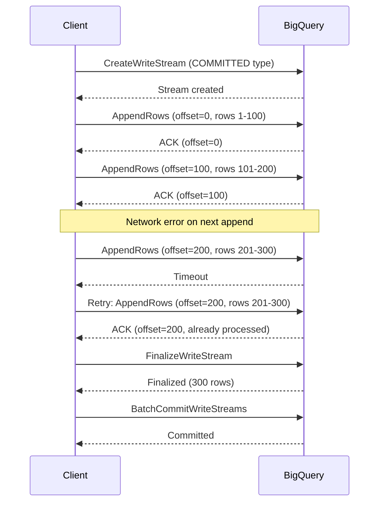

# How to Implement Exactly-Once Delivery with the BigQuery Storage Write API

Author: [nawazdhandala](https://www.github.com/nawazdhandala)

Tags: GCP, BigQuery, Exactly-Once Delivery, Storage Write API, Data Integrity

Description: Learn how to implement exactly-once data delivery to BigQuery using the Storage Write API's committed mode with stream offsets and proper error handling.

---

Duplicate data in your analytics tables is a problem that compounds over time. Counts get inflated, revenue figures become unreliable, and downstream consumers lose trust in the data. The BigQuery Storage Write API's committed mode solves this by providing exactly-once delivery semantics at the API level.

Getting exactly-once right requires understanding how stream offsets work and how to handle failures properly. I have implemented this pattern for financial data pipelines where duplicates are unacceptable, and I want to share the approach.

## How Exactly-Once Works

The Storage Write API's committed mode uses stream offsets to track exactly which rows have been successfully written. Here is the concept:

1. You create a dedicated write stream (not the default stream).
2. Each append request includes an offset that indicates where in the stream the data should be written.
3. The server validates that the offset matches the expected next offset.
4. If you retry a request with the same offset, the server recognizes it as a duplicate and does not write it again.
5. You commit the stream to make the data visible.



## Creating a Committed Write Stream

Here is how to create a committed write stream in Python.

```python
# exactly_once_writer.py - Exactly-once delivery using committed streams
from google.cloud import bigquery_storage_v1
from google.cloud.bigquery_storage_v1 import types
from google.protobuf import descriptor_pb2
from google.api_core import exceptions
import logging
import time

logger = logging.getLogger(__name__)

class ExactlyOnceWriter:
    """Writer that guarantees exactly-once delivery to BigQuery."""

    def __init__(self, project, dataset, table):
        self.project = project
        self.dataset = dataset
        self.table = table
        self.client = bigquery_storage_v1.BigQueryWriteClient()
        self.parent = self.client.table_path(project, dataset, table)
        self.stream = None
        self.current_offset = 0

    def create_stream(self):
        """Create a new committed write stream."""
        write_stream = types.WriteStream()
        # COMMITTED type provides exactly-once semantics
        write_stream.type_ = types.WriteStream.Type.COMMITTED

        self.stream = self.client.create_write_stream(
            parent=self.parent,
            write_stream=write_stream
        )
        self.current_offset = 0
        logger.info(f"Created stream: {self.stream.name}")
        return self.stream.name

    def append_rows(self, rows, max_retries=3):
        """
        Append rows with exactly-once delivery guarantee.
        Uses stream offsets to prevent duplicates on retry.
        """
        if not self.stream:
            raise RuntimeError("No active stream. Call create_stream() first.")

        offset = self.current_offset
        row_count = len(rows)

        for attempt in range(max_retries):
            try:
                # The offset tells BigQuery where these rows should go
                # If we retry with the same offset, BigQuery deduplicates
                request = types.AppendRowsRequest()
                request.write_stream = self.stream.name
                request.offset = types.Int64Value(value=offset)

                # Serialize and append rows
                # (Protocol buffer serialization details omitted for clarity)
                logger.info(
                    f"Appending {row_count} rows at offset {offset} "
                    f"(attempt {attempt + 1})"
                )

                # After successful append, advance the offset
                self.current_offset += row_count
                logger.info(f"Append successful. New offset: {self.current_offset}")
                return True

            except exceptions.AlreadyExists:
                # This offset was already written - this is a successful retry
                logger.info(
                    f"Offset {offset} already written (duplicate request). "
                    f"Treating as success."
                )
                self.current_offset += row_count
                return True

            except exceptions.ResourceExhausted:
                # Rate limited - back off and retry
                wait = min(2 ** attempt * 0.5, 30)
                logger.warning(f"Rate limited. Waiting {wait}s before retry.")
                time.sleep(wait)

            except exceptions.InvalidArgument as e:
                # Bad data - do not retry
                logger.error(f"Invalid data at offset {offset}: {e}")
                raise

            except Exception as e:
                if attempt < max_retries - 1:
                    wait = min(2 ** attempt, 10)
                    logger.warning(
                        f"Attempt {attempt + 1} failed: {e}. "
                        f"Retrying in {wait}s."
                    )
                    time.sleep(wait)
                else:
                    logger.error(
                        f"All {max_retries} attempts failed for offset {offset}"
                    )
                    raise

    def finalize_stream(self):
        """Finalize the stream - no more data can be appended."""
        if not self.stream:
            return

        response = self.client.finalize_write_stream(
            name=self.stream.name
        )
        logger.info(
            f"Stream finalized. Row count: {response.row_count}"
        )
        return response.row_count

    def commit_stream(self):
        """
        Commit the stream to make data visible in BigQuery.
        For COMMITTED type streams, data is visible after each append,
        but committing ensures it persists.
        """
        if not self.stream:
            return

        commit_request = types.BatchCommitWriteStreamsRequest()
        commit_request.parent = self.parent
        commit_request.write_streams = [self.stream.name]

        response = self.client.batch_commit_write_streams(
            request=commit_request
        )

        if response.stream_errors:
            logger.error(f"Commit errors: {response.stream_errors}")
            raise RuntimeError("Stream commit failed")

        logger.info(
            f"Stream committed at {response.commit_time}"
        )
        return response.commit_time
```

## Using the Exactly-Once Writer

Here is how to use the writer in a data pipeline.

```python
# pipeline.py - Using the exactly-once writer in a pipeline
import json
from exactly_once_writer import ExactlyOnceWriter

def process_batch(events):
    """Process a batch of events with exactly-once delivery."""
    writer = ExactlyOnceWriter("my_project", "my_dataset", "events")

    try:
        # Create a new stream for this batch
        stream_name = writer.create_stream()
        print(f"Processing {len(events)} events on stream {stream_name}")

        # Split events into chunks for efficient appending
        chunk_size = 500
        for i in range(0, len(events), chunk_size):
            chunk = events[i:i + chunk_size]
            writer.append_rows(chunk)
            print(f"  Appended rows {i} to {i + len(chunk)}")

        # Finalize - no more data will be appended to this stream
        total_rows = writer.finalize_stream()
        print(f"Stream finalized with {total_rows} rows")

        # Commit to make data permanently visible
        commit_time = writer.commit_stream()
        print(f"Data committed at {commit_time}")

    except Exception as e:
        print(f"Pipeline failed: {e}")
        # The stream can be abandoned - uncommitted data will not be visible
        raise


if __name__ == "__main__":
    # Simulate a batch of events
    events = [
        {"event_id": f"evt-{i}", "user_id": i % 1000, "event_type": "click"}
        for i in range(10000)
    ]
    process_batch(events)
```

## Handling Stream Failures

When a stream fails, you need to decide what to do with the partially written data.

```python
# failure_handling.py - Handling stream failures gracefully
def process_with_recovery(events, writer):
    """Process events with failure recovery."""
    checkpoint_offset = 0

    try:
        writer.create_stream()

        chunk_size = 500
        for i in range(0, len(events), chunk_size):
            chunk = events[i:i + chunk_size]
            writer.append_rows(chunk)
            # Save checkpoint after each successful append
            checkpoint_offset = i + len(chunk)

        writer.finalize_stream()
        writer.commit_stream()

    except Exception as e:
        print(f"Failed at offset {checkpoint_offset}: {e}")

        # Option 1: Create a new stream and retry from the checkpoint
        remaining_events = events[checkpoint_offset:]
        if remaining_events:
            print(f"Retrying {len(remaining_events)} remaining events")
            retry_writer = ExactlyOnceWriter(
                writer.project, writer.dataset, writer.table
            )
            process_with_recovery(remaining_events, retry_writer)

        # Option 2: Abandon and let the next pipeline run pick up the data
        # This is safe because uncommitted data is not visible
```

## Offset Management for Long-Running Streams

For long-running streams that span multiple processing windows, you need persistent offset tracking.

```python
# offset_tracker.py - Track offsets persistently for recovery
import json
import os

class OffsetTracker:
    """Track stream offsets in a persistent store for recovery."""

    def __init__(self, checkpoint_path):
        self.checkpoint_path = checkpoint_path

    def save_checkpoint(self, stream_name, offset, metadata=None):
        """Save the current offset to persistent storage."""
        checkpoint = {
            "stream_name": stream_name,
            "offset": offset,
            "metadata": metadata or {}
        }
        with open(self.checkpoint_path, 'w') as f:
            json.dump(checkpoint, f)

    def load_checkpoint(self):
        """Load the last saved checkpoint."""
        if not os.path.exists(self.checkpoint_path):
            return None
        with open(self.checkpoint_path, 'r') as f:
            return json.load(f)

    def clear_checkpoint(self):
        """Clear the checkpoint after successful commit."""
        if os.path.exists(self.checkpoint_path):
            os.remove(self.checkpoint_path)
```

## Multiple Streams for High Throughput

For very high throughput scenarios, use multiple streams in parallel. Each stream maintains its own offset independently.

```python
# parallel_writer.py - Multiple streams for parallel exactly-once writes
from concurrent.futures import ThreadPoolExecutor, as_completed
from exactly_once_writer import ExactlyOnceWriter

def parallel_write(events, project, dataset, table, num_streams=4):
    """Write events using multiple parallel streams."""
    # Partition events across streams
    chunk_size = len(events) // num_streams
    partitions = []
    for i in range(num_streams):
        start = i * chunk_size
        end = start + chunk_size if i < num_streams - 1 else len(events)
        partitions.append(events[start:end])

    # Create writers and process partitions in parallel
    stream_names = []
    with ThreadPoolExecutor(max_workers=num_streams) as executor:
        futures = {}
        for i, partition in enumerate(partitions):
            writer = ExactlyOnceWriter(project, dataset, table)
            writer.create_stream()
            stream_names.append(writer.stream.name)
            future = executor.submit(write_partition, writer, partition)
            futures[future] = i

        # Wait for all partitions to complete
        for future in as_completed(futures):
            partition_idx = futures[future]
            try:
                future.result()
                print(f"Partition {partition_idx} completed")
            except Exception as e:
                print(f"Partition {partition_idx} failed: {e}")
                raise

    # Commit all streams atomically
    commit_all_streams(project, dataset, table, stream_names)
    print(f"All {num_streams} streams committed successfully")


def write_partition(writer, events):
    """Write a partition of events to a single stream."""
    chunk_size = 500
    for i in range(0, len(events), chunk_size):
        chunk = events[i:i + chunk_size]
        writer.append_rows(chunk)
    writer.finalize_stream()


def commit_all_streams(project, dataset, table, stream_names):
    """Commit multiple streams atomically."""
    client = bigquery_storage_v1.BigQueryWriteClient()
    parent = client.table_path(project, dataset, table)

    request = types.BatchCommitWriteStreamsRequest()
    request.parent = parent
    request.write_streams = stream_names

    response = client.batch_commit_write_streams(request=request)
    if response.stream_errors:
        raise RuntimeError(f"Commit failed: {response.stream_errors}")
```

## Verifying Exactly-Once Delivery

After implementing exactly-once delivery, verify it works by checking for duplicates.

```sql
-- Check for duplicate event_ids which would indicate delivery issues
SELECT
  event_id,
  COUNT(*) AS occurrence_count
FROM `my_project.my_dataset.events`
WHERE event_date = CURRENT_DATE()
GROUP BY event_id
HAVING COUNT(*) > 1
LIMIT 20;
```

```sql
-- Compare expected vs actual row counts
SELECT
  COUNT(*) AS total_rows,
  COUNT(DISTINCT event_id) AS unique_events,
  COUNT(*) - COUNT(DISTINCT event_id) AS duplicate_count
FROM `my_project.my_dataset.events`
WHERE event_date = CURRENT_DATE();
```

## Wrapping Up

Exactly-once delivery with the BigQuery Storage Write API requires more setup than the default stream, but it eliminates the duplicate data problem at its source. The key concepts are: use COMMITTED type streams, always include offsets in your append requests, handle retries by re-sending with the same offset, and commit streams atomically when all data is appended. For financial, billing, or any data where accuracy matters, this is the right approach.

For monitoring your exactly-once delivery pipelines and alerting on any data integrity issues, [OneUptime](https://oneuptime.com) provides the observability tools needed to keep your data pipelines reliable.
