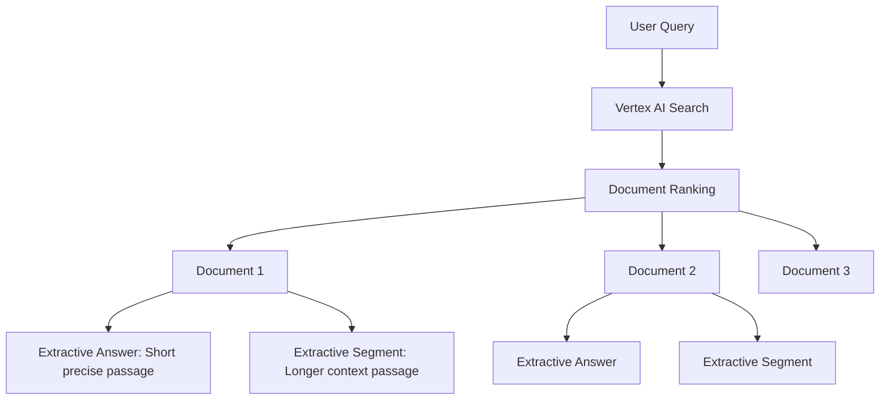

# How to Implement Extractive Answers and Segments in Vertex AI Search

Author: [nawazdhandala](https://www.github.com/nawazdhandala)

Tags: GCP, Vertex AI Search, Extractive Answers, Search API, NLP

Description: Learn how to use extractive answers and segments in Vertex AI Search to pull precise answer passages directly from your indexed documents.

---

When users search your knowledge base, they do not want a list of document links. They want the actual answer. Vertex AI Search provides two features that deliver this: extractive answers and extractive segments. Extractive answers are short, precise passages that directly answer the query. Extractive segments are longer text blocks that provide more context. Together, they let you build a search experience where users get instant answers without clicking through to individual documents.

This guide covers how to configure and use both features effectively.

## Extractive Answers vs. Extractive Segments

Understanding the difference helps you choose the right feature for your use case:

**Extractive Answers** are short text spans (usually 1-2 sentences) that directly answer the query. Think of them as the highlighted answer you see at the top of a Google search result. They work best for factual questions with clear answers.

**Extractive Segments** are longer passages (typically a paragraph or more) extracted from the document. They provide surrounding context that helps users understand the answer in its broader context. These work well for complex topics where a short answer would lose important nuance.



## Prerequisites

- A Vertex AI Search engine with indexed content
- Python 3.9+
- The Discovery Engine API enabled

```bash
pip install google-cloud-discoveryengine
```

## Configuring Extractive Answers

### Basic Extractive Answer Request

```python
from google.cloud import discoveryengine_v1 as discoveryengine

def search_with_extractive_answers(
    project_id: str,
    location: str,
    engine_id: str,
    query: str,
    max_answers: int = 3,
):
    """Search and extract precise answer passages from documents."""
    client = discoveryengine.SearchServiceClient()

    serving_config = (
        f"projects/{project_id}/locations/{location}"
        f"/collections/default_collection/engines/{engine_id}"
        f"/servingConfigs/default_search"
    )

    # Configure extractive content specification
    extractive_spec = discoveryengine.SearchRequest.ContentSearchSpec.ExtractiveContentSpec(
        max_extractive_answer_count=max_answers,  # Number of answers per document
        return_extractive_segment_score=True,      # Include confidence scores
    )

    request = discoveryengine.SearchRequest(
        serving_config=serving_config,
        query=query,
        page_size=5,
        content_search_spec=discoveryengine.SearchRequest.ContentSearchSpec(
            extractive_content_spec=extractive_spec,
        ),
    )

    response = client.search(request)

    # Process the extractive answers
    for result in response.results:
        doc_data = result.document.derived_struct_data
        title = doc_data.get("title", "Untitled")
        answers = doc_data.get("extractive_answers", [])

        if answers:
            print(f"\nDocument: {title}")
            for i, answer in enumerate(answers):
                content = answer.get("content", "")
                page = answer.get("pageNumber", "N/A")
                print(f"  Answer {i+1} (page {page}): {content}")

    return response

# Get extractive answers for a factual question
search_with_extractive_answers(
    project_id="your-project-id",
    location="global",
    engine_id="enterprise-search",
    query="What is the maximum file upload size?",
    max_answers=3,
)
```

## Configuring Extractive Segments

### Getting Longer Context Passages

```python
def search_with_extractive_segments(
    project_id: str,
    location: str,
    engine_id: str,
    query: str,
    max_segments: int = 3,
    num_previous_segments: int = 1,
    num_next_segments: int = 1,
):
    """Search and extract longer context segments from documents."""
    client = discoveryengine.SearchServiceClient()

    serving_config = (
        f"projects/{project_id}/locations/{location}"
        f"/collections/default_collection/engines/{engine_id}"
        f"/servingConfigs/default_search"
    )

    # Configure extractive segments
    extractive_spec = discoveryengine.SearchRequest.ContentSearchSpec.ExtractiveContentSpec(
        max_extractive_segment_count=max_segments,
        return_extractive_segment_score=True,
        # Include surrounding segments for additional context
        num_previous_segments=num_previous_segments,
        num_next_segments=num_next_segments,
    )

    request = discoveryengine.SearchRequest(
        serving_config=serving_config,
        query=query,
        page_size=5,
        content_search_spec=discoveryengine.SearchRequest.ContentSearchSpec(
            extractive_content_spec=extractive_spec,
        ),
    )

    response = client.search(request)

    for result in response.results:
        doc_data = result.document.derived_struct_data
        title = doc_data.get("title", "Untitled")
        segments = doc_data.get("extractive_segments", [])

        if segments:
            print(f"\nDocument: {title}")
            for i, segment in enumerate(segments):
                content = segment.get("content", "")
                page = segment.get("pageNumber", "N/A")
                relevance_score = segment.get("relevanceScore", 0)
                print(f"  Segment {i+1} (page {page}, score: {relevance_score:.3f}):")
                print(f"  {content[:500]}...")

                # Print adjacent segments if available
                prev_segments = segment.get("previousSegments", [])
                next_segments = segment.get("nextSegments", [])
                if prev_segments:
                    print(f"  [Previous context]: {prev_segments[0].get('content', '')[:200]}...")
                if next_segments:
                    print(f"  [Following context]: {next_segments[0].get('content', '')[:200]}...")

    return response

# Get extractive segments for a complex topic
search_with_extractive_segments(
    project_id="your-project-id",
    location="global",
    engine_id="enterprise-search",
    query="How does the authentication flow work for SSO users?",
    max_segments=3,
)
```

## Combining Answers and Segments

You can request both extractive answers and segments in the same query to get both quick answers and detailed context.

```python
def search_with_both(
    project_id: str,
    location: str,
    engine_id: str,
    query: str,
):
    """Get both extractive answers and segments from a single search."""
    client = discoveryengine.SearchServiceClient()

    serving_config = (
        f"projects/{project_id}/locations/{location}"
        f"/collections/default_collection/engines/{engine_id}"
        f"/servingConfigs/default_search"
    )

    # Request both answers and segments
    extractive_spec = discoveryengine.SearchRequest.ContentSearchSpec.ExtractiveContentSpec(
        max_extractive_answer_count=2,    # Short precise answers
        max_extractive_segment_count=2,   # Longer context segments
        return_extractive_segment_score=True,
    )

    request = discoveryengine.SearchRequest(
        serving_config=serving_config,
        query=query,
        page_size=5,
        content_search_spec=discoveryengine.SearchRequest.ContentSearchSpec(
            extractive_content_spec=extractive_spec,
            # Also include snippets for the result list
            snippet_spec=discoveryengine.SearchRequest.ContentSearchSpec.SnippetSpec(
                return_snippet=True,
                max_snippet_count=2,
            ),
        ),
    )

    response = client.search(request)

    for result in response.results:
        doc_data = result.document.derived_struct_data
        title = doc_data.get("title", "Untitled")

        print(f"\n{'='*60}")
        print(f"Document: {title}")

        # Show extractive answers first (quick answers)
        answers = doc_data.get("extractive_answers", [])
        if answers:
            print("\n  Quick Answers:")
            for answer in answers:
                print(f"    > {answer.get('content', '')}")

        # Show extractive segments (detailed context)
        segments = doc_data.get("extractive_segments", [])
        if segments:
            print("\n  Detailed Context:")
            for segment in segments:
                print(f"    {segment.get('content', '')[:300]}...")

    return response

search_with_both(
    project_id="your-project-id",
    location="global",
    engine_id="enterprise-search",
    query="What are the backup retention settings?",
)
```

## Building a Search Results UI

Here is how you might structure the results in a web application.

```python
def format_search_results_for_ui(response) -> list:
    """Format search results into a structure suitable for a frontend."""
    formatted_results = []

    for result in response.results:
        doc_data = result.document.derived_struct_data

        formatted = {
            "title": doc_data.get("title", "Untitled"),
            "link": doc_data.get("link", "#"),
            "quick_answers": [],
            "context_segments": [],
            "snippets": [],
        }

        # Extract answers
        for answer in doc_data.get("extractive_answers", []):
            formatted["quick_answers"].append({
                "text": answer.get("content", ""),
                "page": answer.get("pageNumber"),
            })

        # Extract segments
        for segment in doc_data.get("extractive_segments", []):
            formatted["context_segments"].append({
                "text": segment.get("content", ""),
                "page": segment.get("pageNumber"),
                "score": segment.get("relevanceScore", 0),
            })

        # Extract snippets
        for snippet in doc_data.get("snippets", []):
            formatted["snippets"].append({
                "text": snippet.get("snippet", ""),
                "html": snippet.get("snippet_with_html_tag", ""),
            })

        formatted_results.append(formatted)

    return formatted_results
```

## Quality Tuning Tips

The quality of extractive answers depends heavily on your document content. Here are practical tips:

**Document structure matters** - Well-structured documents with clear headings, short paragraphs, and defined sections produce better extractive answers. If your documents are walls of text, the model has a harder time isolating precise answers.

**Question-answer patterns** - Documents that follow a FAQ or Q&A format are ideal for extractive answers because the answer boundaries are clear.

**Increase segment count for complex topics** - For technical documentation where context is important, request more segments (3-5) and enable previous/next segments for surrounding context.

**Use relevance scores for filtering** - Filter out low-scoring segments to avoid showing irrelevant content. A score threshold of 0.5 is a reasonable starting point.

```python
# Filter results by relevance score
def filter_by_relevance(response, min_score: float = 0.5):
    """Only return segments above a minimum relevance score."""
    filtered = []
    for result in response.results:
        doc_data = result.document.derived_struct_data
        segments = doc_data.get("extractive_segments", [])
        high_quality = [s for s in segments if s.get("relevanceScore", 0) >= min_score]
        if high_quality:
            filtered.append({
                "title": doc_data.get("title"),
                "segments": high_quality,
            })
    return filtered
```

## Summary

Extractive answers and segments in Vertex AI Search let you build search experiences that give users direct answers instead of just document links. Use extractive answers for factual, well-defined questions and extractive segments for topics that need more context. Combining both in a single request gives you the flexibility to show a quick answer at the top with detailed context below. Focus on document quality and structure to get the best extraction results, and use relevance scores to filter out noise.
