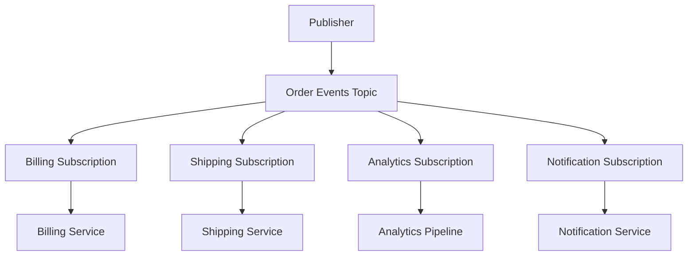

# How to Implement Fan-Out Message Patterns with Multiple Pub/Sub Subscriptions

Author: [nawazdhandala](https://www.github.com/nawazdhandala)

Tags: GCP, Pub/Sub, Fan-Out, Messaging Patterns, Architecture

Description: Learn how to implement fan-out messaging patterns in Google Cloud Pub/Sub using multiple subscriptions on a single topic to deliver messages to multiple independent consumers.

---

Fan-out is one of the most common messaging patterns, and Pub/Sub makes it almost trivially easy to implement. The idea is simple: a publisher sends a message once, and multiple independent consumers each receive their own copy. The publisher does not need to know about the consumers, and the consumers do not need to coordinate with each other.

In Pub/Sub, fan-out works through multiple subscriptions on a single topic. Each subscription gets every message published to the topic (unless filtered), and each subscription is processed independently. If one consumer falls behind, it does not affect the others.

## The Fan-Out Pattern

Here is how fan-out works in Pub/Sub:



When a message is published to the "Order Events" topic, it is delivered to all four subscriptions. Each service processes the message independently. The billing service charges the customer, the shipping service schedules delivery, the analytics pipeline records the event, and the notification service sends a confirmation email.

## Setting Up Fan-Out

The setup is straightforward. Create one topic and multiple subscriptions:

```bash
# Create the shared topic
gcloud pubsub topics create order-events

# Create independent subscriptions for each consumer
gcloud pubsub subscriptions create billing-sub \
  --topic=order-events \
  --ack-deadline=60

gcloud pubsub subscriptions create shipping-sub \
  --topic=order-events \
  --ack-deadline=120

gcloud pubsub subscriptions create analytics-sub \
  --topic=order-events \
  --ack-deadline=300

gcloud pubsub subscriptions create notification-sub \
  --topic=order-events \
  --ack-deadline=30
```

In Terraform:

```hcl
# Shared topic for order events
resource "google_pubsub_topic" "order_events" {
  name = "order-events"
  message_retention_duration = "604800s"
}

# Billing service subscription
resource "google_pubsub_subscription" "billing" {
  name                 = "billing-sub"
  topic                = google_pubsub_topic.order_events.id
  ack_deadline_seconds = 60

  retry_policy {
    minimum_backoff = "10s"
    maximum_backoff = "600s"
  }

  dead_letter_policy {
    dead_letter_topic     = google_pubsub_topic.billing_dlq.id
    max_delivery_attempts = 10
  }

  expiration_policy { ttl = "" }
}

# Shipping service subscription
resource "google_pubsub_subscription" "shipping" {
  name                 = "shipping-sub"
  topic                = google_pubsub_topic.order_events.id
  ack_deadline_seconds = 120

  retry_policy {
    minimum_backoff = "10s"
    maximum_backoff = "600s"
  }

  dead_letter_policy {
    dead_letter_topic     = google_pubsub_topic.shipping_dlq.id
    max_delivery_attempts = 10
  }

  expiration_policy { ttl = "" }
}

# Analytics pipeline subscription
resource "google_pubsub_subscription" "analytics" {
  name                 = "analytics-sub"
  topic                = google_pubsub_topic.order_events.id
  ack_deadline_seconds = 300

  # Analytics can tolerate some delay
  retry_policy {
    minimum_backoff = "30s"
    maximum_backoff = "600s"
  }

  expiration_policy { ttl = "" }
}

# Notification service subscription (push to Cloud Run)
resource "google_pubsub_subscription" "notifications" {
  name  = "notification-sub"
  topic = google_pubsub_topic.order_events.id

  push_config {
    push_endpoint = "https://notification-svc.run.app/events"
    oidc_token {
      service_account_email = google_service_account.pubsub_invoker.email
    }
  }

  ack_deadline_seconds = 30
  expiration_policy { ttl = "" }
}
```

## The Publisher Does Not Change

One of the best things about the fan-out pattern is that the publisher does not need to know about the consumers. It publishes to the topic, and that is it:

```python
# Publisher code - completely unaware of how many subscribers exist
from google.cloud import pubsub_v1
import json

publisher = pubsub_v1.PublisherClient()
topic_path = publisher.topic_path("my-project", "order-events")

def publish_order_event(order):
    """Publish an order event. All subscribers get a copy automatically."""
    message = {
        "order_id": order["id"],
        "customer_id": order["customer_id"],
        "total": order["total"],
        "status": order["status"],
        "timestamp": order["timestamp"],
    }

    future = publisher.publish(
        topic_path,
        data=json.dumps(message).encode("utf-8"),
        event_type=f"order.{order['status']}",
        region=order.get("region", "us-east"),
    )

    return future.result()
```

You can add new subscribers at any time without modifying the publisher. Want to add a fraud detection service? Create a new subscription and deploy the service. The publisher keeps running unchanged.

## Fan-Out with Filtering

Not every consumer needs every message. Use subscription filters to deliver only relevant messages to each consumer:

```hcl
# Billing only cares about payment events
resource "google_pubsub_subscription" "billing_filtered" {
  name   = "billing-filtered-sub"
  topic  = google_pubsub_topic.order_events.id
  filter = "attributes.event_type = \"order.paid\" OR attributes.event_type = \"order.refunded\""

  ack_deadline_seconds = 60
  expiration_policy { ttl = "" }
}

# Shipping only cares about fulfillment events
resource "google_pubsub_subscription" "shipping_filtered" {
  name   = "shipping-filtered-sub"
  topic  = google_pubsub_topic.order_events.id
  filter = "attributes.event_type = \"order.shipped\" OR attributes.event_type = \"order.delivered\""

  ack_deadline_seconds = 120
  expiration_policy { ttl = "" }
}

# Analytics gets everything - no filter
resource "google_pubsub_subscription" "analytics_all" {
  name                 = "analytics-all-sub"
  topic                = google_pubsub_topic.order_events.id
  ack_deadline_seconds = 300
  expiration_policy    { ttl = "" }
}
```

This is selective fan-out. Each consumer still gets an independent copy, but only of the messages it cares about.

## Fan-Out with Different Delivery Types

Different consumers may need different delivery mechanisms. Pub/Sub supports this naturally:

```hcl
# Pull subscription for a GKE-based service
resource "google_pubsub_subscription" "gke_service" {
  name                 = "gke-processor-sub"
  topic                = google_pubsub_topic.order_events.id
  ack_deadline_seconds = 60
  expiration_policy    { ttl = "" }
}

# Push subscription for a Cloud Run service
resource "google_pubsub_subscription" "cloud_run_service" {
  name  = "cloud-run-processor-sub"
  topic = google_pubsub_topic.order_events.id

  push_config {
    push_endpoint = "https://processor.run.app/events"
    oidc_token {
      service_account_email = "pubsub-sa@my-project.iam.gserviceaccount.com"
    }
  }

  expiration_policy { ttl = "" }
}

# BigQuery subscription for data warehousing
resource "google_pubsub_subscription" "bigquery_export" {
  name  = "bigquery-export-sub"
  topic = google_pubsub_topic.order_events.id

  bigquery_config {
    table          = "my-project.analytics.order_events"
    write_metadata = true
  }

  expiration_policy { ttl = "" }
}
```

One topic, three completely different delivery mechanisms. The publisher does not care which is which.

## Handling Independent Failure

A key advantage of the fan-out pattern is fault isolation. If the shipping service goes down, the billing service, analytics pipeline, and notification service continue operating normally. The shipping subscription accumulates a backlog until the service recovers.

Each subscription should have its own dead letter topic to prevent failed messages from blocking other messages:

```python
# Each consumer handles failures independently
from google.cloud import pubsub_v1
import json
import logging

logger = logging.getLogger(__name__)

def create_resilient_subscriber(project_id, subscription_id, handler_fn):
    """Create a subscriber with independent error handling."""
    subscriber = pubsub_v1.SubscriberClient()
    subscription_path = subscriber.subscription_path(project_id, subscription_id)

    def callback(message):
        try:
            data = json.loads(message.data.decode('utf-8'))
            handler_fn(data)
            message.ack()
        except Exception as e:
            logger.error(f"[{subscription_id}] Processing failed: {e}")
            message.nack()  # Will be retried or sent to DLQ

    flow_control = pubsub_v1.types.FlowControl(max_messages=50)

    streaming_pull = subscriber.subscribe(
        subscription_path,
        callback=callback,
        flow_control=flow_control,
    )

    logger.info(f"Started subscriber for {subscription_id}")
    return streaming_pull

# Each service runs its own subscriber
billing_sub = create_resilient_subscriber(
    "my-project", "billing-sub", process_billing
)

shipping_sub = create_resilient_subscriber(
    "my-project", "shipping-sub", process_shipping
)
```

## Monitoring Fan-Out Health

With multiple subscriptions on a topic, you need to monitor each one independently:

```hcl
# Alert if any subscription has a growing backlog
resource "google_monitoring_alert_policy" "fanout_backlog" {
  display_name = "Fan-Out Subscription Backlog Alert"
  combiner     = "OR"

  conditions {
    display_name = "Any order-events subscription backlog too high"

    condition_threshold {
      filter = <<-EOT
        resource.type = "pubsub_subscription"
        AND metric.type = "pubsub.googleapis.com/subscription/num_undelivered_messages"
        AND resource.labels.subscription_id = monitoring.regex.full_match("(billing|shipping|analytics|notification)-sub")
      EOT

      aggregations {
        alignment_period   = "300s"
        per_series_aligner = "ALIGN_MEAN"
      }

      comparison      = "COMPARISON_GT"
      threshold_value = 5000
      duration        = "600s"

      trigger {
        count = 1
      }
    }
  }

  notification_channels = [
    google_monitoring_notification_channel.slack.name,
  ]
}
```

## Fan-Out vs Fan-In

Fan-out (one publisher, many subscribers) is different from fan-in (many publishers, one subscriber). Pub/Sub supports both naturally:

- **Fan-out**: One topic with multiple subscriptions
- **Fan-in**: Multiple publishers writing to the same topic, one subscription reading from it
- **Both**: Multiple publishers, one topic, multiple subscriptions

You can combine these patterns freely. A topic that receives events from ten different microservices and fans out to five different consumer services is perfectly fine.

## Best Practices

1. **Give each subscription its own DLQ.** A poisoned message might affect only one consumer. Separate DLQs make investigation easier.

2. **Set appropriate ack deadlines per consumer.** The billing service might need 30 seconds, while the analytics pipeline needs 5 minutes. Configure each independently.

3. **Use topic-level message retention.** This ensures you can add a new subscription and replay historical messages if needed.

4. **Name subscriptions clearly.** Include the consumer service name in the subscription name so monitoring dashboards are readable.

5. **Document the fan-out topology.** Maintain a diagram or document that shows which services subscribe to which topics. This becomes critical during incident response.

## Wrapping Up

Fan-out with Pub/Sub is one of the simplest and most powerful patterns in event-driven architecture. Create a topic, add subscriptions for each consumer, and publish messages once. Each consumer gets its own copy, processes at its own pace, and handles failures independently. Add subscription filters for selective fan-out, use different delivery types for different consumers, and monitor each subscription individually. The pattern scales from two consumers to dozens without any changes to the publisher.
