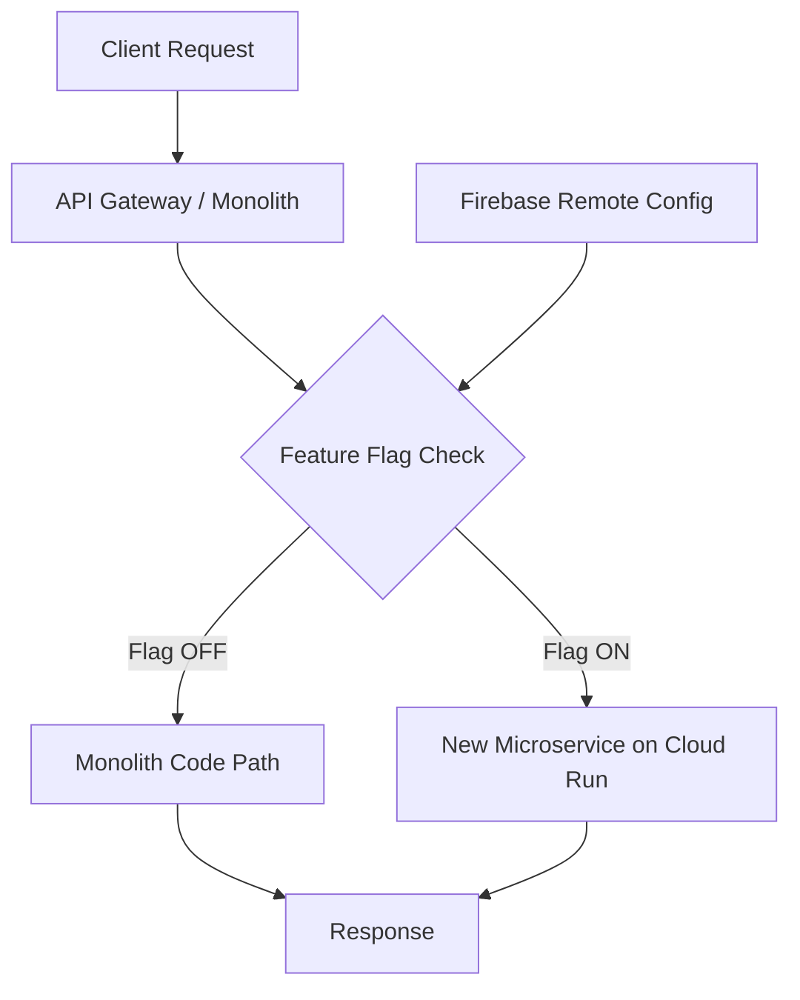

# How to Implement Feature Flags for Gradual Monolith-to-Microservices Migration on GCP

Author: [nawazdhandala](https://www.github.com/nawazdhandala)

Tags: GCP, Feature Flags, Microservices, Migration, Cloud Run, Firebase Remote Config

Description: Use feature flags to gradually migrate traffic from a monolithic application to new microservices on GCP, reducing risk and enabling safe rollbacks during the transition.

---

Breaking apart a monolith is risky. You are replacing battle-tested code with new services, and if something goes wrong, you need to roll back fast. The safest way I have found to do this is with feature flags - they let you control which code path runs (old monolith vs. new microservice) without redeploying anything.

This post walks through a practical approach to using feature flags during a monolith-to-microservices migration on GCP, with real code examples and strategies that have worked well in production.

## Why Feature Flags for Migration

When you extract a piece of your monolith into a microservice, you are essentially building a parallel implementation. Without feature flags, you are stuck with a big-bang cutover - deploy the new service, switch all traffic, and hope for the best.

Feature flags give you granular control:

- Route 5% of traffic to the new service while 95% still hits the monolith
- Enable the new service for internal users first, then expand
- Instantly roll back to the monolith if the new service has issues
- Run both paths simultaneously and compare results (shadow testing)

## Architecture Overview

Here is the high-level setup:



## Setting Up Feature Flag Infrastructure

You have several options for feature flag services on GCP. Firebase Remote Config works well if you want a managed, free solution. For more advanced use cases, you can use a dedicated service like LaunchDarkly, or build a simple flag store with Cloud Firestore.

Here is a lightweight approach using Cloud Firestore as a flag store:

```python
# feature_flags.py - Simple feature flag service backed by Firestore
from google.cloud import firestore
import hashlib
import logging

# Initialize Firestore client
db = firestore.Client()
FLAGS_COLLECTION = 'feature_flags'

# Local cache to avoid hitting Firestore on every request
_flag_cache = {}
_cache_ttl = 30  # seconds

def get_flag(flag_name):
    """Fetch a feature flag configuration from Firestore."""
    import time

    # Check cache first
    cached = _flag_cache.get(flag_name)
    if cached and (time.time() - cached['fetched_at']) < _cache_ttl:
        return cached['value']

    # Fetch from Firestore
    doc = db.collection(FLAGS_COLLECTION).document(flag_name).get()
    if not doc.exists:
        return {'enabled': False, 'percentage': 0}

    flag_data = doc.to_dict()
    _flag_cache[flag_name] = {'value': flag_data, 'fetched_at': time.time()}
    return flag_data


def is_enabled(flag_name, user_id=None):
    """Check if a feature flag is enabled for a given user."""
    flag = get_flag(flag_name)

    if not flag.get('enabled', False):
        return False

    # If no percentage rollout, flag is fully on
    percentage = flag.get('percentage', 100)
    if percentage >= 100:
        return True

    # Use consistent hashing so the same user always gets the same result
    if user_id:
        hash_val = int(hashlib.md5(f'{flag_name}:{user_id}'.encode()).hexdigest(), 16)
        return (hash_val % 100) < percentage

    return False
```

## Creating Flag Documents

Set up your migration flags in Firestore. Each flag controls the routing for one piece of functionality being extracted from the monolith.

```python
# setup_flags.py - Initialize feature flags for the migration
from google.cloud import firestore

db = firestore.Client()

# Define migration flags
migration_flags = {
    'use_user_service': {
        'enabled': True,
        'percentage': 10,       # Start with 10% of traffic
        'description': 'Route user profile requests to new User microservice',
        'fallback_url': None,   # Use monolith code path
        'service_url': 'https://user-service-xxxxx.run.app',
    },
    'use_order_service': {
        'enabled': False,
        'percentage': 0,
        'description': 'Route order requests to new Order microservice',
        'fallback_url': None,
        'service_url': 'https://order-service-xxxxx.run.app',
    },
    'use_notification_service': {
        'enabled': True,
        'percentage': 100,      # Fully migrated
        'description': 'Route notifications to new Notification microservice',
        'fallback_url': None,
        'service_url': 'https://notification-service-xxxxx.run.app',
    },
}

# Write flags to Firestore
for flag_name, config in migration_flags.items():
    db.collection('feature_flags').document(flag_name).set(config)
    print(f'Created flag: {flag_name}')
```

## Implementing the Router in the Monolith

Inside your monolith, add routing logic at the points where you are extracting functionality. Here is an example in a Flask application:

```python
# routes/users.py - User profile endpoint with feature flag routing
import requests
from flask import request, jsonify, g
from feature_flags import is_enabled, get_flag

@app.route('/api/users/<user_id>/profile')
def get_user_profile(user_id):
    """Serve user profile from either monolith or new microservice."""

    # Check if this request should go to the new User microservice
    if is_enabled('use_user_service', user_id=user_id):
        return proxy_to_microservice('use_user_service', user_id)
    else:
        return monolith_get_profile(user_id)


def proxy_to_microservice(flag_name, user_id):
    """Forward the request to the new microservice."""
    flag = get_flag(flag_name)
    service_url = flag.get('service_url')

    try:
        # Forward the request with original headers
        headers = {
            'Authorization': request.headers.get('Authorization', ''),
            'X-Request-ID': request.headers.get('X-Request-ID', ''),
            'X-Forwarded-From': 'monolith',
        }

        resp = requests.get(
            f'{service_url}/api/users/{user_id}/profile',
            headers=headers,
            timeout=5,
        )

        # If the microservice fails, fall back to monolith
        if resp.status_code >= 500:
            logging.warning(f'Microservice returned {resp.status_code}, falling back')
            return monolith_get_profile(user_id)

        return (resp.content, resp.status_code, dict(resp.headers))

    except requests.exceptions.RequestException as e:
        logging.error(f'Microservice request failed: {e}, falling back to monolith')
        return monolith_get_profile(user_id)


def monolith_get_profile(user_id):
    """Original monolith code for fetching user profile."""
    user = db.query(User).filter_by(id=user_id).first()
    if not user:
        return jsonify({'error': 'User not found'}), 404
    return jsonify(user.to_dict())
```

Notice the automatic fallback - if the microservice is down or returns a server error, the request falls back to the monolith seamlessly.

## Gradual Rollout Strategy

Here is a practical rollout sequence that has worked well:

1. **0% - Deploy and test internally**: The microservice is deployed but only accessed through direct testing.
2. **1% - Canary**: Route a tiny fraction of real traffic. Monitor error rates and latency.
3. **10% - Expanded canary**: Increase if the 1% looked good. Watch for issues that only appear at slightly higher load.
4. **50% - Half traffic**: At this point you have strong confidence. Compare metrics between monolith and microservice paths.
5. **100% - Full migration**: All traffic goes to the microservice. Keep the monolith code path for two weeks as a safety net.
6. **Remove the flag**: Once stable, remove the feature flag and the old monolith code.

Update the rollout percentage through Firestore:

```bash
# Increase the user service rollout to 50% using the Firebase CLI
# Or you can update directly via the Firestore console
gcloud firestore documents update \
  --collection=feature_flags \
  --document=use_user_service \
  --field-updates="percentage=50"
```

## Shadow Testing with Dual Writes

For critical data operations, you might want to call both the monolith and the microservice, compare the results, but only return the monolith response. This catches bugs before they affect users.

```python
import asyncio
import aiohttp

async def shadow_test(flag_name, user_id):
    """Call both monolith and microservice, compare results."""
    flag = get_flag(flag_name)
    service_url = flag.get('service_url')

    # Get monolith result (this is the real response)
    monolith_result = monolith_get_profile(user_id)

    # Call microservice in the background, do not block the response
    try:
        async with aiohttp.ClientSession() as session:
            async with session.get(
                f'{service_url}/api/users/{user_id}/profile',
                timeout=aiohttp.ClientTimeout(total=3)
            ) as resp:
                micro_result = await resp.json()

        # Compare and log differences
        if monolith_result != micro_result:
            logging.warning(f'Shadow test mismatch for user {user_id}')
            log_mismatch(user_id, monolith_result, micro_result)

    except Exception as e:
        logging.error(f'Shadow test failed: {e}')

    # Always return the monolith result
    return monolith_result
```

## Monitoring During Migration

Set up dashboards that show metrics for both code paths side by side:

- **Error rates**: Compare error rates between monolith and microservice paths
- **Latency (p50, p95, p99)**: The microservice should be at least as fast
- **Request volume**: Verify the traffic split matches your flag percentage
- **Fallback rate**: Track how often the automatic fallback triggers

## Wrapping Up

Feature flags turn a scary monolith-to-microservices migration into a controlled, reversible process. You can move at whatever pace you are comfortable with, and you always have a one-click rollback to the proven monolith code. The combination of consistent user hashing (so the same user always gets the same experience), automatic fallback on errors, and shadow testing gives you confidence that the new microservice is ready before you commit to it fully. Start with the least critical service, prove out the pattern, and then apply it to the rest of the migration.
