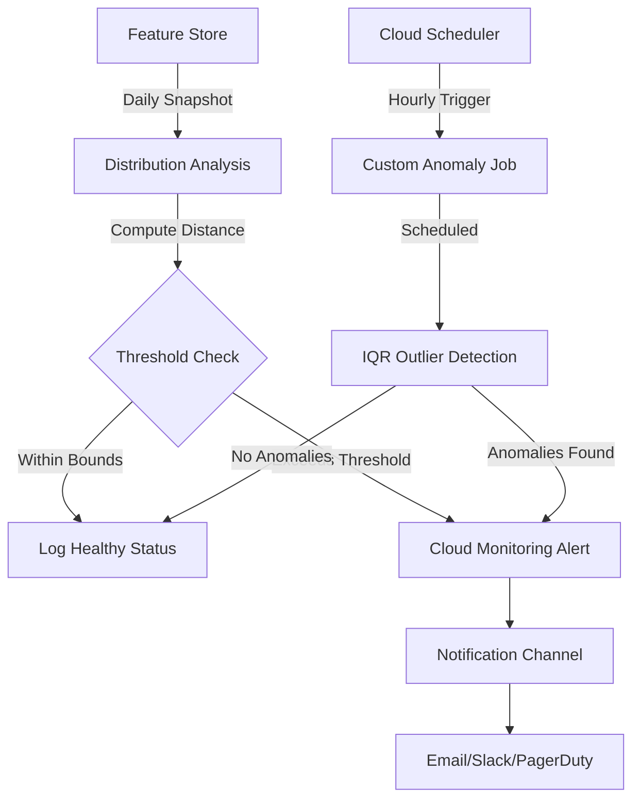

# How to Implement Feature Monitoring and Anomaly Detection in Vertex AI Feature Store

Author: [nawazdhandala](https://www.github.com/nawazdhandala)

Tags: GCP, Vertex AI, Feature Store, Monitoring, Anomaly Detection

Description: A practical guide to setting up feature monitoring and anomaly detection in Vertex AI Feature Store to catch data drift and quality issues early.

---

Features that looked perfect during training can degrade silently in production. A column that was always populated starts returning nulls. A numerical feature that ranged between 0 and 100 suddenly spikes to 10,000. If you are not monitoring your features, these problems go undetected until your model's predictions start failing.

Vertex AI Feature Store includes monitoring capabilities that let you define expected distributions, set anomaly thresholds, and receive alerts when something goes wrong. This guide covers how to set that up from scratch.

## The Problem with Unmonitored Features

Consider a recommendation engine that uses a "user_average_session_duration" feature. During training, this feature ranged from 1 to 120 minutes. Six months later, a bug in the session tracking code starts reporting durations in seconds instead of minutes. The feature values drop by 60x, but nobody notices because the model still returns predictions - just increasingly bad ones.

Feature monitoring catches these kinds of issues by comparing current feature distributions against a baseline and flagging deviations that exceed your thresholds.

## Setting Up a Feature Store with Monitoring

Start by creating a feature store and defining your features with monitoring enabled.

This code sets up a feature store with a feature group that has monitoring configured:

```python
from google.cloud import aiplatform
from google.cloud.aiplatform_v1 import FeaturestoreServiceClient
from google.cloud.aiplatform_v1.types import featurestore as featurestore_pb2

# Initialize the client
aiplatform.init(project="your-project-id", location="us-central1")

# Create a Feature Store
feature_store = aiplatform.Featurestore.create(
    featurestore_id="user_features_store",
    online_serving_config=aiplatform.Featurestore.OnlineServingConfig(
        fixed_node_count=1
    )
)

# Create an entity type for users
user_entity = feature_store.create_entity_type(
    entity_type_id="users",
    description="User behavioral features"
)

# Create features with monitoring thresholds
user_entity.batch_create_features(
    feature_configs={
        "avg_session_duration": {
            "value_type": "DOUBLE",
            "description": "Average session duration in minutes",
            "monitoring_config": {
                "snapshot_analysis": {
                    "monitoring_interval_days": 1  # Check daily
                },
                "numerical_threshold_config": {
                    "value": 0.3  # Alert if distribution shift > 0.3
                }
            }
        },
        "purchase_count_30d": {
            "value_type": "INT64",
            "description": "Number of purchases in last 30 days",
            "monitoring_config": {
                "snapshot_analysis": {
                    "monitoring_interval_days": 1
                },
                "numerical_threshold_config": {
                    "value": 0.25
                }
            }
        },
        "preferred_category": {
            "value_type": "STRING",
            "description": "Most frequently browsed product category",
            "monitoring_config": {
                "snapshot_analysis": {
                    "monitoring_interval_days": 1
                },
                "categorical_threshold_config": {
                    "value": 0.2  # Alert if category distribution shifts > 0.2
                }
            }
        }
    }
)
```

The monitoring configuration specifies how often to check (snapshot interval) and how much drift is acceptable before raising an alert. The threshold values are based on statistical distance measures - for numerical features, it uses Jensen-Shannon divergence, and for categorical features, it uses L-infinity distance.

## Configuring Monitoring Alerts

Feature monitoring is only useful if someone gets notified when anomalies are detected. You can set up Cloud Monitoring alerts that trigger when drift exceeds your thresholds.

This code creates a monitoring alert policy for feature drift:

```python
from google.cloud import monitoring_v3

# Create a monitoring client
client = monitoring_v3.AlertPolicyServiceClient()
project_name = f"projects/your-project-id"

# Define the alert policy for feature drift
alert_policy = monitoring_v3.AlertPolicy(
    display_name="Vertex AI Feature Drift Alert",
    conditions=[
        monitoring_v3.AlertPolicy.Condition(
            display_name="Feature distribution anomaly detected",
            condition_threshold=monitoring_v3.AlertPolicy.Condition.MetricThreshold(
                filter='resource.type="aiplatform.googleapis.com/Featurestore" '
                       'AND metric.type="aiplatform.googleapis.com/featurestore/'
                       'feature_value_distribution_distance"',
                comparison=monitoring_v3.ComparisonType.COMPARISON_GT,
                threshold_value=0.3,
                duration={"seconds": 0},
                aggregations=[
                    monitoring_v3.Aggregation(
                        alignment_period={"seconds": 3600},
                        per_series_aligner=monitoring_v3.Aggregation.Aligner.ALIGN_MAX
                    )
                ]
            )
        )
    ],
    notification_channels=["projects/your-project-id/notificationChannels/YOUR_CHANNEL_ID"],
    alert_strategy=monitoring_v3.AlertPolicy.AlertStrategy(
        auto_close={"seconds": 86400}  # Auto-close after 24 hours
    )
)

# Create the alert policy
created_policy = client.create_alert_policy(
    name=project_name,
    alert_policy=alert_policy
)
print(f"Alert policy created: {created_policy.name}")
```

## Ingesting Features with Baseline Distribution

For monitoring to work effectively, you need to establish a baseline distribution. This is typically the distribution of your features at the time your model was trained.

This code ingests feature values and snapshots the baseline:

```python
import pandas as pd
from google.cloud import aiplatform

aiplatform.init(project="your-project-id", location="us-central1")

# Load your training data as the baseline
baseline_df = pd.DataFrame({
    "entity_id": ["user_001", "user_002", "user_003", "user_004", "user_005"],
    "avg_session_duration": [15.2, 42.7, 8.1, 67.3, 23.9],
    "purchase_count_30d": [3, 12, 0, 8, 5],
    "preferred_category": ["electronics", "clothing", "electronics", "books", "clothing"],
    "feature_timestamp": pd.to_datetime([
        "2026-01-15", "2026-01-15", "2026-01-15", "2026-01-15", "2026-01-15"
    ])
})

# Get the entity type
feature_store = aiplatform.Featurestore("user_features_store")
user_entity = feature_store.get_entity_type("users")

# Ingest baseline features from a DataFrame
user_entity.ingest_from_df(
    feature_ids=["avg_session_duration", "purchase_count_30d", "preferred_category"],
    feature_time="feature_timestamp",
    df_source=baseline_df,
    entity_id_field="entity_id"
)

print("Baseline features ingested successfully")
```

## Building a Custom Anomaly Detection Pipeline

While the built-in monitoring handles distribution drift, you might want more sophisticated anomaly detection on individual feature values. You can build a pipeline that runs periodically and checks for outliers.

This code implements a custom anomaly detection job using statistical methods:

```python
import numpy as np
from google.cloud import aiplatform, bigquery

def detect_feature_anomalies(project_id, feature_store_id, entity_type_id):
    """
    Detect anomalies in feature values using IQR method.
    Returns a list of anomalous entities and features.
    """
    # Query recent feature values from BigQuery offline store
    bq_client = bigquery.Client(project=project_id)

    query = f"""
    SELECT
        entity_id,
        avg_session_duration,
        purchase_count_30d,
        feature_timestamp
    FROM `{project_id}.{feature_store_id}.{entity_type_id}`
    WHERE feature_timestamp >= TIMESTAMP_SUB(CURRENT_TIMESTAMP(), INTERVAL 24 HOUR)
    """

    df = bq_client.query(query).to_dataframe()

    anomalies = []
    numerical_features = ["avg_session_duration", "purchase_count_30d"]

    for feature in numerical_features:
        values = df[feature].dropna()

        # Calculate IQR bounds
        q1 = values.quantile(0.25)
        q3 = values.quantile(0.75)
        iqr = q3 - q1
        lower_bound = q1 - 3 * iqr  # Using 3x IQR for stricter detection
        upper_bound = q3 + 3 * iqr

        # Find outliers
        outlier_mask = (values < lower_bound) | (values > upper_bound)
        outlier_entities = df.loc[outlier_mask, "entity_id"].tolist()

        if outlier_entities:
            anomalies.append({
                "feature": feature,
                "lower_bound": lower_bound,
                "upper_bound": upper_bound,
                "outlier_count": len(outlier_entities),
                "sample_entities": outlier_entities[:10]
            })

    # Check for null rate spikes
    for feature in numerical_features:
        null_rate = df[feature].isna().mean()
        if null_rate > 0.05:  # Alert if more than 5% null
            anomalies.append({
                "feature": feature,
                "issue": "high_null_rate",
                "null_rate": null_rate
            })

    return anomalies

# Run detection
anomalies = detect_feature_anomalies(
    "your-project-id",
    "user_features_store",
    "users"
)

for anomaly in anomalies:
    print(f"Anomaly detected: {anomaly}")
```

## Scheduling Monitoring with Cloud Scheduler

To run your custom anomaly detection on a regular schedule, you can use Cloud Scheduler to trigger a Cloud Function.

This shows the Cloud Function that wraps the anomaly detection logic:

```python
import functions_framework
from google.cloud import logging as cloud_logging
import json

@functions_framework.http
def check_feature_anomalies(request):
    """Cloud Function triggered by Cloud Scheduler to check feature health."""

    # Initialize logging
    log_client = cloud_logging.Client()
    logger = log_client.logger("feature-monitoring")

    anomalies = detect_feature_anomalies(
        "your-project-id",
        "user_features_store",
        "users"
    )

    if anomalies:
        # Log anomalies with severity
        logger.log_struct(
            {
                "message": "Feature anomalies detected",
                "anomaly_count": len(anomalies),
                "details": anomalies
            },
            severity="WARNING"
        )

        # You could also send a Slack notification or PagerDuty alert here
        return json.dumps({"status": "anomalies_found", "count": len(anomalies)}), 200

    logger.log_text("Feature health check passed - no anomalies detected")
    return json.dumps({"status": "healthy"}), 200
```

## Monitoring Dashboard

You can visualize feature health in a Cloud Monitoring dashboard. Here is the overall flow of the monitoring system.



## Practical Tips

Choosing the right threshold values takes experimentation. Start with conservative thresholds (higher values like 0.3-0.5) and tighten them as you understand the natural variation in your features. Seasonal patterns in your data - like higher purchase counts during holidays - can cause false positives if your thresholds are too tight.

Monitor the monitoring itself. If your scheduled anomaly detection jobs stop running, you will not get alerts. Set up a separate heartbeat check that verifies your monitoring pipeline is operational.

Keep your baseline distributions up to date. When you retrain your model on new data, update the baseline to reflect the new training distribution. Stale baselines lead to alert fatigue as the natural data distribution evolves.

Feature monitoring is not a substitute for model monitoring, but it complements it well. A feature anomaly can explain why model performance degraded, and catching it at the feature level gives you more time to react before end users notice the impact.
