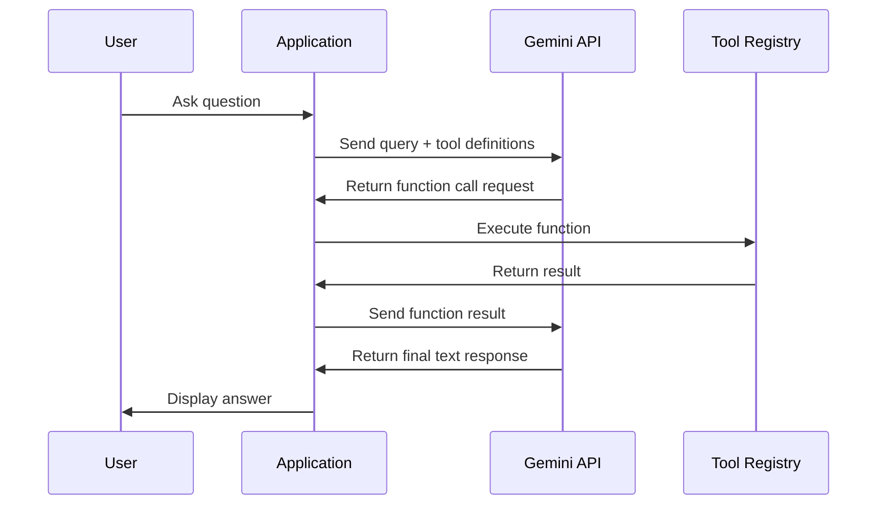

# How to Implement Function Calling with Gemini for Tool-Augmented AI Applications

Author: [nawazdhandala](https://www.github.com/nawazdhandala)

Tags: GCP, Gemini, Vertex AI, Function Calling, AI Applications

Description: Learn how to implement function calling with Gemini on Google Cloud to build tool-augmented AI applications that interact with external APIs and services.

---

Function calling is one of the most practical capabilities in the Gemini family of models. Instead of just generating text, the model can decide when to call external tools - APIs, databases, or any function you define - and then use the results to form a well-grounded response. This turns Gemini from a text generator into something that can actually take action on behalf of users.

I have been building tool-augmented applications with Gemini for several months now, and function calling has changed how I think about LLM integrations. In this post, I will walk through the mechanics of function calling, show you how to set it up on Vertex AI, and share patterns that work well in production.

## What Is Function Calling?

Function calling lets you describe a set of tools (functions) to Gemini. When the model receives a user query, it can decide whether it needs to invoke one of those tools to answer the question. If it does, it returns a structured function call request rather than plain text. Your application then executes that function and sends the result back to the model, which incorporates it into its final response.

The key insight is that Gemini does not execute the function itself. It generates the function call parameters, and your code handles the execution. This gives you full control over what actually happens.

## Setting Up Your Environment

Before you start, make sure you have the Google Cloud SDK configured and the Vertex AI Python SDK installed.

This snippet installs the required packages and sets up authentication:

```python
# Install the Vertex AI SDK with the latest Gemini support
# pip install google-cloud-aiplatform

import vertexai
from vertexai.generative_models import (
    FunctionDeclaration,
    GenerativeModel,
    Part,
    Tool,
)

# Initialize Vertex AI with your project and region
vertexai.init(project="your-project-id", location="us-central1")
```

## Defining Function Declarations

Function declarations tell Gemini what tools are available. Each declaration includes a name, description, and a schema for the parameters. The better your descriptions, the more accurately Gemini will decide when to use each function.

Here is an example defining a weather lookup function:

```python
# Define a function that Gemini can call to get weather data
get_weather_func = FunctionDeclaration(
    name="get_current_weather",
    description="Get the current weather conditions for a given city. Use this when the user asks about weather, temperature, or climate conditions.",
    parameters={
        "type": "object",
        "properties": {
            "city": {
                "type": "string",
                "description": "The city name, e.g. 'San Francisco' or 'London'"
            },
            "unit": {
                "type": "string",
                "enum": ["celsius", "fahrenheit"],
                "description": "Temperature unit preference"
            }
        },
        "required": ["city"]
    }
)

# Bundle functions into a Tool object
weather_tool = Tool(function_declarations=[get_weather_func])
```

## Making the First Function Call

With your tool defined, you can now create a model instance and send a message. When Gemini decides it needs weather data, it will respond with a function call instead of text.

This code sends a query and handles the function call response:

```python
# Create the model with our tool
model = GenerativeModel(
    "gemini-2.0-flash",
    tools=[weather_tool]
)

# Start a chat session
chat = model.start_chat()

# Send a message that should trigger the weather function
response = chat.send_message("What is the weather like in Tokyo right now?")

# Check if the model wants to call a function
function_call = response.candidates[0].content.parts[0].function_call

print(f"Function to call: {function_call.name}")
print(f"Arguments: {dict(function_call.args)}")
# Output: Function to call: get_current_weather
# Output: Arguments: {'city': 'Tokyo', 'unit': 'celsius'}
```

## Sending Function Results Back

After executing the function on your end, you send the result back to the model so it can formulate a natural language response.

Here is how to return the function result and get the final answer:

```python
# Simulate the actual API call (in production, you would call a real weather API)
weather_data = {
    "city": "Tokyo",
    "temperature": 12,
    "unit": "celsius",
    "condition": "partly cloudy",
    "humidity": 65
}

# Send the function response back to Gemini
response = chat.send_message(
    Part.from_function_response(
        name="get_current_weather",
        response={"result": weather_data}
    )
)

# Now Gemini produces a natural language answer using the data
print(response.text)
# Output: "The current weather in Tokyo is 12 degrees Celsius and partly cloudy
#          with 65% humidity."
```

## Handling Multiple Functions

Real applications usually need multiple tools. You can declare several functions in one tool or across multiple tools. Gemini will pick the right one based on the user query.

This example shows a multi-tool setup with weather and restaurant search:

```python
# Define a second function for restaurant search
search_restaurants_func = FunctionDeclaration(
    name="search_restaurants",
    description="Search for restaurants in a given city. Use this when the user asks about places to eat or dining options.",
    parameters={
        "type": "object",
        "properties": {
            "city": {
                "type": "string",
                "description": "The city to search in"
            },
            "cuisine": {
                "type": "string",
                "description": "Type of cuisine, e.g. 'Italian', 'Japanese'"
            },
            "price_range": {
                "type": "string",
                "enum": ["budget", "moderate", "expensive"],
                "description": "Price range filter"
            }
        },
        "required": ["city"]
    }
)

# Combine both functions into a single tool
multi_tool = Tool(
    function_declarations=[get_weather_func, search_restaurants_func]
)

# Create model with both tools available
model = GenerativeModel("gemini-2.0-flash", tools=[multi_tool])
```

## Parallel Function Calling

Gemini can request multiple function calls in a single turn. For example, if a user asks "What is the weather in Tokyo and find me good sushi restaurants there?", the model might return two function calls at once. You should handle this by iterating over all parts in the response.

This code handles parallel function calls:

```python
# Handle multiple function calls in one response
response = chat.send_message(
    "What is the weather in Tokyo and find me good sushi restaurants there?"
)

# Iterate through all parts - there may be multiple function calls
function_responses = []
for part in response.candidates[0].content.parts:
    if part.function_call:
        call = part.function_call
        print(f"Calling: {call.name} with args: {dict(call.args)}")

        # Execute each function and collect results
        if call.name == "get_current_weather":
            result = {"temperature": 12, "condition": "sunny"}
        elif call.name == "search_restaurants":
            result = {"restaurants": ["Sukiyabashi Jiro", "Sushi Saito"]}

        function_responses.append(
            Part.from_function_response(name=call.name, response={"result": result})
        )

# Send all results back at once
final_response = chat.send_message(function_responses)
print(final_response.text)
```

## Architecture for Production Applications

When building production systems, you want a clean separation between the LLM layer and your tool implementations. Here is a pattern that works well:



## Best Practices for Function Descriptions

The quality of your function descriptions directly impacts how well Gemini picks the right tool. Here are some guidelines:

- Be specific about when to use each function. Instead of "Gets data", write "Retrieves the current stock price for a given ticker symbol. Use this when the user asks about stock prices or market data."
- Include examples in the parameter descriptions. This helps the model extract the right values from user queries.
- Use enums for parameters with a fixed set of values. This constrains the model output and reduces errors.
- Mark required vs optional parameters clearly.

## Error Handling

Things go wrong in production. Your tool might fail, the API might be down, or the parameters might be invalid. Always wrap function execution in error handling and return meaningful error messages to the model.

This code shows proper error handling for function execution:

```python
# Wrap function execution with error handling
try:
    if call.name == "get_current_weather":
        result = fetch_weather(dict(call.args))
except Exception as e:
    # Return the error to Gemini so it can inform the user gracefully
    result = {"error": f"Failed to fetch weather: {str(e)}"}

response = chat.send_message(
    Part.from_function_response(
        name=call.name,
        response={"result": result}
    )
)
```

## Monitoring Function Calls

In production, you want visibility into which functions are being called, how often, and whether they succeed. Integrate logging and monitoring from the start. Track metrics like function call frequency, latency, error rates, and whether the model is picking the right tool.

If you are using OneUptime for monitoring, you can set up custom metrics to track these function call patterns and alert when error rates spike.

## Wrapping Up

Function calling transforms Gemini from a text generator into an agent that can interact with the real world through your tools. The key is writing clear function descriptions, handling parallel calls correctly, and building robust error handling around your tool executions. Start with a single function, get the pattern working end-to-end, and then expand your tool set as needed.
