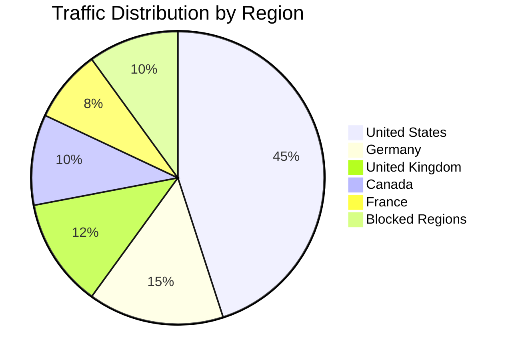

# How to Implement Geo-Location-Based Firewall Rules on Google Cloud

Author: [nawazdhandala](https://www.github.com/nawazdhandala)

Tags: GCP, Firewall, Geo-Location, Cloud Armor, Google Cloud Security

Description: Learn how to implement geo-location-based firewall rules on Google Cloud to restrict or allow traffic based on the geographic origin of requests.

---

Sometimes you need to restrict access to your application based on where traffic originates. Maybe you are required to comply with sanctions regulations, or your service only operates in certain countries, or you have seen a surge of malicious traffic from a specific region. Geo-location-based firewall rules let you allow or deny traffic based on the country of origin.

On Google Cloud, there are two main ways to implement geo-blocking: Cloud Armor for HTTP(S) traffic behind a load balancer, and VPC firewall rules with geo-location source ranges for non-HTTP workloads. This guide covers both approaches.

## Approach 1: Cloud Armor Geo-Blocking (Recommended for Web Traffic)

Cloud Armor integrates with the external Application Load Balancer and provides geo-location filtering using the `origin.region_code` attribute. This is the cleanest approach for web applications.

### Creating a Geo-Blocking Security Policy

```bash
# Create a Cloud Armor security policy for geo-based filtering
gcloud compute security-policies create geo-policy \
    --description="Geo-location based access control"
```

### Allowing Traffic from Specific Countries

If your application only serves customers in the US, Canada, and the EU:

```bash
# Allow traffic from US and Canada
gcloud compute security-policies rules create 1000 \
    --security-policy=geo-policy \
    --expression="origin.region_code == 'US' || origin.region_code == 'CA'" \
    --action=allow \
    --description="Allow US and Canadian traffic"

# Allow traffic from EU countries
gcloud compute security-policies rules create 1100 \
    --security-policy=geo-policy \
    --expression="origin.region_code == 'DE' || origin.region_code == 'FR' || origin.region_code == 'GB' || origin.region_code == 'NL' || origin.region_code == 'IE' || origin.region_code == 'ES' || origin.region_code == 'IT'" \
    --action=allow \
    --description="Allow EU traffic"

# Deny all other traffic by default
gcloud compute security-policies rules update 2147483647 \
    --security-policy=geo-policy \
    --action=deny-403
```

### Blocking Traffic from Specific Countries

The inverse approach - block specific countries and allow everything else:

```bash
# Block traffic from specific regions
gcloud compute security-policies rules create 500 \
    --security-policy=geo-policy \
    --expression="origin.region_code == 'CN' || origin.region_code == 'RU'" \
    --action=deny-403 \
    --description="Block traffic from specific regions"

# Default allow everything else (this is the default rule)
gcloud compute security-policies rules update 2147483647 \
    --security-policy=geo-policy \
    --action=allow
```

### Using Region Code Groups

For broader regional blocking, you can combine multiple expressions. Here is a more comprehensive approach using a CEL expression:

```bash
# Allow only North American and European traffic using a single rule
# This is more maintainable than listing every country individually
gcloud compute security-policies rules create 1000 \
    --security-policy=geo-policy \
    --expression="origin.region_code in ['US', 'CA', 'MX', 'GB', 'DE', 'FR', 'NL', 'IE', 'ES', 'IT', 'SE', 'NO', 'DK', 'FI', 'BE', 'AT', 'CH', 'PT', 'PL', 'CZ']" \
    --action=allow \
    --description="Allow North American and European traffic"
```

### Applying the Policy to Your Load Balancer

```bash
# Attach the geo-blocking policy to your backend service
gcloud compute backend-services update my-web-backend \
    --security-policy=geo-policy \
    --global
```

## Approach 2: Network Firewall Policies with Geo-Location

For workloads not behind a load balancer (like direct VM access or non-HTTP services), use network firewall policies with source geo-location:

```bash
# Create a network firewall policy
gcloud compute network-firewall-policies create geo-firewall-policy \
    --global \
    --description="Geo-location based network firewall"

# Allow SSH only from US and Canadian IPs
gcloud compute network-firewall-policies rules create 1000 \
    --firewall-policy=geo-firewall-policy \
    --global-firewall-policy \
    --direction=INGRESS \
    --action=allow \
    --layer4-configs=tcp:22 \
    --src-region-codes=US,CA \
    --target-secure-tags=organizations/123456789/access/ssh-enabled \
    --description="Allow SSH from US and Canada only"

# Allow HTTPS from approved regions
gcloud compute network-firewall-policies rules create 1100 \
    --firewall-policy=geo-firewall-policy \
    --global-firewall-policy \
    --direction=INGRESS \
    --action=allow \
    --layer4-configs=tcp:443 \
    --src-region-codes=US,CA,GB,DE,FR,NL \
    --description="Allow HTTPS from approved regions"

# Deny all other ingress from the internet
gcloud compute network-firewall-policies rules create 2000 \
    --firewall-policy=geo-firewall-policy \
    --global-firewall-policy \
    --direction=INGRESS \
    --action=deny \
    --layer4-configs=all \
    --src-ip-ranges=0.0.0.0/0 \
    --description="Default deny all external ingress"

# Associate with VPC
gcloud compute network-firewall-policies associations create \
    --firewall-policy=geo-firewall-policy \
    --network=my-vpc \
    --global-firewall-policy \
    --name=geo-firewall-association
```

## Combining Geo-Location with Other Rules

Geo-location rules become more powerful when combined with other Cloud Armor features:

```bash
# Rate limit traffic from specific regions more aggressively
# Some regions might have higher bot traffic
gcloud compute security-policies rules create 800 \
    --security-policy=geo-policy \
    --expression="origin.region_code == 'BR'" \
    --action=throttle \
    --rate-limit-threshold-count=50 \
    --rate-limit-threshold-interval-sec=60 \
    --conform-action=allow \
    --exceed-action=deny-429 \
    --enforce-on-key=IP \
    --description="Rate limit traffic from specific region"

# Block specific country AND specific path combinations
gcloud compute security-policies rules create 700 \
    --security-policy=geo-policy \
    --expression="origin.region_code != 'US' && request.path.matches('/admin/.*')" \
    --action=deny-403 \
    --description="Block non-US access to admin panel"
```

## Terraform Configuration

Here is a complete Terraform setup for both Cloud Armor and network firewall policy approaches:

```hcl
# Cloud Armor geo-blocking policy
resource "google_compute_security_policy" "geo_policy" {
  name        = "geo-policy"
  description = "Geo-location based access control"

  # Allow specific countries
  rule {
    action   = "allow"
    priority = 1000
    match {
      expr {
        expression = "origin.region_code in ['US', 'CA', 'GB', 'DE', 'FR']"
      }
    }
    description = "Allow traffic from approved countries"
  }

  # Deny everything else
  rule {
    action   = "deny(403)"
    priority = 2147483647
    match {
      versioned_expr = "SRC_IPS_V1"
      config {
        src_ip_ranges = ["*"]
      }
    }
    description = "Default deny"
  }
}

# Attach to backend service
resource "google_compute_backend_service" "web" {
  name            = "web-backend"
  security_policy = google_compute_security_policy.geo_policy.id
  # ... other config
}

# Network firewall policy with geo-location rules
resource "google_compute_network_firewall_policy" "geo_firewall" {
  name        = "geo-firewall-policy"
  description = "Network firewall with geo-location rules"
}

resource "google_compute_network_firewall_policy_rule" "allow_us_ssh" {
  firewall_policy = google_compute_network_firewall_policy.geo_firewall.name
  priority        = 1000
  direction       = "INGRESS"
  action          = "allow"
  description     = "Allow SSH from US only"

  match {
    src_region_codes = ["US"]
    layer4_configs {
      ip_protocol = "tcp"
      ports       = ["22"]
    }
  }
}
```

## Monitoring Geo-Blocked Traffic

Set up logging and dashboards to understand your geo-blocking patterns:

```bash
# Enable logging on the Cloud Armor policy
gcloud compute security-policies update geo-policy \
    --log-level=VERBOSE

# Query logs for blocked requests by country
gcloud logging read '
  resource.type="http_load_balancer"
  AND jsonPayload.enforcedSecurityPolicy.outcome="DENY"
' --limit=50 \
  --format="table(timestamp, jsonPayload.enforcedSecurityPolicy.name, httpRequest.remoteIp)"
```

You can create a Cloud Monitoring dashboard to visualize traffic by region:



## Important Considerations

**Geo-IP accuracy.** Google uses its own geo-IP database to determine the country of origin. While generally accurate, edge cases exist - VPN users, satellite internet users, and newly allocated IP ranges may be misclassified.

**VPN and proxy bypass.** Determined users can bypass geo-blocking using VPNs. Geo-blocking is a policy compliance tool, not a security barrier. Do not rely on it as your sole access control mechanism.

**CDN and proxy considerations.** If traffic passes through a CDN before reaching your load balancer, the source IP might be the CDN's IP rather than the user's. Make sure your architecture preserves the original client IP.

**Compliance requirements.** Some regulations (like OFAC sanctions) require geo-blocking. Document which countries you block and why. Cloud Armor logs provide the audit trail.

**Testing before enforcement.** Use Cloud Armor's preview mode to evaluate rules before enforcing them:

```bash
# Create a rule in preview mode to see what would be blocked
gcloud compute security-policies rules create 1000 \
    --security-policy=geo-policy \
    --expression="origin.region_code not in ['US', 'CA']" \
    --action=deny-403 \
    --preview \
    --description="Preview: Block non-US/CA traffic"
```

Preview mode logs the decision without actually blocking traffic, letting you validate the rule's impact before going live.

Geo-location-based firewall rules are a straightforward way to restrict access based on geographic origin. Whether you use Cloud Armor for HTTP traffic or network firewall policies for broader coverage, the setup takes minutes and gives you country-level control over who can reach your services.
