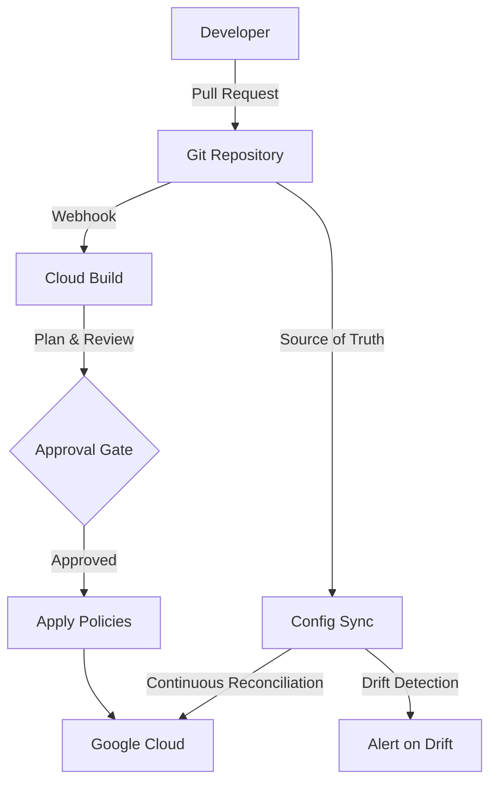

# How to Implement GitOps-Based Security Policy Management for Google Cloud

Author: [nawazdhandala](https://www.github.com/nawazdhandala)

Tags: GCP, GitOps, Security Policy, Infrastructure as Code, Google Cloud DevOps

Description: Learn how to implement GitOps-based security policy management for Google Cloud, using Git as the source of truth for firewall rules, IAM policies, and organization policies.

---

Security policies managed through the Google Cloud Console or ad-hoc CLI commands inevitably drift from their intended state. Someone makes an emergency change and forgets to document it. Another team member modifies a firewall rule without going through a review. Over time, your actual security posture no longer matches what you think it is.

GitOps solves this by making Git the single source of truth for all security policies. Every change goes through a pull request, gets reviewed, and is automatically applied. If someone makes an out-of-band change, a reconciliation loop detects and corrects the drift.

This guide covers implementing GitOps for Google Cloud security policies using Config Sync, Terraform, and Cloud Build.

## GitOps Architecture for Security Policies



The workflow:
1. An engineer proposes a security policy change via pull request
2. Automated checks validate the change (syntax, compliance rules, blast radius)
3. A security team member reviews and approves
4. Cloud Build applies the change to Google Cloud
5. Config Sync continuously reconciles the actual state against the desired state in Git

## Repository Structure

Organize your security policy repository clearly:

```
security-policies/
  org-policies/
    resource-location.yaml
    iam-restrictions.yaml
    compute-restrictions.yaml
  firewall-rules/
    production/
      web-tier.yaml
      api-tier.yaml
      data-tier.yaml
    staging/
      default.yaml
  iam-policies/
    production/
      project-bindings.yaml
      service-accounts.yaml
    staging/
      project-bindings.yaml
  vpc-service-controls/
    perimeters.yaml
    access-levels.yaml
  terraform/
    main.tf
    variables.tf
    firewall.tf
    iam.tf
    org-policies.tf
```

## Approach 1: Terraform with Cloud Build

### Setting Up the Terraform Backend

```hcl
# terraform/backend.tf
# Store Terraform state in a GCS bucket with versioning
terraform {
  backend "gcs" {
    bucket = "security-policies-tfstate"
    prefix = "security"
  }
}

provider "google" {
  project = var.project_id
  region  = var.region
}
```

### Defining Security Policies in Terraform

```hcl
# terraform/firewall.tf
# Firewall rules managed through GitOps

# Load firewall rule definitions from YAML files
locals {
  firewall_rules = yamldecode(file("${path.module}/../firewall-rules/production/web-tier.yaml"))
}

# Web tier firewall rules
resource "google_compute_firewall" "web_ingress" {
  name    = "allow-web-ingress"
  network = var.vpc_network
  project = var.project_id

  allow {
    protocol = "tcp"
    ports    = ["80", "443"]
  }

  source_ranges = ["0.0.0.0/0"]
  target_tags   = ["web-tier"]

  log_config {
    metadata = "INCLUDE_ALL_METADATA"
  }
}

resource "google_compute_firewall" "deny_all" {
  name     = "deny-all-ingress"
  network  = var.vpc_network
  project  = var.project_id
  priority = 65534

  deny {
    protocol = "all"
  }

  source_ranges = ["0.0.0.0/0"]

  log_config {
    metadata = "INCLUDE_ALL_METADATA"
  }
}

# terraform/iam.tf
# IAM policies managed through GitOps

resource "google_project_iam_binding" "viewers" {
  project = var.project_id
  role    = "roles/viewer"

  members = [
    "group:engineering@company.com",
  ]
}

resource "google_project_iam_binding" "editors" {
  project = var.project_id
  role    = "roles/editor"

  members = [
    "group:platform-team@company.com",
  ]

  condition {
    title       = "Business hours only"
    description = "Allow editor access during business hours"
    expression  = "request.time.getHours('America/New_York') >= 8 && request.time.getHours('America/New_York') <= 18"
  }
}

# terraform/org-policies.tf
# Organization policies managed through GitOps

resource "google_project_organization_policy" "resource_locations" {
  project    = var.project_id
  constraint = "constraints/gcp.resourceLocations"

  list_policy {
    allow {
      values = ["in:us-locations"]
    }
  }
}

resource "google_project_organization_policy" "disable_sa_keys" {
  project    = var.project_id
  constraint = "iam.disableServiceAccountKeyCreation"

  boolean_policy {
    enforced = true
  }
}
```

### Cloud Build Pipeline for Security Policies

```yaml
# cloudbuild.yaml
# CI/CD pipeline for security policy changes
# Runs terraform plan on PRs and terraform apply on merge to main

steps:
  # Step 1: Validate Terraform syntax
  - name: 'hashicorp/terraform:1.7'
    entrypoint: 'sh'
    args:
      - '-c'
      - |
        cd terraform
        terraform init -backend=false
        terraform validate
    id: 'validate'

  # Step 2: Check for policy compliance using OPA/Conftest
  - name: 'openpolicyagent/conftest:latest'
    args:
      - 'test'
      - '--policy'
      - 'policies/'
      - 'terraform/plan.json'
    id: 'policy-check'
    waitFor: ['plan']

  # Step 3: Run terraform plan
  - name: 'hashicorp/terraform:1.7'
    entrypoint: 'sh'
    args:
      - '-c'
      - |
        cd terraform
        terraform init
        terraform plan -out=plan.tfplan -json > plan.json
        terraform show -json plan.tfplan > ../terraform/plan.json
    id: 'plan'
    waitFor: ['validate']

  # Step 4: Apply (only on main branch)
  - name: 'hashicorp/terraform:1.7'
    entrypoint: 'sh'
    args:
      - '-c'
      - |
        if [ "$BRANCH_NAME" = "main" ]; then
          cd terraform
          terraform init
          terraform apply -auto-approve
        else
          echo "Skipping apply - not on main branch"
        fi
    id: 'apply'
    waitFor: ['policy-check']

options:
  logging: CLOUD_LOGGING_ONLY
```

Create the Cloud Build trigger:

```bash
# Create a trigger for pull requests (runs plan only)
gcloud builds triggers create github \
    --name="security-policy-plan" \
    --repo-name="security-policies" \
    --repo-owner="myorg" \
    --pull-request-pattern="^main$" \
    --build-config="cloudbuild.yaml" \
    --project=security-project

# Create a trigger for merges to main (runs apply)
gcloud builds triggers create github \
    --name="security-policy-apply" \
    --repo-name="security-policies" \
    --repo-owner="myorg" \
    --branch-pattern="^main$" \
    --build-config="cloudbuild.yaml" \
    --require-approval \
    --project=security-project
```

## Approach 2: Config Sync for GKE Network Policies

For Kubernetes-native security policies, use Config Sync with Anthos Config Management:

```bash
# Install Config Sync on your GKE cluster
gcloud container fleet config-management apply \
    --membership=my-cluster-membership \
    --config=config-management.yaml
```

```yaml
# config-management.yaml
# Configures Config Sync to pull policies from Git
apiVersion: configmanagement.gke.io/v1
kind: ConfigManagement
metadata:
  name: config-management
spec:
  sourceFormat: unstructured
  git:
    syncRepo: https://github.com/myorg/security-policies
    syncBranch: main
    secretType: token
    policyDir: k8s-policies
  policyController:
    enabled: true
```

Define Kubernetes network policies in the repository:

```yaml
# k8s-policies/network-policy-default-deny.yaml
# Default deny all ingress traffic in the production namespace
apiVersion: networking.k8s.io/v1
kind: NetworkPolicy
metadata:
  name: default-deny-ingress
  namespace: production
spec:
  podSelector: {}
  policyTypes:
    - Ingress

---
# k8s-policies/network-policy-allow-web.yaml
# Allow traffic to web pods from the load balancer
apiVersion: networking.k8s.io/v1
kind: NetworkPolicy
metadata:
  name: allow-web-ingress
  namespace: production
spec:
  podSelector:
    matchLabels:
      tier: web
  ingress:
    - from:
        - ipBlock:
            cidr: 10.0.0.0/8
      ports:
        - protocol: TCP
          port: 8080
```

## Policy Validation with OPA/Conftest

Write policy checks that validate security policy changes before they are applied:

```rego
# policies/firewall.rego
# OPA policy that validates firewall rule changes

package firewall

# Deny firewall rules that open SSH to the internet
deny[msg] {
    resource := input.resource_changes[_]
    resource.type == "google_compute_firewall"
    resource.change.after.source_ranges[_] == "0.0.0.0/0"
    resource.change.after.allow[_].ports[_] == "22"
    msg := sprintf("Firewall rule '%s' opens SSH to the internet", [resource.name])
}

# Deny firewall rules without logging enabled
deny[msg] {
    resource := input.resource_changes[_]
    resource.type == "google_compute_firewall"
    not resource.change.after.log_config
    msg := sprintf("Firewall rule '%s' does not have logging enabled", [resource.name])
}

# Require all IAM bindings to use groups, not individual users
deny[msg] {
    resource := input.resource_changes[_]
    resource.type == "google_project_iam_binding"
    member := resource.change.after.members[_]
    startswith(member, "user:")
    msg := sprintf("IAM binding '%s' uses individual user '%s' - use groups instead", [resource.name, member])
}
```

## Drift Detection and Remediation

Set up a scheduled job that detects drift between Git and actual state:

```bash
# Schedule a drift detection job that runs every 6 hours
gcloud scheduler jobs create http detect-security-drift \
    --schedule="0 */6 * * *" \
    --uri="https://us-central1-my-project.cloudfunctions.net/detect-drift" \
    --http-method=POST \
    --oidc-service-account-email=gitops-runner@security-project.iam.gserviceaccount.com
```

```python
# detect_drift.py
# Cloud Function that detects drift between Git-defined policies and actual state

import functions_framework
from google.cloud import compute_v1
from google.cloud import asset_v1
import json
import yaml
import logging

logger = logging.getLogger(__name__)

@functions_framework.http
def detect_drift(request):
    """Compare actual security policies against Git-defined state."""

    drift_findings = []

    # Check firewall rules
    firewall_drift = check_firewall_drift()
    drift_findings.extend(firewall_drift)

    # Check organization policies
    org_policy_drift = check_org_policy_drift()
    drift_findings.extend(org_policy_drift)

    if drift_findings:
        send_drift_alert(drift_findings)

    return json.dumps({
        'drift_detected': len(drift_findings) > 0,
        'findings': drift_findings
    })


def check_firewall_drift():
    """Compare actual firewall rules against expected rules from Git."""
    findings = []
    client = compute_v1.FirewallsClient()

    # Load expected rules from Git (stored in a GCS bucket synced from Git)
    expected_rules = load_expected_rules('firewall-rules/production/')

    # Get actual rules
    request = compute_v1.ListFirewallsRequest(project='my-project')
    actual_rules = {rule.name: rule for rule in client.list(request=request)}

    # Check for unexpected rules (rules in GCP but not in Git)
    for name, rule in actual_rules.items():
        if name not in expected_rules and not name.startswith('gke-'):
            findings.append({
                'type': 'unexpected_resource',
                'resource_type': 'firewall_rule',
                'resource_name': name,
                'detail': 'Firewall rule exists in GCP but not in Git'
            })

    return findings
```

## Best Practices

**Protect the main branch.** Require at least two approvals from the security team for changes to the main branch. Use branch protection rules and CODEOWNERS files.

**Use separate repos for different environments.** Or at minimum, separate directories. Production security policies should have stricter review requirements than staging.

**Implement canary deployments for policies.** Apply changes to a subset of resources first, monitor for issues, then roll out to everything.

**Keep a break-glass process.** Document an emergency procedure for making changes outside the GitOps flow. Require that any emergency changes are backported to Git within 24 hours.

**Audit the Git history.** The Git commit log becomes your audit trail. Every security policy change has a commit message, author, reviewer, and timestamp.

GitOps for security policies gives you the same benefits that GitOps brings to application deployment: version control, peer review, automated testing, and a clear audit trail. The initial setup takes effort, but once running, it becomes the most reliable way to manage security at scale.
