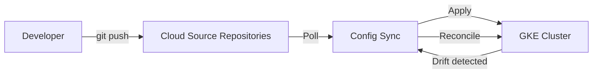

# How to Implement GitOps for GKE Using Config Sync and Cloud Source Repositories

Author: [nawazdhandala](https://www.github.com/nawazdhandala)

Tags: GCP, GKE, GitOps, Config Sync, Cloud Source Repositories

Description: A hands-on guide to implementing GitOps for Google Kubernetes Engine using Config Sync and Cloud Source Repositories for declarative cluster management.

---

Managing Kubernetes clusters manually with kubectl commands is a recipe for configuration drift. What is running in your cluster gradually diverges from what your team thinks is running, and debugging becomes a nightmare. GitOps flips this around - Git becomes the single source of truth, and the cluster automatically reconciles itself to match what is in the repository.

On GKE, Config Sync is Google's native GitOps tool. It watches a Git repository and continuously applies configurations to your cluster. In this post, I will show you how to set it up with Cloud Source Repositories, structure your configs, and handle the real-world complexities.

## How Config Sync Works

Config Sync runs as a controller inside your GKE cluster. It polls your Git repository at a configurable interval, compares the desired state in Git with the actual state in the cluster, and reconciles any differences. If someone manually changes something in the cluster, Config Sync reverts it back to what Git says it should be.



## Step 1: Create a Cloud Source Repository

Set up the Git repository that will hold your cluster configurations:

```bash
# Create the repository
gcloud source repos create gke-config

# Clone it locally
gcloud source repos clone gke-config

cd gke-config
```

## Step 2: Structure Your Config Repository

Config Sync supports two formats for organizing configs: unstructured and hierarchical. The unstructured format is simpler and more flexible:

```
gke-config/
  namespaces/
    production/
      namespace.yaml
      deployments/
        api-server.yaml
        web-frontend.yaml
      services/
        api-service.yaml
        web-service.yaml
      policies/
        network-policy.yaml
    staging/
      namespace.yaml
      deployments/
        api-server.yaml
        web-frontend.yaml
  cluster/
    rbac/
      cluster-roles.yaml
      cluster-role-bindings.yaml
    resource-quotas.yaml
    priority-classes.yaml
```

Create the base structure and some initial configs:

```bash
# Create the directory structure
mkdir -p namespaces/production/deployments
mkdir -p namespaces/production/services
mkdir -p namespaces/production/policies
mkdir -p namespaces/staging/deployments
mkdir -p cluster/rbac
```

Add a namespace configuration:

```yaml
# namespaces/production/namespace.yaml
apiVersion: v1
kind: Namespace
metadata:
  name: production
  labels:
    env: production
    managed-by: config-sync
  annotations:
    configsync.gke.io/cluster-name-selector: ""
```

Add a deployment:

```yaml
# namespaces/production/deployments/api-server.yaml
apiVersion: apps/v1
kind: Deployment
metadata:
  name: api-server
  namespace: production
  labels:
    app: api-server
    managed-by: config-sync
spec:
  replicas: 3
  selector:
    matchLabels:
      app: api-server
  template:
    metadata:
      labels:
        app: api-server
    spec:
      containers:
        - name: api-server
          image: gcr.io/my-project/api-server:v1.2.0
          ports:
            - containerPort: 8080
          resources:
            requests:
              cpu: 250m
              memory: 256Mi
            limits:
              cpu: 500m
              memory: 512Mi
          readinessProbe:
            httpGet:
              path: /health
              port: 8080
            initialDelaySeconds: 5
            periodSeconds: 10
```

Add a network policy:

```yaml
# namespaces/production/policies/network-policy.yaml
apiVersion: networking.k8s.io/v1
kind: NetworkPolicy
metadata:
  name: default-deny-ingress
  namespace: production
spec:
  podSelector: {}
  policyTypes:
    - Ingress
  ingress:
    - from:
        - namespaceSelector:
            matchLabels:
              env: production
```

Commit and push:

```bash
git add .
git commit -m "Initial cluster configuration"
git push origin main
```

## Step 3: Enable Config Sync on GKE

Install Config Sync on your GKE cluster using the GKE Hub feature:

```bash
# Enable the required APIs
gcloud services enable \
  container.googleapis.com \
  gkehub.googleapis.com \
  anthosconfigmanagement.googleapis.com

# Register the cluster with the Hub (if not already registered)
gcloud container hub memberships register my-cluster \
  --gke-cluster=us-central1/my-cluster \
  --enable-workload-identity

# Apply the Config Sync configuration
cat > config-sync-config.yaml << 'EOF'
apiVersion: configmanagement.gke.io/v1
kind: ConfigManagement
metadata:
  name: config-management
spec:
  configSync:
    enabled: true
    sourceFormat: unstructured
    syncRepo: https://source.developers.google.com/p/my-project/r/gke-config
    syncBranch: main
    secretType: gcpserviceaccount
    gcpServiceAccountEmail: config-sync-sa@my-project.iam.gserviceaccount.com
    policyDir: "."
    syncWait: 15
  preventDrift: true
EOF

gcloud beta container hub config-management apply \
  --membership=my-cluster \
  --config=config-sync-config.yaml
```

## Step 4: Set Up Authentication

Config Sync needs permission to read from Cloud Source Repositories. Create a service account and bind it:

```bash
# Create the service account
gcloud iam service-accounts create config-sync-sa \
  --display-name="Config Sync Service Account"

# Grant access to Cloud Source Repositories
gcloud projects add-iam-policy-binding my-project \
  --member="serviceAccount:config-sync-sa@my-project.iam.gserviceaccount.com" \
  --role="roles/source.reader"

# Bind the Kubernetes service account to the GCP service account
gcloud iam service-accounts add-iam-policy-binding \
  config-sync-sa@my-project.iam.gserviceaccount.com \
  --role="roles/iam.workloadIdentityUser" \
  --member="serviceAccount:my-project.svc.id.goog[config-management-system/root-reconciler]"
```

## Step 5: Verify Sync Status

Check that Config Sync is working:

```bash
# Check the sync status
gcloud beta container hub config-management status \
  --membership=my-cluster

# For more detail, use nomos (the Config Sync CLI)
# Install nomos
gcloud components install nomos

# Check sync status
nomos status

# View any sync errors
nomos status --format=yaml
```

## Step 6: Implement a Change Workflow

With GitOps, all changes go through Git. Here is a typical workflow:

```bash
# Create a branch for your change
git checkout -b update-api-replicas

# Edit the deployment - increase replicas from 3 to 5
# (Edit namespaces/production/deployments/api-server.yaml)

# Commit and push
git add namespaces/production/deployments/api-server.yaml
git commit -m "Scale api-server to 5 replicas for holiday traffic"
git push origin update-api-replicas

# Create a pull request in Cloud Source Repositories or your Git provider
# After review and merge to main, Config Sync will automatically apply the change
```

## Step 7: Set Up Drift Prevention

Config Sync can prevent manual changes to managed resources. This is critical for maintaining the GitOps guarantee:

```bash
# Drift prevention is enabled in the ConfigManagement spec
# When preventDrift is true, Config Sync uses an admission webhook
# to reject manual changes to managed resources

# Test it by trying to manually scale a deployment
kubectl scale deployment api-server -n production --replicas=10
# This should be rejected by the webhook
```

## Handling Secrets

One challenge with GitOps is that you should not store secrets in Git. Use Sealed Secrets or External Secrets Operator:

```yaml
# namespaces/production/external-secret.yaml
apiVersion: external-secrets.io/v1beta1
kind: ExternalSecret
metadata:
  name: api-credentials
  namespace: production
spec:
  refreshInterval: 1h
  secretStoreRef:
    name: gcp-secret-manager
    kind: ClusterSecretStore
  target:
    name: api-credentials
  data:
    - secretKey: database-url
      remoteRef:
        key: projects/my-project/secrets/db-url/versions/latest
    - secretKey: api-key
      remoteRef:
        key: projects/my-project/secrets/api-key/versions/latest
```

## Monitoring Config Sync

Set up alerts for sync failures:

```bash
# Config Sync exports metrics to Cloud Monitoring
# Create an alert for sync errors
gcloud alpha monitoring policies create \
  --display-name="Config Sync Error" \
  --condition-display-name="Config Sync has sync errors" \
  --condition-filter='resource.type="k8s_container" AND resource.labels.container_name="reconciler" AND metric.type="logging.googleapis.com/log_entry_count" AND metric.labels.severity="ERROR"' \
  --condition-threshold-value=0 \
  --condition-threshold-comparison=COMPARISON_GT \
  --notification-channels=projects/my-project/notificationChannels/oncall
```

## Wrapping Up

GitOps with Config Sync and Cloud Source Repositories gives you a declarative, auditable, and reproducible way to manage your GKE clusters. Every change goes through Git, gets reviewed, and is automatically applied to the cluster. Drift prevention ensures that what is in Git is what is actually running.

The biggest mindset shift is that kubectl apply becomes something only Config Sync does. Developers and operators work with Git, not with the cluster directly. Once your team adapts to this workflow, you will wonder how you ever managed clusters without it.
