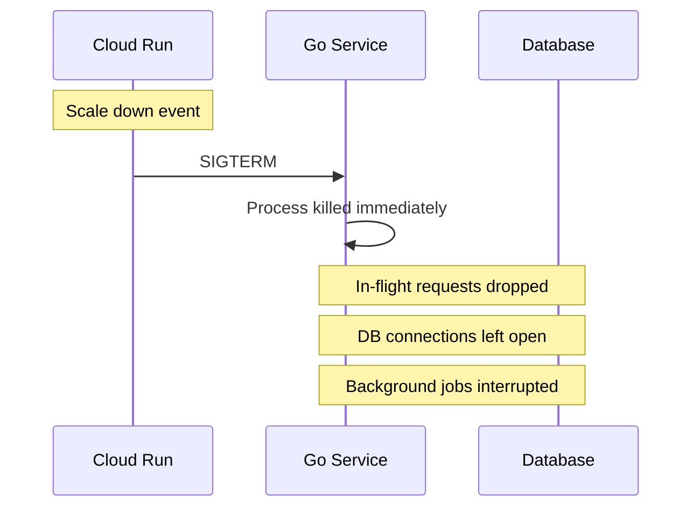
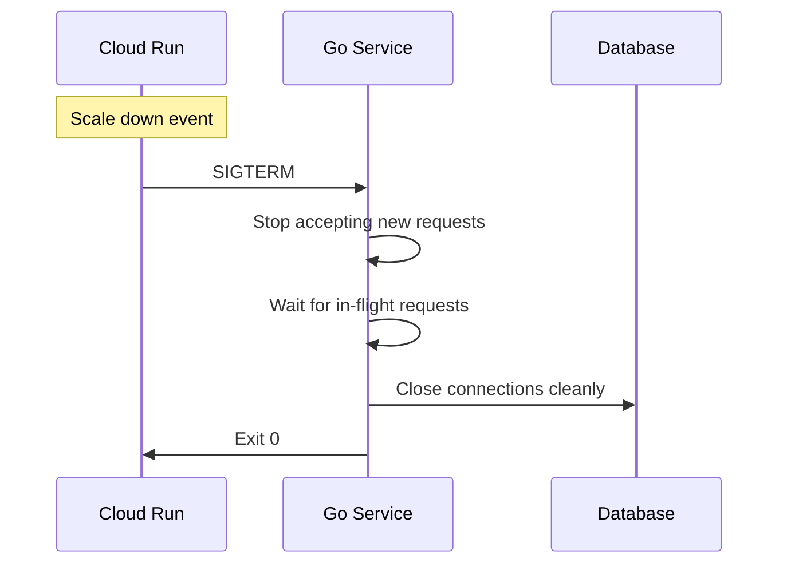

# How to Implement Graceful Shutdown in a Go Cloud Run Service with Context Cancellation

Author: [nawazdhandala](https://www.github.com/nawazdhandala)

Tags: GCP, Cloud Run, Go, Graceful Shutdown, Context Cancellation

Description: Implement graceful shutdown in a Go Cloud Run service using context cancellation to properly handle in-flight requests during scale-down events.

---

Cloud Run can terminate your container at any time - during scale-down, deployment updates, or when your service has been idle. When that happens, Cloud Run sends a SIGTERM signal and gives your container a grace period (10 seconds by default, configurable up to 60 minutes) to finish what it is doing. If your service does not handle this signal, in-flight requests get dropped, database connections get cut, and you end up with corrupted state.

Graceful shutdown is not optional for production services. Here is how to do it properly in Go.

## The Problem

Without graceful shutdown, here is what happens when Cloud Run terminates your container:



With graceful shutdown:



## The Basic Pattern

The core idea is to listen for OS signals, stop accepting new connections, wait for in-flight requests to finish, then clean up resources.

```go
package main

import (
    "context"
    "log"
    "net/http"
    "os"
    "os/signal"
    "syscall"
    "time"
)

func main() {
    // Create a context that will be cancelled when we receive SIGTERM or SIGINT
    ctx, stop := signal.NotifyContext(context.Background(), syscall.SIGTERM, syscall.SIGINT)
    defer stop()

    // Set up the HTTP server
    mux := http.NewServeMux()
    mux.HandleFunc("/", handleRequest)
    mux.HandleFunc("/health", handleHealth)

    server := &http.Server{
        Addr:    ":" + getPort(),
        Handler: mux,
    }

    // Start the server in a goroutine
    go func() {
        log.Printf("Server starting on %s", server.Addr)
        if err := server.ListenAndServe(); err != http.ErrServerClosed {
            log.Fatalf("Server error: %v", err)
        }
    }()

    // Block until the context is cancelled (SIGTERM received)
    <-ctx.Done()
    log.Println("Shutdown signal received, draining connections...")

    // Create a deadline for the shutdown process
    // Cloud Run gives 10 seconds by default, so use slightly less
    shutdownCtx, cancel := context.WithTimeout(context.Background(), 8*time.Second)
    defer cancel()

    // Shutdown stops accepting new connections and waits for in-flight ones
    if err := server.Shutdown(shutdownCtx); err != nil {
        log.Printf("Shutdown error: %v", err)
    }

    log.Println("Server stopped gracefully")
}

func getPort() string {
    port := os.Getenv("PORT")
    if port == "" {
        port = "8080"
    }
    return port
}
```

The `signal.NotifyContext` function creates a context that gets cancelled when the process receives SIGTERM. The `server.Shutdown` method then stops accepting new connections while letting in-flight requests finish.

## Handling Long-Running Requests

If your service handles requests that take a while - say, processing a file upload or running a complex query - you need to make sure those requests respect the shutdown deadline.

```go
// handleRequest demonstrates a handler that respects context cancellation
func handleRequest(w http.ResponseWriter, r *http.Request) {
    // The request context will be cancelled when the server shuts down
    ctx := r.Context()

    log.Printf("Processing request %s", r.URL.Path)

    // Simulate a long-running operation that checks for cancellation
    result, err := longRunningTask(ctx)
    if err != nil {
        if ctx.Err() == context.Canceled {
            // The request was cancelled due to shutdown
            log.Println("Request cancelled during shutdown")
            http.Error(w, "Service shutting down", http.StatusServiceUnavailable)
            return
        }
        http.Error(w, "Processing failed", http.StatusInternalServerError)
        return
    }

    w.Header().Set("Content-Type", "application/json")
    w.Write([]byte(result))
}

// longRunningTask simulates work that periodically checks for cancellation
func longRunningTask(ctx context.Context) (string, error) {
    // Break work into steps and check context between each step
    steps := []string{"fetch", "transform", "validate", "save"}

    for _, step := range steps {
        select {
        case <-ctx.Done():
            // Context was cancelled - clean up and return
            return "", ctx.Err()
        default:
            // Continue processing
            log.Printf("Executing step: %s", step)
            time.Sleep(500 * time.Millisecond)
        }
    }

    return `{"status": "completed"}`, nil
}
```

## Cleaning Up Resources

Most services have resources that need proper cleanup - database connections, Pub/Sub clients, file handles. Structure your shutdown to clean these up in the right order.

```go
package main

import (
    "context"
    "log"
    "net/http"
    "os/signal"
    "syscall"
    "time"

    "cloud.google.com/go/pubsub"
    "github.com/jackc/pgx/v5/pgxpool"
)

// App holds all application resources that need cleanup
type App struct {
    server    *http.Server
    db        *pgxpool.Pool
    pubsub    *pubsub.Client
}

func main() {
    ctx, stop := signal.NotifyContext(context.Background(), syscall.SIGTERM, syscall.SIGINT)
    defer stop()

    // Initialize all resources
    app, err := initApp(ctx)
    if err != nil {
        log.Fatalf("Failed to initialize: %v", err)
    }

    // Start the server
    go func() {
        if err := app.server.ListenAndServe(); err != http.ErrServerClosed {
            log.Fatalf("Server error: %v", err)
        }
    }()

    // Wait for shutdown signal
    <-ctx.Done()
    log.Println("Shutdown initiated")

    // Phase 1: Stop accepting new HTTP connections
    shutdownCtx, cancel := context.WithTimeout(context.Background(), 8*time.Second)
    defer cancel()

    if err := app.server.Shutdown(shutdownCtx); err != nil {
        log.Printf("HTTP shutdown error: %v", err)
    }
    log.Println("HTTP server stopped")

    // Phase 2: Close the Pub/Sub client (stops receiving messages)
    if app.pubsub != nil {
        if err := app.pubsub.Close(); err != nil {
            log.Printf("Pub/Sub close error: %v", err)
        }
        log.Println("Pub/Sub client closed")
    }

    // Phase 3: Close database connections last
    // (in-flight requests might still need the database)
    if app.db != nil {
        app.db.Close()
        log.Println("Database connections closed")
    }

    log.Println("Graceful shutdown complete")
}
```

## Background Workers

If your service runs background goroutines - processing queues, running periodic tasks - those need to respect the shutdown signal too.

```go
// startBackgroundWorker runs a periodic task that stops on shutdown
func startBackgroundWorker(ctx context.Context, db *pgxpool.Pool) {
    ticker := time.NewTicker(30 * time.Second)
    defer ticker.Stop()

    for {
        select {
        case <-ctx.Done():
            log.Println("Background worker shutting down")
            return
        case <-ticker.C:
            // Run the periodic task with a timeout
            taskCtx, cancel := context.WithTimeout(ctx, 10*time.Second)
            if err := runPeriodicCleanup(taskCtx, db); err != nil {
                log.Printf("Periodic cleanup error: %v", err)
            }
            cancel()
        }
    }
}
```

## Testing Graceful Shutdown

You can test this locally by sending SIGTERM to your process.

```bash
# Start the server
go run main.go &

# Send a request that takes a while
curl http://localhost:8080/slow &

# Send SIGTERM while the request is in flight
kill -SIGTERM $(pgrep -f "go run main.go")

# The request should complete before the server exits
```

## Cloud Run Configuration

Increase the termination grace period if your requests take longer than 10 seconds.

```bash
# Set termination grace period to 60 seconds
gcloud run deploy my-service \
  --image gcr.io/YOUR_PROJECT/my-service \
  --timeout=60 \
  --cpu-throttling \
  --region us-central1
```

You can also set this in your Cloud Run YAML:

```yaml
apiVersion: serving.knative.dev/v1
kind: Service
metadata:
  name: my-service
spec:
  template:
    spec:
      # Allow 60 seconds for graceful shutdown
      terminationGracePeriodSeconds: 60
      containers:
        - image: gcr.io/YOUR_PROJECT/my-service
```

## Common Mistakes

1. **Not handling SIGTERM at all** - Your container gets killed immediately after the grace period, dropping all in-flight requests.

2. **Using the wrong timeout** - If your shutdown timeout exceeds Cloud Run's grace period, Cloud Run will force-kill your container before your cleanup finishes.

3. **Cleaning up resources in the wrong order** - Close the HTTP server first, then close clients that in-flight handlers might still be using.

4. **Forgetting background goroutines** - A goroutine that does not check context will keep running until the process is killed.

5. **Not testing it** - Graceful shutdown is easy to get wrong and hard to notice until it causes data loss in production.

## Wrapping Up

Graceful shutdown is one of those things that you set up once and then it just works. The key ingredients are `signal.NotifyContext` for catching SIGTERM, `server.Shutdown` for draining HTTP connections, and passing context through your application so every component knows when it is time to stop. Get these right and your Cloud Run services will handle scale-down events, deployments, and restarts without dropping requests.

For monitoring your Cloud Run services and catching issues like elevated error rates during deployments, OneUptime provides real-time alerting and uptime monitoring that can help you verify your graceful shutdown is working correctly in production.
