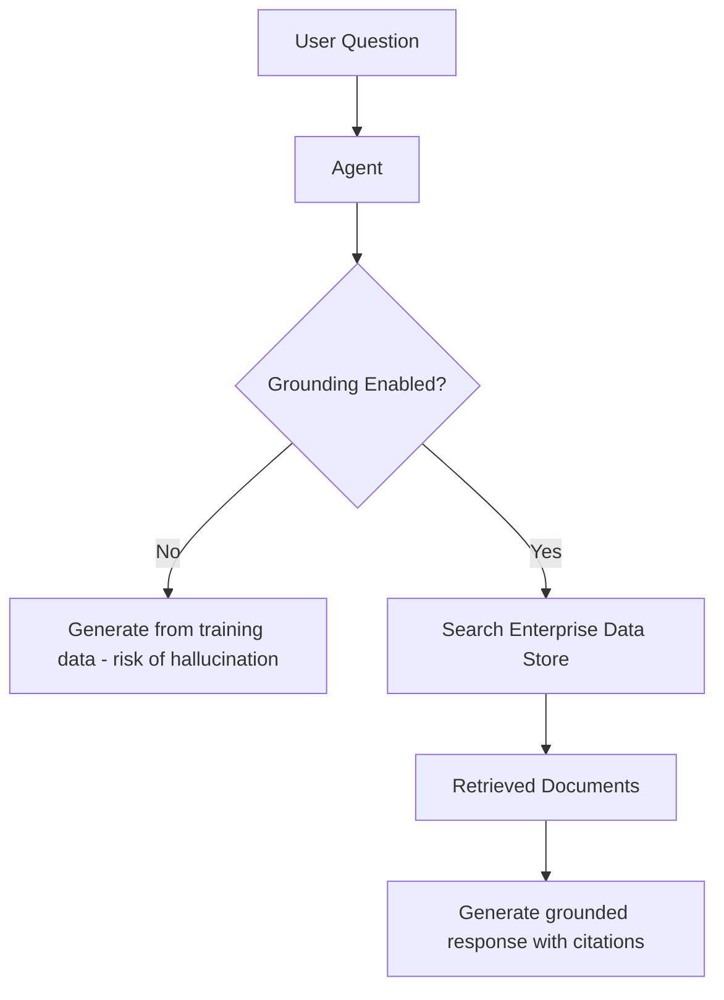

# How to Implement Grounding with Enterprise Data in Vertex AI Agent Builder

Author: [nawazdhandala](https://www.github.com/nawazdhandala)

Tags: GCP, Vertex AI, Agent Builder, Grounding, Enterprise Data

Description: Implement data grounding in Vertex AI Agent Builder to ensure your AI agent gives accurate answers based on your enterprise documents and knowledge bases.

---

AI agents that make up answers are worse than useless - they are dangerous. Grounding solves this by connecting your agent to actual enterprise data, so its responses are based on real documents rather than the model's training data. Vertex AI Agent Builder supports grounding through Vertex AI Search data stores, which means you can point your agent at your documentation, FAQs, policy documents, and internal wikis, and it will answer questions based on that content with citations.

This guide shows how to set up and configure grounding for your agents to ensure accurate, verifiable responses.

## What Grounding Does

Without grounding, an AI agent generates responses entirely from its pre-training knowledge. This leads to hallucinations - plausible-sounding answers that are factually wrong or outdated. Grounding adds a retrieval step: before generating a response, the agent searches your enterprise data for relevant information and uses only that information to formulate its answer.



## Prerequisites

- Google Cloud project with Vertex AI Agent Builder configured
- A Vertex AI Search data store with indexed content
- Python 3.9+

```bash
pip install google-cloud-aiplatform google-cloud-discoveryengine
```

## Step 1: Prepare Your Enterprise Data

### Setting Up a Data Store for Grounding

Your enterprise data needs to be indexed in a Vertex AI Search data store. The data can come from Cloud Storage, BigQuery, or web crawling.

```python
from google.cloud import discoveryengine_v1 as discoveryengine

def create_grounding_data_store(project_id: str, location: str, data_store_id: str):
    """Create a data store specifically for agent grounding."""
    client = discoveryengine.DataStoreServiceClient()

    data_store = discoveryengine.DataStore(
        display_name="Enterprise Grounding Data",
        industry_vertical=discoveryengine.IndustryVertical.GENERIC,
        content_config=discoveryengine.DataStore.ContentConfig.CONTENT_REQUIRED,
        solution_types=[discoveryengine.SolutionType.SOLUTION_TYPE_SEARCH],
    )

    parent = f"projects/{project_id}/locations/{location}/collections/default_collection"

    operation = client.create_data_store(
        parent=parent,
        data_store=data_store,
        data_store_id=data_store_id,
    )

    result = operation.result(timeout=300)
    print(f"Grounding data store created: {result.name}")
    return result

create_grounding_data_store(
    project_id="your-project-id",
    location="global",
    data_store_id="grounding-knowledge-base",
)
```

### Importing Documents

```python
def import_grounding_documents(
    project_id: str,
    location: str,
    data_store_id: str,
    gcs_uri: str,
):
    """Import documents into the grounding data store."""
    client = discoveryengine.DocumentServiceClient()

    parent = (
        f"projects/{project_id}/locations/{location}"
        f"/collections/default_collection/dataStores/{data_store_id}"
        f"/branches/default_branch"
    )

    gcs_source = discoveryengine.GcsSource(
        input_uris=[gcs_uri],
        data_schema="content",
    )

    request = discoveryengine.ImportDocumentsRequest(
        parent=parent,
        gcs_source=gcs_source,
        reconciliation_mode=discoveryengine.ImportDocumentsRequest.ReconciliationMode.INCREMENTAL,
    )

    operation = client.import_documents(request=request)
    print("Document import started...")
    result = operation.result(timeout=600)
    print(f"Import complete. Error samples: {len(result.error_samples)}")
    return result

# Import company documentation
import_grounding_documents(
    project_id="your-project-id",
    location="global",
    data_store_id="grounding-knowledge-base",
    gcs_uri="gs://your-bucket/enterprise-docs/**",
)
```

## Step 2: Configure Grounding in the Agent

### Using Vertex AI Generative AI with Grounding

```python
from google.cloud import aiplatform
from vertexai.generative_models import GenerativeModel, Tool
from vertexai.preview.generative_models import grounding

# Initialize Vertex AI
aiplatform.init(project="your-project-id", location="us-central1")

def create_grounded_model():
    """Create a generative model with enterprise data grounding."""
    model = GenerativeModel("gemini-1.5-pro")

    # Configure grounding with your data store
    grounding_tool = Tool.from_retrieval(
        grounding.Retrieval(
            grounding.VertexAISearch(
                datastore=f"projects/your-project-id/locations/global/collections/default_collection/dataStores/grounding-knowledge-base"
            )
        )
    )

    return model, grounding_tool

model, grounding_tool = create_grounded_model()

# Generate a grounded response
response = model.generate_content(
    "What is our company's data retention policy?",
    tools=[grounding_tool],
)

print(response.text)

# Check grounding metadata
if response.candidates[0].grounding_metadata:
    metadata = response.candidates[0].grounding_metadata
    print("\nGrounding sources:")
    for chunk in metadata.grounding_chunks:
        if chunk.retrieved_context:
            print(f"  Source: {chunk.retrieved_context.title}")
            print(f"  URI: {chunk.retrieved_context.uri}")
```

### Grounding with Google Search

You can also ground responses using Google Search for real-time public information.

```python
from vertexai.preview.generative_models import grounding

def create_web_grounded_model():
    """Create a model grounded with Google Search for public information."""
    model = GenerativeModel("gemini-1.5-pro")

    web_grounding_tool = Tool.from_google_search_retrieval(
        grounding.GoogleSearchRetrieval()
    )

    return model, web_grounding_tool

web_model, web_tool = create_web_grounded_model()

# Get a response grounded in current web data
response = web_model.generate_content(
    "What are the latest features announced for Google Cloud Run?",
    tools=[web_tool],
)

print(response.text)
```

## Step 3: Build a Grounded Agent

Combine grounding with agent capabilities for a conversational experience.

```python
from langchain_google_vertexai import ChatVertexAI
from langchain_core.tools import tool
from langchain.agents import create_react_agent, AgentExecutor
from langchain_core.prompts import ChatPromptTemplate, MessagesPlaceholder
from google.cloud import discoveryengine_v1 as discoveryengine

PROJECT_ID = "your-project-id"
LOCATION = "global"
DATA_STORE_ID = "grounding-knowledge-base"
ENGINE_ID = "grounding-search-engine"

@tool
def search_enterprise_knowledge(query: str) -> str:
    """Search the enterprise knowledge base for accurate information about company
    policies, products, procedures, and technical documentation. Always use this
    tool to verify facts before answering questions."""
    client = discoveryengine.SearchServiceClient()

    serving_config = (
        f"projects/{PROJECT_ID}/locations/{LOCATION}"
        f"/collections/default_collection/engines/{ENGINE_ID}"
        f"/servingConfigs/default_search"
    )

    request = discoveryengine.SearchRequest(
        serving_config=serving_config,
        query=query,
        page_size=5,
        content_search_spec=discoveryengine.SearchRequest.ContentSearchSpec(
            extractive_content_spec=discoveryengine.SearchRequest.ContentSearchSpec.ExtractiveContentSpec(
                max_extractive_answer_count=3,
                max_extractive_segment_count=3,
            ),
            summary_spec=discoveryengine.SearchRequest.ContentSearchSpec.SummarySpec(
                summary_result_count=3,
                include_citations=True,
            ),
        ),
    )

    response = client.search(request)

    # Format grounded results
    results = []

    # Include the AI summary if available
    if response.summary and response.summary.summary_text:
        results.append(f"Summary: {response.summary.summary_text}")

    # Include extractive content
    for result in response.results:
        doc_data = result.document.derived_struct_data
        title = doc_data.get("title", "Unknown")

        for answer in doc_data.get("extractive_answers", []):
            content = answer.get("content", "")
            results.append(f"[Source: {title}] {content}")

        for segment in doc_data.get("extractive_segments", []):
            content = segment.get("content", "")
            results.append(f"[Source: {title}] {content}")

    return "\n\n".join(results) if results else "No relevant information found in the knowledge base."

# Build the grounded agent
llm = ChatVertexAI(
    model_name="gemini-1.5-pro",
    project="your-project-id",
    location="us-central1",
    temperature=0.1,
)

tools = [search_enterprise_knowledge]

prompt = ChatPromptTemplate.from_messages([
    ("system", """You are an enterprise assistant that provides accurate, grounded answers.

CRITICAL RULES:
1. ALWAYS search the enterprise knowledge base before answering factual questions
2. NEVER make up information - only use data from the knowledge base
3. If the knowledge base does not contain the answer, clearly state that
4. Always cite which document your answer comes from
5. If you are uncertain about any detail, search again with different terms
6. For opinions or general advice, you can respond directly, but flag that it is not from official documentation"""),
    MessagesPlaceholder(variable_name="chat_history", optional=True),
    ("human", "{input}"),
    MessagesPlaceholder(variable_name="agent_scratchpad"),
])

agent = create_react_agent(llm=llm, tools=tools, prompt=prompt)
grounded_agent = AgentExecutor(
    agent=agent,
    tools=tools,
    verbose=True,
    max_iterations=4,
    handle_parsing_errors=True,
)
```

## Testing Grounding Quality

```python
# Test with a factual question
result = grounded_agent.invoke({
    "input": "What is our SLA guarantee for enterprise customers?",
    "chat_history": [],
})
print(f"Grounded answer: {result['output']}")

# Test with a question that should not be in the knowledge base
result = grounded_agent.invoke({
    "input": "What is the weather like in Tokyo today?",
    "chat_history": [],
})
print(f"Response: {result['output']}")
# The agent should indicate this is not in the enterprise knowledge base
```

## Evaluating Grounding Effectiveness

Track how well the grounding prevents hallucinations.

```python
def evaluate_grounding(agent, test_cases: list) -> dict:
    """Evaluate grounding quality against known test cases."""
    results = {
        "total": len(test_cases),
        "grounded": 0,
        "ungrounded": 0,
        "correct": 0,
    }

    for case in test_cases:
        query = case["query"]
        expected_source = case.get("expected_source")

        response = agent.invoke({"input": query, "chat_history": []})
        output = response["output"]

        # Check if the response references a source
        if "[Source:" in output or "according to" in output.lower():
            results["grounded"] += 1
        else:
            results["ungrounded"] += 1

        # Check if the response is factually correct
        if case.get("expected_answer_contains"):
            if case["expected_answer_contains"].lower() in output.lower():
                results["correct"] += 1

    results["grounding_rate"] = f"{results['grounded']/results['total']:.0%}"
    return results

# Define test cases
test_cases = [
    {
        "query": "What is our refund policy?",
        "expected_source": "refund-policy.pdf",
        "expected_answer_contains": "30 days",
    },
    {
        "query": "What plans do we offer?",
        "expected_source": "pricing.pdf",
        "expected_answer_contains": "professional",
    },
]
```

## Keeping Grounding Data Fresh

Set up automated pipelines to keep your grounding data current.

```python
def schedule_grounding_refresh():
    """Set up automated document refresh for the grounding data store."""
    # Use Cloud Scheduler to trigger periodic re-imports
    # This ensures the agent always has access to the latest documents

    print("Recommended refresh schedule:")
    print("  - Policy documents: Weekly")
    print("  - Product documentation: Daily")
    print("  - FAQ and support articles: Every 6 hours")
    print("  - Pricing information: On change (event-driven)")
```

## Summary

Grounding is not optional for enterprise AI agents - it is essential. Without it, your agent will confidently provide incorrect information, which erodes trust and creates liability. Set up a Vertex AI Search data store with your enterprise documents, configure the agent to search before answering, and enforce strict rules about only using retrieved information. Monitor grounding rates and accuracy over time, and keep the underlying data fresh. The result is an agent that users can trust because every answer is backed by your actual documentation.
