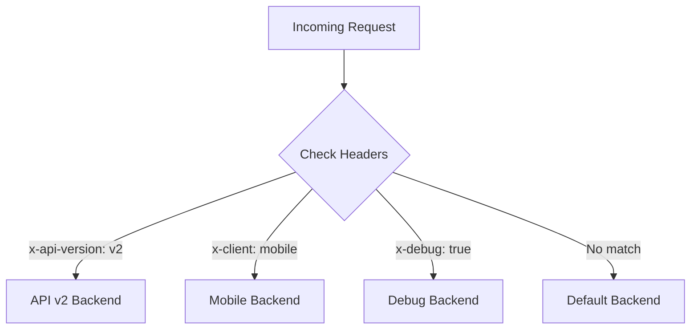

# How to Implement Header-Based Routing with URL Maps on Google Cloud Application Load Balancer

Author: [nawazdhandala](https://www.github.com/nawazdhandala)

Tags: GCP, Load Balancer, Header-Based Routing, URL Maps, Traffic Management

Description: Learn how to implement header-based routing on Google Cloud Application Load Balancer using URL map route rules to direct traffic based on HTTP headers.

---

URL path-based routing is the standard approach for most load balancers, but sometimes you need to route based on something other than the URL. Maybe you want to send mobile app traffic to a different backend, route requests based on API version headers, or direct internal users to a debug-enabled service. Header-based routing on Google Cloud's Application Load Balancer lets you inspect HTTP request headers and make routing decisions based on their values.

This post covers how to configure header-based routing through URL map route rules, with practical examples for common use cases.

## How Header-Based Routing Works

The Application Load Balancer evaluates route rules in priority order. Each route rule can include match conditions based on headers, URL path, or query parameters. When a request matches a rule, it gets routed to the specified backend service.



## Setting Up Backend Services

Let us create the backend services that we will route to.

```bash
# Create a health check
gcloud compute health-checks create http app-hc \
    --port=8080 \
    --request-path=/healthz

# Default backend
gcloud compute backend-services create default-backend \
    --global \
    --protocol=HTTP \
    --health-checks=app-hc \
    --port-name=http

# API v2 backend
gcloud compute backend-services create api-v2-backend \
    --global \
    --protocol=HTTP \
    --health-checks=app-hc \
    --port-name=http

# Mobile backend
gcloud compute backend-services create mobile-backend \
    --global \
    --protocol=HTTP \
    --health-checks=app-hc \
    --port-name=http

# Debug backend
gcloud compute backend-services create debug-backend \
    --global \
    --protocol=HTTP \
    --health-checks=app-hc \
    --port-name=http
```

I will skip the instance group setup here since we covered that in previous posts. The important part is the URL map configuration.

## Basic Header Matching

The URL map route rules support several types of header matches:

- **exactMatch**: Header value must match exactly
- **prefixMatch**: Header value must start with the specified string
- **suffixMatch**: Header value must end with the specified string
- **regexMatch**: Header value must match a regular expression
- **presentMatch**: Header just needs to be present (or absent)
- **rangeMatch**: Header value must be a number within a range

Here is a URL map with various header matching patterns:

```bash
gcloud compute url-maps import app-url-map --source=- <<'EOF'
name: app-url-map
defaultService: projects/my-project/global/backendServices/default-backend
hostRules:
  - hosts:
      - "*"
    pathMatcher: header-routes
pathMatchers:
  - name: header-routes
    defaultService: projects/my-project/global/backendServices/default-backend
    routeRules:
      # Route API v2 requests based on version header
      - priority: 1
        matchRules:
          - headerMatches:
              - headerName: "x-api-version"
                exactMatch: "v2"
        service: projects/my-project/global/backendServices/api-v2-backend
      # Route mobile clients based on client type header
      - priority: 2
        matchRules:
          - headerMatches:
              - headerName: "x-client-type"
                exactMatch: "mobile"
        service: projects/my-project/global/backendServices/mobile-backend
      # Route debug requests
      - priority: 3
        matchRules:
          - headerMatches:
              - headerName: "x-debug"
                presentMatch: true
        service: projects/my-project/global/backendServices/debug-backend
EOF
```

## Combining Header Matches with Path Matches

You can combine header conditions with URL path conditions for more precise routing.

```bash
gcloud compute url-maps import app-url-map --source=- <<'EOF'
name: app-url-map
defaultService: projects/my-project/global/backendServices/default-backend
hostRules:
  - hosts:
      - "*"
    pathMatcher: combined-routes
pathMatchers:
  - name: combined-routes
    defaultService: projects/my-project/global/backendServices/default-backend
    routeRules:
      # Only route to v2 backend if both path and header match
      - priority: 1
        matchRules:
          - prefixMatch: "/api/"
            headerMatches:
              - headerName: "x-api-version"
                exactMatch: "v2"
        service: projects/my-project/global/backendServices/api-v2-backend
      # Mobile clients hitting the /feed/ path
      - priority: 2
        matchRules:
          - prefixMatch: "/feed/"
            headerMatches:
              - headerName: "x-client-type"
                exactMatch: "mobile"
        service: projects/my-project/global/backendServices/mobile-backend
EOF
```

Within a single `matchRules` entry, all conditions must be true (AND logic). Between multiple `matchRules` entries, any can be true (OR logic).

## Multiple Header Conditions

You can require multiple headers to all match:

```bash
gcloud compute url-maps import app-url-map --source=- <<'EOF'
name: app-url-map
defaultService: projects/my-project/global/backendServices/default-backend
hostRules:
  - hosts:
      - "*"
    pathMatcher: multi-header-routes
pathMatchers:
  - name: multi-header-routes
    defaultService: projects/my-project/global/backendServices/default-backend
    routeRules:
      # Both headers must match (AND condition)
      - priority: 1
        matchRules:
          - headerMatches:
              - headerName: "x-tenant"
                exactMatch: "enterprise"
              - headerName: "x-region"
                exactMatch: "eu"
        service: projects/my-project/global/backendServices/eu-enterprise-backend
      # Inverted match - route if header is NOT present
      - priority: 2
        matchRules:
          - headerMatches:
              - headerName: "x-auth-token"
                invertMatch: true
                presentMatch: true
        service: projects/my-project/global/backendServices/unauthenticated-backend
EOF
```

The `invertMatch` field reverses the match logic. In the example above, requests without the `x-auth-token` header get routed to the unauthenticated backend.

## Regex Header Matching

For more flexible matching, use regex patterns:

```bash
gcloud compute url-maps import app-url-map --source=- <<'EOF'
name: app-url-map
defaultService: projects/my-project/global/backendServices/default-backend
hostRules:
  - hosts:
      - "*"
    pathMatcher: regex-routes
pathMatchers:
  - name: regex-routes
    defaultService: projects/my-project/global/backendServices/default-backend
    routeRules:
      # Match User-Agent for specific bot patterns
      - priority: 1
        matchRules:
          - headerMatches:
              - headerName: "user-agent"
                regexMatch: ".*(Googlebot|Bingbot|Slurp).*"
        service: projects/my-project/global/backendServices/bot-backend
      # Match API keys that start with a specific prefix
      - priority: 2
        matchRules:
          - headerMatches:
              - headerName: "x-api-key"
                prefixMatch: "premium_"
        service: projects/my-project/global/backendServices/premium-backend
EOF
```

## Header Manipulation in Route Actions

Beyond just routing, you can modify headers as requests pass through the load balancer:

```bash
gcloud compute url-maps import app-url-map --source=- <<'EOF'
name: app-url-map
defaultService: projects/my-project/global/backendServices/default-backend
hostRules:
  - hosts:
      - "*"
    pathMatcher: header-manipulation
pathMatchers:
  - name: header-manipulation
    defaultService: projects/my-project/global/backendServices/default-backend
    routeRules:
      - priority: 1
        matchRules:
          - prefixMatch: "/"
        routeAction:
          weightedBackendServices:
            - backendService: projects/my-project/global/backendServices/default-backend
              weight: 100
              headerAction:
                requestHeadersToAdd:
                  # Add a header to tell the backend which LB handled the request
                  - headerName: "x-lb-region"
                    headerValue: "us-central1"
                    replace: true
                  # Add routing metadata
                  - headerName: "x-route-matched"
                    headerValue: "default"
                    replace: true
                requestHeadersToRemove:
                  # Strip sensitive headers before they reach the backend
                  - "x-debug-token"
                  - "x-internal-only"
EOF
```

## Testing Header-Based Routes

Verify your routing configuration with curl:

```bash
# Get the load balancer IP
LB_IP=$(gcloud compute addresses describe app-global-ip --global --format="value(address)")

# Test default routing (no special headers)
curl -s -o /dev/null -w "%{http_code}" https://app.example.com/

# Test API v2 routing
curl -H "x-api-version: v2" https://app.example.com/api/users

# Test mobile routing
curl -H "x-client-type: mobile" https://app.example.com/feed/

# Test debug routing
curl -H "x-debug: true" https://app.example.com/

# Test combined conditions
curl -H "x-api-version: v2" https://app.example.com/api/data

# Verify the request reaches the right backend by checking response headers
curl -v -H "x-api-version: v2" https://app.example.com/api/users 2>&1 | grep "x-served-by"
```

## Common Use Cases

Here are some patterns I have seen work well in production:

**A/B testing**: Route a percentage of users with a specific cookie or header to a test backend. The application sets the header on first visit, and subsequent requests get consistently routed.

**Multi-tenant routing**: Route requests to different backends based on a tenant ID header. Each tenant's traffic is isolated at the infrastructure level.

**Internal vs external traffic**: Use a header injected by your API gateway to distinguish internal service-to-service calls from external user requests, and route them to different backends with different resource allocations.

**Gradual feature rollout**: Combine header-based routing with weighted routing. Internal users with a specific header always see the new version, while external traffic gets a gradual percentage-based rollout.

## Wrapping Up

Header-based routing on GCP's Application Load Balancer is configured entirely through URL map route rules. The matching options are flexible - exact, prefix, suffix, regex, presence, and range - and you can combine multiple header conditions with path conditions. This gives you fine-grained control over how traffic flows to your backends, without changing any application code. The route rules evaluate in priority order, so put your most specific rules at the lowest priority numbers, and always have a default route as a catch-all.
