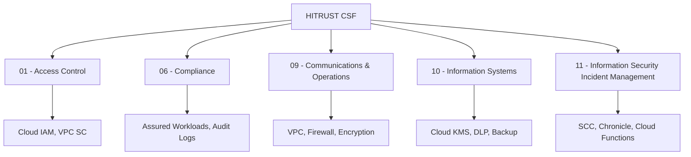

# How to Implement HITRUST CSF Controls for Healthcare Workloads on GCP

Author: [nawazdhandala](https://www.github.com/nawazdhandala)

Tags: GCP, HITRUST, Healthcare, Compliance, Google Cloud Security

Description: A guide to implementing HITRUST Common Security Framework controls for healthcare workloads on Google Cloud Platform, covering technical and operational requirements.

---

HITRUST CSF (Common Security Framework) is the gold standard for healthcare compliance. It incorporates requirements from HIPAA, NIST, ISO 27001, PCI DSS, and other frameworks into a single, certifiable set of controls. If your healthcare application runs on Google Cloud, you need to map HITRUST control categories to specific GCP configurations.

This guide covers the practical implementation of key HITRUST CSF control domains on Google Cloud.

## HITRUST Control Domains on GCP

HITRUST CSF has 14 control categories. Here is how the most technically relevant ones map to GCP services:



## Domain 01: Access Control

### Implementing Role-Based Access Control

```bash
# Create HITRUST-aligned custom roles for healthcare workloads
# Clinical data viewer - can read patient data but not modify
gcloud iam roles create clinicalDataViewer \
    --project=healthcare-project \
    --title="Clinical Data Viewer" \
    --description="Read-only access to clinical data (HITRUST 01.a)" \
    --permissions=\
bigquery.datasets.get,\
bigquery.tables.get,\
bigquery.tables.getData,\
bigquery.jobs.create,\
healthcare.datasets.get,\
healthcare.fhirStores.get,\
healthcare.fhirResources.get

# Clinical data administrator - can manage data stores
gcloud iam roles create clinicalDataAdmin \
    --project=healthcare-project \
    --title="Clinical Data Admin" \
    --description="Manage clinical data stores (HITRUST 01.b)" \
    --permissions=\
healthcare.datasets.get,\
healthcare.datasets.update,\
healthcare.fhirStores.create,\
healthcare.fhirStores.update,\
healthcare.fhirStores.get,\
healthcare.fhirResources.create,\
healthcare.fhirResources.update,\
healthcare.fhirResources.get

# Assign roles to groups with conditions
gcloud projects add-iam-policy-binding healthcare-project \
    --role=projects/healthcare-project/roles/clinicalDataViewer \
    --member="group:clinical-staff@hospital.org" \
    --condition='expression=resource.type == "healthcare.googleapis.com/FhirStore",title=FHIR stores only'
```

### Enforcing MFA and Session Controls

```bash
# Set organization policy to require 2SV (two-step verification)
# This satisfies HITRUST 01.q multi-factor authentication requirement
gcloud identity groups update clinical-staff@hospital.org \
    --group-email=clinical-staff@hospital.org

# Configure session length for healthcare users
# HITRUST 01.t requires automatic session termination
# Configure this in Google Workspace Admin:
# Security > Google Cloud session control > Set to 4 hours
```

## Domain 05: Physical and Environmental Security

While Google handles physical data center security (their responsibility under shared responsibility), you need to document the controls and configure data residency:

```bash
# Restrict resources to US locations (HITRUST 05.i)
gcloud resource-manager org-policies set-policy - \
    --folder=HEALTHCARE_FOLDER_ID <<'EOF'
constraint: constraints/gcp.resourceLocations
listPolicy:
  allowedValues:
    - "in:us-locations"
EOF
```

## Domain 09: Communications and Operations Management

### Network Segmentation

```bash
# Create a dedicated VPC for healthcare workloads (HITRUST 09.m)
gcloud compute networks create healthcare-vpc \
    --project=healthcare-project \
    --subnet-mode=custom

# Create segmented subnets for different tiers
gcloud compute networks subnets create clinical-apps-subnet \
    --project=healthcare-project \
    --network=healthcare-vpc \
    --region=us-central1 \
    --range=10.0.0.0/20 \
    --enable-private-ip-google-access \
    --enable-flow-logs

gcloud compute networks subnets create data-tier-subnet \
    --project=healthcare-project \
    --network=healthcare-vpc \
    --region=us-central1 \
    --range=10.0.16.0/20 \
    --enable-private-ip-google-access \
    --enable-flow-logs

# Implement firewall rules for network segmentation
# Only allow clinical app tier to reach data tier (HITRUST 09.m)
gcloud compute firewall-rules create allow-app-to-data \
    --project=healthcare-project \
    --network=healthcare-vpc \
    --allow=tcp:5432,tcp:443 \
    --source-ranges=10.0.0.0/20 \
    --destination-ranges=10.0.16.0/20 \
    --description="Allow clinical apps to reach data stores"

# Deny direct internet access to data tier
gcloud compute firewall-rules create deny-data-egress \
    --project=healthcare-project \
    --network=healthcare-vpc \
    --direction=EGRESS \
    --action=DENY \
    --rules=all \
    --destination-ranges=0.0.0.0/0 \
    --target-tags=data-tier \
    --priority=100 \
    --description="Block internet access from data tier (HITRUST 09.m)"
```

### Encryption in Transit and at Rest

```bash
# Create HSM-backed encryption keys (HITRUST 09.x)
gcloud kms keyrings create hitrust-keyring \
    --location=us \
    --project=healthcare-project

gcloud kms keys create phi-encryption-key \
    --keyring=hitrust-keyring \
    --location=us \
    --purpose=encryption \
    --protection-level=hsm \
    --rotation-period=90d \
    --project=healthcare-project

# Enforce TLS for all Cloud SQL connections (HITRUST 09.y)
gcloud sql instances patch healthcare-db \
    --project=healthcare-project \
    --require-ssl

# Create encrypted storage for PHI (HITRUST 09.x)
gcloud storage buckets create gs://phi-data-bucket \
    --project=healthcare-project \
    --location=us \
    --default-encryption-key=projects/healthcare-project/locations/us/keyRings/hitrust-keyring/cryptoKeys/phi-encryption-key \
    --uniform-bucket-level-access
```

## Domain 09: Data Loss Prevention

Implement DLP scanning for PHI:

```python
# dlp_scanner.py
# Scans Cloud Storage objects for PHI using Cloud DLP
# Satisfies HITRUST 09.q data leakage prevention

import functions_framework
from google.cloud import dlp_v2
from google.cloud import storage
import json

dlp_client = dlp_v2.DlpServiceClient()
PROJECT_ID = "healthcare-project"

@functions_framework.cloud_event
def scan_uploaded_file(cloud_event):
    """Scan newly uploaded files for PHI content."""

    data = cloud_event.data
    bucket_name = data["bucket"]
    file_name = data["name"]

    # Configure DLP inspection for healthcare-specific info types
    inspect_config = dlp_v2.InspectConfig(
        info_types=[
            # PHI-related info types
            dlp_v2.InfoType(name="PERSON_NAME"),
            dlp_v2.InfoType(name="DATE_OF_BIRTH"),
            dlp_v2.InfoType(name="PHONE_NUMBER"),
            dlp_v2.InfoType(name="EMAIL_ADDRESS"),
            dlp_v2.InfoType(name="US_SOCIAL_SECURITY_NUMBER"),
            dlp_v2.InfoType(name="MEDICAL_RECORD_NUMBER"),
            dlp_v2.InfoType(name="US_DEA_NUMBER"),
            dlp_v2.InfoType(name="US_HEALTHCARE_NPI"),
        ],
        min_likelihood=dlp_v2.Likelihood.LIKELY,
        include_quote=False,  # Do not include PHI in the finding
    )

    # Configure the storage item to inspect
    storage_config = dlp_v2.StorageConfig(
        cloud_storage_options=dlp_v2.CloudStorageOptions(
            file_set=dlp_v2.CloudStorageOptions.FileSet(
                url=f"gs://{bucket_name}/{file_name}"
            )
        )
    )

    # Create and run the inspection job
    job = dlp_client.create_dlp_job(
        request={
            "parent": f"projects/{PROJECT_ID}/locations/us",
            "inspect_job": {
                "inspect_config": inspect_config,
                "storage_config": storage_config,
                "actions": [
                    {
                        "pub_sub": {
                            "topic": f"projects/{PROJECT_ID}/topics/dlp-findings"
                        }
                    }
                ],
            },
        }
    )

    print(f"DLP job created: {job.name}")
```

## Domain 10: Information Systems Acquisition

### Healthcare API Configuration

```bash
# Create a Healthcare dataset for FHIR data (HITRUST 10.a)
gcloud healthcare datasets create healthcare-dataset \
    --location=us-central1 \
    --project=healthcare-project

# Create a FHIR store with audit logging
gcloud healthcare fhir-stores create patient-records \
    --dataset=healthcare-dataset \
    --location=us-central1 \
    --version=R4 \
    --enable-update-create \
    --project=healthcare-project

# Enable FHIR store audit logging
gcloud healthcare fhir-stores update patient-records \
    --dataset=healthcare-dataset \
    --location=us-central1 \
    --project=healthcare-project
```

## Domain 11: Incident Management

```bash
# Enable Security Command Center for threat detection (HITRUST 11.a)
gcloud scc settings update \
    --organization=123456789 \
    --enable-modules=SECURITY_HEALTH_ANALYTICS,EVENT_THREAT_DETECTION

# Create notification for security findings
gcloud scc notifications create hitrust-alerts \
    --organization=123456789 \
    --filter='severity="CRITICAL" OR severity="HIGH"' \
    --pubsub-topic=projects/healthcare-project/topics/security-incidents

# Create a Cloud Function for automated incident response
gcloud functions deploy incident-responder \
    --runtime=python311 \
    --trigger-topic=security-incidents \
    --source=./incident-response/ \
    --region=us-central1 \
    --project=healthcare-project
```

## Comprehensive Audit Logging

```bash
# Enable comprehensive audit logging for HITRUST 09.aa
gcloud projects get-iam-policy healthcare-project --format=json | \
    python3 -c "
import json, sys
policy = json.load(sys.stdin)
policy['auditConfigs'] = [{
    'service': 'allServices',
    'auditLogConfigs': [
        {'logType': 'ADMIN_READ'},
        {'logType': 'DATA_READ'},
        {'logType': 'DATA_WRITE'}
    ]
}]
json.dump(policy, sys.stdout, indent=2)
" > /tmp/audit-policy.json

gcloud projects set-iam-policy healthcare-project /tmp/audit-policy.json

# Create a log sink for long-term retention (7 years for HITRUST)
gcloud logging sinks create hitrust-audit-sink \
    storage.googleapis.com/hitrust-audit-archive \
    --project=healthcare-project \
    --log-filter='logName:"cloudaudit.googleapis.com"'
```

## Terraform Configuration

```hcl
# Healthcare API dataset
resource "google_healthcare_dataset" "main" {
  name     = "healthcare-dataset"
  location = "us-central1"
  project  = "healthcare-project"
}

# FHIR store for patient records
resource "google_healthcare_fhir_store" "patients" {
  name    = "patient-records"
  dataset = google_healthcare_dataset.main.id
  version = "R4"

  enable_update_create          = true
  disable_referential_integrity = false
}

# VPC Service Controls for healthcare data
resource "google_access_context_manager_service_perimeter" "healthcare" {
  parent = "accessPolicies/${var.policy_id}"
  name   = "accessPolicies/${var.policy_id}/servicePerimeters/healthcare_perimeter"
  title  = "Healthcare Data Perimeter"

  status {
    resources = ["projects/${var.project_number}"]
    restricted_services = [
      "healthcare.googleapis.com",
      "bigquery.googleapis.com",
      "storage.googleapis.com",
    ]
  }
}
```

## Continuous Compliance Monitoring

HITRUST certification requires continuous monitoring, not just point-in-time compliance:

1. **Daily** - Review Security Command Center findings, check automated DLP scan results
2. **Weekly** - Review access logs for unusual patterns, verify backup completion
3. **Monthly** - Run full compliance checks, review network flow logs for anomalies
4. **Quarterly** - Conduct access reviews, test incident response procedures
5. **Annually** - Full HITRUST assessment, penetration testing, risk assessment update

The combination of Google Cloud's Healthcare API, Cloud DLP, Security Command Center, and proper IAM configuration gives you a strong technical foundation for HITRUST CSF compliance. The operational processes around these controls are what turn them into a certifiable program.
