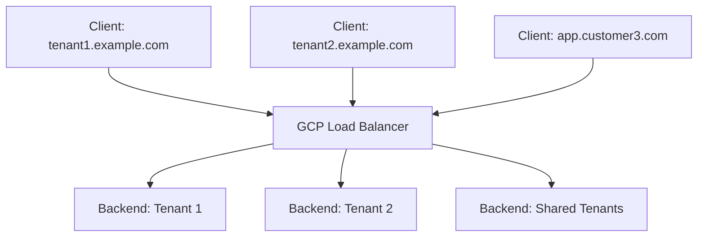

# How to Implement Host-Based Routing for Multi-Tenant Applications on GCP Load Balancer

Author: [nawazdhandala](https://www.github.com/nawazdhandala)

Tags: GCP, Load Balancer, Host-Based Routing, Multi-Tenant, URL Map, Google Cloud

Description: Configure host-based routing on Google Cloud HTTP(S) Load Balancer to serve multiple tenants from a single load balancer using different domain names.

---

Multi-tenant applications often need to serve different customers through different domain names - tenant1.example.com, tenant2.example.com, or even completely different domains like app.customer1.com and app.customer2.com. Instead of deploying a separate load balancer for each tenant, you can use a single Google Cloud HTTP(S) Load Balancer with host-based routing to direct traffic to the right backend based on the hostname in the request.

This approach reduces infrastructure costs, simplifies certificate management, and gives you a single point for monitoring and security policies.

## Architecture

A single external HTTP(S) load balancer handles all incoming traffic. The URL map inspects the Host header and routes to different backend services based on the hostname. Each tenant can have its own backend service pointing to dedicated infrastructure, or tenants can share backends with the routing layer handling isolation.



## Setting Up the Backend Services

Create separate backend services for different tenant tiers or groupings.

```bash
# Create health checks
gcloud compute health-checks create http tenant-hc \
  --port=8080 \
  --request-path=/health \
  --project=my-project

# Backend for premium tenants (dedicated resources)
gcloud compute backend-services create premium-tenant-backend \
  --protocol=HTTP \
  --port-name=http \
  --health-checks=tenant-hc \
  --global \
  --project=my-project

# Backend for standard tenants (shared resources)
gcloud compute backend-services create standard-tenant-backend \
  --protocol=HTTP \
  --port-name=http \
  --health-checks=tenant-hc \
  --global \
  --project=my-project

# Backend for a specific enterprise tenant with custom infrastructure
gcloud compute backend-services create enterprise-acme-backend \
  --protocol=HTTP \
  --port-name=http \
  --health-checks=tenant-hc \
  --global \
  --project=my-project

# Default backend for unmatched hosts
gcloud compute backend-services create default-backend \
  --protocol=HTTP \
  --port-name=http \
  --health-checks=tenant-hc \
  --global \
  --project=my-project

# Add backends (instance groups or NEGs) to each backend service
gcloud compute backend-services add-backend premium-tenant-backend \
  --instance-group=premium-ig \
  --instance-group-zone=us-central1-a \
  --global \
  --project=my-project

gcloud compute backend-services add-backend standard-tenant-backend \
  --instance-group=standard-ig \
  --instance-group-zone=us-central1-a \
  --global \
  --project=my-project
```

## Creating the URL Map with Host Rules

The URL map defines which backend service handles traffic for each hostname.

```yaml
# url-map-multitenant.yaml
# Host-based routing for multi-tenant application
name: multitenant-url-map
defaultService: projects/my-project/global/backendServices/default-backend

hostRules:
  # Premium tenants - each gets their own host rule
  - hosts:
      - "tenant1.example.com"
      - "tenant2.example.com"
    pathMatcher: premium-tenants

  # Standard tenants - grouped together
  - hosts:
      - "tenant3.example.com"
      - "tenant4.example.com"
      - "tenant5.example.com"
      - "tenant6.example.com"
    pathMatcher: standard-tenants

  # Enterprise tenant with custom domain
  - hosts:
      - "app.acmecorp.com"
      - "acme.example.com"
    pathMatcher: enterprise-acme

  # Wildcard matching for any subdomain
  - hosts:
      - "*.tenants.example.com"
    pathMatcher: wildcard-tenants

pathMatchers:
  - name: premium-tenants
    defaultService: projects/my-project/global/backendServices/premium-tenant-backend
    # Premium tenants can also have path-based routing within their backends
    pathRules:
      - paths:
          - "/api/*"
        service: projects/my-project/global/backendServices/premium-tenant-backend
      - paths:
          - "/static/*"
        service: projects/my-project/global/backendServices/standard-tenant-backend

  - name: standard-tenants
    defaultService: projects/my-project/global/backendServices/standard-tenant-backend

  - name: enterprise-acme
    defaultService: projects/my-project/global/backendServices/enterprise-acme-backend

  - name: wildcard-tenants
    defaultService: projects/my-project/global/backendServices/standard-tenant-backend
```

Import the URL map.

```bash
gcloud compute url-maps import multitenant-url-map \
  --source=url-map-multitenant.yaml \
  --global \
  --project=my-project
```

## Managing SSL Certificates

Multi-tenant routing requires SSL certificates for each domain. Google-managed certificates handle renewal automatically.

```bash
# Create Google-managed certificates for tenant domains
gcloud compute ssl-certificates create tenant-example-cert \
  --domains="tenant1.example.com,tenant2.example.com,tenant3.example.com,tenant4.example.com,tenant5.example.com,tenant6.example.com" \
  --global \
  --project=my-project

# Create a separate certificate for the enterprise custom domain
gcloud compute ssl-certificates create acme-cert \
  --domains="app.acmecorp.com" \
  --global \
  --project=my-project

# Create a wildcard certificate for dynamic tenant subdomains
gcloud compute ssl-certificates create wildcard-tenants-cert \
  --domains="*.tenants.example.com" \
  --global \
  --project=my-project
```

Note that Google-managed certificates do not support wildcard domains directly. For wildcard certificates, you need to use Certificate Manager with DNS authorization.

```bash
# Using Certificate Manager for wildcard certificates
gcloud certificate-manager dns-authorizations create tenants-dns-auth \
  --domain="tenants.example.com" \
  --project=my-project

# Get the DNS record to add to your DNS zone
gcloud certificate-manager dns-authorizations describe tenants-dns-auth \
  --project=my-project

# After adding the DNS record, create the certificate
gcloud certificate-manager certificates create wildcard-tenants-cert \
  --domains="*.tenants.example.com" \
  --dns-authorizations=tenants-dns-auth \
  --project=my-project
```

## Setting Up the Load Balancer Frontend

Create the HTTPS proxy and forwarding rule.

```bash
# Create the target HTTPS proxy with all certificates
gcloud compute target-https-proxies create multitenant-https-proxy \
  --url-map=multitenant-url-map \
  --ssl-certificates=tenant-example-cert,acme-cert \
  --global \
  --project=my-project

# Create a global static IP
gcloud compute addresses create multitenant-lb-ip \
  --global \
  --project=my-project

# Create the forwarding rule
gcloud compute forwarding-rules create multitenant-https-rule \
  --target-https-proxy=multitenant-https-proxy \
  --global \
  --address=multitenant-lb-ip \
  --ports=443 \
  --project=my-project

# Get the IP address for DNS configuration
gcloud compute addresses describe multitenant-lb-ip \
  --global \
  --format='value(address)' \
  --project=my-project
```

## Passing Tenant Context to Backends

Your backend services need to know which tenant the request is for. The Host header is available, but you can also add a custom header with the tenant identifier.

```yaml
# URL map with custom header injection per tenant
hostRules:
  - hosts:
      - "tenant1.example.com"
    pathMatcher: tenant1-matcher

pathMatchers:
  - name: tenant1-matcher
    defaultService: projects/my-project/global/backendServices/premium-tenant-backend
    defaultRouteAction:
      weightedBackendServices:
        - backendService: projects/my-project/global/backendServices/premium-tenant-backend
          weight: 100
          headerAction:
            requestHeadersToAdd:
              - headerName: X-Tenant-ID
                headerValue: "tenant1"
                replace: true
```

Your backend application reads this header to identify the tenant.

```python
# Backend application reads tenant ID from the header
from flask import Flask, request

app = Flask(__name__)

@app.route("/api/data")
def get_data():
    # Tenant ID injected by the load balancer
    tenant_id = request.headers.get("X-Tenant-ID")
    if not tenant_id:
        # Fallback: extract from Host header
        host = request.host
        tenant_id = host.split(".")[0]

    # Use tenant_id to query the right database/schema
    data = fetch_tenant_data(tenant_id)
    return jsonify(data)
```

## Terraform Configuration

```hcl
# Terraform for multi-tenant host-based routing
resource "google_compute_url_map" "multitenant" {
  name            = "multitenant-url-map"
  default_service = google_compute_backend_service.default.id
  project         = "my-project"

  host_rule {
    hosts        = ["tenant1.example.com", "tenant2.example.com"]
    path_matcher = "premium"
  }

  host_rule {
    hosts        = ["tenant3.example.com", "tenant4.example.com"]
    path_matcher = "standard"
  }

  host_rule {
    hosts        = ["app.acmecorp.com"]
    path_matcher = "enterprise-acme"
  }

  path_matcher {
    name            = "premium"
    default_service = google_compute_backend_service.premium.id
  }

  path_matcher {
    name            = "standard"
    default_service = google_compute_backend_service.standard.id
  }

  path_matcher {
    name            = "enterprise-acme"
    default_service = google_compute_backend_service.enterprise_acme.id
  }
}

resource "google_compute_managed_ssl_certificate" "tenant_cert" {
  name    = "tenant-cert"
  project = "my-project"

  managed {
    domains = [
      "tenant1.example.com",
      "tenant2.example.com",
      "tenant3.example.com",
      "tenant4.example.com",
    ]
  }
}
```

## Scaling Considerations

Google-managed SSL certificates support up to 100 domains per certificate and you can attach up to 15 certificates to a single load balancer, giving you 1,500 custom domains. For larger deployments, use Certificate Manager with certificate maps that support more domains.

The URL map itself supports up to 100 host rules. If you exceed this, consider using a wildcard host rule with dynamic tenant detection in your application layer.

Monitor per-host metrics in Cloud Monitoring to track tenant-specific traffic volume and latency. This data helps you make decisions about which tenants need dedicated backends versus shared resources.

Host-based routing on Google Cloud Load Balancer provides an efficient multi-tenant architecture that scales from a handful of tenants to hundreds, all through a single load balancer with centralized management.
