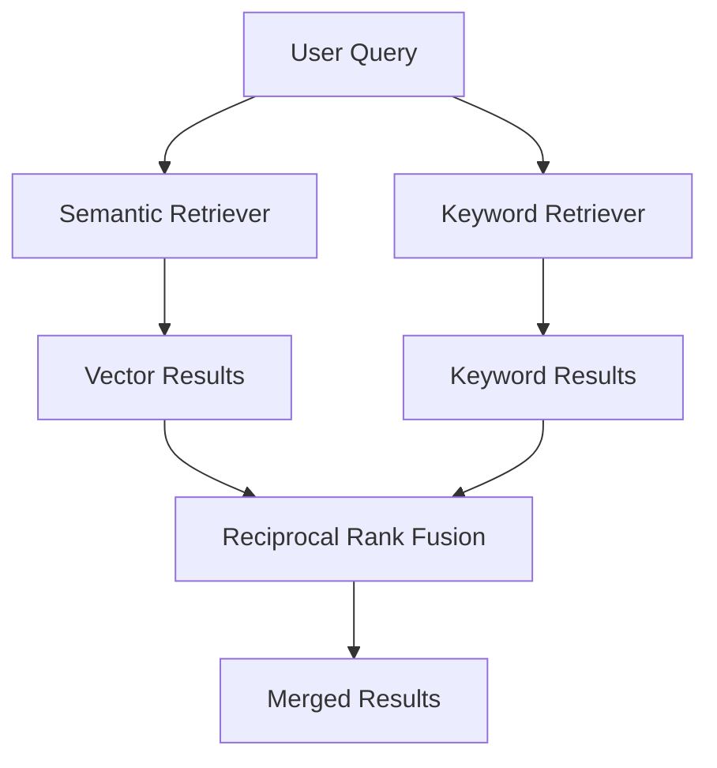

# How to Implement Hybrid Retrieval with LangChain Using Vertex AI Vector Search

Author: [nawazdhandala](https://www.github.com/nawazdhandala)

Tags: GCP, LangChain, Vertex AI, Vector Search, Hybrid Retrieval

Description: Learn how to combine semantic vector search with keyword-based retrieval using LangChain and Vertex AI Vector Search for better document retrieval accuracy.

---

Pure semantic search works well most of the time, but it has blind spots. It might miss documents that contain exact technical terms, product names, or specific identifiers that the user is searching for. Keyword search catches those, but misses semantically similar content. Hybrid retrieval combines both approaches, giving you the best of both worlds.

In this guide, I will show you how to implement hybrid retrieval using LangChain with Vertex AI Vector Search for the semantic component and a keyword retriever for the lexical component.

## What Is Hybrid Retrieval

Hybrid retrieval runs two search strategies in parallel and merges the results. The typical combination is:

- **Semantic search** - Uses vector embeddings to find documents that are conceptually similar to the query, even if they use different words
- **Keyword search** - Uses traditional text matching (BM25 or similar) to find documents containing the exact terms in the query

The results from both searches are combined using a fusion algorithm that balances relevance from both signals.



## Prerequisites

- Google Cloud project with Vertex AI API enabled
- A Vertex AI Vector Search index (or we will create one)
- Python 3.9+

```bash
# Install required packages
pip install langchain langchain-google-vertexai langchain-community google-cloud-aiplatform rank_bm25
```

## Setting Up the Semantic Retriever

### Creating a Vertex AI Vector Search Index

First, let us set up the vector search component using Vertex AI Matching Engine (Vector Search).

```python
from google.cloud import aiplatform
from langchain_google_vertexai import VertexAIEmbeddings

# Initialize the AI Platform SDK
aiplatform.init(project="your-project-id", location="us-central1")

# Set up the embedding model
embeddings = VertexAIEmbeddings(
    model_name="text-embedding-004",
    project="your-project-id",
)
```

### Preparing and Indexing Documents

```python
from langchain_core.documents import Document
from langchain.text_splitter import RecursiveCharacterTextSplitter

# Sample documents - in production, these come from your data source
raw_documents = [
    Document(
        page_content="Kubernetes pods can be scheduled on specific nodes using nodeSelector, affinity rules, or taints and tolerations. The scheduler evaluates these constraints when placing pods.",
        metadata={"source": "k8s-docs", "topic": "scheduling"},
    ),
    Document(
        page_content="Cloud Run services automatically scale based on the number of incoming requests. You can configure minimum and maximum instance counts to control scaling behavior.",
        metadata={"source": "cloudrun-docs", "topic": "scaling"},
    ),
    Document(
        page_content="Error code PERMISSION_DENIED (403) in GCP typically means the authenticated identity lacks the required IAM permissions for the requested operation.",
        metadata={"source": "troubleshooting", "topic": "errors"},
    ),
    Document(
        page_content="BigQuery supports nested and repeated fields using STRUCT and ARRAY types. This allows you to denormalize your data and reduce the need for joins.",
        metadata={"source": "bigquery-docs", "topic": "schema"},
    ),
    Document(
        page_content="The gcloud auth application-default login command sets up Application Default Credentials for local development. Services running on GCP use the attached service account instead.",
        metadata={"source": "auth-docs", "topic": "authentication"},
    ),
]

# Split documents into chunks
splitter = RecursiveCharacterTextSplitter(
    chunk_size=500,
    chunk_overlap=100,
)
chunks = splitter.split_documents(raw_documents)
print(f"Created {len(chunks)} chunks from {len(raw_documents)} documents")
```

### Building the Vector Store

For this example, we will use a local FAISS vector store as a stand-in. In production, you would use Vertex AI Vector Search.

```python
from langchain_community.vectorstores import FAISS

# Build the FAISS vector store with Vertex AI embeddings
vector_store = FAISS.from_documents(
    documents=chunks,
    embedding=embeddings,
)

# Create a retriever from the vector store
semantic_retriever = vector_store.as_retriever(
    search_type="similarity",
    search_kwargs={"k": 5},  # Return top 5 results
)
```

## Setting Up the Keyword Retriever

The keyword retriever uses BM25, a proven text ranking algorithm that works well for exact term matching.

```python
from langchain_community.retrievers import BM25Retriever

# Create a BM25 keyword retriever from the same chunks
keyword_retriever = BM25Retriever.from_documents(
    chunks,
    k=5,  # Return top 5 results
)
```

## Combining with Ensemble Retriever

LangChain provides `EnsembleRetriever` that merges results from multiple retrievers using Reciprocal Rank Fusion.

```python
from langchain.retrievers import EnsembleRetriever

# Combine semantic and keyword retrievers
# The weights control how much each retriever contributes to the final ranking
hybrid_retriever = EnsembleRetriever(
    retrievers=[semantic_retriever, keyword_retriever],
    weights=[0.6, 0.4],  # 60% semantic, 40% keyword
)
```

The weights are important. A 60/40 split in favor of semantic search is a good starting point. If your users frequently search for exact terms, product codes, or error messages, increase the keyword weight. If queries tend to be natural language questions, lean more toward semantic.

## Testing the Hybrid Retriever

Let us compare the three approaches with different query types.

```python
def compare_retrievers(query: str):
    """Compare results from semantic, keyword, and hybrid retrieval."""
    print(f"\nQuery: {query}")
    print("=" * 60)

    # Semantic results
    semantic_results = semantic_retriever.invoke(query)
    print(f"\nSemantic ({len(semantic_results)} results):")
    for doc in semantic_results[:3]:
        print(f"  - {doc.page_content[:100]}...")

    # Keyword results
    keyword_results = keyword_retriever.invoke(query)
    print(f"\nKeyword ({len(keyword_results)} results):")
    for doc in keyword_results[:3]:
        print(f"  - {doc.page_content[:100]}...")

    # Hybrid results
    hybrid_results = hybrid_retriever.invoke(query)
    print(f"\nHybrid ({len(hybrid_results)} results):")
    for doc in hybrid_results[:3]:
        print(f"  - {doc.page_content[:100]}...")

# Test with a natural language query - semantic should shine
compare_retrievers("How do I handle authentication in my application?")

# Test with an exact term query - keyword should shine
compare_retrievers("PERMISSION_DENIED 403 error")

# Test with a mixed query - hybrid should give the best results
compare_retrievers("How to fix 403 permission errors in GCP")
```

## Building a Full RAG Pipeline with Hybrid Retrieval

Now let us plug the hybrid retriever into a complete RAG pipeline.

```python
from langchain_google_vertexai import ChatVertexAI
from langchain_core.prompts import ChatPromptTemplate
from langchain_core.runnables import RunnablePassthrough
from langchain_core.output_parsers import StrOutputParser

# Initialize the language model
llm = ChatVertexAI(
    model_name="gemini-1.5-pro",
    project="your-project-id",
    location="us-central1",
    temperature=0.2,
)

# RAG prompt template
rag_prompt = ChatPromptTemplate.from_template("""
Answer the question based on the following context. Include relevant details
and be specific. If the context does not contain enough information, say so.

Context:
{context}

Question: {question}

Answer:""")

def format_docs(docs):
    """Format retrieved documents into a single context string."""
    return "\n\n---\n\n".join(
        f"[Source: {doc.metadata.get('source', 'unknown')}]\n{doc.page_content}"
        for doc in docs
    )

# Build the RAG chain with hybrid retrieval
rag_chain = (
    {"context": hybrid_retriever | format_docs, "question": RunnablePassthrough()}
    | rag_prompt
    | llm
    | StrOutputParser()
)

# Test the full pipeline
answer = rag_chain.invoke("How do I fix a 403 permission denied error when calling the BigQuery API?")
print(answer)
```

## Using Vertex AI Vector Search in Production

For production workloads, replace the local FAISS store with Vertex AI Vector Search (Matching Engine) for better scalability.

```python
from langchain_google_vertexai import VectorSearchVectorStore

# Connect to an existing Vertex AI Vector Search index
# You need to create the index and endpoint in the Cloud Console or via API first
vector_store = VectorSearchVectorStore.from_components(
    project_id="your-project-id",
    region="us-central1",
    gcs_bucket_name="your-embeddings-bucket",
    index_id="your-index-id",
    endpoint_id="your-endpoint-id",
    embedding=embeddings,
)

# Use it as the semantic retriever in the ensemble
semantic_retriever = vector_store.as_retriever(search_kwargs={"k": 5})

# Rebuild the hybrid retriever with the production vector store
hybrid_retriever = EnsembleRetriever(
    retrievers=[semantic_retriever, keyword_retriever],
    weights=[0.6, 0.4],
)
```

## Tuning Hybrid Weights

The optimal weight balance depends on your data and query patterns. Here is a systematic way to tune it.

```python
def evaluate_weights(test_queries, expected_docs, weight_configs):
    """Evaluate different weight configurations against known good results."""
    results = {}

    for semantic_weight, keyword_weight in weight_configs:
        retriever = EnsembleRetriever(
            retrievers=[semantic_retriever, keyword_retriever],
            weights=[semantic_weight, keyword_weight],
        )

        # Calculate hit rate for this configuration
        hits = 0
        for query, expected in zip(test_queries, expected_docs):
            retrieved = retriever.invoke(query)
            retrieved_sources = [d.metadata.get("source") for d in retrieved]
            if expected in retrieved_sources:
                hits += 1

        hit_rate = hits / len(test_queries)
        results[(semantic_weight, keyword_weight)] = hit_rate
        print(f"Weights ({semantic_weight}, {keyword_weight}): Hit rate = {hit_rate:.2%}")

    return results

# Test different weight configurations
weight_configs = [(0.8, 0.2), (0.7, 0.3), (0.6, 0.4), (0.5, 0.5), (0.4, 0.6)]
```

## Summary

Hybrid retrieval with LangChain and Vertex AI Vector Search gives you a retrieval layer that handles both natural language queries and exact term searches well. The EnsembleRetriever makes it easy to combine multiple retrieval strategies with configurable weights. Start with a 60/40 semantic/keyword split, test against real queries, and adjust the weights based on your results. For production, use Vertex AI Vector Search for the semantic component and consider storing the BM25 index in a managed service for durability.
