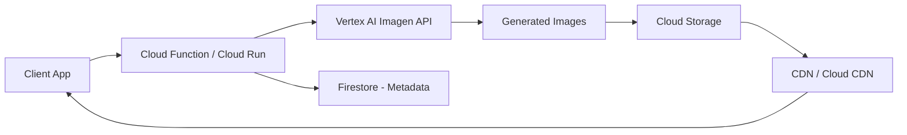

# How to Implement Image Generation with Imagen on Vertex AI

Author: [nawazdhandala](https://www.github.com/nawazdhandala)

Tags: GCP, Vertex AI, Imagen, Image Generation, AI, Machine Learning, Google Cloud

Description: Learn how to implement image generation using Google's Imagen model on Vertex AI, including setup, prompt engineering, and production deployment patterns.

---

Image generation has gone from a research curiosity to a practical tool that product teams use daily. Whether you need to generate marketing assets, product mockups, or creative content, Google's Imagen model on Vertex AI gives you a production-ready API that handles the heavy lifting. In this guide, I will walk you through setting up Imagen, crafting effective prompts, and building a robust image generation pipeline.

## What is Imagen on Vertex AI?

Imagen is Google's text-to-image diffusion model, available through the Vertex AI platform. Unlike running your own Stable Diffusion instance on a GPU, Imagen is a managed service - you send a text prompt, and you get back generated images. No infrastructure to manage, no model weights to download, and no CUDA driver headaches.

The model supports several capabilities:

- Text-to-image generation
- Image editing and inpainting
- Image upscaling
- Product recontextualization and customization

## Prerequisites

Before you start, make sure you have these in place:

1. A Google Cloud project with billing enabled
2. The Vertex AI API enabled
3. The `gcloud` CLI installed and authenticated
4. Python 3.9 or later

Enable the required API with this command:

```bash
# Enable the Vertex AI API for your project

gcloud services enable aiplatform.googleapis.com --project=your-project-id
```

## Setting Up Your Environment

Start by installing the required Python packages:

```bash
# Install the Google Gen AI SDK and production helper libraries
pip install google-genai Pillow google-cloud-storage functions-framework
```

Now set up authentication. The simplest approach during development is application default credentials:

```bash
# Authenticate with your Google account for local development
gcloud auth application-default login
```

## Basic Image Generation

Here is a straightforward example that generates an image from a text prompt:

```python
from google import genai
from google.genai import types

# Initialize the Gen AI SDK for Vertex AI with your project and region
client = genai.Client(vertexai=True, project="your-project-id", location="us-central1")

# Generate images from a text prompt
# number_of_images controls how many variations you get back
response = client.models.generate_images(
    model="imagen-3.0-generate-001",
    prompt="A modern office building at sunset, photorealistic, warm lighting",
    config=types.GenerateImagesConfig(
        number_of_images=4,
        aspect_ratio="16:9",
        safety_filter_level=types.SafetyFilterLevel.BLOCK_ONLY_HIGH,
    ),
)

# Save each generated image to disk
for idx, generated_image in enumerate(response.generated_images):
    generated_image.image.save(f"generated_image_{idx}.png")
    print(f"Saved generated_image_{idx}.png")
```

This gives you four variations of the same prompt. Each call to `generate_images` produces unique results, so you can run it multiple times to get more options.

## Prompt Engineering for Better Results

The quality of your output depends heavily on the prompt. Here are patterns that consistently produce better results with Imagen:

**Be specific about style and medium.** Instead of "a cat," try "a tabby cat in watercolor style with soft pastel colors." The model responds well to explicit art direction.

**Include lighting and composition details.** Terms like "golden hour lighting," "bird's eye view," or "shallow depth of field" help the model understand what you want.

**Use negative prompts to exclude unwanted elements.** You can specify what you do not want in the output:

```python
# Use negative_prompt to steer the model away from unwanted elements
response = client.models.generate_images(
    model="imagen-3.0-generate-001",
    prompt="A clean minimalist workspace with a laptop, natural lighting, professional photography",
    config=types.GenerateImagesConfig(
        negative_prompt="clutter, mess, dark, blurry, low quality",
        number_of_images=2,
        aspect_ratio="16:9",
    ),
)
```

## Image Editing and Inpainting

Imagen also supports editing existing images. You can provide a base image and a mask to tell the model which region to modify:

```python
from google.genai.types import RawReferenceImage, MaskReferenceImage

# Load the source image and the mask that defines the edit region
base_image = types.Image.from_file(location="source_photo.png")
mask_image = types.Image.from_file(location="mask.png")

raw_ref = RawReferenceImage(reference_image=base_image, reference_id=1)
mask_ref = MaskReferenceImage(
    reference_image=mask_image,
    reference_id=2,
    config=types.MaskReferenceConfig(mask_mode="MASK_MODE_USER_PROVIDED"),
)

# Edit the masked region based on the text prompt
response = client.models.edit_image(
    model="imagen-3.0-capability-001",
    prompt="Replace the background with a tropical beach scene",
    reference_images=[raw_ref, mask_ref],
    config=types.EditImageConfig(
        edit_mode="EDIT_MODE_BGSWAP",
        number_of_images=2,
    ),
)

for idx, generated_image in enumerate(response.generated_images):
    generated_image.image.save(f"edited_{idx}.png")
```

The mask should be a black-and-white image where non-zero pixels indicate the areas you want to edit. Everything in black stays unchanged.

## Building a Production Pipeline

For production use, you will want to wrap this in a proper service with error handling, retry logic, and storage integration. Here is a Cloud Function that generates images and stores them in Cloud Storage:

```python
import functions_framework
from google.cloud import storage
from google import genai
from google.genai import types
import uuid
import json

# Initialize clients once at module level to reuse across invocations
client = genai.Client(vertexai=True, project="your-project-id", location="us-central1")
storage_client = storage.Client()

@functions_framework.http
def generate_image(request):
    """HTTP Cloud Function that generates images and stores them in GCS."""
    request_json = request.get_json(silent=True)

    if not request_json or "prompt" not in request_json:
        return json.dumps({"error": "Missing prompt in request body"}), 400

    prompt = request_json["prompt"]
    num_images = request_json.get("num_images", 1)
    aspect_ratio = request_json.get("aspect_ratio", "1:1")

    try:
        # Generate the images using Imagen
        response = client.models.generate_images(
            model="imagen-3.0-generate-001",
            prompt=prompt,
            config=types.GenerateImagesConfig(
                number_of_images=num_images,
                aspect_ratio=aspect_ratio,
                safety_filter_level=types.SafetyFilterLevel.BLOCK_MEDIUM_AND_ABOVE,
            ),
        )

        # Upload each generated image to Cloud Storage
        bucket = storage_client.bucket("your-image-bucket")
        urls = []

        for generated_image in response.generated_images:
            blob_name = f"generated/{uuid.uuid4()}.png"
            blob = bucket.blob(blob_name)

            # Save image to a temp file, then upload
            temp_path = f"/tmp/{uuid.uuid4()}.png"
            generated_image.image.save(temp_path)
            blob.upload_from_filename(temp_path)

            # Make the blob publicly readable if needed
            urls.append(f"gs://your-image-bucket/{blob_name}")

        return json.dumps({"images": urls}), 200

    except Exception as e:
        return json.dumps({"error": str(e)}), 500
```

## Handling Rate Limits and Quotas

Vertex AI has quotas on Imagen API calls. In production, you need to handle rate limiting gracefully:

```python
import time
from google.genai import errors

# Custom retry predicate that retries on rate limit errors
def is_rate_limit_error(exception):
    return isinstance(exception, errors.APIError) and exception.code == 429

def generate_with_retry(client, prompt, **kwargs):
    """Generate images with automatic retry on rate limit errors."""
    delay = 1.0
    deadline = time.monotonic() + 300.0

    while True:
        try:
            return client.models.generate_images(
                model="imagen-3.0-generate-001",
                prompt=prompt,
                **kwargs,
            )
        except errors.APIError as exc:
            if not is_rate_limit_error(exc) or time.monotonic() + delay > deadline:
                raise

            time.sleep(delay)
            delay = min(delay * 2.0, 60.0)
```

## Cost Considerations

Imagen pricing on Vertex AI is per-image generated. As of early 2026, expect roughly $0.02-0.04 per standard resolution image, with higher costs for upscaled or edited images. A few tips to manage costs:

- Cache generated images aggressively - do not regenerate the same prompt twice
- Use lower `number_of_images` values during development
- Set up billing alerts in the Cloud Console
- Consider generating at standard resolution first, then upscaling only the images you actually use

## Architecture Overview

Here is how a typical image generation pipeline fits together:


```mermaid
graph LR
    A[Client App] --> B[Cloud Function / Cloud Run]
    B --> C[Vertex AI Imagen API]
    C --> D[Generated Images]
    D --> E[Cloud Storage]
    E --> F[CDN / Cloud CDN]
    F --> A
    B --> G[Firestore - Metadata]
```

## Safety and Content Filtering

Imagen includes built-in safety filters. You can control the filter strictness using the `safety_filter_level` parameter:

- `BLOCK_ONLY_HIGH` - Only blocks the most harmful content
- `BLOCK_MEDIUM_AND_ABOVE` - Balanced filtering (recommended for most use cases)
- `BLOCK_LOW_AND_ABOVE` - Aggressive filtering

For enterprise applications, you should also implement your own content review layer on top of the built-in filters, especially if user-submitted prompts are involved.

## Monitoring Your Pipeline

Once your image generation pipeline is in production, set up monitoring with Cloud Monitoring to track API latency, error rates, and quota usage. Create alerts for when you approach your quota limits so you can request increases before hitting a wall.

Use OneUptime to monitor the overall health of your image generation service, including endpoint availability, response times, and error rates across your entire pipeline.

## Wrapping Up

Imagen on Vertex AI gives you a solid foundation for building image generation features without managing GPU infrastructure. The key points to remember: use specific, descriptive prompts for better results, implement proper retry logic for production workloads, and always cache generated images to control costs. Start with the basic generation example, validate that the output quality meets your needs, and then build out the production pipeline from there.
