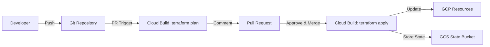

# How to Implement Infrastructure as Code Deployment Pipelines Using Cloud Build and Terraform on GCP

Author: [nawazdhandala](https://www.github.com/nawazdhandala)

Tags: GCP, Terraform, Cloud Build, Infrastructure as Code, CI/CD

Description: Learn how to build automated infrastructure deployment pipelines on GCP using Cloud Build and Terraform with proper state management and approval workflows.

---

Managing GCP infrastructure by clicking through the console does not scale. When you have dozens of projects, hundreds of resources, and a team of engineers, you need infrastructure defined as code, reviewed through pull requests, and deployed through automated pipelines. Terraform and Cloud Build together give you exactly that.

In this post, I will show you how to build a production-ready Terraform deployment pipeline using Cloud Build, with remote state management, plan review, and proper approval gates.

## Architecture Overview



## Step 1: Set Up Remote State Storage

Terraform state should be stored remotely in a GCS bucket with versioning and locking:

```bash
# Create a bucket for Terraform state
gsutil mb -l us-central1 gs://my-project-terraform-state

# Enable versioning for state recovery
gsutil versioning set on gs://my-project-terraform-state

# Create a table for state locking (using Cloud Storage locking, not DynamoDB)
# GCS handles locking natively for Terraform
```

Configure the Terraform backend:

```hcl
# terraform/backend.tf
terraform {
  backend "gcs" {
    bucket = "my-project-terraform-state"
    prefix = "infrastructure"
  }

  required_version = ">= 1.5.0"

  required_providers {
    google = {
      source  = "hashicorp/google"
      version = "~> 5.0"
    }
    google-beta = {
      source  = "hashicorp/google-beta"
      version = "~> 5.0"
    }
  }
}
```

## Step 2: Organize Your Terraform Code

Structure your Terraform code with modules and environment-specific configurations:

```
terraform/
  modules/
    networking/
      main.tf
      variables.tf
      outputs.tf
    gke/
      main.tf
      variables.tf
      outputs.tf
    cloud-sql/
      main.tf
      variables.tf
      outputs.tf
  environments/
    dev/
      main.tf
      variables.tf
      terraform.tfvars
      backend.tf
    staging/
      main.tf
      variables.tf
      terraform.tfvars
      backend.tf
    production/
      main.tf
      variables.tf
      terraform.tfvars
      backend.tf
```

Here is an example environment configuration:

```hcl
# terraform/environments/production/main.tf
module "networking" {
  source = "../../modules/networking"

  project_id   = var.project_id
  region       = var.region
  network_name = "production-vpc"
  subnets = [
    {
      name          = "app-subnet"
      ip_cidr_range = "10.0.0.0/20"
      region        = var.region
    },
    {
      name          = "gke-subnet"
      ip_cidr_range = "10.1.0.0/20"
      region        = var.region
      secondary_ranges = {
        pods     = "10.4.0.0/14"
        services = "10.8.0.0/20"
      }
    }
  ]
}

module "gke" {
  source = "../../modules/gke"

  project_id   = var.project_id
  region       = var.region
  cluster_name = "production-cluster"
  network      = module.networking.network_id
  subnet       = module.networking.subnet_ids["gke-subnet"]

  min_nodes = 3
  max_nodes = 20
  machine_type = "e2-standard-4"
}

module "cloud_sql" {
  source = "../../modules/cloud-sql"

  project_id    = var.project_id
  region        = var.region
  instance_name = "production-db"
  tier          = "db-custom-4-16384"
  network       = module.networking.network_id

  high_availability = true
  backup_enabled    = true
}
```

```hcl
# terraform/environments/production/terraform.tfvars
project_id = "my-app-production"
region     = "us-central1"
```

## Step 3: Create the Cloud Build Pipeline

Build two pipeline configurations - one for plan (on PRs) and one for apply (on merge):

```yaml
# cloudbuild-plan.yaml - Runs on pull requests
steps:
  # Validate Terraform formatting
  - name: 'hashicorp/terraform:1.7'
    entrypoint: 'sh'
    args:
      - '-c'
      - |
        cd terraform/environments/$_ENVIRONMENT
        terraform fmt -check -recursive
        if [ $? -ne 0 ]; then
          echo "Terraform formatting check failed. Run 'terraform fmt' locally."
          exit 1
        fi
    id: 'fmt-check'

  # Initialize Terraform
  - name: 'hashicorp/terraform:1.7'
    entrypoint: 'sh'
    args:
      - '-c'
      - |
        cd terraform/environments/$_ENVIRONMENT
        terraform init -input=false
    id: 'init'

  # Validate configuration
  - name: 'hashicorp/terraform:1.7'
    entrypoint: 'sh'
    args:
      - '-c'
      - |
        cd terraform/environments/$_ENVIRONMENT
        terraform validate
    id: 'validate'
    waitFor: ['init']

  # Run terraform plan and save output
  - name: 'hashicorp/terraform:1.7'
    entrypoint: 'sh'
    args:
      - '-c'
      - |
        cd terraform/environments/$_ENVIRONMENT
        terraform plan -input=false -out=tfplan 2>&1 | tee /workspace/plan_output.txt

        # Generate a summary
        echo "---" >> /workspace/plan_output.txt
        terraform show -no-color tfplan | grep -E "Plan:|No changes" >> /workspace/plan_summary.txt 2>/dev/null || echo "Plan completed" >> /workspace/plan_summary.txt
    id: 'plan'
    waitFor: ['validate']

  # Run tfsec for security analysis
  - name: 'aquasec/tfsec:latest'
    entrypoint: 'sh'
    args:
      - '-c'
      - |
        tfsec terraform/environments/$_ENVIRONMENT \
          --format=json \
          --out=/workspace/tfsec_results.json \
          --soft-fail
        echo "Security scan complete"
    id: 'security-scan'
    waitFor: ['init']

  # Post plan output as a PR comment
  - name: 'gcr.io/cloud-builders/gcloud'
    entrypoint: 'bash'
    args:
      - '-c'
      - |
        if [ -n "$_PR_NUMBER" ]; then
          PLAN_SUMMARY=$(cat /workspace/plan_summary.txt)
          TFSEC_SUMMARY=$(cat /workspace/tfsec_results.json | jq '.results | length')

          # Post comment to the PR using the GitHub API
          COMMENT="### Terraform Plan - $_ENVIRONMENT\n\n\`\`\`\n$PLAN_SUMMARY\n\`\`\`\n\nSecurity findings: $TFSEC_SUMMARY\n\nFull plan output available in [Cloud Build logs](https://console.cloud.google.com/cloud-build/builds/$BUILD_ID)"

          echo "$COMMENT"
        fi
    id: 'comment'
    waitFor: ['plan', 'security-scan']

substitutions:
  _ENVIRONMENT: dev
  _PR_NUMBER: ""
```

```yaml
# cloudbuild-apply.yaml - Runs on merge to main
steps:
  # Initialize Terraform
  - name: 'hashicorp/terraform:1.7'
    entrypoint: 'sh'
    args:
      - '-c'
      - |
        cd terraform/environments/$_ENVIRONMENT
        terraform init -input=false
    id: 'init'

  # Plan again to ensure consistency
  - name: 'hashicorp/terraform:1.7'
    entrypoint: 'sh'
    args:
      - '-c'
      - |
        cd terraform/environments/$_ENVIRONMENT
        terraform plan -input=false -out=tfplan
    id: 'plan'
    waitFor: ['init']

  # Apply the plan
  - name: 'hashicorp/terraform:1.7'
    entrypoint: 'sh'
    args:
      - '-c'
      - |
        cd terraform/environments/$_ENVIRONMENT
        terraform apply -input=false -auto-approve tfplan
    id: 'apply'
    waitFor: ['plan']

  # Verify the applied state
  - name: 'hashicorp/terraform:1.7'
    entrypoint: 'sh'
    args:
      - '-c'
      - |
        cd terraform/environments/$_ENVIRONMENT
        terraform output -json > /workspace/outputs.json
        echo "Applied successfully. Outputs:"
        cat /workspace/outputs.json | jq .
    id: 'verify'
    waitFor: ['apply']

substitutions:
  _ENVIRONMENT: dev

options:
  logging: CLOUD_LOGGING_ONLY
```

## Step 4: Set Up Cloud Build Triggers

Create triggers for each environment:

```bash
# Plan trigger for PRs (all environments)
gcloud builds triggers create github \
  --name="terraform-plan-dev" \
  --repo-name=infrastructure \
  --repo-owner=my-org \
  --pull-request-pattern="^main$" \
  --build-config=cloudbuild-plan.yaml \
  --substitutions="_ENVIRONMENT=dev" \
  --included-files="terraform/environments/dev/**,terraform/modules/**"

gcloud builds triggers create github \
  --name="terraform-plan-production" \
  --repo-name=infrastructure \
  --repo-owner=my-org \
  --pull-request-pattern="^main$" \
  --build-config=cloudbuild-plan.yaml \
  --substitutions="_ENVIRONMENT=production" \
  --included-files="terraform/environments/production/**,terraform/modules/**"

# Apply trigger for merges to main
gcloud builds triggers create github \
  --name="terraform-apply-dev" \
  --repo-name=infrastructure \
  --repo-owner=my-org \
  --branch-pattern="^main$" \
  --build-config=cloudbuild-apply.yaml \
  --substitutions="_ENVIRONMENT=dev" \
  --included-files="terraform/environments/dev/**,terraform/modules/**"

# Production apply with manual approval
gcloud builds triggers create github \
  --name="terraform-apply-production" \
  --repo-name=infrastructure \
  --repo-owner=my-org \
  --branch-pattern="^main$" \
  --build-config=cloudbuild-apply.yaml \
  --substitutions="_ENVIRONMENT=production" \
  --included-files="terraform/environments/production/**,terraform/modules/**" \
  --require-approval
```

## Step 5: Grant Cloud Build Proper Permissions

Cloud Build needs permissions to manage GCP resources:

```bash
# Get the Cloud Build service account
PROJECT_NUMBER=$(gcloud projects describe my-project --format='value(projectNumber)')
CB_SA="${PROJECT_NUMBER}@cloudbuild.gserviceaccount.com"

# Grant broad infrastructure management roles
# Scope these down based on what Terraform actually manages
gcloud projects add-iam-policy-binding my-project \
  --member="serviceAccount:$CB_SA" \
  --role="roles/editor"

# Grant access to the state bucket
gsutil iam ch "serviceAccount:$CB_SA:roles/storage.admin" gs://my-project-terraform-state

# For cross-project deployments, grant permissions in each project
gcloud projects add-iam-policy-binding my-app-production \
  --member="serviceAccount:$CB_SA" \
  --role="roles/editor"
```

## Step 6: Add Policy Checks

Use Open Policy Agent (OPA) or Sentinel to enforce infrastructure policies:

```bash
# Install conftest for OPA policy testing
# Add this step to the plan pipeline

# Example policy: all GKE clusters must have private nodes
# policy/gke.rego
cat > policy/gke.rego << 'EOF'
package main

deny[msg] {
  resource := input.resource_changes[_]
  resource.type == "google_container_cluster"
  not resource.change.after.private_cluster_config
  msg := sprintf("GKE cluster '%s' must use private cluster config", [resource.name])
}

deny[msg] {
  resource := input.resource_changes[_]
  resource.type == "google_container_cluster"
  resource.change.after.private_cluster_config.enable_private_nodes != true
  msg := sprintf("GKE cluster '%s' must have private nodes enabled", [resource.name])
}
EOF
```

## Wrapping Up

Terraform deployment pipelines with Cloud Build give you automated, auditable infrastructure changes. PRs show the plan output so reviewers know exactly what will change. Security scanning catches misconfigurations before they are applied. And approval gates on production deployments ensure that changes are intentional.

The investment in setting up this pipeline pays for itself the first time it prevents an unintended infrastructure change from reaching production. Start with one environment, get the pipeline working reliably, then extend it to staging and production with appropriate approval gates.
