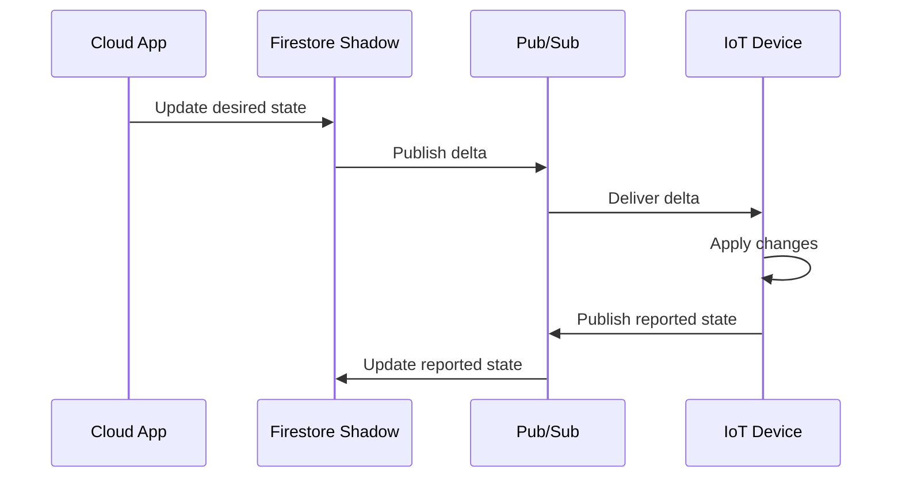

# How to Implement IoT Device Shadow Patterns on Google Cloud Using Firestore and Pub/Sub

Author: [nawazdhandala](https://www.github.com/nawazdhandala)

Tags: GCP, IoT, Firestore, Pub/Sub, Device Shadow

Description: Implement the device shadow pattern on Google Cloud using Firestore for state storage and Pub/Sub for state synchronization between cloud and devices.

---

The device shadow (sometimes called device twin) is a pattern that solves a fundamental problem in IoT: your devices are not always online. When a user changes a setting in your application, the device might be asleep, disconnected, or in a tunnel. The shadow acts as a persistent, cloud-side representation of the device's state. When the device reconnects, it syncs with its shadow.

AWS has IoT Device Shadows. Azure has Device Twins. On Google Cloud, you build your own using Firestore and Pub/Sub. This gives you full control over the state model and synchronization logic.

## How the Shadow Pattern Works

Every device has two state representations:

- **Reported state**: What the device says its current state is (e.g., "thermostat is set to 72F")
- **Desired state**: What the cloud wants the device state to be (e.g., "set thermostat to 68F")

When there is a difference between reported and desired state, the delta tells the device what it needs to change. When the device makes the change, it updates its reported state to match.



## Prerequisites

- GCP project with Firestore and Pub/Sub APIs enabled
- Firestore database in Native mode
- Python 3.8+

## Step 1: Set Up the Pub/Sub Topics

Create topics for state synchronization:

```bash
# Topic for desired state changes (cloud to device)
gcloud pubsub topics create device-desired-state

# Topic for reported state updates (device to cloud)
gcloud pubsub topics create device-reported-state

# Topic for delta notifications (computed differences)
gcloud pubsub topics create device-state-delta

# Subscriptions for each direction
gcloud pubsub subscriptions create device-desired-state-sub \
  --topic=device-desired-state

gcloud pubsub subscriptions create device-reported-state-sub \
  --topic=device-reported-state

gcloud pubsub subscriptions create device-state-delta-sub \
  --topic=device-state-delta
```

## Step 2: Define the Shadow Document Structure

In Firestore, each device gets a document in the `device_shadows` collection:

```python
# shadow_model.py - Defines the device shadow data structure

SHADOW_TEMPLATE = {
    "device_id": "",
    "state": {
        "desired": {},     # What the cloud wants
        "reported": {},    # What the device reports
        "delta": {},       # Computed difference
    },
    "metadata": {
        "desired": {},     # Timestamps for each desired field
        "reported": {},    # Timestamps for each reported field
    },
    "version": 0,          # Incremented on every update
    "last_updated": None,   # Server timestamp of last change
    "connected": False,     # Whether device is currently online
}
```

## Step 3: Build the Shadow Service

This is the core logic that manages shadow state in Firestore:

```python
# shadow_service.py - Core shadow state management logic

from google.cloud import firestore
from google.cloud import pubsub_v1
import json
import time
from copy import deepcopy

db = firestore.Client()
publisher = pubsub_v1.PublisherClient()

PROJECT_ID = "your-project-id"
SHADOWS_COLLECTION = "device_shadows"

def compute_delta(desired, reported):
    """Computes the difference between desired and reported state.
    Returns only the fields that differ, which tells the device
    what it needs to change."""
    delta = {}
    for key, value in desired.items():
        if key not in reported or reported[key] != value:
            delta[key] = value
    return delta

def get_shadow(device_id):
    """Retrieves the current shadow document for a device.
    Creates a new shadow if one does not exist."""
    doc_ref = db.collection(SHADOWS_COLLECTION).document(device_id)
    doc = doc_ref.get()

    if doc.exists:
        return doc.to_dict()

    # Create a new shadow for an unregistered device
    shadow = deepcopy(SHADOW_TEMPLATE)
    shadow["device_id"] = device_id
    shadow["last_updated"] = firestore.SERVER_TIMESTAMP
    doc_ref.set(shadow)
    return shadow

def update_desired_state(device_id, desired_updates):
    """Updates the desired state from a cloud application.
    Computes the delta and notifies the device via Pub/Sub.

    Args:
        device_id: The device to update
        desired_updates: Dict of desired state changes
    """
    doc_ref = db.collection(SHADOWS_COLLECTION).document(device_id)

    # Use a transaction to safely read-modify-write
    @firestore.transactional
    def update_in_transaction(transaction):
        doc = doc_ref.get(transaction=transaction)
        shadow = doc.to_dict() if doc.exists else deepcopy(SHADOW_TEMPLATE)

        # Merge the desired updates into existing desired state
        current_desired = shadow.get("state", {}).get("desired", {})
        current_desired.update(desired_updates)

        # Compute the new delta
        current_reported = shadow.get("state", {}).get("reported", {})
        delta = compute_delta(current_desired, current_reported)

        # Update timestamps for changed desired fields
        now = time.time()
        metadata_desired = shadow.get("metadata", {}).get("desired", {})
        for key in desired_updates:
            metadata_desired[key] = now

        # Write the updated shadow
        transaction.update(doc_ref, {
            "state.desired": current_desired,
            "state.delta": delta,
            "metadata.desired": metadata_desired,
            "version": firestore.Increment(1),
            "last_updated": firestore.SERVER_TIMESTAMP,
        })

        return delta

    transaction = db.transaction()
    delta = update_in_transaction(transaction)

    # Notify the device about the state change via Pub/Sub
    if delta:
        topic_path = publisher.topic_path(PROJECT_ID, "device-state-delta")
        message = {
            "device_id": device_id,
            "delta": delta,
            "timestamp": int(time.time() * 1000),
        }
        publisher.publish(
            topic_path,
            data=json.dumps(message).encode("utf-8"),
            device_id=device_id,
        )

    return delta

def update_reported_state(device_id, reported_updates):
    """Updates the reported state from a device.
    Recalculates the delta after the device reports its actual state.

    Args:
        device_id: The device reporting its state
        reported_updates: Dict of reported state values
    """
    doc_ref = db.collection(SHADOWS_COLLECTION).document(device_id)

    @firestore.transactional
    def update_in_transaction(transaction):
        doc = doc_ref.get(transaction=transaction)
        shadow = doc.to_dict() if doc.exists else deepcopy(SHADOW_TEMPLATE)

        # Merge the reported updates
        current_reported = shadow.get("state", {}).get("reported", {})
        current_reported.update(reported_updates)

        # Recalculate delta with updated reported state
        current_desired = shadow.get("state", {}).get("desired", {})
        delta = compute_delta(current_desired, current_reported)

        # Update timestamps for reported fields
        now = time.time()
        metadata_reported = shadow.get("metadata", {}).get("reported", {})
        for key in reported_updates:
            metadata_reported[key] = now

        transaction.update(doc_ref, {
            "state.reported": current_reported,
            "state.delta": delta,
            "metadata.reported": metadata_reported,
            "version": firestore.Increment(1),
            "last_updated": firestore.SERVER_TIMESTAMP,
        })

        return delta

    transaction = db.transaction()
    return update_in_transaction(transaction)
```

## Step 4: Cloud Function for Processing Reported State

When a device publishes its reported state to Pub/Sub, a Cloud Function updates the shadow:

```python
# process_reported_state.py - Cloud Function triggered by device state reports

import json
import functions_framework
from shadow_service import update_reported_state

@functions_framework.cloud_event
def process_reported(cloud_event):
    """Processes reported state updates from devices.
    Triggered by messages on the device-reported-state topic."""

    import base64

    data = base64.b64decode(cloud_event.data["message"]["data"])
    message = json.loads(data)

    device_id = message.get("device_id")
    reported = message.get("state", {})

    if device_id and reported:
        delta = update_reported_state(device_id, reported)
        if not delta:
            print(f"Device {device_id} is now in sync")
        else:
            print(f"Device {device_id} still has pending changes: {delta}")
```

## Step 5: Device-Side Shadow Sync

Here is the device-side code that syncs with its cloud shadow:

```python
# device_shadow_client.py - Runs on the IoT device

import json
import time
from google.cloud import pubsub_v1

class DeviceShadowClient:
    """Client that runs on the device to sync state with the cloud shadow."""

    def __init__(self, project_id, device_id):
        self.project_id = project_id
        self.device_id = device_id
        self.publisher = pubsub_v1.PublisherClient()
        self.subscriber = pubsub_v1.SubscriberClient()
        self.local_state = {}

    def report_state(self, state_updates):
        """Reports the device's current state to the cloud shadow."""
        self.local_state.update(state_updates)

        topic = self.publisher.topic_path(
            self.project_id, "device-reported-state"
        )
        message = {
            "device_id": self.device_id,
            "state": state_updates,
            "timestamp": int(time.time() * 1000),
        }
        self.publisher.publish(
            topic, data=json.dumps(message).encode("utf-8")
        )

    def handle_delta(self, message):
        """Handles incoming delta messages from the cloud.
        The device should apply these changes and report back."""
        data = json.loads(message.data.decode("utf-8"))

        if data.get("device_id") != self.device_id:
            message.nack()
            return

        delta = data.get("delta", {})
        print(f"Received desired state changes: {delta}")

        # Apply the changes locally
        applied = self.apply_state_changes(delta)

        # Report back what was actually applied
        self.report_state(applied)
        message.ack()

    def apply_state_changes(self, delta):
        """Applies desired state changes to the device hardware.
        Override this method with your actual device control logic."""
        applied = {}
        for key, value in delta.items():
            # This is where you would control actual hardware
            print(f"  Setting {key} = {value}")
            applied[key] = value
        return applied

    def start_listening(self):
        """Starts listening for delta messages from the cloud."""
        sub_path = self.subscriber.subscription_path(
            self.project_id, "device-state-delta-sub"
        )
        self.subscriber.subscribe(sub_path, callback=self.handle_delta)
        print(f"Device {self.device_id} listening for state changes")
```

## Real-World Example

Imagine a smart thermostat. A user sets the temperature to 68F via the app:

1. App calls `update_desired_state("thermo-001", {"temperature": 68})`
2. Shadow computes delta: `{"temperature": 68}` (device was at 72)
3. Delta message sent via Pub/Sub
4. Device receives delta, adjusts thermostat, reports `{"temperature": 68}`
5. Shadow updates reported state, delta becomes empty
6. Device and cloud are in sync

If the device was offline during step 3, the delta persists in Firestore. When the device reconnects and checks its shadow, it picks up the pending change.

## Wrapping Up

The device shadow pattern is essential for any production IoT system where devices go offline. Building it on Firestore and Pub/Sub gives you real-time synchronization with Firestore's snapshot listeners, durable state storage, and the scalability of Pub/Sub for message delivery. The Firestore transaction support ensures you never lose state updates even under concurrent modifications from multiple sources.
