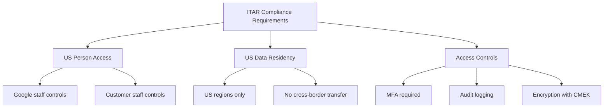

# How to Implement ITAR Compliance for Defense Workloads on Google Cloud

Author: [nawazdhandala](https://www.github.com/nawazdhandala)

Tags: GCP, ITAR, Compliance, Defense, Assured Workloads

Description: A guide to implementing ITAR compliance for defense workloads on Google Cloud using Assured Workloads and additional security controls for regulated data.

---

ITAR (International Traffic in Arms Regulations) governs the export of defense articles, services, and technical data. If your organization handles ITAR-controlled data, you need to ensure that only US persons can access it and that the data never leaves US jurisdiction - even accidentally through a cloud misconfiguration. Google Cloud supports ITAR compliance through Assured Workloads with the IL4 (Impact Level 4) compliance regime, which covers both ITAR and CUI (Controlled Unclassified Information) requirements.

This post covers the specific steps to set up and maintain an ITAR-compliant environment on Google Cloud.

## Understanding ITAR Requirements on Cloud

ITAR compliance on cloud platforms comes down to three core requirements:

1. **US person access only** - Only US citizens and permanent residents can access ITAR data and the infrastructure that processes it
2. **US jurisdiction only** - Data must be stored and processed within the United States
3. **Access controls** - Strong authentication, authorization, and audit logging



## Step 1: Create an Assured Workloads Environment for ITAR

Google Cloud's Assured Workloads with the IL4 compliance regime satisfies the infrastructure requirements for ITAR:

```bash
# Enable the Assured Workloads API
gcloud services enable assuredworkloads.googleapis.com

# Create an Assured Workloads folder with IL4 compliance
# IL4 covers ITAR and CUI requirements
gcloud assured workloads create \
    --organization=123456789 \
    --location=us \
    --display-name="ITAR Defense Workloads" \
    --compliance-regime=IL4 \
    --billing-account=BILLING_ACCOUNT_ID \
    --next-rotation-time="2026-03-01T00:00:00Z" \
    --rotation-period=7776000s \
    --labels="compliance=itar,classification=cui"
```

When you create an IL4 workload, Google Cloud automatically:
- Restricts resources to US regions
- Ensures only US-person Google staff can access the infrastructure
- Applies organization policies that prevent non-compliant configurations
- Configures encryption to meet FIPS 140-2 requirements

## Step 2: Create Projects for ITAR Workloads

```bash
# Create the main application project under the Assured Workloads folder
gcloud projects create itar-app-prod \
    --folder=ASSURED_WORKLOAD_FOLDER_ID

gcloud billing projects link itar-app-prod \
    --billing-account=BILLING_ACCOUNT_ID

# Create a separate project for shared services
gcloud projects create itar-shared-services \
    --folder=ASSURED_WORKLOAD_FOLDER_ID

gcloud billing projects link itar-shared-services \
    --billing-account=BILLING_ACCOUNT_ID

# Enable necessary APIs
gcloud services enable \
    compute.googleapis.com \
    container.googleapis.com \
    storage.googleapis.com \
    cloudkms.googleapis.com \
    logging.googleapis.com \
    monitoring.googleapis.com \
    secretmanager.googleapis.com \
    --project=itar-app-prod
```

## Step 3: Configure HSM-Backed Encryption Keys

ITAR data must be encrypted with FIPS 140-2 Level 3 validated modules. Cloud HSM keys satisfy this requirement:

```bash
# Create a keyring in the US multi-region
gcloud kms keyrings create itar-keyring \
    --location=us \
    --project=itar-shared-services

# Create HSM-backed encryption keys for different data types
# Key for general data encryption
gcloud kms keys create itar-data-key \
    --keyring=itar-keyring \
    --location=us \
    --purpose=encryption \
    --protection-level=hsm \
    --rotation-period=90d \
    --next-rotation-time="2026-03-01T00:00:00Z" \
    --project=itar-shared-services

# Key for secrets and credentials
gcloud kms keys create itar-secrets-key \
    --keyring=itar-keyring \
    --location=us \
    --purpose=encryption \
    --protection-level=hsm \
    --rotation-period=90d \
    --next-rotation-time="2026-03-01T00:00:00Z" \
    --project=itar-shared-services

# Key for log data
gcloud kms keys create itar-logs-key \
    --keyring=itar-keyring \
    --location=us \
    --purpose=encryption \
    --protection-level=hsm \
    --rotation-period=90d \
    --next-rotation-time="2026-03-01T00:00:00Z" \
    --project=itar-shared-services
```

## Step 4: Enforce Organization Policies

While Assured Workloads sets baseline policies, add additional ones for ITAR:

```bash
# Restrict resource locations to US only
gcloud resource-manager org-policies set-policy - \
    --folder=ASSURED_WORKLOAD_FOLDER_ID <<'EOF'
constraint: constraints/gcp.resourceLocations
listPolicy:
  allowedValues:
    - "in:us-locations"
EOF

# Require CMEK for all services
gcloud resource-manager org-policies set-policy - \
    --folder=ASSURED_WORKLOAD_FOLDER_ID <<'EOF'
constraint: constraints/gcp.restrictNonCmekServices
listPolicy:
  deniedValues:
    - "compute.googleapis.com"
    - "storage.googleapis.com"
    - "bigquery.googleapis.com"
    - "container.googleapis.com"
    - "sqladmin.googleapis.com"
EOF

# Disable external IP addresses on VMs
gcloud resource-manager org-policies enable-enforce \
    compute.vmExternalIpAccess \
    --folder=ASSURED_WORKLOAD_FOLDER_ID

# Disable serial port access
gcloud resource-manager org-policies enable-enforce \
    compute.disableSerialPortAccess \
    --folder=ASSURED_WORKLOAD_FOLDER_ID

# Require OS Login for SSH
gcloud resource-manager org-policies enable-enforce \
    compute.requireOsLogin \
    --folder=ASSURED_WORKLOAD_FOLDER_ID

# Prevent public access to storage buckets
gcloud resource-manager org-policies enable-enforce \
    storage.uniformBucketLevelAccess \
    --folder=ASSURED_WORKLOAD_FOLDER_ID

gcloud resource-manager org-policies enable-enforce \
    storage.publicAccessPrevention \
    --folder=ASSURED_WORKLOAD_FOLDER_ID
```

## Step 5: Network Isolation

ITAR workloads need strict network isolation:

```bash
# Create an isolated VPC for ITAR workloads
gcloud compute networks create itar-vpc \
    --project=itar-app-prod \
    --subnet-mode=custom

# Create subnets with private access and flow logs
gcloud compute networks subnets create itar-subnet-east \
    --project=itar-app-prod \
    --network=itar-vpc \
    --region=us-east4 \
    --range=10.0.0.0/20 \
    --enable-private-ip-google-access \
    --enable-flow-logs \
    --logging-flow-sampling=1.0 \
    --logging-metadata=include-all

# Create a Cloud NAT for outbound access (no public IPs on VMs)
gcloud compute routers create itar-router \
    --project=itar-app-prod \
    --network=itar-vpc \
    --region=us-east4

gcloud compute routers nats create itar-nat \
    --project=itar-app-prod \
    --router=itar-router \
    --region=us-east4 \
    --nat-all-subnet-ip-ranges \
    --auto-allocate-nat-external-ips \
    --enable-logging

# Set up VPC Service Controls
gcloud access-context-manager perimeters create itar-perimeter \
    --policy=POLICY_ID \
    --title="ITAR Service Perimeter" \
    --resources="projects/ITAR_PROJECT_NUMBER" \
    --restricted-services="storage.googleapis.com,bigquery.googleapis.com,compute.googleapis.com,container.googleapis.com,secretmanager.googleapis.com"
```

## Step 6: Access Control and Identity

ITAR requires that only US persons access the data. Implement this at the organizational level:

```bash
# Restrict IAM members to your organization's domain only
gcloud resource-manager org-policies set-policy - \
    --folder=ASSURED_WORKLOAD_FOLDER_ID <<'EOF'
constraint: constraints/iam.allowedPolicyMemberDomains
listPolicy:
  allowedValues:
    - "C0123abc456"
EOF

# Create custom IAM roles with minimal permissions
gcloud iam roles create itarDeveloper \
    --project=itar-app-prod \
    --title="ITAR Developer" \
    --description="Limited access role for ITAR-cleared developers" \
    --permissions=compute.instances.list,compute.instances.get,container.clusters.get,container.pods.list,logging.logEntries.list \
    --stage=GA
```

## Step 7: Comprehensive Audit Logging

```bash
# Enable all audit log types for the project
gcloud projects get-iam-policy itar-app-prod --format=json > policy.json
# Add audit config for all services to the policy
# Then apply it back

# Create a log sink for long-term audit log retention
gcloud logging sinks create itar-audit-sink \
    storage.googleapis.com/itar-audit-logs-bucket \
    --project=itar-app-prod \
    --log-filter='logName:"cloudaudit.googleapis.com"'

# Create the audit log bucket with 7-year retention (ITAR requirement)
gcloud storage buckets create gs://itar-audit-logs-bucket \
    --project=itar-shared-services \
    --location=us \
    --retention-period=2556d \
    --default-encryption-key=projects/itar-shared-services/locations/us/keyRings/itar-keyring/cryptoKeys/itar-logs-key

# Lock the retention policy so it cannot be reduced
gcloud storage buckets update gs://itar-audit-logs-bucket \
    --lock-retention-period
```

## Step 8: Security Monitoring

```bash
# Enable Security Command Center Premium for continuous monitoring
gcloud scc settings update \
    --organization=123456789 \
    --enable-modules=SECURITY_HEALTH_ANALYTICS,EVENT_THREAT_DETECTION,CONTAINER_THREAT_DETECTION

# Create a notification config for critical findings
gcloud scc notifications create itar-critical-findings \
    --organization=123456789 \
    --filter='severity="CRITICAL" OR severity="HIGH"' \
    --pubsub-topic=projects/itar-shared-services/topics/security-findings
```

## Terraform Configuration

```hcl
# Assured Workloads for ITAR (IL4)
resource "google_assured_workloads_workload" "itar" {
  display_name      = "ITAR Defense Workloads"
  compliance_regime = "IL4"
  billing_account   = "billingAccounts/BILLING_ID"
  organization      = "123456789"
  location          = "us"

  kms_settings {
    next_rotation_time = "2026-03-01T00:00:00Z"
    rotation_period    = "7776000s"
  }

  labels = {
    compliance     = "itar"
    classification = "cui"
  }
}

# HSM-backed key for ITAR data
resource "google_kms_crypto_key" "itar_key" {
  name            = "itar-data-key"
  key_ring        = google_kms_key_ring.itar.id
  rotation_period = "7776000s"
  purpose         = "ENCRYPT_DECRYPT"

  version_template {
    algorithm        = "GOOGLE_SYMMETRIC_ENCRYPTION"
    protection_level = "HSM"
  }
}
```

## Ongoing Compliance Activities

ITAR compliance does not stop at initial configuration. You need ongoing processes:

1. **Quarterly access reviews** - Verify all users with access are US persons
2. **Annual training** - Ensure all personnel understand ITAR obligations
3. **Continuous monitoring** - Review Security Command Center findings daily
4. **Incident response** - Have a documented plan for ITAR breaches, including DDTC notification requirements
5. **Configuration audits** - Run regular checks that no resources exist outside US regions

The combination of Assured Workloads, organization policies, VPC Service Controls, and proper operational procedures gives you a defensible ITAR compliance posture on Google Cloud. The infrastructure controls are the foundation, but your people and processes are what keep you compliant day to day.
