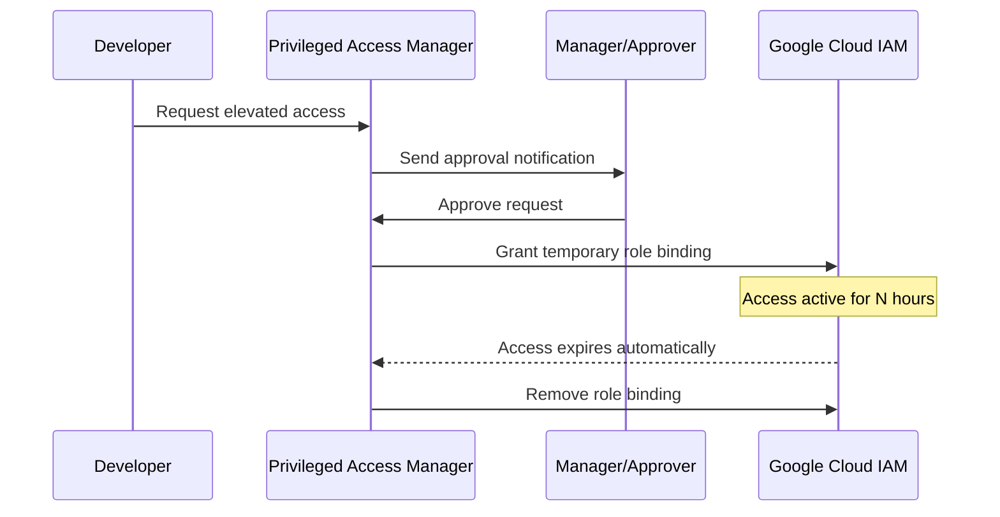

# How to Implement Just-in-Time Access with Google Cloud Privileged Access Manager

Author: [nawazdhandala](https://www.github.com/nawazdhandala)

Tags: GCP, Google Cloud, Privileged Access Manager, PAM, Just-in-Time Access, IAM, Security

Description: Learn how to implement just-in-time privileged access in Google Cloud using Privileged Access Manager to reduce standing privileges and improve security.

---

Standing privileges are a security problem. When an engineer has permanent admin access to production, that access exists 24/7 whether they need it or not. If their account gets compromised, the attacker inherits all those permissions. Just-in-time (JIT) access flips this model - nobody has elevated privileges by default. When someone needs admin access, they request it, get approved, and receive time-limited credentials that automatically expire.

Google Cloud Privileged Access Manager (PAM) is the managed service for implementing JIT access in GCP. It lets you create entitlements that define who can request what access, with approval workflows and automatic expiration built in.

## How Privileged Access Manager Works

The workflow is straightforward:



No permanent elevated roles. No manual cleanup. The access grant has a built-in expiration, and PAM removes the role binding automatically when time is up.

## Prerequisites

- A Google Cloud organization
- The Privileged Access Manager API enabled
- Organization Admin or PAM Admin role
- An understanding of which roles need JIT access in your environment

## Step 1: Enable the Privileged Access Manager API

```bash
# Enable the PAM API
gcloud services enable privilegedaccessmanager.googleapis.com \
    --project=my-project
```

## Step 2: Define Your Access Entitlements

An entitlement is the central concept in PAM. It defines:
- What access is available (which IAM roles)
- Who can request it (eligible requesters)
- Who can approve it (approvers)
- How long the access lasts
- Whether approval is required

```bash
# Create an entitlement for production database admin access
gcloud pam entitlements create prod-db-admin \
    --project=my-project \
    --location=global \
    --entitlement-id=prod-db-admin \
    --eligible-users="group:backend-engineers@example.com" \
    --privileged-access-roles="roles/cloudsql.admin" \
    --max-request-duration="4h" \
    --approval-workflow-approvers="group:team-leads@example.com" \
    --require-approver-justification=true \
    --requester-justification-required=true
```

Let me explain each part of this entitlement:

**eligible-users**: The group of people who can request this access. They do not have the access by default - they can only request it.

**privileged-access-roles**: The IAM role(s) that get granted when the request is approved. You can specify multiple roles for a single entitlement.

**max-request-duration**: The maximum time the access can last. Individual requests can ask for less time, but not more.

**approval-workflow-approvers**: Who needs to approve the request before access is granted.

## Step 3: Create Multiple Entitlements for Different Access Levels

Most organizations need several entitlements for different scenarios:

```bash
# Entitlement for compute admin access (requires approval)
gcloud pam entitlements create compute-admin-jit \
    --project=my-project \
    --location=global \
    --entitlement-id=compute-admin-jit \
    --eligible-users="group:infrastructure-team@example.com" \
    --privileged-access-roles="roles/compute.admin" \
    --max-request-duration="2h" \
    --approval-workflow-approvers="group:infra-leads@example.com" \
    --requester-justification-required=true

# Entitlement for billing viewer (auto-approved, lower risk)
gcloud pam entitlements create billing-viewer-jit \
    --project=my-project \
    --location=global \
    --entitlement-id=billing-viewer-jit \
    --eligible-users="group:finance-team@example.com" \
    --privileged-access-roles="roles/billing.viewer" \
    --max-request-duration="8h" \
    --no-require-approval

# Entitlement for emergency access (requires two approvers)
gcloud pam entitlements create emergency-admin \
    --project=my-project \
    --location=global \
    --entitlement-id=emergency-admin \
    --eligible-users="group:on-call-engineers@example.com" \
    --privileged-access-roles="roles/owner" \
    --max-request-duration="1h" \
    --approval-workflow-approvers="group:security-team@example.com,group:engineering-directors@example.com" \
    --requester-justification-required=true \
    --require-approver-justification=true
```

## Step 4: Request Access

When a developer needs elevated access, they submit a request through the gcloud CLI or the Cloud Console:

```bash
# Request production database admin access for 2 hours
gcloud pam grants create \
    --project=my-project \
    --location=global \
    --entitlement=prod-db-admin \
    --requested-duration="2h" \
    --justification="Need to investigate slow query on orders table - JIRA-1234"
```

The request is sent to the designated approvers with the justification text. Approvers get notified through email and can approve or deny through the Cloud Console, gcloud CLI, or API.

## Step 5: Approve or Deny Requests

Approvers review pending requests and act on them:

```bash
# List pending approval requests
gcloud pam grants list \
    --project=my-project \
    --location=global \
    --entitlement=prod-db-admin \
    --filter="state=APPROVAL_AWAITED"

# Approve a request
gcloud pam grants approve GRANT_ID \
    --project=my-project \
    --location=global \
    --entitlement=prod-db-admin \
    --reason="Approved for incident investigation"

# Deny a request
gcloud pam grants deny GRANT_ID \
    --project=my-project \
    --location=global \
    --entitlement=prod-db-admin \
    --reason="Please use read-only access instead"
```

Once approved, the IAM role binding is created automatically, and the requester has the elevated access for the specified duration.

## Step 6: Monitor and Audit Access Grants

All PAM activity is logged in Cloud Audit Logs, giving you a complete audit trail:

```bash
# View recent PAM grants and their status
gcloud pam grants list \
    --project=my-project \
    --location=global \
    --entitlement=prod-db-admin \
    --limit=20

# Search audit logs for PAM activity
gcloud logging read \
    'resource.type="audited_resource" AND protoPayload.serviceName="privilegedaccessmanager.googleapis.com"' \
    --project=my-project \
    --limit=50 \
    --format="table(timestamp,protoPayload.methodName,protoPayload.authenticationInfo.principalEmail)"
```

Set up alerts for sensitive entitlements:

```bash
# Create an alert when emergency admin access is granted
gcloud monitoring policies create \
    --project=my-project \
    --display-name="Emergency Admin Access Granted" \
    --condition-display-name="PAM emergency admin grant approved" \
    --condition-filter='resource.type="audited_resource" AND protoPayload.serviceName="privilegedaccessmanager.googleapis.com" AND protoPayload.methodName="ApproveGrant" AND protoPayload.request.entitlement="emergency-admin"' \
    --notification-channels=CHANNEL_ID
```

## Step 7: Integrate with Incident Management

JIT access works best when it is integrated with your incident management workflow. Require that access requests reference a ticket or incident:

```bash
# Example: Script that validates the justification contains a ticket reference
#!/bin/bash
# validate-jit-request.sh
# Called as part of an automated approval workflow

JUSTIFICATION="$1"

# Check if the justification contains a valid ticket reference
if echo "${JUSTIFICATION}" | grep -qE "(JIRA|INC|SENTRY)-[0-9]+"; then
    echo "Valid ticket reference found"
    exit 0
else
    echo "Justification must include a ticket reference (e.g., JIRA-1234)"
    exit 1
fi
```

## Best Practices

**Start with high-risk roles**: You do not need to put every IAM role behind JIT access. Start with the roles that could cause the most damage - Owner, Editor, database admin, and security admin roles.

**Keep entitlement durations short**: The longer an access grant lasts, the larger the attack window. 1-2 hours is usually enough for most tasks. If someone consistently needs longer access, that might indicate they need a different permanent role instead.

**Use groups for eligible users**: Do not assign entitlement eligibility to individual users. Use Google Groups so you can manage membership changes without updating every entitlement.

**Require justifications**: Always require requesters to explain why they need the access. This creates an audit trail and makes people think twice about whether they actually need the elevated permissions.

**Review entitlements regularly**: Audit your entitlements quarterly. Remove entitlements that are never used, and check if eligible user groups are still appropriate.

## Summary

Privileged Access Manager lets you replace standing elevated privileges with time-limited, approved access grants. The setup involves creating entitlements that define who can request what access and who approves it. Developers request access when they need it, approvers review and approve, and the access automatically expires. The result is a much smaller attack surface - instead of dozens of people with permanent admin access, you have zero people with standing privileges and a clear audit trail of every time someone used elevated access.
