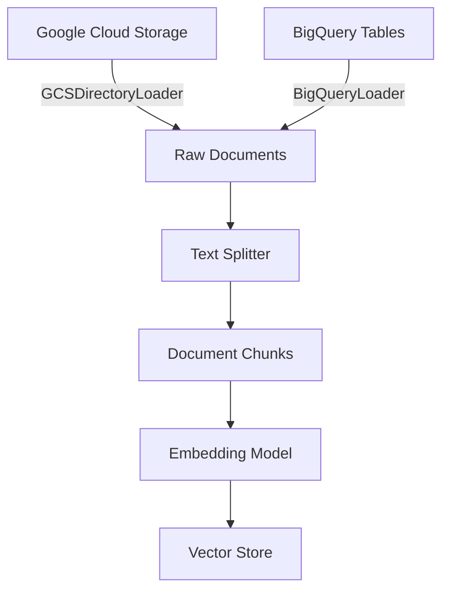

# How to Implement LangChain Document Loaders for Google Cloud Storage and BigQuery

Author: [nawazdhandala](https://www.github.com/nawazdhandala)

Tags: GCP, LangChain, Cloud Storage, BigQuery, Document Loaders

Description: A practical guide to loading documents from Google Cloud Storage and BigQuery into LangChain for building RAG pipelines and AI applications.

---

One of the first challenges in building any AI application is getting your data into a format that your language model can work with. LangChain solves this through document loaders - components that read data from various sources and convert them into a standard Document format. If your data lives in Google Cloud Storage or BigQuery, LangChain has dedicated loaders that make ingestion straightforward.

This guide covers how to use both the GCS and BigQuery document loaders, handle different file formats, and set up efficient data pipelines for your AI applications.

## Prerequisites

You will need the following before getting started:

- A Google Cloud project with billing enabled
- Cloud Storage and BigQuery APIs enabled
- Python 3.9+
- Proper IAM permissions (Storage Object Viewer for GCS, BigQuery Data Viewer for BQ)

Install the necessary packages:

```bash
# Install LangChain with Google Cloud integrations
pip install langchain langchain-google-community langchain-community google-cloud-storage google-cloud-bigquery
```

## Loading Documents from Google Cloud Storage

### Loading a Single File

The simplest case is loading a single file from a GCS bucket. LangChain provides `GCSFileLoader` for this purpose.

```python
from langchain_google_community import GCSFileLoader

# Load a single PDF file from a GCS bucket
loader = GCSFileLoader(
    project_name="your-gcp-project-id",
    bucket="your-bucket-name",
    blob="documents/quarterly-report.pdf",  # Path within the bucket
)

# Load the document - returns a list of Document objects
docs = loader.load()

# Each document has page_content and metadata
for doc in docs:
    print(f"Content length: {len(doc.page_content)} characters")
    print(f"Metadata: {doc.metadata}")
```

### Loading an Entire Directory

When you have many files in a bucket directory, use `GCSDirectoryLoader` to load them all at once.

```python
from langchain_google_community import GCSDirectoryLoader

# Load all files from a specific prefix (directory) in the bucket
loader = GCSDirectoryLoader(
    project_name="your-gcp-project-id",
    bucket="your-document-bucket",
    prefix="knowledge-base/",  # Only load files under this prefix
)

# Load all documents from the directory
documents = loader.load()
print(f"Loaded {len(documents)} documents from GCS")

# Inspect what we got
for doc in documents[:3]:
    print(f"Source: {doc.metadata.get('source', 'unknown')}")
    print(f"Preview: {doc.page_content[:200]}...")
    print("---")
```

### Handling Different File Types

GCS buckets often contain mixed file formats. You can customize how each format gets parsed by providing a custom loader function.

```python
from langchain_google_community import GCSFileLoader
from langchain_community.document_loaders import (
    PyPDFLoader,
    TextLoader,
    CSVLoader,
    UnstructuredMarkdownLoader,
)
import tempfile
import os

def custom_loader_func(file_path: str, content_type: str = None):
    """Route files to the appropriate loader based on extension."""
    extension = os.path.splitext(file_path)[1].lower()

    # Map file extensions to their respective loaders
    loader_map = {
        ".pdf": PyPDFLoader,
        ".txt": TextLoader,
        ".csv": CSVLoader,
        ".md": UnstructuredMarkdownLoader,
    }

    loader_class = loader_map.get(extension, TextLoader)
    loader = loader_class(file_path)
    return loader.load()

# Use the custom loader function with GCSFileLoader
loader = GCSFileLoader(
    project_name="your-gcp-project-id",
    bucket="your-bucket-name",
    blob="reports/analysis.pdf",
    loader_func=custom_loader_func,
)

docs = loader.load()
```

## Loading Documents from BigQuery

BigQuery is often where structured data lives in a GCP environment. The `BigQueryLoader` lets you pull data directly from tables or custom queries.

### Basic Table Loading

```python
from langchain_google_community import BigQueryLoader

# Load data from a BigQuery table
# The page_content_columns parameter specifies which columns to use as document content
loader = BigQueryLoader(
    query="SELECT title, body, created_at FROM `your-project.dataset.articles` LIMIT 1000",
    project="your-gcp-project-id",
    page_content_columns=["title", "body"],  # These columns become the document text
    metadata_columns=["created_at"],  # These columns become metadata
)

documents = loader.load()

print(f"Loaded {len(documents)} documents from BigQuery")
print(f"Sample content: {documents[0].page_content[:300]}")
print(f"Sample metadata: {documents[0].metadata}")
```

### Loading with Complex Queries

You can use any valid BigQuery SQL, which means you can join tables, filter data, and transform columns before loading.

```python
from langchain_google_community import BigQueryLoader

# Use a complex query to join and filter data before loading
query = """
SELECT
    a.title,
    a.content,
    a.category,
    a.published_date,
    ARRAY_TO_STRING(ARRAY_AGG(t.tag_name), ', ') as tags
FROM `your-project.dataset.articles` a
LEFT JOIN `your-project.dataset.article_tags` t
    ON a.id = t.article_id
WHERE a.status = 'published'
    AND a.published_date >= '2025-01-01'
GROUP BY a.title, a.content, a.category, a.published_date
ORDER BY a.published_date DESC
"""

loader = BigQueryLoader(
    query=query,
    project="your-gcp-project-id",
    page_content_columns=["title", "content"],
    metadata_columns=["category", "published_date", "tags"],
)

docs = loader.load()
```

### Lazy Loading for Large Datasets

When dealing with large result sets, you do not want to load everything into memory at once. Use `lazy_load()` to process documents one at a time.

```python
from langchain_google_community import BigQueryLoader

loader = BigQueryLoader(
    query="SELECT content, source_url FROM `your-project.dataset.web_pages`",
    project="your-gcp-project-id",
    page_content_columns=["content"],
    metadata_columns=["source_url"],
)

# Process documents one at a time to avoid memory issues
processed_count = 0
for doc in loader.lazy_load():
    # Process each document individually
    # For example, split it and add to a vector store
    processed_count += 1
    if processed_count % 100 == 0:
        print(f"Processed {processed_count} documents...")

print(f"Total processed: {processed_count}")
```

## Splitting Documents for RAG

After loading, documents usually need to be split into smaller chunks for embedding and retrieval. Here is how to chain loading with splitting.

```python
from langchain_google_community import GCSDirectoryLoader
from langchain.text_splitter import RecursiveCharacterTextSplitter

# Load documents from GCS
loader = GCSDirectoryLoader(
    project_name="your-gcp-project-id",
    bucket="your-document-bucket",
    prefix="knowledge-base/",
)

raw_documents = loader.load()

# Split into chunks suitable for embedding
splitter = RecursiveCharacterTextSplitter(
    chunk_size=1000,       # Target chunk size in characters
    chunk_overlap=200,     # Overlap between chunks to preserve context
    separators=["\n\n", "\n", ". ", " ", ""],  # Split priorities
)

chunks = splitter.split_documents(raw_documents)
print(f"Split {len(raw_documents)} documents into {len(chunks)} chunks")
```

## Building a Complete Ingestion Pipeline

Here is a complete pipeline that loads from both GCS and BigQuery, splits the content, and prepares it for a vector store.

```python
from langchain_google_community import GCSDirectoryLoader, BigQueryLoader
from langchain.text_splitter import RecursiveCharacterTextSplitter

def build_document_pipeline(project_id: str):
    """Build a complete document ingestion pipeline from GCS and BigQuery."""

    all_documents = []

    # Load PDF reports from GCS
    gcs_loader = GCSDirectoryLoader(
        project_name=project_id,
        bucket="company-documents",
        prefix="reports/",
    )
    gcs_docs = gcs_loader.load()
    print(f"Loaded {len(gcs_docs)} documents from GCS")
    all_documents.extend(gcs_docs)

    # Load FAQ data from BigQuery
    bq_loader = BigQueryLoader(
        query="SELECT question, answer, category FROM `{}.support.faqs`".format(project_id),
        project=project_id,
        page_content_columns=["question", "answer"],
        metadata_columns=["category"],
    )
    bq_docs = bq_loader.load()
    print(f"Loaded {len(bq_docs)} documents from BigQuery")
    all_documents.extend(bq_docs)

    # Split everything into chunks
    splitter = RecursiveCharacterTextSplitter(
        chunk_size=1000,
        chunk_overlap=200,
    )
    chunks = splitter.split_documents(all_documents)
    print(f"Total chunks ready for embedding: {len(chunks)}")

    return chunks

# Run the pipeline
chunks = build_document_pipeline("your-gcp-project-id")
```

## Data Flow Overview



## Tips for Production

When running document loading pipelines in production, keep these things in mind. Always use `lazy_load()` for large datasets to control memory usage. Set appropriate BigQuery query limits and consider using table partitions to reduce scan costs. For GCS, filter by prefix to avoid loading unnecessary files.

Monitor your pipeline with Cloud Logging and set up alerts if ingestion jobs fail. You can also schedule these pipelines using Cloud Scheduler triggering Cloud Functions or Cloud Run jobs.

The combination of GCS and BigQuery as data sources with LangChain's document loaders gives you a flexible foundation for building RAG systems. Once your data is chunked and ready, you can plug it into any vector store - Vertex AI Vector Search, Pinecone, or even a local FAISS index for development.
