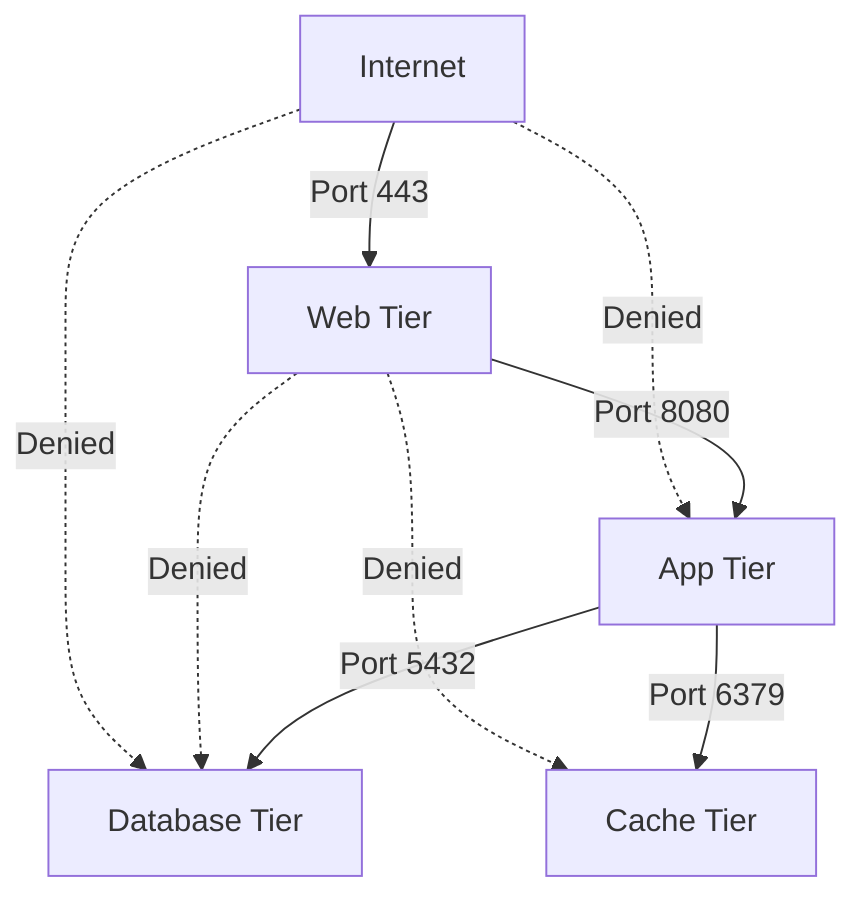

# How to Implement Micro-Segmentation Using VPC Firewall Rules and Network Tags on GCP

Author: [nawazdhandala](https://www.github.com/nawazdhandala)

Tags: GCP, Firewall, Micro-Segmentation, Network Security, VPC

Description: Learn how to implement micro-segmentation on GCP using VPC firewall rules and network tags to enforce least-privilege network access between workloads.

---

In a traditional flat network, any VM can talk to any other VM. A compromised workload can reach everything on the network - databases, internal APIs, admin interfaces. Micro-segmentation fixes this by creating granular network policies that only allow the specific traffic that each workload needs. On GCP, you implement micro-segmentation using VPC firewall rules with network tags, giving you workload-level access control without changing your network topology.

This post walks through designing and implementing micro-segmentation for a typical multi-tier application on GCP.

## What Micro-Segmentation Looks Like

Instead of broad allow rules like "all internal traffic allowed," micro-segmentation creates specific rules like "web servers can talk to app servers on port 8080, app servers can talk to databases on port 5432, and nothing else is allowed."



Dashed lines represent denied traffic. The web tier cannot directly access the database - it must go through the app tier.

## Step 1 - Define Network Tags

Network tags are labels you attach to VMs. Firewall rules reference these tags to target specific groups of VMs.

```bash
# Create VMs with appropriate network tags
# Web server VMs
gcloud compute instances create web-server-1 \
    --zone=us-central1-a \
    --machine-type=e2-standard-2 \
    --network=my-vpc \
    --subnet=my-subnet \
    --tags=web-tier,http-server

gcloud compute instances create web-server-2 \
    --zone=us-central1-b \
    --machine-type=e2-standard-2 \
    --network=my-vpc \
    --subnet=my-subnet \
    --tags=web-tier,http-server

# Application server VMs
gcloud compute instances create app-server-1 \
    --zone=us-central1-a \
    --machine-type=e2-standard-4 \
    --network=my-vpc \
    --subnet=my-subnet \
    --tags=app-tier

gcloud compute instances create app-server-2 \
    --zone=us-central1-b \
    --machine-type=e2-standard-4 \
    --network=my-vpc \
    --subnet=my-subnet \
    --tags=app-tier

# Database VMs
gcloud compute instances create db-primary \
    --zone=us-central1-a \
    --machine-type=e2-standard-8 \
    --network=my-vpc \
    --subnet=my-subnet \
    --tags=db-tier

# Cache VMs
gcloud compute instances create cache-server \
    --zone=us-central1-a \
    --machine-type=e2-standard-2 \
    --network=my-vpc \
    --subnet=my-subnet \
    --tags=cache-tier
```

For managed instance groups, add tags to the instance template:

```bash
# Instance template with network tags
gcloud compute instance-templates create web-template \
    --machine-type=e2-standard-2 \
    --network=my-vpc \
    --subnet=my-subnet \
    --tags=web-tier,http-server \
    --image-family=debian-11 \
    --image-project=debian-cloud
```

## Step 2 - Create a Default-Deny Rule

The foundation of micro-segmentation is denying all traffic by default. GCP VPCs have two implied rules: allow all egress and deny all ingress. You need to override the default allow rules.

```bash
# Deny all internal ingress traffic at high priority
gcloud compute firewall-rules create deny-all-internal-ingress \
    --network=my-vpc \
    --direction=INGRESS \
    --action=DENY \
    --rules=all \
    --source-ranges=10.0.0.0/8 \
    --priority=65534

# Deny all internal egress traffic
gcloud compute firewall-rules create deny-all-internal-egress \
    --network=my-vpc \
    --direction=EGRESS \
    --action=DENY \
    --rules=all \
    --destination-ranges=10.0.0.0/8 \
    --priority=65534
```

Now nothing can communicate internally. We will add specific allow rules for each legitimate traffic flow.

## Step 3 - Allow Health Check Traffic

Google's health checkers need to reach your VMs. This is required for load balancing.

```bash
# Allow health checks from Google's ranges
gcloud compute firewall-rules create allow-health-checks \
    --network=my-vpc \
    --direction=INGRESS \
    --action=ALLOW \
    --rules=tcp:8080,tcp:443,tcp:80 \
    --source-ranges=35.191.0.0/16,130.211.0.0/22 \
    --priority=1000
```

## Step 4 - Create Tier-Specific Allow Rules

Now create the specific allow rules for each legitimate traffic flow.

```bash
# Allow internet to web tier on HTTPS
gcloud compute firewall-rules create allow-internet-to-web \
    --network=my-vpc \
    --direction=INGRESS \
    --action=ALLOW \
    --rules=tcp:443 \
    --source-ranges=0.0.0.0/0 \
    --target-tags=web-tier \
    --priority=1000

# Allow web tier to app tier on port 8080
gcloud compute firewall-rules create allow-web-to-app \
    --network=my-vpc \
    --direction=INGRESS \
    --action=ALLOW \
    --rules=tcp:8080 \
    --source-tags=web-tier \
    --target-tags=app-tier \
    --priority=1000

# Allow app tier to database tier on PostgreSQL port
gcloud compute firewall-rules create allow-app-to-db \
    --network=my-vpc \
    --direction=INGRESS \
    --action=ALLOW \
    --rules=tcp:5432 \
    --source-tags=app-tier \
    --target-tags=db-tier \
    --priority=1000

# Allow app tier to cache tier on Redis port
gcloud compute firewall-rules create allow-app-to-cache \
    --network=my-vpc \
    --direction=INGRESS \
    --action=ALLOW \
    --rules=tcp:6379 \
    --source-tags=app-tier \
    --target-tags=cache-tier \
    --priority=1000

# Allow database replication between db-tier VMs
gcloud compute firewall-rules create allow-db-replication \
    --network=my-vpc \
    --direction=INGRESS \
    --action=ALLOW \
    --rules=tcp:5432 \
    --source-tags=db-tier \
    --target-tags=db-tier \
    --priority=1000
```

You also need egress rules to match:

```bash
# Allow web tier to reach app tier
gcloud compute firewall-rules create allow-web-to-app-egress \
    --network=my-vpc \
    --direction=EGRESS \
    --action=ALLOW \
    --rules=tcp:8080 \
    --target-tags=web-tier \
    --destination-ranges=10.0.0.0/8 \
    --priority=1000

# Allow app tier to reach database and cache
gcloud compute firewall-rules create allow-app-to-db-egress \
    --network=my-vpc \
    --direction=EGRESS \
    --action=ALLOW \
    --rules=tcp:5432,tcp:6379 \
    --target-tags=app-tier \
    --destination-ranges=10.0.0.0/8 \
    --priority=1000

# Allow all tiers to reach Google APIs (for logging, monitoring, etc.)
gcloud compute firewall-rules create allow-google-apis-egress \
    --network=my-vpc \
    --direction=EGRESS \
    --action=ALLOW \
    --rules=tcp:443 \
    --destination-ranges=199.36.153.8/30 \
    --priority=1000
```

## Step 5 - Allow SSH for Management

You still need SSH access for management, but restrict it to specific source ranges.

```bash
# Allow SSH only from IAP (Identity-Aware Proxy) ranges
gcloud compute firewall-rules create allow-iap-ssh \
    --network=my-vpc \
    --direction=INGRESS \
    --action=ALLOW \
    --rules=tcp:22 \
    --source-ranges=35.235.240.0/20 \
    --priority=1000
```

Using IAP for SSH means you do not need to open port 22 from the public internet or your corporate network.

## Step 6 - Verify the Segmentation

Test that the rules work as expected by trying legitimate and illegitimate connections.

```bash
# SSH into a web server and try to reach the app tier (should work)
gcloud compute ssh web-server-1 --zone=us-central1-a \
    --command="curl -s -o /dev/null -w '%{http_code}' http://app-server-1:8080/healthz"
# Expected: 200

# Try to reach the database directly from the web tier (should fail)
gcloud compute ssh web-server-1 --zone=us-central1-a \
    --command="nc -zv db-primary 5432 -w 3"
# Expected: Connection refused or timeout

# From the app tier, reach the database (should work)
gcloud compute ssh app-server-1 --zone=us-central1-a \
    --command="nc -zv db-primary 5432 -w 3"
# Expected: Connection succeeded
```

## Step 7 - Enable Firewall Rules Logging

Log firewall rule matches for auditing and troubleshooting.

```bash
# Enable logging on critical firewall rules
gcloud compute firewall-rules update deny-all-internal-ingress \
    --enable-logging

gcloud compute firewall-rules update allow-app-to-db \
    --enable-logging

gcloud compute firewall-rules update deny-all-internal-egress \
    --enable-logging
```

Query the logs to find denied traffic, which helps identify missing rules:

```bash
# Find denied traffic in firewall logs
gcloud logging read 'resource.type="gce_subnetwork" AND jsonPayload.disposition="DENIED"' \
    --format="table(timestamp, jsonPayload.connection.src_ip, jsonPayload.connection.dest_ip, jsonPayload.connection.dest_port)" \
    --limit=50
```

## Using Service Accounts Instead of Tags

For GKE workloads or for stronger identity, you can use service accounts instead of network tags in firewall rules.

```bash
# Create service accounts for each tier
gcloud iam service-accounts create web-tier-sa \
    --display-name="Web Tier Service Account"

gcloud iam service-accounts create app-tier-sa \
    --display-name="App Tier Service Account"

# Create firewall rules using service accounts
gcloud compute firewall-rules create allow-web-to-app-sa \
    --network=my-vpc \
    --direction=INGRESS \
    --action=ALLOW \
    --rules=tcp:8080 \
    --source-service-accounts=web-tier-sa@my-project.iam.gserviceaccount.com \
    --target-service-accounts=app-tier-sa@my-project.iam.gserviceaccount.com \
    --priority=1000
```

Service accounts provide a stronger identity than tags because tags can be modified by anyone with compute instance admin permissions, while service account assignment is controlled by IAM.

## Wrapping Up

Micro-segmentation with VPC firewall rules and network tags gives you workload-level access control on GCP. The approach is straightforward: start with default-deny rules, then add specific allow rules for each legitimate traffic flow. Use network tags for simplicity or service accounts for stronger identity. Enable firewall logging to audit traffic and find missing rules. The result is a network where a compromised workload can only reach the specific services it legitimately needs, dramatically reducing the blast radius of any security incident.
