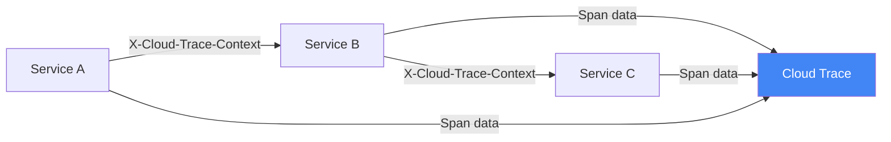

# How to Implement Middleware for Cloud Trace Propagation in a Go HTTP Service on Cloud Run

Author: [nawazdhandala](https://www.github.com/nawazdhandala)

Tags: GCP, Cloud Trace, Go, Cloud Run, Distributed Tracing, Observability

Description: Implement middleware for Cloud Trace context propagation in a Go HTTP service on Cloud Run to enable distributed tracing across microservices.

---

When you have multiple services calling each other on Cloud Run, figuring out where a slow request is spending its time becomes a real challenge. Cloud Trace solves this by stitching together timing data across service boundaries. But it only works if each service properly propagates the trace context to downstream calls.

In this post, I will show you how to build HTTP middleware that extracts incoming trace context, creates spans for your service, and propagates the context to any outgoing HTTP calls.

## How Cloud Trace Propagation Works

Cloud Run automatically injects a trace header (`X-Cloud-Trace-Context`) into incoming requests. Your service needs to:

1. Extract the trace ID and span ID from the incoming header
2. Create a child span for the work your service does
3. Include the same trace context when making outgoing HTTP calls



## Setting Up Dependencies

```bash
go get go.opentelemetry.io/otel
go get go.opentelemetry.io/otel/sdk/trace
go get go.opentelemetry.io/otel/exporters/otlp/otlptrace/otlptracegrpc
go get go.opentelemetry.io/contrib/instrumentation/net/http/otelhttp
go get github.com/GoogleCloudPlatform/opentelemetry-operations-go/exporter/trace
```

## Configuring the Trace Exporter

First, set up the OpenTelemetry trace exporter that sends data to Cloud Trace.

```go
package main

import (
    "context"
    "fmt"
    "log"
    "os"

    texporter "github.com/GoogleCloudPlatform/opentelemetry-operations-go/exporter/trace"
    "go.opentelemetry.io/otel"
    "go.opentelemetry.io/otel/propagation"
    sdktrace "go.opentelemetry.io/otel/sdk/trace"
    "go.opentelemetry.io/otel/sdk/resource"
    semconv "go.opentelemetry.io/otel/semconv/v1.21.0"
)

// initTracer sets up the OpenTelemetry trace pipeline with Cloud Trace exporter
func initTracer(ctx context.Context) (*sdktrace.TracerProvider, error) {
    projectID := os.Getenv("GOOGLE_CLOUD_PROJECT")

    // Create the Cloud Trace exporter
    exporter, err := texporter.New(texporter.WithProjectID(projectID))
    if err != nil {
        return nil, fmt.Errorf("failed to create trace exporter: %w", err)
    }

    // Define resource attributes for this service
    res, err := resource.New(ctx,
        resource.WithAttributes(
            semconv.ServiceName("my-service"),
            semconv.ServiceVersion("1.0.0"),
        ),
    )
    if err != nil {
        return nil, fmt.Errorf("failed to create resource: %w", err)
    }

    // Create the trace provider with batch processing
    tp := sdktrace.NewTracerProvider(
        sdktrace.WithBatcher(exporter),
        sdktrace.WithResource(res),
        // Sample all requests in development, reduce in production
        sdktrace.WithSampler(sdktrace.AlwaysSample()),
    )

    // Set the global trace provider and propagator
    otel.SetTracerProvider(tp)

    // Use both W3C Trace Context and Google Cloud Trace propagation
    otel.SetTextMapPropagator(propagation.NewCompositeTextMapPropagator(
        propagation.TraceContext{},
        propagation.Baggage{},
    ))

    return tp, nil
}
```

## Building the Trace Middleware

The middleware wraps each incoming request in a span and ensures the trace context flows through.

```go
package main

import (
    "fmt"
    "net/http"
    "strings"

    "go.opentelemetry.io/otel"
    "go.opentelemetry.io/otel/attribute"
    "go.opentelemetry.io/otel/trace"
)

// traceMiddleware extracts trace context from incoming requests and creates spans
func traceMiddleware(serviceName string) func(http.Handler) http.Handler {
    tracer := otel.Tracer(serviceName)

    return func(next http.Handler) http.Handler {
        return http.HandlerFunc(func(w http.ResponseWriter, r *http.Request) {
            // Extract the trace context from incoming headers
            ctx := otel.GetTextMapPropagator().Extract(r.Context(), propagation.HeaderCarrier(r.Header))

            // Also handle the GCP-specific X-Cloud-Trace-Context header
            ctx = extractGCPTraceContext(ctx, r)

            // Start a new span for this request
            spanName := fmt.Sprintf("%s %s", r.Method, r.URL.Path)
            ctx, span := tracer.Start(ctx, spanName,
                trace.WithSpanKind(trace.SpanKindServer),
                trace.WithAttributes(
                    attribute.String("http.method", r.Method),
                    attribute.String("http.url", r.URL.String()),
                    attribute.String("http.user_agent", r.UserAgent()),
                    attribute.String("http.host", r.Host),
                ),
            )
            defer span.End()

            // Wrap the response writer to capture the status code
            wrapped := &statusRecorder{ResponseWriter: w, status: http.StatusOK}

            // Pass the traced context to the next handler
            next.ServeHTTP(wrapped, r.WithContext(ctx))

            // Record the response status on the span
            span.SetAttributes(attribute.Int("http.status_code", wrapped.status))

            if wrapped.status >= 400 {
                span.SetAttributes(attribute.Bool("error", true))
            }
        })
    }
}

// statusRecorder captures the HTTP status code from the response
type statusRecorder struct {
    http.ResponseWriter
    status int
}

func (r *statusRecorder) WriteHeader(status int) {
    r.status = status
    r.ResponseWriter.WriteHeader(status)
}
```

## Parsing the GCP Trace Header

Cloud Run uses the `X-Cloud-Trace-Context` header format, which is different from W3C Trace Context. Here is how to parse it.

```go
import (
    "context"
    "encoding/hex"
    "strings"

    "go.opentelemetry.io/otel/trace"
)

// extractGCPTraceContext parses the X-Cloud-Trace-Context header
// Format: TRACE_ID/SPAN_ID;o=TRACE_TRUE
func extractGCPTraceContext(ctx context.Context, r *http.Request) context.Context {
    header := r.Header.Get("X-Cloud-Trace-Context")
    if header == "" {
        return ctx
    }

    // Split the header into trace ID, span ID, and options
    parts := strings.SplitN(header, "/", 2)
    if len(parts) < 2 {
        return ctx
    }

    traceIDStr := parts[0]

    // Extract span ID (before the semicolon)
    spanParts := strings.SplitN(parts[1], ";", 2)
    spanIDStr := spanParts[0]

    // Convert the trace ID to the OpenTelemetry format (32 hex chars)
    traceID, err := trace.TraceIDFromHex(traceIDStr)
    if err != nil {
        return ctx
    }

    // Convert span ID - GCP uses decimal, OTel uses 16 hex chars
    // Pad the span ID to 16 hex characters
    spanIDHex := fmt.Sprintf("%016s", spanIDStr)
    spanID, err := trace.SpanIDFromHex(spanIDHex)
    if err != nil {
        return ctx
    }

    // Create a remote span context from the parsed values
    spanCtx := trace.NewSpanContext(trace.SpanContextConfig{
        TraceID:    traceID,
        SpanID:     spanID,
        TraceFlags: trace.FlagsSampled,
        Remote:     true,
    })

    return trace.ContextWithRemoteSpanContext(ctx, spanCtx)
}
```

## Propagating Trace Context in Outgoing Calls

When your service makes HTTP calls to other services, you need to inject the trace context into the outgoing request headers.

```go
import (
    "context"
    "net/http"

    "go.opentelemetry.io/contrib/instrumentation/net/http/otelhttp"
    "go.opentelemetry.io/otel"
    "go.opentelemetry.io/otel/attribute"
)

// tracedHTTPClient creates an HTTP client that propagates trace context
func tracedHTTPClient() *http.Client {
    // otelhttp.NewTransport wraps the default transport with trace propagation
    return &http.Client{
        Transport: otelhttp.NewTransport(http.DefaultTransport),
    }
}

// callDownstreamService makes an HTTP call with trace context propagation
func callDownstreamService(ctx context.Context, url string) (*http.Response, error) {
    tracer := otel.Tracer("my-service")

    // Create a child span for the outgoing call
    ctx, span := tracer.Start(ctx, "call-downstream",
        trace.WithAttributes(
            attribute.String("downstream.url", url),
        ),
    )
    defer span.End()

    // Create the request with the traced context
    req, err := http.NewRequestWithContext(ctx, http.MethodGet, url, nil)
    if err != nil {
        return nil, err
    }

    // Inject trace headers into the outgoing request
    otel.GetTextMapPropagator().Inject(ctx, propagation.HeaderCarrier(req.Header))

    // Use the traced HTTP client
    client := tracedHTTPClient()
    resp, err := client.Do(req)
    if err != nil {
        span.RecordError(err)
        return nil, err
    }

    span.SetAttributes(attribute.Int("http.response.status_code", resp.StatusCode))
    return resp, nil
}
```

## Putting It Together

```go
func main() {
    ctx := context.Background()

    // Initialize the trace provider
    tp, err := initTracer(ctx)
    if err != nil {
        log.Fatalf("Failed to init tracer: %v", err)
    }
    defer func() {
        // Flush any pending traces before shutdown
        if err := tp.Shutdown(ctx); err != nil {
            log.Printf("Trace provider shutdown error: %v", err)
        }
    }()

    // Set up routes with trace middleware
    mux := http.NewServeMux()
    mux.HandleFunc("/api/orders", handleOrders)

    // Wrap the entire mux with the trace middleware
    handler := traceMiddleware("order-service")(mux)

    port := os.Getenv("PORT")
    if port == "" {
        port = "8080"
    }

    log.Printf("Starting traced service on port %s", port)
    log.Fatal(http.ListenAndServe(":"+port, handler))
}

// handleOrders is an example handler that calls a downstream service
func handleOrders(w http.ResponseWriter, r *http.Request) {
    ctx := r.Context()

    // This call will carry the trace context to the downstream service
    resp, err := callDownstreamService(ctx, "https://inventory-service.run.app/check")
    if err != nil {
        http.Error(w, "Downstream call failed", http.StatusBadGateway)
        return
    }
    defer resp.Body.Close()

    w.WriteHeader(http.StatusOK)
    w.Write([]byte("Order processed"))
}
```

## Viewing Traces

After deploying, you can view traces in the Cloud Trace console. Each trace shows the full request path across services with timing for each span.

```mermaid
gantt
    title Distributed Trace Example
    dateFormat X
    axisFormat %L ms

    section Service A
    Handle request     :0, 300

    section Service B
    Process order      :50, 200

    section Service C
    Check inventory    :100, 80
```



## Wrapping Up

Trace propagation is the foundation of distributed tracing. Without it, you get isolated spans that do not tell the full story. The middleware approach keeps your handlers clean - they just use the context that is already there. The key is to make sure every outgoing HTTP call includes the trace context, and every incoming request extracts it.

For a comprehensive view of your distributed system's health - combining traces, metrics, and uptime monitoring - OneUptime integrates well with Cloud Trace data to give you end-to-end observability.
