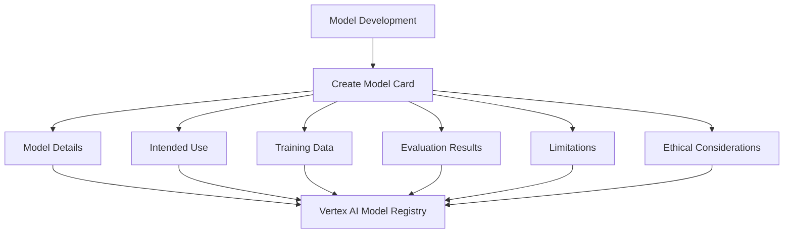

# How to Implement Model Cards for ML Model Documentation on Vertex AI

Author: [nawazdhandala](https://www.github.com/nawazdhandala)

Tags: GCP, Vertex AI, Model Cards, ML Documentation, Responsible AI, MLOps, Google Cloud

Description: Learn how to create and maintain model cards on Vertex AI to document ML model details, performance, limitations, and ethical considerations.

---

Every production ML model should have documentation that answers basic questions: What does this model do? What data was it trained on? How well does it perform, and for whom? What are its limitations? Model cards, originally proposed by Google researchers in 2019, are a standardized way to document these answers. Vertex AI has built-in support for model cards, making it straightforward to create and maintain this documentation alongside your models. Here is how to implement them.

## What Goes in a Model Card

A model card is not a research paper. It is a practical reference document for anyone who uses, maintains, or makes decisions about a model. The standard sections include:

- **Model Details**: What the model does, who built it, version info
- **Intended Use**: What it should and should not be used for
- **Training Data**: What data was used and how it was collected
- **Evaluation Results**: Performance metrics, including per-subgroup breakdowns
- **Limitations**: Known weaknesses, failure modes, and edge cases
- **Ethical Considerations**: Potential risks and mitigation strategies



## Step 1: Define the Model Card Structure

Create a Python module that builds model cards programmatically:

```python
# model_card_builder.py - Build model cards for Vertex AI models
from google.cloud import aiplatform
from datetime import datetime
import json

class ModelCardBuilder:
    """Builds structured model card documentation for Vertex AI models.
    Follows Google's Model Card framework."""

    def __init__(self, model_name, model_version):
        self.card = {
            "model_details": {
                "name": model_name,
                "version": model_version,
                "created_date": datetime.utcnow().isoformat(),
                "owners": [],
                "description": "",
                "references": [],
            },
            "intended_use": {
                "primary_uses": [],
                "primary_users": [],
                "out_of_scope_uses": [],
            },
            "training_data": {
                "description": "",
                "source": "",
                "preprocessing": "",
                "size": "",
                "date_range": "",
            },
            "evaluation": {
                "metrics": {},
                "sliced_metrics": {},
                "datasets_used": [],
            },
            "limitations": {
                "known_limitations": [],
                "failure_modes": [],
                "edge_cases": [],
            },
            "ethical_considerations": {
                "sensitive_data": [],
                "potential_harms": [],
                "mitigations": [],
            },
        }

    def set_model_details(self, description, owners, references=None):
        """Set the basic model information."""
        self.card["model_details"]["description"] = description
        self.card["model_details"]["owners"] = owners
        self.card["model_details"]["references"] = references or []
        return self

    def set_intended_use(self, primary_uses, primary_users, out_of_scope):
        """Define what the model should and should not be used for."""
        self.card["intended_use"]["primary_uses"] = primary_uses
        self.card["intended_use"]["primary_users"] = primary_users
        self.card["intended_use"]["out_of_scope_uses"] = out_of_scope
        return self

    def set_training_data(self, description, source, preprocessing, size, date_range):
        """Document the training data characteristics."""
        self.card["training_data"] = {
            "description": description,
            "source": source,
            "preprocessing": preprocessing,
            "size": size,
            "date_range": date_range,
        }
        return self

    def add_evaluation_metrics(self, metric_name, value, dataset=None):
        """Add a performance metric to the model card."""
        self.card["evaluation"]["metrics"][metric_name] = {
            "value": value,
            "dataset": dataset,
        }
        return self

    def add_sliced_metrics(self, slice_name, metrics_dict):
        """Add per-subgroup performance metrics for fairness analysis."""
        self.card["evaluation"]["sliced_metrics"][slice_name] = metrics_dict
        return self

    def add_limitation(self, description, severity="medium"):
        """Document a known limitation of the model."""
        self.card["limitations"]["known_limitations"].append({
            "description": description,
            "severity": severity,
        })
        return self

    def add_ethical_consideration(self, concern, mitigation):
        """Document ethical risks and how they are mitigated."""
        self.card["ethical_considerations"]["potential_harms"].append(concern)
        self.card["ethical_considerations"]["mitigations"].append(mitigation)
        return self

    def build(self):
        """Return the complete model card as a dictionary."""
        return self.card

    def to_json(self):
        """Serialize the model card to JSON."""
        return json.dumps(self.card, indent=2)
```

## Step 2: Create a Model Card for a Deployed Model

Use the builder to document a real model:

```python
# create_card.py - Create a model card for the loan approval model
from model_card_builder import ModelCardBuilder

# Build the model card with all sections filled in
card = (
    ModelCardBuilder("loan-approval-model", "v2.1")
    .set_model_details(
        description="Binary classification model that predicts loan approval likelihood based on applicant financial profile. Uses gradient boosted trees trained on historical loan data.",
        owners=["ML Platform Team", "Risk Engineering"],
        references=["https://internal-docs/models/loan-approval"],
    )
    .set_intended_use(
        primary_uses=[
            "Pre-screening loan applications for automated fast-track approval",
            "Prioritizing applications for manual review based on risk score",
        ],
        primary_users=[
            "Loan processing system (automated decisions for scores > 0.95)",
            "Credit analysts (decision support for manual review)",
        ],
        out_of_scope=[
            "Final loan approval decisions without human review",
            "Applicants under 18 years of age",
            "Commercial or business loans (model trained only on personal loans)",
            "Applications from regions not represented in training data",
        ],
    )
    .set_training_data(
        description="Historical personal loan applications with approval/denial outcomes",
        source="Internal loan processing database, applications from 2020-2025",
        preprocessing="Removed applications with incomplete data (12% of records). Excluded protected attributes from features. Applied SMOTE oversampling to balance approval/denial classes.",
        size="2.4 million applications, 65% approved, 35% denied after rebalancing",
        date_range="January 2020 to December 2025",
    )
    .add_evaluation_metrics("AUC-ROC", 0.923, dataset="holdout test set (2025 Q4)")
    .add_evaluation_metrics("Precision", 0.891, dataset="holdout test set")
    .add_evaluation_metrics("Recall", 0.867, dataset="holdout test set")
    .add_evaluation_metrics("F1 Score", 0.879, dataset="holdout test set")
    .add_sliced_metrics("gender_male", {"auc": 0.925, "approval_rate": 0.72})
    .add_sliced_metrics("gender_female", {"auc": 0.921, "approval_rate": 0.70})
    .add_sliced_metrics("age_18_30", {"auc": 0.898, "approval_rate": 0.61})
    .add_sliced_metrics("age_31_50", {"auc": 0.931, "approval_rate": 0.74})
    .add_sliced_metrics("age_51_plus", {"auc": 0.919, "approval_rate": 0.69})
    .add_limitation(
        "Lower accuracy for applicants under 25 due to shorter credit history",
        severity="medium"
    )
    .add_limitation(
        "Model has not been validated for self-employed applicants with irregular income patterns",
        severity="high"
    )
    .add_limitation(
        "Performance degrades for applications with more than 3 co-borrowers",
        severity="low"
    )
    .add_ethical_consideration(
        concern="Potential for indirect discrimination through correlated features (zip code correlating with race)",
        mitigation="Removed zip code from features. Added fairness constraints during training. Monthly disparate impact audits."
    )
    .add_ethical_consideration(
        concern="Model may perpetuate historical lending biases present in training data",
        mitigation="Applied debiasing preprocessing to training data. Set equal opportunity difference threshold at 0.05."
    )
    .build()
)
```

## Step 3: Attach the Model Card to a Vertex AI Model

Store the model card as metadata on the Vertex AI model resource:

```python
from google.cloud import aiplatform
import json

aiplatform.init(project="your-project-id", location="us-central1")

# Get the model
model = aiplatform.Model(
    model_name="projects/your-project-id/locations/us-central1/models/YOUR_MODEL_ID"
)

# Update the model with the model card as a label and description
model.update(
    labels={
        "model_card_version": "v2_1",
        "has_model_card": "true",
        "last_card_update": "2026-02-17",
    },
    description=json.dumps(card)[:5000],  # Vertex AI has a description length limit
)

# For the full model card, store it in Cloud Storage alongside the model artifacts
from google.cloud import storage

storage_client = storage.Client()
bucket = storage_client.bucket("your-model-artifacts-bucket")
blob = bucket.blob(f"models/loan-approval-v2.1/model_card.json")
blob.upload_from_string(json.dumps(card, indent=2), content_type="application/json")

print("Model card stored in Cloud Storage and linked to model")
```

## Step 4: Generate a Human-Readable Model Card

Convert the structured data into a readable document:

```python
# render_model_card.py - Generate a readable model card document
def render_model_card_markdown(card):
    """Convert a model card dictionary to a readable Markdown document."""

    md = []
    details = card["model_details"]

    md.append(f"# Model Card: {details['name']} ({details['version']})")
    md.append(f"\nCreated: {details['created_date']}")
    md.append(f"Owners: {', '.join(details['owners'])}")
    md.append(f"\n## Model Description\n{details['description']}")

    # Intended Use
    use = card["intended_use"]
    md.append("\n## Intended Use")
    md.append("\n### Primary Uses")
    for u in use["primary_uses"]:
        md.append(f"- {u}")
    md.append("\n### Out of Scope Uses")
    for u in use["out_of_scope_uses"]:
        md.append(f"- {u}")

    # Training Data
    data = card["training_data"]
    md.append(f"\n## Training Data")
    md.append(f"\n{data['description']}")
    md.append(f"\n- Source: {data['source']}")
    md.append(f"- Size: {data['size']}")
    md.append(f"- Date Range: {data['date_range']}")
    md.append(f"- Preprocessing: {data['preprocessing']}")

    # Evaluation
    md.append("\n## Evaluation Results")
    md.append("\n### Overall Metrics")
    md.append("| Metric | Value | Dataset |")
    md.append("|--------|-------|---------|")
    for name, info in card["evaluation"]["metrics"].items():
        md.append(f"| {name} | {info['value']} | {info.get('dataset', 'N/A')} |")

    if card["evaluation"]["sliced_metrics"]:
        md.append("\n### Per-Group Metrics")
        md.append("| Group | AUC | Approval Rate |")
        md.append("|-------|-----|---------------|")
        for group, metrics in card["evaluation"]["sliced_metrics"].items():
            md.append(f"| {group} | {metrics.get('auc', 'N/A')} | {metrics.get('approval_rate', 'N/A')} |")

    # Limitations
    md.append("\n## Known Limitations")
    for lim in card["limitations"]["known_limitations"]:
        md.append(f"- [{lim['severity'].upper()}] {lim['description']}")

    # Ethical Considerations
    md.append("\n## Ethical Considerations")
    for concern, mitigation in zip(
        card["ethical_considerations"]["potential_harms"],
        card["ethical_considerations"]["mitigations"]
    ):
        md.append(f"\n**Concern:** {concern}")
        md.append(f"**Mitigation:** {mitigation}")

    return "\n".join(md)

# Generate and save the readable version
markdown_card = render_model_card_markdown(card)
print(markdown_card)
```

## Step 5: Automate Model Card Updates

Model cards should be updated whenever the model is retrained or when new evaluation data becomes available:

```python
# auto_update_card.py - Update model card metrics automatically after retraining
def update_card_after_retraining(model_id, new_metrics, new_sliced_metrics):
    """Update the model card with fresh evaluation metrics after retraining.
    Preserves existing documentation while updating quantitative sections."""

    # Load the existing model card
    bucket = storage_client.bucket("your-model-artifacts-bucket")
    blob = bucket.blob(f"models/{model_id}/model_card.json")
    existing_card = json.loads(blob.download_as_text())

    # Update the evaluation metrics
    existing_card["evaluation"]["metrics"] = new_metrics
    existing_card["evaluation"]["sliced_metrics"] = new_sliced_metrics
    existing_card["model_details"]["created_date"] = datetime.utcnow().isoformat()

    # Increment the version
    current_version = existing_card["model_details"]["version"]
    major, minor = current_version.lstrip("v").split(".")
    existing_card["model_details"]["version"] = f"v{major}.{int(minor) + 1}"

    # Save the updated card
    blob.upload_from_string(
        json.dumps(existing_card, indent=2),
        content_type="application/json"
    )

    return existing_card
```

## Making Model Cards Part of Your ML Pipeline

Integrate model card creation into your CI/CD pipeline so it happens automatically:

1. After training completes, compute evaluation metrics
2. Generate the model card from the metrics and predefined templates
3. Store the card alongside the model artifacts
4. Validate that required sections are non-empty before allowing deployment
5. Include model card review as a gate in your deployment approval process

```python
# Validation function for deployment gates
def validate_model_card(card):
    """Check that all required model card sections are filled in.
    Returns True only if the card is complete enough for deployment."""

    required_checks = [
        len(card["model_details"]["description"]) > 50,
        len(card["intended_use"]["primary_uses"]) > 0,
        len(card["intended_use"]["out_of_scope_uses"]) > 0,
        len(card["training_data"]["description"]) > 50,
        len(card["evaluation"]["metrics"]) > 0,
        len(card["limitations"]["known_limitations"]) > 0,
    ]

    missing = [i for i, check in enumerate(required_checks) if not check]
    if missing:
        print(f"Model card validation failed: {len(missing)} sections incomplete")
        return False

    print("Model card validation passed")
    return True
```

## Monitoring

Use OneUptime to track model deployments and correlate them with model card versions. When a model misbehaves in production, the model card is the first place to look for documented limitations and edge cases. Set up alerts for model card staleness - if a model has been retrained but its card has not been updated, flag it.

## Summary

Model cards transform ML model documentation from an afterthought into a living artifact that travels with the model through its lifecycle. The key is automation - generate as much of the card as possible from your training pipeline metadata, and reserve manual effort for the sections that require human judgment like intended use limitations and ethical considerations. On Vertex AI, model cards integrate naturally with the Model Registry, making them accessible to anyone who interacts with the model.
