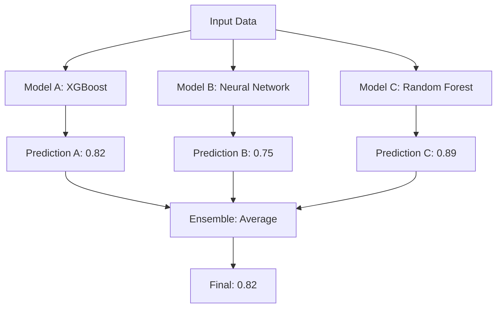

# How to Implement Model Ensembles on Vertex AI Prediction Endpoints

Author: [nawazdhandala](https://www.github.com/nawazdhandala)

Tags: GCP, Vertex AI, Model Ensembles, Prediction, Machine Learning

Description: A practical guide to implementing model ensembles on Vertex AI prediction endpoints for improved accuracy and robustness in production ML systems.

---

A single model gives you a single perspective on your data. An ensemble of models gives you multiple perspectives, and the combined prediction is almost always better than any individual model. This is not just theory - ensemble methods consistently win ML competitions and power critical production systems at companies like Netflix, Uber, and Google.

On Vertex AI, you can implement ensembles in several ways: through a custom container that calls multiple models, by deploying models to separate endpoints and combining results in your application, or by using a routing layer that dispatches to different models. This guide walks through practical implementations of each approach.

## Why Ensembles Work

Different model architectures make different kinds of errors. A gradient boosted tree might struggle with rare patterns that a neural network captures. A neural network might overfit to noise that the tree model ignores. When you average their predictions, the errors tend to cancel out.



## Approach 1: Custom Container Ensemble

The most straightforward approach is a custom container that loads multiple models and combines their predictions.

This code implements an ensemble server:

```python
# ensemble_server.py - Custom container that serves multiple models

import os
import pickle
import numpy as np
import torch
import xgboost as xgb
from flask import Flask, request, jsonify
from google.cloud import storage

app = Flask(__name__)

# Model storage
models = {}

def download_from_gcs(gcs_uri, local_path):
    """Download a file from GCS."""
    parts = gcs_uri.replace("gs://", "").split("/", 1)
    bucket_name = parts[0]
    blob_path = parts[1]

    client = storage.Client()
    bucket = client.bucket(bucket_name)
    blob = bucket.blob(blob_path)
    blob.download_to_filename(local_path)

def load_models():
    """Load all models in the ensemble."""
    model_dir = os.environ.get("AIP_STORAGE_URI", "/models")

    # Load XGBoost model
    download_from_gcs(f"{model_dir}/xgboost_model.json", "/tmp/xgb.json")
    models["xgboost"] = xgb.Booster()
    models["xgboost"].load_model("/tmp/xgb.json")

    # Load scikit-learn Random Forest
    download_from_gcs(f"{model_dir}/random_forest.pkl", "/tmp/rf.pkl")
    with open("/tmp/rf.pkl", "rb") as f:
        models["random_forest"] = pickle.load(f)

    # Load PyTorch neural network
    download_from_gcs(f"{model_dir}/neural_net.pt", "/tmp/nn.pt")
    models["neural_net"] = torch.jit.load("/tmp/nn.pt")
    models["neural_net"].eval()

    print(f"Loaded {len(models)} models for ensemble")

@app.route("/health", methods=["GET"])
def health():
    """Health check."""
    if len(models) == 3:
        return jsonify({"status": "healthy", "models": list(models.keys())}), 200
    return jsonify({"status": "loading"}), 503

@app.route("/predict", methods=["POST"])
def predict():
    """Ensemble prediction combining all models."""
    data = request.get_json()
    instances = np.array(data.get("instances", []))

    if len(instances) == 0:
        return jsonify({"error": "No instances provided"}), 400

    all_predictions = []

    # XGBoost prediction
    dmatrix = xgb.DMatrix(instances)
    xgb_preds = models["xgboost"].predict(dmatrix)
    all_predictions.append(xgb_preds)

    # Random Forest prediction
    rf_preds = models["random_forest"].predict_proba(instances)[:, 1]
    all_predictions.append(rf_preds)

    # Neural Network prediction
    with torch.no_grad():
        tensor_input = torch.tensor(instances, dtype=torch.float32)
        nn_preds = torch.sigmoid(models["neural_net"](tensor_input)).numpy().flatten()
    all_predictions.append(nn_preds)

    # Combine predictions using weighted average
    weights = [0.4, 0.25, 0.35]  # Tuned on validation set
    ensemble_preds = np.average(all_predictions, axis=0, weights=weights)

    # Build response with individual and ensemble predictions
    results = []
    for i in range(len(instances)):
        results.append({
            "ensemble_prediction": float(ensemble_preds[i]),
            "ensemble_class": int(ensemble_preds[i] > 0.5),
            "individual_predictions": {
                "xgboost": float(all_predictions[0][i]),
                "random_forest": float(all_predictions[1][i]),
                "neural_net": float(all_predictions[2][i])
            }
        })

    return jsonify({"predictions": results}), 200

if __name__ == "__main__":
    load_models()
    port = int(os.environ.get("AIP_HTTP_PORT", 8080))
    app.run(host="0.0.0.0", port=port)
```

## Deploying the Ensemble Container

Build and deploy the ensemble to Vertex AI:

```python
from google.cloud import aiplatform

aiplatform.init(project="your-project-id", location="us-central1")

# Upload the ensemble model
model = aiplatform.Model.upload(
    display_name="fraud-ensemble",
    artifact_uri="gs://your-bucket/models/ensemble/",
    serving_container_image_uri=(
        "us-central1-docker.pkg.dev/your-project/ml-serving/ensemble:v1"
    ),
    serving_container_health_route="/health",
    serving_container_predict_route="/predict",
    serving_container_ports=[8080]
)

# Deploy with enough resources for all three models
endpoint = aiplatform.Endpoint.create(display_name="fraud-ensemble-endpoint")
model.deploy(
    endpoint=endpoint,
    machine_type="n1-standard-8",  # Extra memory for multiple models
    min_replica_count=1,
    max_replica_count=5
)
```

## Approach 2: Multi-Endpoint Ensemble

If your models have different resource requirements or you want to scale them independently, deploy each to its own endpoint and combine results in your application.

This code implements a client-side ensemble:

```python
# client_ensemble.py - Combine predictions from multiple endpoints

import asyncio
from google.cloud import aiplatform
from concurrent.futures import ThreadPoolExecutor

class MultiEndpointEnsemble:
    """Ensemble that queries multiple Vertex AI endpoints in parallel."""

    def __init__(self, endpoints_config):
        """
        Args:
            endpoints_config: List of dicts with 'endpoint_id', 'weight', and 'name'
        """
        self.endpoints = []
        for config in endpoints_config:
            ep = aiplatform.Endpoint(config["endpoint_id"])
            self.endpoints.append({
                "endpoint": ep,
                "weight": config["weight"],
                "name": config["name"]
            })
        self.executor = ThreadPoolExecutor(max_workers=len(self.endpoints))

    def _predict_single(self, endpoint_config, instances):
        """Get prediction from a single endpoint."""
        try:
            response = endpoint_config["endpoint"].predict(instances=instances)
            return {
                "name": endpoint_config["name"],
                "predictions": response.predictions,
                "weight": endpoint_config["weight"]
            }
        except Exception as e:
            print(f"Error from {endpoint_config['name']}: {e}")
            return None

    def predict(self, instances):
        """Get ensemble prediction by querying all endpoints in parallel."""
        # Submit all predictions in parallel
        futures = [
            self.executor.submit(self._predict_single, ep, instances)
            for ep in self.endpoints
        ]

        # Collect results
        results = [f.result() for f in futures]
        valid_results = [r for r in results if r is not None]

        if not valid_results:
            raise RuntimeError("All ensemble models failed")

        # Combine with weighted average
        num_instances = len(instances)
        ensemble_preds = [0.0] * num_instances

        total_weight = sum(r["weight"] for r in valid_results)

        for result in valid_results:
            normalized_weight = result["weight"] / total_weight
            for i, pred in enumerate(result["predictions"]):
                # Handle different prediction formats
                score = pred if isinstance(pred, (int, float)) else pred[0]
                ensemble_preds[i] += score * normalized_weight

        return {
            "ensemble_predictions": ensemble_preds,
            "individual_results": valid_results,
            "models_used": len(valid_results)
        }

# Usage
ensemble = MultiEndpointEnsemble([
    {
        "endpoint_id": "projects/your-project/locations/us-central1/endpoints/EP1",
        "weight": 0.4,
        "name": "xgboost"
    },
    {
        "endpoint_id": "projects/your-project/locations/us-central1/endpoints/EP2",
        "weight": 0.35,
        "name": "neural_net"
    },
    {
        "endpoint_id": "projects/your-project/locations/us-central1/endpoints/EP3",
        "weight": 0.25,
        "name": "random_forest"
    }
])

result = ensemble.predict([[0.5, 0.3, 0.8, 1.2, 0.1]])
print(f"Ensemble prediction: {result['ensemble_predictions']}")
```

## Approach 3: Stacking Ensemble

A stacking ensemble uses a meta-model that learns how to best combine the predictions of base models. This is more powerful than simple averaging.

This code implements a stacking approach:

```python
# stacking_server.py - Stacking ensemble with a meta-learner

import pickle
import numpy as np
from flask import Flask, request, jsonify

app = Flask(__name__)

base_models = {}
meta_model = None

def load_models():
    """Load base models and meta-learner."""
    global meta_model

    # Load base models (same as before)
    with open("/tmp/model_a.pkl", "rb") as f:
        base_models["model_a"] = pickle.load(f)
    with open("/tmp/model_b.pkl", "rb") as f:
        base_models["model_b"] = pickle.load(f)
    with open("/tmp/model_c.pkl", "rb") as f:
        base_models["model_c"] = pickle.load(f)

    # Load the meta-learner (trained on base model outputs)
    with open("/tmp/meta_model.pkl", "rb") as f:
        meta_model = pickle.load(f)

@app.route("/predict", methods=["POST"])
def predict():
    """Stacking ensemble prediction."""
    data = request.get_json()
    instances = np.array(data.get("instances", []))

    # Get predictions from each base model
    base_predictions = []
    for name, model in base_models.items():
        if hasattr(model, "predict_proba"):
            preds = model.predict_proba(instances)[:, 1]
        else:
            preds = model.predict(instances)
        base_predictions.append(preds)

    # Stack base predictions as features for the meta-model
    meta_features = np.column_stack(base_predictions)

    # Meta-model makes the final prediction
    final_predictions = meta_model.predict_proba(meta_features)[:, 1]

    results = [
        {"prediction": float(p), "class": int(p > 0.5)}
        for p in final_predictions
    ]

    return jsonify({"predictions": results}), 200
```

## Training the Stacking Meta-Model

The meta-model is trained on out-of-fold predictions from the base models to avoid overfitting:

```python
from sklearn.model_selection import cross_val_predict
from sklearn.linear_model import LogisticRegression

def train_stacking_ensemble(X_train, y_train, base_models):
    """Train a stacking ensemble with cross-validated base predictions."""
    meta_features = []

    for name, model in base_models.items():
        # Get out-of-fold predictions using cross-validation
        oof_preds = cross_val_predict(
            model, X_train, y_train,
            cv=5, method="predict_proba"
        )[:, 1]
        meta_features.append(oof_preds)

        # Fit base model on full training data
        model.fit(X_train, y_train)

    # Stack predictions as meta-features
    meta_X = np.column_stack(meta_features)

    # Train meta-learner on the stacked predictions
    meta_model = LogisticRegression(C=1.0)
    meta_model.fit(meta_X, y_train)

    return base_models, meta_model
```

## Monitoring Ensemble Performance

Track both the ensemble and individual model performance to know when a model should be replaced or reweighted:

```python
def log_ensemble_metrics(ensemble_pred, individual_preds, ground_truth):
    """Compare ensemble vs individual model performance."""
    from sklearn.metrics import roc_auc_score, accuracy_score

    # Ensemble metrics
    ensemble_auc = roc_auc_score(ground_truth, ensemble_pred)
    print(f"Ensemble AUC: {ensemble_auc:.4f}")

    # Individual model metrics
    for name, preds in individual_preds.items():
        auc = roc_auc_score(ground_truth, preds)
        print(f"  {name} AUC: {auc:.4f} (delta: {ensemble_auc - auc:+.4f})")
```

Ensemble methods on Vertex AI add reliability and accuracy to your prediction system. The right approach depends on your latency requirements, operational complexity tolerance, and how different your base models are. Start with a simple weighted average in a custom container, and graduate to stacking when you need every last bit of accuracy.
