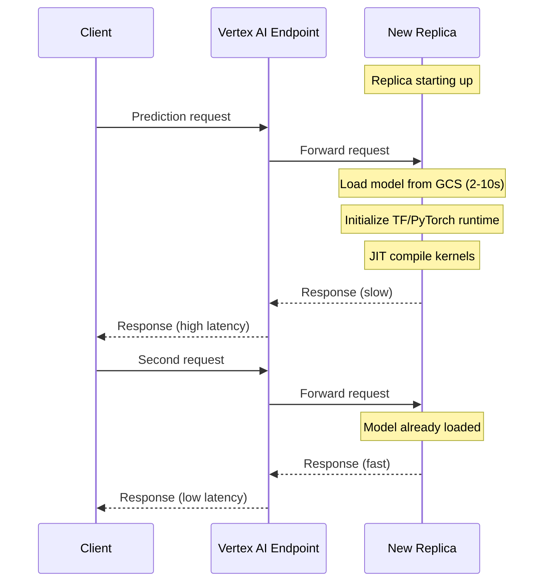

# How to Implement Model Warm-Up and Traffic Splitting on Vertex AI Endpoints

Author: [nawazdhandala](https://www.github.com/nawazdhandala)

Tags: GCP, Vertex AI, Model Serving, Traffic Splitting, Warm-Up

Description: Learn how to configure model warm-up for reduced cold-start latency and traffic splitting for safe model rollouts on Vertex AI endpoints.

---

You have trained a better model and you want to deploy it. But switching all traffic instantly from the old model to the new one is risky. What if the new model has a subtle bug that only shows up under production traffic? And even if the model is fine, the first requests after deployment often suffer from high latency because the model has not been loaded into memory yet.

Model warm-up and traffic splitting solve these two problems. Warm-up ensures your model is ready to serve low-latency predictions from the very first request. Traffic splitting lets you gradually shift traffic from the old model to the new one, monitoring for issues along the way.

## Understanding Cold Start Latency

When Vertex AI spins up a new replica of your model, the first prediction request triggers model loading into memory, JIT compilation of optimized kernels, and initialization of any caches. This can add seconds to the first few requests.



## Configuring Model Warm-Up with TensorFlow Serving

If you use TensorFlow models with the pre-built TF serving container, you can provide warm-up requests that execute during startup before the model starts receiving real traffic.

First, create the warm-up data file. TensorFlow Serving looks for warm-up requests in a specific location within your saved model directory.

This code generates a warm-up request file:

```python
# generate_warmup.py - Create warm-up data for TF Serving

import tensorflow as tf
from tensorflow_serving.apis import predict_pb2, prediction_log_pb2
import numpy as np

def create_warmup_file(saved_model_dir, num_warmup_requests=100):
    """Generate warm-up requests and save them in the model directory.

    The warm-up file must be at:
    <model_dir>/assets.extra/tf_serving_warmup_requests
    """
    warmup_dir = f"{saved_model_dir}/assets.extra"
    tf.io.gfile.makedirs(warmup_dir)
    warmup_file = f"{warmup_dir}/tf_serving_warmup_requests"

    with tf.io.TFRecordWriter(warmup_file) as writer:
        for _ in range(num_warmup_requests):
            # Create a sample input that matches your model's expected shape
            sample_input = np.random.randn(1, 512).astype(np.float32)

            # Build a PredictionLog with the sample request
            predict_request = predict_pb2.PredictRequest()
            predict_request.model_spec.name = "default"
            predict_request.model_spec.signature_name = "serving_default"
            predict_request.inputs["input_1"].CopyFrom(
                tf.make_tensor_proto(sample_input)
            )

            log = prediction_log_pb2.PredictionLog(
                predict_log=prediction_log_pb2.PredictLog(
                    request=predict_request
                )
            )

            writer.write(log.SerializeToString())

    print(f"Created {num_warmup_requests} warm-up requests at {warmup_file}")

# Generate warm-up file for your saved model
create_warmup_file("gs://your-bucket/models/my-model/1/")
```

## Custom Container Warm-Up

If you use a custom serving container, implement warm-up in your server startup code. Run sample predictions before marking the health check as ready.

This code implements warm-up in a custom Flask server:

```python
# app.py - Custom serving container with warm-up

import os
import numpy as np
from flask import Flask, request, jsonify
import time

app = Flask(__name__)

model = None
is_warm = False  # Track warm-up status

def load_and_warm_model():
    """Load the model and run warm-up predictions."""
    global model, is_warm

    # Load the model
    import tensorflow as tf
    model_dir = os.environ.get("AIP_STORAGE_URI", "/models")
    model = tf.keras.models.load_model(model_dir)
    print("Model loaded successfully")

    # Run warm-up predictions to initialize caches and compile kernels
    print("Starting warm-up...")
    warmup_start = time.time()

    for i in range(50):
        # Use representative input shapes
        dummy_input = np.random.randn(1, 512).astype(np.float32)
        _ = model.predict(dummy_input, verbose=0)

    warmup_time = time.time() - warmup_start
    print(f"Warm-up complete in {warmup_time:.2f}s ({50} predictions)")

    is_warm = True

@app.route("/health", methods=["GET"])
def health():
    """Only report healthy after warm-up is complete."""
    if is_warm:
        return jsonify({"status": "healthy", "warm": True}), 200
    return jsonify({"status": "warming_up", "warm": False}), 503

@app.route("/predict", methods=["POST"])
def predict():
    """Handle prediction requests."""
    data = request.get_json()
    instances = np.array(data.get("instances", []))
    predictions = model.predict(instances, verbose=0)
    return jsonify({"predictions": predictions.tolist()})

if __name__ == "__main__":
    load_and_warm_model()
    port = int(os.environ.get("AIP_HTTP_PORT", 8080))
    app.run(host="0.0.0.0", port=port)
```

The key insight here is that the health endpoint returns 503 until warm-up is complete. Vertex AI will not route traffic to the replica until the health check passes, so users never see cold-start latency.

## Setting Up Traffic Splitting

Traffic splitting lets you deploy a new model alongside the current one and gradually shift traffic. This is essential for safe rollouts.

This code deploys two models with an initial 90/10 split:

```python
from google.cloud import aiplatform

aiplatform.init(project="your-project-id", location="us-central1")

# Create endpoint
endpoint = aiplatform.Endpoint.create(
    display_name="recommendation-endpoint"
)

# Deploy the current production model with 90% traffic
model_v1 = aiplatform.Model("projects/your-project-id/locations/us-central1/models/MODEL_V1_ID")
model_v1.deploy(
    endpoint=endpoint,
    deployed_model_display_name="rec-model-v1-prod",
    machine_type="n1-standard-4",
    min_replica_count=2,
    max_replica_count=5,
    traffic_percentage=90
)

# Deploy the new model with 10% traffic (canary)
model_v2 = aiplatform.Model("projects/your-project-id/locations/us-central1/models/MODEL_V2_ID")
model_v2.deploy(
    endpoint=endpoint,
    deployed_model_display_name="rec-model-v2-canary",
    machine_type="n1-standard-4",
    min_replica_count=1,
    max_replica_count=3,
    traffic_percentage=10
)

print(f"Endpoint with traffic split: {endpoint.resource_name}")
```

## Automated Rollout with Health Checks

For production deployments, automate the traffic shifting with health checks at each stage.

This code implements an automated rollout with monitoring:

```python
import time
from google.cloud import aiplatform, monitoring_v3
import datetime

def get_error_rate(project_id, endpoint_id, model_id, window_minutes=15):
    """Check the error rate for a deployed model over a time window."""
    client = monitoring_v3.MetricServiceClient()
    now = datetime.datetime.now(datetime.timezone.utc)

    interval = monitoring_v3.TimeInterval({
        "start_time": {"seconds": int((now - datetime.timedelta(minutes=window_minutes)).timestamp())},
        "end_time": {"seconds": int(now.timestamp())}
    })

    # Query error count
    error_results = client.list_time_series(
        request={
            "name": f"projects/{project_id}",
            "filter": (
                f'resource.type="aiplatform.googleapis.com/Endpoint" '
                f'AND metric.type="aiplatform.googleapis.com/prediction/online/error_count" '
                f'AND resource.labels.endpoint_id="{endpoint_id}" '
                f'AND metric.labels.deployed_model_id="{model_id}"'
            ),
            "interval": interval,
            "aggregation": monitoring_v3.Aggregation(
                alignment_period={"seconds": window_minutes * 60},
                per_series_aligner=monitoring_v3.Aggregation.Aligner.ALIGN_SUM
            )
        }
    )

    total_errors = sum(
        point.value.int64_value
        for series in error_results
        for point in series.points
    )

    return total_errors

def safe_rollout(endpoint, new_model_id, old_model_id, project_id, endpoint_id):
    """Perform a safe rollout with automatic rollback on errors."""
    stages = [
        {"new_pct": 10, "wait_minutes": 15, "max_errors": 5},
        {"new_pct": 25, "wait_minutes": 15, "max_errors": 10},
        {"new_pct": 50, "wait_minutes": 30, "max_errors": 20},
        {"new_pct": 75, "wait_minutes": 15, "max_errors": 30},
        {"new_pct": 100, "wait_minutes": 0, "max_errors": 0}
    ]

    for stage in stages:
        new_pct = stage["new_pct"]
        old_pct = 100 - new_pct

        # Update traffic split
        traffic = {}
        if new_pct > 0:
            traffic[new_model_id] = new_pct
        if old_pct > 0:
            traffic[old_model_id] = old_pct

        endpoint.update(traffic_split=traffic)
        print(f"Traffic: new={new_pct}%, old={old_pct}%")

        if stage["wait_minutes"] > 0:
            print(f"Monitoring for {stage['wait_minutes']} minutes...")
            time.sleep(stage["wait_minutes"] * 60)

            # Check error rate
            errors = get_error_rate(
                project_id, endpoint_id, new_model_id,
                window_minutes=stage["wait_minutes"]
            )

            if errors > stage["max_errors"]:
                print(f"Too many errors ({errors}), rolling back!")
                endpoint.update(traffic_split={old_model_id: 100})
                return False

            print(f"Errors in window: {errors} (threshold: {stage['max_errors']})")

    print("Rollout complete successfully!")
    return True
```

## Configuring Autoscaling for Traffic Splits

When running multiple models on an endpoint, configure autoscaling for each model based on its expected traffic share.

```python
# The canary model needs fewer replicas since it handles less traffic
model_v2.deploy(
    endpoint=endpoint,
    deployed_model_display_name="rec-model-v2-canary",
    machine_type="n1-standard-4",
    min_replica_count=1,  # Minimum 1 for the canary
    max_replica_count=3,
    traffic_percentage=10,
    # Autoscaling configuration
    autoscaling_target_cpu_utilization=60,  # Scale up at 60% CPU
    autoscaling_target_accelerator_duty_cycle=60  # For GPU models
)
```

## Monitoring Traffic Split Performance

Track key metrics for each model version to make informed rollout decisions.

```python
def compare_model_performance(endpoint, deployed_models):
    """Compare latency and error rates across deployed models."""
    for dm in deployed_models:
        print(f"\nModel: {dm.display_name} (ID: {dm.id})")

        # Get latency metrics
        # These come from Cloud Monitoring
        latency = get_metric(
            "aiplatform.googleapis.com/prediction/online/prediction_latencies",
            dm.id
        )
        print(f"  P50 Latency: {latency.get('p50', 'N/A')}ms")
        print(f"  P99 Latency: {latency.get('p99', 'N/A')}ms")

        # Get prediction count
        count = get_metric(
            "aiplatform.googleapis.com/prediction/online/prediction_count",
            dm.id
        )
        print(f"  Prediction Count: {count}")

        # Get error count
        errors = get_metric(
            "aiplatform.googleapis.com/prediction/online/error_count",
            dm.id
        )
        print(f"  Error Count: {errors}")
```

Model warm-up eliminates the cold-start penalty that would otherwise affect your first users after a deployment or scale-up event. Traffic splitting gives you the safety net to deploy with confidence, catching issues while they affect only a small fraction of your traffic. Together, they make Vertex AI model deployments production-ready.
