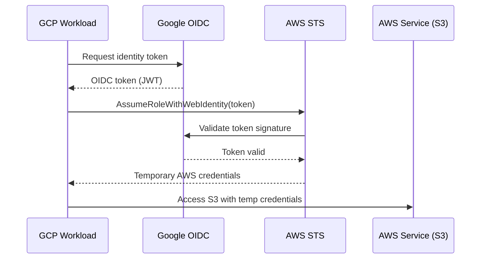

# How to Implement Multi-Cloud Identity Federation Between GCP IAM and AWS IAM Using Workload Identity

Author: [nawazdhandala](https://www.github.com/nawazdhandala)

Tags: GCP, AWS, Workload Identity, IAM Federation, Multi-Cloud Security

Description: Learn how to implement secure multi-cloud identity federation between GCP and AWS using workload identity federation to eliminate long-lived credentials.

---

If you are running workloads across GCP and AWS, you have probably dealt with the pain of managing cross-cloud credentials. A GCP Cloud Function needs to read from an S3 bucket. A GKE pod needs to call an AWS API. The old way was to create long-lived AWS access keys and store them as secrets in GCP. That works, but it is a security risk - those keys never expire unless you rotate them, and if they leak, an attacker has access until you notice.

Workload identity federation solves this by letting GCP workloads authenticate to AWS using short-lived tokens, with no static credentials anywhere. In this post, I will show you how to set it up in both directions.

## How Workload Identity Federation Works

The core idea is simple: instead of using static credentials, your GCP workload presents its GCP identity token to AWS, and AWS validates it against Google's OIDC endpoint. If the token is valid and the identity matches the trust policy, AWS issues temporary credentials.



No static keys. Tokens expire automatically. And the trust relationship is explicit - you define exactly which GCP identities can assume which AWS roles.

## GCP to AWS: Accessing AWS Resources from GCP Workloads

### Step 1: Create an OIDC Provider in AWS

First, register Google as an identity provider in your AWS account:

```bash
# Get Google's OIDC thumbprint (you need this for the provider)
# The thumbprint for accounts.google.com
THUMBPRINT="08745487e891c19e3078c1f2a07e452950ef36f6"

# Create the OIDC provider
aws iam create-open-id-connect-provider \
  --url https://accounts.google.com \
  --client-id-list "sts.amazonaws.com" \
  --thumbprint-list "$THUMBPRINT"
```

### Step 2: Create an AWS IAM Role with a Trust Policy

Create a role that trusts specific GCP service accounts:

```bash
# Create the trust policy
# This allows a specific GCP service account to assume this AWS role
cat > trust-policy.json << 'POLICY'
{
  "Version": "2012-10-17",
  "Statement": [
    {
      "Effect": "Allow",
      "Principal": {
        "Federated": "arn:aws:iam::123456789012:oidc-provider/accounts.google.com"
      },
      "Action": "sts:AssumeRoleWithWebIdentity",
      "Condition": {
        "StringEquals": {
          "accounts.google.com:oaud": "sts.amazonaws.com",
          "accounts.google.com:sub": "SERVICE_ACCOUNT_UNIQUE_ID"
        }
      }
    }
  ]
}
POLICY

# Create the role
aws iam create-role \
  --role-name gcp-cross-cloud-access \
  --assume-role-policy-document file://trust-policy.json

# Attach the permissions the GCP workload needs
aws iam attach-role-policy \
  --role-name gcp-cross-cloud-access \
  --policy-arn arn:aws:iam::aws:policy/AmazonS3ReadOnlyAccess
```

To get the service account unique ID from GCP:

```bash
# Get the unique ID of your GCP service account
gcloud iam service-accounts describe \
  my-service@my-gcp-project.iam.gserviceaccount.com \
  --format="value(uniqueId)"
```

### Step 3: Access AWS from a GCP Workload

Here is how a Cloud Function or GKE workload authenticates to AWS:

```python
# gcp_to_aws.py - Access AWS resources from a GCP workload
import google.auth
import google.auth.transport.requests
import boto3

def get_aws_session():
    """
    Create an AWS session using GCP identity federation.
    No static AWS credentials needed.
    """
    # Get a Google ID token targeting AWS STS
    credentials, project = google.auth.default()
    auth_request = google.auth.transport.requests.Request()
    credentials.refresh(auth_request)

    # Get an ID token for the AWS STS audience
    id_token_credentials = google.oauth2.id_token.fetch_id_token(
        auth_request,
        target_audience='sts.amazonaws.com'
    )

    # Use the ID token to assume the AWS role
    sts_client = boto3.client('sts', region_name='us-east-1')
    response = sts_client.assume_role_with_web_identity(
        RoleArn='arn:aws:iam::123456789012:role/gcp-cross-cloud-access',
        RoleSessionName='gcp-workload-session',
        WebIdentityToken=id_token_credentials,
        DurationSeconds=3600
    )

    # Create a session with the temporary credentials
    session = boto3.Session(
        aws_access_key_id=response['Credentials']['AccessKeyId'],
        aws_secret_access_key=response['Credentials']['SecretAccessKey'],
        aws_session_token=response['Credentials']['SessionToken'],
        region_name='us-east-1'
    )

    return session

def read_s3_file(bucket, key):
    """Read a file from S3 using federated credentials."""
    session = get_aws_session()
    s3 = session.client('s3')
    response = s3.get_object(Bucket=bucket, Key=key)
    return response['Body'].read().decode('utf-8')
```

## AWS to GCP: Accessing GCP Resources from AWS Workloads

The reverse direction uses GCP's Workload Identity Federation to let AWS workloads access GCP resources.

### Step 1: Create a Workload Identity Pool in GCP

```bash
# Create a workload identity pool
gcloud iam workload-identity-pools create aws-pool \
  --location=global \
  --display-name="AWS Workload Identity Pool"

# Create an AWS provider in the pool
gcloud iam workload-identity-pools providers create-aws aws-provider \
  --location=global \
  --workload-identity-pool=aws-pool \
  --account-id=123456789012 \
  --display-name="AWS Account"
```

### Step 2: Grant GCP Permissions to the AWS Identity

```bash
# Create a service account for AWS workloads to impersonate
gcloud iam service-accounts create aws-workload-sa \
  --display-name="AWS Workload Service Account"

# Grant the service account access to GCP resources
gcloud projects add-iam-policy-binding my-gcp-project \
  --member="serviceAccount:aws-workload-sa@my-gcp-project.iam.gserviceaccount.com" \
  --role="roles/storage.objectViewer"

# Allow the specific AWS role to impersonate this service account
gcloud iam service-accounts add-iam-policy-binding \
  aws-workload-sa@my-gcp-project.iam.gserviceaccount.com \
  --role="roles/iam.workloadIdentityUser" \
  --member="principalSet://iam.googleapis.com/projects/PROJECT_NUMBER/locations/global/workloadIdentityPools/aws-pool/attribute.aws_role/arn:aws:sts::123456789012:assumed-role/my-aws-role"
```

### Step 3: Access GCP from an AWS Workload

Create a credential configuration file that tells the GCP SDK how to get credentials from AWS:

```bash
# Generate the credential configuration file
gcloud iam workload-identity-pools create-cred-config \
  projects/PROJECT_NUMBER/locations/global/workloadIdentityPools/aws-pool/providers/aws-provider \
  --service-account=aws-workload-sa@my-gcp-project.iam.gserviceaccount.com \
  --aws \
  --output-file=gcp-credentials.json
```

Use the credentials in your AWS-hosted application:

```python
# aws_to_gcp.py - Access GCP resources from an AWS workload
import os
from google.cloud import storage

# Set the credentials file path
os.environ['GOOGLE_APPLICATION_CREDENTIALS'] = 'gcp-credentials.json'

def list_gcs_objects(bucket_name, prefix=''):
    """
    List objects in a GCS bucket from an AWS workload.
    Authentication happens automatically via workload identity federation.
    """
    client = storage.Client()
    bucket = client.bucket(bucket_name)
    blobs = bucket.list_blobs(prefix=prefix)

    for blob in blobs:
        print(f"{blob.name} - {blob.size} bytes")

def download_gcs_file(bucket_name, blob_name, destination):
    """Download a file from GCS to the local filesystem."""
    client = storage.Client()
    bucket = client.bucket(bucket_name)
    blob = bucket.blob(blob_name)
    blob.download_to_filename(destination)
    print(f"Downloaded {blob_name} to {destination}")
```

## Security Best Practices

A few important things to keep in mind when setting up cross-cloud federation:

**Scope trust policies narrowly.** Do not trust all identities from an AWS account or all service accounts in a GCP project. Specify exact role ARNs and service account emails.

**Set short session durations.** The default session duration for assumed roles is 1 hour. For automated workloads, this is usually fine. For sensitive operations, consider shorter durations:

```python
# Request a shorter session for sensitive operations
response = sts_client.assume_role_with_web_identity(
    RoleArn='arn:aws:iam::123456789012:role/sensitive-access',
    RoleSessionName='sensitive-session',
    WebIdentityToken=id_token,
    DurationSeconds=900  # 15 minutes
)
```

**Audit cross-cloud access.** Enable CloudTrail in AWS and Cloud Audit Logs in GCP to track all cross-cloud authentication events:

```bash
# Query GCP audit logs for workload identity federation events
gcloud logging read 'resource.type="iam_service_account" AND protoPayload.methodName="GenerateAccessToken"' \
  --limit=50 \
  --format=json
```

## Wrapping Up

Workload identity federation eliminates the need for static credentials in multi-cloud architectures. GCP workloads authenticate to AWS using their native Google identity, and AWS workloads authenticate to GCP using their native AWS role - no secrets to manage, rotate, or risk leaking.

The setup takes some effort on both sides, but once it is in place, cross-cloud authentication becomes transparent to your application code. Your workloads just use the standard SDKs, and the federation layer handles the rest.
