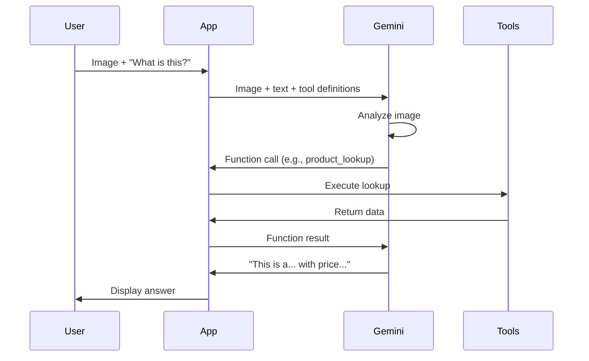

# How to Implement Multimodal Function Calling with Gemini 3 on Vertex AI

Author: [nawazdhandala](https://www.github.com/nawazdhandala)

Tags: GCP, Gemini 3, Vertex AI, Function Calling, Multimodal AI

Description: Learn how to implement multimodal function calling with Gemini 3 on Vertex AI where the model processes images, audio, and video while calling external tools.

---

Multimodal function calling is when the model processes visual, audio, or video input and decides to call external tools based on what it sees or hears. Imagine pointing a camera at a product barcode and having the model automatically look up the product details, or sending a screenshot of an error message and having it search your knowledge base for solutions.

Gemini 3 handles this natively - it can reason about multimodal inputs and make function call decisions in a single pass. In this post, I will show you how to build applications that combine visual understanding with tool execution.

## Understanding Multimodal Function Calling

In standard function calling, the model reads text and decides whether to call a tool. In multimodal function calling, the model can look at an image, listen to audio, or watch a video and make the same decision. The model might see a chart and decide it needs to fetch the underlying data, or hear a meeting recording and decide to create calendar events.

The flow looks like this:



## Setting Up Multimodal Tools

Define tools that complement visual or audio analysis.

```python
import vertexai
from vertexai.generative_models import (
    GenerativeModel,
    FunctionDeclaration,
    Part,
    Tool,
    Image,
)

# Initialize Vertex AI
vertexai.init(project="your-project-id", location="us-central1")

# Define tools that work with visual context
product_lookup = FunctionDeclaration(
    name="lookup_product",
    description=(
        "Look up product details by name, barcode, or description. "
        "Use this when you identify a product in an image."
    ),
    parameters={
        "type": "object",
        "properties": {
            "product_name": {
                "type": "string",
                "description": "Name or description of the product"
            },
            "barcode": {
                "type": "string",
                "description": "Barcode number if visible in the image"
            },
            "category": {
                "type": "string",
                "description": "Product category if identifiable"
            }
        },
        "required": ["product_name"]
    }
)

location_info = FunctionDeclaration(
    name="get_location_info",
    description=(
        "Get information about a location identified in an image. "
        "Use this when you recognize a landmark, building, or place."
    ),
    parameters={
        "type": "object",
        "properties": {
            "location_name": {
                "type": "string",
                "description": "Name of the location or landmark"
            },
            "location_type": {
                "type": "string",
                "enum": ["landmark", "restaurant", "store", "office", "park", "other"]
            }
        },
        "required": ["location_name"]
    }
)

search_error = FunctionDeclaration(
    name="search_error_database",
    description=(
        "Search the error database for solutions to error messages. "
        "Use this when you see an error message in a screenshot."
    ),
    parameters={
        "type": "object",
        "properties": {
            "error_message": {
                "type": "string",
                "description": "The error message text seen in the image"
            },
            "application": {
                "type": "string",
                "description": "The application where the error occurred"
            }
        },
        "required": ["error_message"]
    }
)

# Bundle all tools
visual_tools = Tool(
    function_declarations=[product_lookup, location_info, search_error]
)

# Create the model
model = GenerativeModel(
    "gemini-3.0-flash",
    tools=[visual_tools],
    system_instruction=(
        "You are a visual analysis assistant with access to external tools. "
        "When you see something in an image that could benefit from additional "
        "data, use the available tools to get more information."
    )
)
```

## Processing Images with Function Calls

Send an image and let the model decide which tools to call based on what it sees.

```python
def execute_visual_tool(function_name, args):
    """Execute a tool triggered by visual analysis."""
    args_dict = dict(args)

    if function_name == "lookup_product":
        # In production, call your product database
        return {
            "product_name": args_dict.get("product_name"),
            "price": 29.99,
            "in_stock": True,
            "rating": 4.5,
            "reviews": 1247,
            "description": "High-quality product with excellent reviews."
        }

    elif function_name == "get_location_info":
        return {
            "name": args_dict.get("location_name"),
            "address": "123 Main Street",
            "hours": "9 AM - 9 PM",
            "rating": 4.2,
            "phone": "+1-555-0123"
        }

    elif function_name == "search_error_database":
        return {
            "error": args_dict.get("error_message"),
            "solutions": [
                "Check if the service is running with systemctl status",
                "Verify network connectivity to the database",
                "Check application logs for more details"
            ],
            "related_docs": ["https://docs.example.com/troubleshooting"]
        }

    return {"error": f"Unknown tool: {function_name}"}


def process_image_with_tools(image_path, user_query):
    """Process an image with potential function calls."""
    # Load the image
    image = Image.load_from_file(image_path)

    # Send to Gemini
    chat = model.start_chat()
    response = chat.send_message([image, user_query])

    # Check for function calls
    function_responses = []
    for part in response.candidates[0].content.parts:
        if part.function_call:
            fc = part.function_call
            print(f"Tool called: {fc.name}({dict(fc.args)})")
            result = execute_visual_tool(fc.name, fc.args)
            function_responses.append(
                Part.from_function_response(
                    name=fc.name,
                    response={"result": result}
                )
            )
        elif part.text:
            print(f"Direct response: {part.text}")

    # If tools were called, send results back
    if function_responses:
        final_response = chat.send_message(function_responses)
        return final_response.text

    return response.text

# Example: analyze a screenshot of an error
result = process_image_with_tools(
    "error-screenshot.png",
    "What is this error and how do I fix it?"
)
print(result)
```

## Video Analysis with Tool Calls

Gemini can watch a video and call tools based on what it observes.

```python
def analyze_video_with_tools(video_uri, analysis_request):
    """Analyze a video and use tools for additional context."""
    video_part = Part.from_uri(uri=video_uri, mime_type="video/mp4")

    chat = model.start_chat()
    response = chat.send_message([video_part, analysis_request])

    # Handle potential function calls
    all_tool_results = []
    max_rounds = 3

    for round_num in range(max_rounds):
        function_calls = [
            part for part in response.candidates[0].content.parts
            if part.function_call
        ]

        if not function_calls:
            break

        function_responses = []
        for part in function_calls:
            fc = part.function_call
            result = execute_visual_tool(fc.name, fc.args)
            all_tool_results.append({
                "tool": fc.name,
                "args": dict(fc.args),
                "result": result
            })
            function_responses.append(
                Part.from_function_response(
                    name=fc.name,
                    response={"result": result}
                )
            )

        response = chat.send_message(function_responses)

    return {
        "analysis": response.text,
        "tools_used": all_tool_results
    }

# Analyze a product demo video
result = analyze_video_with_tools(
    "gs://your-bucket/product-demo.mp4",
    "Watch this product demo and look up detailed specs for each product shown."
)
print(result["analysis"])
```

## Building a Visual Search Agent

Create an agent that takes photos and searches for information automatically.

```python
class VisualSearchAgent:
    """Agent that processes images and searches for related information."""

    def __init__(self):
        # Define search-oriented tools
        web_search = FunctionDeclaration(
            name="web_search",
            description="Search the web for information about something seen in an image.",
            parameters={
                "type": "object",
                "properties": {
                    "query": {
                        "type": "string",
                        "description": "Search query based on visual analysis"
                    }
                },
                "required": ["query"]
            }
        )

        price_check = FunctionDeclaration(
            name="check_price",
            description="Check the current market price for an item identified in an image.",
            parameters={
                "type": "object",
                "properties": {
                    "item_name": {"type": "string"},
                    "condition": {
                        "type": "string",
                        "enum": ["new", "used", "refurbished"]
                    }
                },
                "required": ["item_name"]
            }
        )

        search_tools = Tool(function_declarations=[web_search, price_check])

        self.model = GenerativeModel(
            "gemini-3.0-flash",
            tools=[search_tools],
            system_instruction=(
                "You are a visual search assistant. Analyze images and "
                "automatically search for relevant information using your tools. "
                "Identify items, landmarks, text, and anything else noteworthy."
            )
        )

    def search(self, image_path, context=""):
        """Analyze an image and search for related information."""
        image = Image.load_from_file(image_path)

        prompt = "Analyze this image and search for relevant information."
        if context:
            prompt += f" Context: {context}"

        chat = self.model.start_chat()
        response = chat.send_message([image, prompt])

        # Handle tool calls
        while True:
            calls = [
                p for p in response.candidates[0].content.parts
                if p.function_call
            ]

            if not calls:
                break

            responses = []
            for part in calls:
                fc = part.function_call
                result = self._execute(fc.name, dict(fc.args))
                responses.append(
                    Part.from_function_response(
                        name=fc.name,
                        response={"result": result}
                    )
                )

            response = chat.send_message(responses)

        return response.text

    def _execute(self, name, args):
        """Execute a search tool."""
        if name == "web_search":
            # In production, use a real search API
            return {"results": [
                {"title": "Relevant result", "snippet": "Information found..."}
            ]}
        elif name == "check_price":
            return {"price_range": "$50-$150", "average": "$89"}
        return {"error": "Unknown tool"}

# Usage
agent = VisualSearchAgent()
info = agent.search("product-photo.jpg", context="I want to buy this")
print(info)
```

## Combining Audio and Function Calling

Process audio input and make tool calls based on what the model hears.

```python
def process_audio_with_tools(audio_uri, instruction):
    """Process audio and call tools based on audio content."""
    audio_part = Part.from_uri(uri=audio_uri, mime_type="audio/mp3")

    # Define audio-appropriate tools
    create_task = FunctionDeclaration(
        name="create_task",
        description="Create a task or action item mentioned in the audio.",
        parameters={
            "type": "object",
            "properties": {
                "title": {"type": "string"},
                "assignee": {"type": "string"},
                "due_date": {"type": "string"},
                "priority": {"type": "string", "enum": ["high", "medium", "low"]}
            },
            "required": ["title"]
        }
    )

    audio_tools = Tool(function_declarations=[create_task])

    audio_model = GenerativeModel("gemini-3.0-flash", tools=[audio_tools])
    chat = audio_model.start_chat()

    response = chat.send_message([audio_part, instruction])

    # Collect all function calls
    tasks_created = []
    for part in response.candidates[0].content.parts:
        if part.function_call:
            fc = part.function_call
            tasks_created.append(dict(fc.args))

    return {
        "text_response": response.text if any(p.text for p in response.candidates[0].content.parts) else "",
        "tasks_created": tasks_created
    }

# Process a meeting recording
result = process_audio_with_tools(
    "gs://your-bucket/meeting.mp3",
    "Listen to this meeting recording. Identify all action items and create tasks for each."
)
print(f"Tasks found: {len(result['tasks_created'])}")
for task in result["tasks_created"]:
    print(f"  - {task.get('title')} (assigned to: {task.get('assignee', 'unassigned')})")
```

## Wrapping Up

Multimodal function calling with Gemini 3 lets you build AI agents that see, hear, and act. The model processes visual and audio inputs, understands what it perceives, and calls the right tools to get additional information or take action. Start with simple image-to-tool-call patterns, then expand to video and audio. Monitor the accuracy of your visual tool selection with tools like OneUptime to ensure the model consistently picks the right tools based on what it sees.
