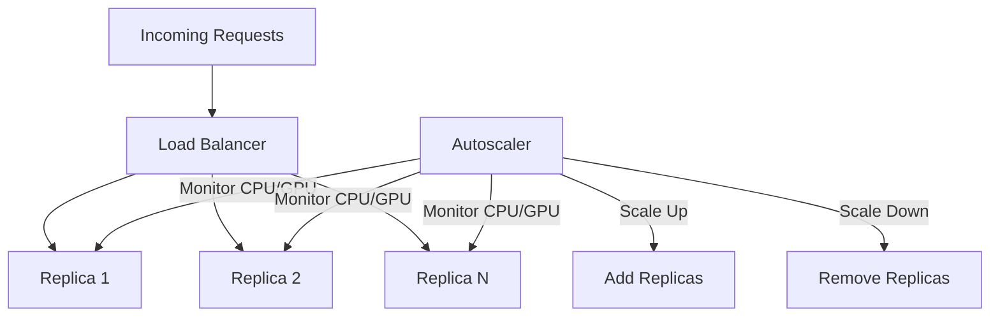

# How to Implement Online Prediction Autoscaling on Vertex AI Endpoints

Author: [nawazdhandala](https://www.github.com/nawazdhandala)

Tags: GCP, Vertex AI, Autoscaling, Prediction Endpoints, Cost Optimization

Description: Learn how to configure autoscaling for Vertex AI prediction endpoints to handle variable traffic while minimizing costs during low-demand periods.

---

Traffic to your prediction endpoint is rarely constant. A fraud detection model might see 100 requests per second during business hours and 5 per second at 3 AM. An e-commerce recommendation model spikes during flash sales and Black Friday. If you provision for peak traffic, you waste money during quiet periods. If you provision for average traffic, your model becomes slow or unavailable during spikes.

Autoscaling solves this by dynamically adjusting the number of model replicas based on actual demand. Vertex AI provides built-in autoscaling that you configure at deployment time. Getting the configuration right is the difference between smooth scaling and a system that either wastes money or drops requests.

## How Vertex AI Autoscaling Works

Vertex AI autoscaling monitors specific metrics on your deployed model and adjusts the replica count accordingly. When the monitored metric exceeds a threshold, it adds replicas. When it drops below, it removes them.



The autoscaler makes decisions based on the average metric value across all replicas. If the average CPU utilization is 80% and your target is 60%, it calculates that it needs more replicas to bring the average down.

## Basic Autoscaling Configuration

The simplest autoscaling configuration specifies minimum and maximum replicas along with a target CPU utilization.

This code deploys a model with autoscaling:

```python
from google.cloud import aiplatform

aiplatform.init(project="your-project-id", location="us-central1")

# Upload your model
model = aiplatform.Model.upload(
    display_name="fraud-detector-v3",
    artifact_uri="gs://your-bucket/models/fraud-v3/",
    serving_container_image_uri="us-docker.pkg.dev/vertex-ai/prediction/sklearn-cpu.1-3:latest"
)

# Create endpoint
endpoint = aiplatform.Endpoint.create(
    display_name="fraud-detection-autoscale"
)

# Deploy with autoscaling
model.deploy(
    endpoint=endpoint,
    deployed_model_display_name="fraud-v3-autoscaled",
    machine_type="n1-standard-4",
    min_replica_count=1,      # Scale down to 1 during quiet periods
    max_replica_count=10,     # Scale up to 10 during peak
    traffic_percentage=100,
    autoscaling_target_cpu_utilization=60  # Target 60% CPU
)

print(f"Deployed with autoscaling: {endpoint.resource_name}")
```

## GPU-Based Autoscaling

For models running on GPUs, you can scale based on GPU duty cycle instead of CPU utilization.

This code configures GPU-based autoscaling:

```python
model.deploy(
    endpoint=endpoint,
    deployed_model_display_name="image-classifier-gpu",
    machine_type="n1-standard-4",
    accelerator_type="NVIDIA_TESLA_T4",
    accelerator_count=1,
    min_replica_count=1,
    max_replica_count=8,
    traffic_percentage=100,
    autoscaling_target_accelerator_duty_cycle=60  # Target 60% GPU utilization
)
```

GPU duty cycle measures the percentage of time the GPU is actively computing. A target of 60% provides headroom for traffic spikes while still being efficient.

## Fine-Tuning Autoscaling Behavior

The default autoscaling settings work for many use cases, but production deployments often need adjustments. Here is how to configure more advanced autoscaling through the Vertex AI API.

This code uses the API directly for finer control:

```python
from google.cloud import aiplatform_v1

def deploy_with_advanced_autoscaling(
    project_id,
    location,
    endpoint_id,
    model_id,
    min_replicas=1,
    max_replicas=10,
    target_cpu=60
):
    """Deploy a model with advanced autoscaling configuration."""
    client = aiplatform_v1.EndpointServiceClient(
        client_options={"api_endpoint": f"{location}-aiplatform.googleapis.com"}
    )

    endpoint_name = (
        f"projects/{project_id}/locations/{location}/endpoints/{endpoint_id}"
    )

    deployed_model = aiplatform_v1.DeployedModel(
        model=f"projects/{project_id}/locations/{location}/models/{model_id}",
        display_name="fraud-detector-advanced-autoscale",
        dedicated_resources=aiplatform_v1.DedicatedResources(
            machine_spec=aiplatform_v1.MachineSpec(
                machine_type="n1-standard-4"
            ),
            min_replica_count=min_replicas,
            max_replica_count=max_replicas,
            autoscaling_metric_specs=[
                aiplatform_v1.DedicatedResources.AutoscalingMetricSpec(
                    metric_name="aiplatform.googleapis.com/prediction/online/cpu_utilization",
                    target=target_cpu
                )
            ]
        )
    )

    # Deploy with traffic split
    operation = client.deploy_model(
        endpoint=endpoint_name,
        deployed_model=deployed_model,
        traffic_split={"0": 100}
    )

    result = operation.result()
    print(f"Deployed: {result.deployed_model.id}")

deploy_with_advanced_autoscaling(
    project_id="your-project-id",
    location="us-central1",
    endpoint_id="ENDPOINT_ID",
    model_id="MODEL_ID"
)
```

## Handling Cold Starts

When the autoscaler adds a new replica, it takes time for the replica to start, load the model, and begin serving. During this startup period, existing replicas handle all the traffic, which can cause latency spikes.

There are two strategies to mitigate cold starts.

First, set a higher minimum replica count. If your baseline traffic needs at least 3 replicas, set the minimum to 3 so you never scale below that.

Second, use scale-up predictions by pre-scaling before expected traffic increases.

This code pre-scales before a known traffic spike:

```python
import time
from google.cloud import aiplatform

def pre_scale_endpoint(endpoint_id, target_replicas):
    """Temporarily increase minimum replicas before an expected traffic spike.

    Call this 10-15 minutes before the spike to allow replicas to warm up.
    """
    aiplatform.init(project="your-project-id", location="us-central1")
    endpoint = aiplatform.Endpoint(endpoint_id)

    deployed_models = endpoint.list_models()

    for dm in deployed_models:
        # Update the minimum replica count
        # This forces the autoscaler to scale up immediately
        endpoint.undeploy(deployed_model_id=dm.id)

        model = aiplatform.Model(dm.model)
        model.deploy(
            endpoint=endpoint,
            deployed_model_display_name=dm.display_name,
            machine_type="n1-standard-4",
            min_replica_count=target_replicas,  # Higher minimum
            max_replica_count=max(target_replicas, 20),
            traffic_percentage=100
        )

    print(f"Pre-scaled to {target_replicas} minimum replicas")

# Pre-scale before a flash sale
pre_scale_endpoint(
    "projects/your-project-id/locations/us-central1/endpoints/EP_ID",
    target_replicas=8
)
```

## Monitoring Autoscaling Behavior

Understanding how your autoscaler behaves is critical for tuning. Monitor the replica count, latency, and utilization metrics.

This code queries autoscaling metrics:

```python
from google.cloud import monitoring_v3
import datetime

def get_autoscaling_metrics(project_id, endpoint_id, hours=24):
    """Retrieve autoscaling-related metrics for analysis."""
    client = monitoring_v3.MetricServiceClient()
    now = datetime.datetime.now(datetime.timezone.utc)

    interval = monitoring_v3.TimeInterval({
        "start_time": {"seconds": int((now - datetime.timedelta(hours=hours)).timestamp())},
        "end_time": {"seconds": int(now.timestamp())}
    })

    metrics_to_fetch = [
        "aiplatform.googleapis.com/prediction/online/replicas",
        "aiplatform.googleapis.com/prediction/online/cpu_utilization",
        "aiplatform.googleapis.com/prediction/online/prediction_latencies"
    ]

    for metric_type in metrics_to_fetch:
        results = client.list_time_series(
            request={
                "name": f"projects/{project_id}",
                "filter": (
                    f'resource.type="aiplatform.googleapis.com/Endpoint" '
                    f'AND resource.labels.endpoint_id="{endpoint_id}" '
                    f'AND metric.type="{metric_type}"'
                ),
                "interval": interval,
                "aggregation": monitoring_v3.Aggregation(
                    alignment_period={"seconds": 300},
                    per_series_aligner=monitoring_v3.Aggregation.Aligner.ALIGN_MEAN
                )
            }
        )

        print(f"\nMetric: {metric_type.split('/')[-1]}")
        for series in results:
            for point in list(series.points)[-5:]:  # Last 5 data points
                value = point.value.double_value or point.value.int64_value
                print(f"  {point.interval.end_time}: {value:.2f}")

get_autoscaling_metrics("your-project-id", "ENDPOINT_ID")
```

## Scale-to-Zero Configuration

For development or low-priority endpoints, you can configure the minimum replicas to zero. This means you pay nothing when there is no traffic, but the first request after idle will experience cold start latency.

```python
# Scale-to-zero deployment - good for dev/staging
model.deploy(
    endpoint=endpoint,
    deployed_model_display_name="dev-model",
    machine_type="n1-standard-2",
    min_replica_count=0,  # Scale to zero when idle
    max_replica_count=5,
    traffic_percentage=100
)
```

Scale-to-zero is not recommended for production endpoints that need consistent latency, but it is excellent for cost savings in non-production environments.

## Choosing the Right Autoscaling Target

The target utilization percentage determines how aggressively the autoscaler responds.

A target of 40-50% CPU is aggressive - it keeps lots of headroom and scales up quickly, which means lower latency but higher cost. Good for latency-sensitive endpoints.

A target of 60-70% CPU is balanced - reasonable headroom with moderate cost. This is the sweet spot for most production deployments.

A target of 80-90% CPU is cost-optimized - minimal headroom, the autoscaler only scales up when replicas are heavily loaded. Higher latency during traffic ramps but lower cost. Good for batch-like traffic patterns.

```python
# Latency-sensitive deployment
model.deploy(
    endpoint=endpoint,
    machine_type="n1-standard-4",
    min_replica_count=2,
    max_replica_count=20,
    autoscaling_target_cpu_utilization=45  # Aggressive - scale up early
)

# Cost-optimized deployment
model.deploy(
    endpoint=endpoint,
    machine_type="n1-standard-4",
    min_replica_count=1,
    max_replica_count=10,
    autoscaling_target_cpu_utilization=75  # Conservative - maximize utilization
)
```

Autoscaling on Vertex AI endpoints is the primary tool for matching your prediction infrastructure cost to actual demand. The right configuration depends on your traffic patterns, latency requirements, and budget constraints. Start with the balanced settings, monitor the behavior for a week, and then adjust based on what you observe.
