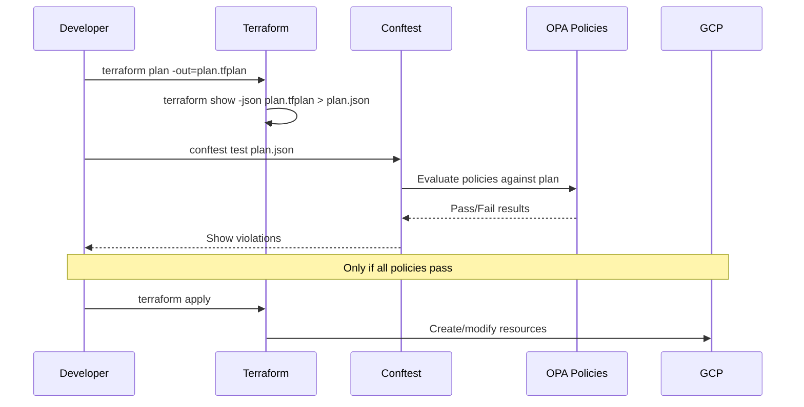

# How to Implement Policy-as-Code for GCP Terraform Deployments Using OPA and Conftest

Author: [nawazdhandala](https://www.github.com/nawazdhandala)

Tags: GCP, Terraform, OPA, Conftest, Policy as Code, Security

Description: Implement policy-as-code for GCP Terraform deployments using Open Policy Agent and Conftest to enforce security, compliance, and cost controls before infrastructure gets deployed.

---

You can write all the Terraform best practices documentation you want, but if there is no automated enforcement, someone will eventually deploy a Cloud SQL instance with a public IP or create a GCS bucket without encryption. Policy-as-code lets you catch these violations before they reach production.

Open Policy Agent (OPA) is the industry standard for policy-as-code, and Conftest is a developer-friendly tool that runs OPA policies against structured data like Terraform plans. Together, they let you write rules in Rego (OPA's policy language) and enforce them in your CI/CD pipeline.

Here is how to set it up for GCP Terraform deployments.

## How It Works

The workflow looks like this:



## Installing the Tools

Install Conftest on your machine or CI environment:

```bash
# On macOS
brew install conftest

# On Linux
LATEST_VERSION=$(wget -O - "https://api.github.com/repos/open-policy-agent/conftest/releases/latest" | grep '"tag_name":' | sed -E 's/.*"([^"]+)".*/\1/' | cut -c 2-)
wget "https://github.com/open-policy-agent/conftest/releases/download/v${LATEST_VERSION}/conftest_${LATEST_VERSION}_Linux_x86_64.tar.gz"
tar xzf conftest_${LATEST_VERSION}_Linux_x86_64.tar.gz
sudo mv conftest /usr/local/bin/
```

## Project Structure

Organize your policies alongside your Terraform code:

```
infrastructure/
  terraform/
    main.tf
    variables.tf
  policy/
    gcp_security.rego
    gcp_networking.rego
    gcp_cost.rego
    gcp_naming.rego
  .conftest.toml
```

The Conftest configuration file tells it where to find policies:

```toml
# .conftest.toml - Conftest configuration
policy = "policy"
namespace = "main"
```

## Generating the Terraform Plan JSON

Conftest works with the JSON representation of a Terraform plan. Here is how to generate it:

```bash
# Create the plan file
terraform plan -out=plan.tfplan

# Convert to JSON for policy evaluation
terraform show -json plan.tfplan > plan.json
```

The JSON plan contains all resource changes, including the before and after values for each attribute. This is what your policies evaluate against.

## Writing Security Policies

Let us start with security policies that are essential for any GCP deployment. These are written in Rego, OPA's policy language.

This first policy ensures that Cloud SQL instances do not get public IPs:

```rego
# policy/gcp_security.rego
# Security policies for GCP Terraform deployments

package main

import future.keywords.in

# Deny Cloud SQL instances with public IP addresses
deny[msg] {
    # Find Cloud SQL instance resources in the plan
    resource := input.resource_changes[_]
    resource.type == "google_sql_database_instance"
    resource.change.after.settings[_].ip_configuration[_].ipv4_enabled == true

    msg := sprintf(
        "Cloud SQL instance '%s' has public IP enabled. Use private IP with ipv4_enabled = false.",
        [resource.name]
    )
}

# Deny GCS buckets without uniform bucket-level access
deny[msg] {
    resource := input.resource_changes[_]
    resource.type == "google_storage_bucket"

    # Check if uniform_bucket_level_access is not set or false
    not resource.change.after.uniform_bucket_level_access

    msg := sprintf(
        "GCS bucket '%s' does not have uniform bucket-level access enabled.",
        [resource.name]
    )
}

# Deny compute instances with external IP addresses
deny[msg] {
    resource := input.resource_changes[_]
    resource.type == "google_compute_instance"

    # Check for access_config which assigns an external IP
    access_config := resource.change.after.network_interface[_].access_config
    count(access_config) > 0

    msg := sprintf(
        "Compute instance '%s' has an external IP address. Use Cloud NAT for outbound access.",
        [resource.name]
    )
}

# Deny GKE clusters without private nodes
deny[msg] {
    resource := input.resource_changes[_]
    resource.type == "google_container_cluster"

    private_config := resource.change.after.private_cluster_config
    count(private_config) == 0

    msg := sprintf(
        "GKE cluster '%s' is not configured as a private cluster.",
        [resource.name]
    )
}
```

## Networking Policies

Policies to enforce networking standards:

```rego
# policy/gcp_networking.rego
# Networking policies for GCP infrastructure

package main

import future.keywords.in

# Deny firewall rules that allow traffic from 0.0.0.0/0
deny[msg] {
    resource := input.resource_changes[_]
    resource.type == "google_compute_firewall"

    # Check source ranges for overly permissive rules
    source_range := resource.change.after.source_ranges[_]
    source_range == "0.0.0.0/0"

    # Allow this for specific ports like 80 and 443
    allow_block := resource.change.after.allow[_]
    ports := allow_block.ports

    # Block if it is not an HTTP/HTTPS rule
    not is_http_rule(ports)

    msg := sprintf(
        "Firewall rule '%s' allows traffic from 0.0.0.0/0 on non-HTTP ports. Restrict source ranges.",
        [resource.name]
    )
}

# Helper function to check if ports are HTTP/HTTPS only
is_http_rule(ports) {
    every_port_is_web(ports)
}

every_port_is_web(ports) {
    count(ports) > 0
    web_ports := {"80", "443", "8080", "8443"}
    every port in ports {
        port in web_ports
    }
}

# Deny VPCs with auto-created subnetworks
deny[msg] {
    resource := input.resource_changes[_]
    resource.type == "google_compute_network"
    resource.change.after.auto_create_subnetworks == true

    msg := sprintf(
        "VPC '%s' uses auto-created subnetworks. Use custom subnets for better CIDR control.",
        [resource.name]
    )
}
```

## Cost Control Policies

Prevent accidentally expensive resources:

```rego
# policy/gcp_cost.rego
# Cost control policies for GCP infrastructure

package main

# Deny oversized compute instances in non-production environments
deny[msg] {
    resource := input.resource_changes[_]
    resource.type == "google_compute_instance"

    machine_type := resource.change.after.machine_type
    is_expensive_machine(machine_type)

    # Check if this is a non-prod environment by looking at labels
    labels := resource.change.after.labels
    env := labels.environment
    env != "production"
    env != "prod"

    msg := sprintf(
        "Compute instance '%s' uses expensive machine type '%s' in non-production environment '%s'.",
        [resource.name, machine_type, env]
    )
}

# List of machine types that are considered expensive
is_expensive_machine(machine_type) {
    expensive_prefixes := ["n2-highmem-32", "n2-highmem-64", "n2-highmem-96", "n2-highmem-128",
                           "n2-standard-64", "n2-standard-96", "n2-standard-128",
                           "c2-standard-60", "m1-megamem", "m1-ultramem", "m2-megamem", "m2-ultramem"]
    prefix := expensive_prefixes[_]
    startswith(machine_type, prefix)
}

# Deny Cloud SQL instances above db-custom-4-16384 in dev
deny[msg] {
    resource := input.resource_changes[_]
    resource.type == "google_sql_database_instance"

    tier := resource.change.after.settings[_].tier
    is_expensive_sql_tier(tier)

    labels := resource.change.after.settings[_].user_labels
    env := labels.environment
    env == "dev"

    msg := sprintf(
        "Cloud SQL instance '%s' uses tier '%s' in dev environment. Use db-custom-2-8192 or smaller.",
        [resource.name, tier]
    )
}

is_expensive_sql_tier(tier) {
    expensive_tiers := ["db-custom-8", "db-custom-16", "db-custom-32", "db-custom-64"]
    prefix := expensive_tiers[_]
    startswith(tier, prefix)
}
```

## Naming Convention Policies

Enforce consistent resource naming:

```rego
# policy/gcp_naming.rego
# Naming convention policies

package main

# Require environment label on all resources that support labels
deny[msg] {
    resource := input.resource_changes[_]

    # Resources that should have labels
    label_resources := {
        "google_compute_instance",
        "google_storage_bucket",
        "google_sql_database_instance",
        "google_container_cluster"
    }

    resource.type in label_resources
    resource.change.actions[_] == "create"

    # Check if environment label exists
    labels := resource.change.after.labels
    not labels.environment

    msg := sprintf(
        "Resource '%s' (type: %s) is missing the required 'environment' label.",
        [resource.name, resource.type]
    )
}
```

## Running Conftest

Run the policies against your Terraform plan:

```bash
# Run all policies against the plan
conftest test plan.json

# Example output with violations
FAIL - plan.json - main - Cloud SQL instance 'primary' has public IP enabled.
                          Use private IP with ipv4_enabled = false.
FAIL - plan.json - main - GCS bucket 'data' does not have uniform bucket-level
                          access enabled.

2 tests, 0 passed, 0 warnings, 2 failures

# Run with verbose output to see passing tests too
conftest test plan.json --all-namespaces
```

## Integrating with CI/CD

Add policy checks to your GitHub Actions workflow:

```yaml
# .github/workflows/terraform.yml
name: Terraform Plan with Policy Check

on:
  pull_request:
    paths:
      - 'infrastructure/**'

jobs:
  plan-and-check:
    runs-on: ubuntu-latest
    steps:
      - uses: actions/checkout@v4

      - uses: hashicorp/setup-terraform@v3
        with:
          terraform_version: 1.7.0

      - name: Install Conftest
        run: |
          wget -q https://github.com/open-policy-agent/conftest/releases/download/v0.50.0/conftest_0.50.0_Linux_x86_64.tar.gz
          tar xzf conftest_0.50.0_Linux_x86_64.tar.gz
          sudo mv conftest /usr/local/bin/

      - name: Terraform Init
        run: terraform init
        working-directory: infrastructure/terraform

      - name: Terraform Plan
        run: |
          terraform plan -out=plan.tfplan
          terraform show -json plan.tfplan > plan.json
        working-directory: infrastructure/terraform

      - name: Policy Check
        run: conftest test infrastructure/terraform/plan.json
```

## Summary

Policy-as-code with OPA and Conftest creates a safety net for your GCP Terraform deployments. Security policies prevent public-facing databases and overly permissive firewall rules. Cost policies catch expensive resources in the wrong environments. Naming policies maintain consistency across your infrastructure. All of these run automatically in CI, so violations are caught in pull requests before they reach production. Start with a few critical policies and expand as your team identifies new patterns to enforce.
