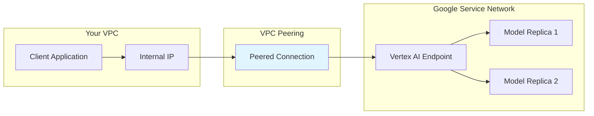

# How to Implement Private Endpoints for Vertex AI Prediction with VPC Peering

Author: [nawazdhandala](https://www.github.com/nawazdhandala)

Tags: GCP, Vertex AI, VPC Peering, Private Endpoints, Security

Description: A practical guide to configuring private prediction endpoints on Vertex AI using VPC peering to keep model inference traffic off the public internet.

---

By default, Vertex AI prediction endpoints are accessible over the public internet. For many production workloads - especially in healthcare, finance, and government - this is not acceptable. Prediction requests might contain sensitive data like patient records, financial transactions, or classified information that should never traverse the public internet.

Private endpoints solve this by routing prediction traffic through VPC peering, keeping all communication within Google's private network. Your client applications connect to the endpoint through an internal IP address, and the data never leaves the VPC.

## How Private Endpoints Work

When you create a private endpoint, Vertex AI establishes a VPC peering connection between your VPC network and Google's service producer network. Prediction requests flow through this peered connection using private IP addresses.



## Prerequisites: Setting Up VPC Peering

Before creating a private endpoint, you need to set up VPC peering with Google's service network. This is a one-time setup per VPC network.

These commands configure the VPC peering:

```bash
# Reserve an IP range for Google's service network
gcloud compute addresses create vertex-ai-range \
    --global \
    --purpose=VPC_PEERING \
    --addresses=10.0.0.0 \
    --prefix-length=16 \
    --network=your-vpc-network \
    --project=your-project-id

# Create the VPC peering connection
gcloud services vpc-peerings connect \
    --service=servicenetworking.googleapis.com \
    --ranges=vertex-ai-range \
    --network=your-vpc-network \
    --project=your-project-id

# Verify the peering is established
gcloud services vpc-peerings list \
    --network=your-vpc-network \
    --project=your-project-id
```

The IP range you reserve determines which private addresses Vertex AI can use. A /16 range provides 65,536 addresses, which is plenty for most deployments.

## Creating a Private Endpoint

With VPC peering in place, create an endpoint that uses the private network.

This code creates a private Vertex AI endpoint:

```python
from google.cloud import aiplatform

aiplatform.init(project="your-project-id", location="us-central1")

# Get the full network resource name
network = "projects/your-project-id/global/networks/your-vpc-network"

# Create a private endpoint
endpoint = aiplatform.Endpoint.create(
    display_name="fraud-detection-private",
    network=network,  # This makes the endpoint private
    description="Private endpoint for fraud detection - no public access"
)

print(f"Private endpoint created: {endpoint.resource_name}")
print(f"Network: {network}")
```

## Deploying a Model to the Private Endpoint

Model deployment to a private endpoint works the same as public endpoints. The only difference is that the endpoint itself restricts access.

This code deploys a model to the private endpoint:

```python
from google.cloud import aiplatform

aiplatform.init(project="your-project-id", location="us-central1")

# Upload your model (same as usual)
model = aiplatform.Model.upload(
    display_name="fraud-detector-v3",
    artifact_uri="gs://your-bucket/models/fraud-v3/",
    serving_container_image_uri="us-docker.pkg.dev/vertex-ai/prediction/sklearn-cpu.1-3:latest"
)

# Get the private endpoint
endpoint = aiplatform.Endpoint(
    "projects/your-project-id/locations/us-central1/endpoints/PRIVATE_ENDPOINT_ID"
)

# Deploy to the private endpoint
model.deploy(
    endpoint=endpoint,
    deployed_model_display_name="fraud-v3-private",
    machine_type="n1-standard-4",
    min_replica_count=2,  # Higher minimum for production
    max_replica_count=10,
    traffic_percentage=100
)

print("Model deployed to private endpoint")
```

## Calling the Private Endpoint

Private endpoints are only accessible from within the peered VPC or from networks connected to it (like Cloud VPN or Cloud Interconnect). You cannot call them from the public internet.

This code calls the private endpoint from a VM within the VPC:

```python
# predict_private.py - Call from a VM or GKE pod within the VPC

from google.cloud import aiplatform

aiplatform.init(
    project="your-project-id",
    location="us-central1"
)

# Get the private endpoint
endpoint = aiplatform.Endpoint(
    "projects/your-project-id/locations/us-central1/endpoints/PRIVATE_ENDPOINT_ID"
)

# Send prediction request - traffic stays within VPC
instances = [
    {
        "transaction_amount": 5432.10,
        "merchant_category": "electronics",
        "time_since_last_purchase": 0.5,
        "device_fingerprint_score": 0.92,
        "account_age_days": 365
    }
]

response = endpoint.predict(instances=instances)

for prediction in response.predictions:
    print(f"Fraud probability: {prediction}")
```

## Calling from GKE

If your application runs on GKE, the pods can call the private endpoint directly since GKE clusters run within your VPC.

This Kubernetes deployment shows the setup:

```yaml
# deployment.yaml - Application that calls private Vertex AI endpoint
apiVersion: apps/v1
kind: Deployment
metadata:
  name: fraud-detection-service
spec:
  replicas: 3
  selector:
    matchLabels:
      app: fraud-detection
  template:
    metadata:
      labels:
        app: fraud-detection
    spec:
      serviceAccountName: vertex-ai-caller
      containers:
        - name: app
          image: us-central1-docker.pkg.dev/your-project/apps/fraud-service:v1
          env:
            - name: VERTEX_ENDPOINT_ID
              value: "projects/your-project-id/locations/us-central1/endpoints/PRIVATE_ENDPOINT_ID"
            - name: PROJECT_ID
              value: "your-project-id"
          ports:
            - containerPort: 8080
          resources:
            requests:
              cpu: 500m
              memory: 512Mi
```

The GKE service account needs the `roles/aiplatform.user` IAM role to call the endpoint:

```bash
# Create a Kubernetes service account bound to a GCP service account
gcloud iam service-accounts create vertex-caller \
    --display-name="Vertex AI Endpoint Caller"

# Grant the prediction permission
gcloud projects add-iam-policy-binding your-project-id \
    --member="serviceAccount:vertex-caller@your-project-id.iam.gserviceaccount.com" \
    --role="roles/aiplatform.user"

# Bind the GKE service account to the GCP service account
gcloud iam service-accounts add-iam-policy-binding \
    vertex-caller@your-project-id.iam.gserviceaccount.com \
    --role="roles/iam.workloadIdentityUser" \
    --member="serviceAccount:your-project-id.svc.id.goog[default/vertex-ai-caller]"
```

## Using Private Service Connect (Alternative to VPC Peering)

For more granular control, you can use Private Service Connect instead of VPC peering. PSC creates a dedicated endpoint in your VPC that forwards to the Vertex AI service.

```bash
# Create a Private Service Connect endpoint
gcloud compute forwarding-rules create vertex-ai-psc \
    --region=us-central1 \
    --network=your-vpc-network \
    --subnet=your-subnet \
    --target-service-attachment=projects/your-project-id/regions/us-central1/serviceAttachments/ATTACHMENT_ID \
    --address=vertex-ai-psc-ip
```

The advantage of PSC over VPC peering is that you get a single, predictable IP address for the endpoint, which simplifies firewall rules and network policies.

## Network Firewall Configuration

Even with private endpoints, you should restrict which resources in your VPC can call the endpoint.

This creates a firewall rule to allow only specific subnets:

```bash
# Allow prediction traffic only from the application subnet
gcloud compute firewall-rules create allow-vertex-ai-prediction \
    --network=your-vpc-network \
    --direction=EGRESS \
    --action=ALLOW \
    --rules=tcp:443,tcp:8080 \
    --destination-ranges=10.0.0.0/16 \
    --target-tags=vertex-ai-caller \
    --priority=1000

# Deny all other traffic to the Vertex AI IP range
gcloud compute firewall-rules create deny-vertex-ai-default \
    --network=your-vpc-network \
    --direction=EGRESS \
    --action=DENY \
    --rules=tcp:443,tcp:8080 \
    --destination-ranges=10.0.0.0/16 \
    --priority=2000
```

## Monitoring Private Endpoint Traffic

Monitor your private endpoint to ensure traffic is flowing through the private path and not accidentally hitting public endpoints.

```python
from google.cloud import monitoring_v3
import datetime

def check_private_endpoint_metrics(project_id, endpoint_id):
    """Query prediction metrics for a private endpoint."""
    client = monitoring_v3.MetricServiceClient()
    now = datetime.datetime.now(datetime.timezone.utc)

    interval = monitoring_v3.TimeInterval({
        "start_time": {"seconds": int((now - datetime.timedelta(hours=1)).timestamp())},
        "end_time": {"seconds": int(now.timestamp())}
    })

    # Check prediction count
    results = client.list_time_series(
        request={
            "name": f"projects/{project_id}",
            "filter": (
                f'resource.type="aiplatform.googleapis.com/Endpoint" '
                f'AND resource.labels.endpoint_id="{endpoint_id}" '
                f'AND metric.type="aiplatform.googleapis.com/prediction/online/prediction_count"'
            ),
            "interval": interval,
            "aggregation": monitoring_v3.Aggregation(
                alignment_period={"seconds": 3600},
                per_series_aligner=monitoring_v3.Aggregation.Aligner.ALIGN_SUM
            )
        }
    )

    for series in results:
        for point in series.points:
            print(f"Predictions in last hour: {point.value.int64_value}")

check_private_endpoint_metrics("your-project-id", "ENDPOINT_ID")
```

## Troubleshooting Private Endpoints

The most common issue is connectivity failures. If your client cannot reach the private endpoint, check these things in order.

First, verify the VPC peering is active. Run `gcloud services vpc-peerings list --network=your-vpc-network` and confirm the status is ACTIVE.

Second, check that your client VM or GKE cluster is in the same VPC network (or a connected network) as the one you peered.

Third, verify DNS resolution. The private endpoint uses an internal DNS name that should resolve to a private IP. Run `nslookup` or `dig` from within the VPC to confirm.

Fourth, check firewall rules. Ensure egress traffic to the reserved IP range is allowed from your client's subnet.

Private endpoints add a layer of security that many regulated industries require. The setup is more involved than public endpoints, but once configured, the prediction workflow is identical - your application code does not need to change at all.
