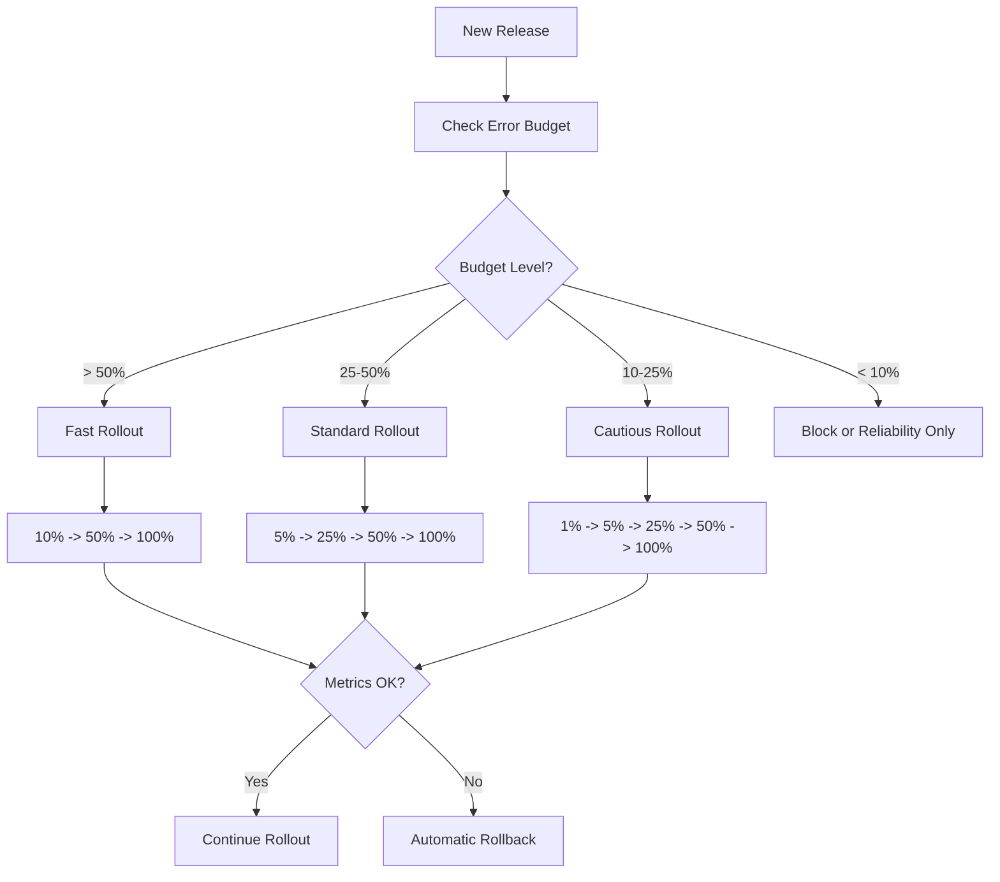

# How to Implement Progressive Rollout Policies Based on Error Budget Consumption on GCP

Author: [nawazdhandala](https://www.github.com/nawazdhandala)

Tags: GCP, SRE, Progressive Rollout, Error Budget, Canary Deployment, Cloud Deploy, Google Cloud

Description: Implement progressive rollout policies that automatically adjust deployment speed based on error budget consumption on Google Cloud Platform.

---

Deploying to 100% of production at once is a gamble. If the release has a bug, all your users are affected immediately. Progressive rollouts - gradually increasing traffic to the new version - limit the blast radius. But most teams implement static rollout policies: 10%, 25%, 50%, 100%, with fixed wait times between each stage. The smarter approach is to tie rollout speed to your error budget. When the budget is healthy, roll out faster. When it is tight, slow down or stop. Here is how to build this on GCP.

## The Concept

Instead of a fixed rollout schedule, the rollout speed adapts to real-time SLO data:

- **Healthy error budget (> 50%)**: Fast rollout with shorter soak times between stages
- **Moderate budget (25-50%)**: Standard rollout with normal soak times
- **Low budget (10-25%)**: Slow rollout with extended soak times and manual gates
- **Depleted budget (< 10%)**: No rollout unless it is a reliability fix



## Step 1: Define Rollout Profiles

Create rollout profiles that map to error budget levels:

```python
# rollout_profiles.py - Define rollout strategies based on error budget health
from dataclasses import dataclass, field
from typing import List

@dataclass
class RolloutStage:
    """A single stage in the progressive rollout."""
    traffic_percentage: int
    soak_time_minutes: int
    requires_manual_approval: bool = False

@dataclass
class RolloutProfile:
    """A complete rollout strategy with multiple stages."""
    name: str
    stages: List[RolloutStage]
    description: str
    auto_rollback_on_error: bool = True
    error_threshold_pct: float = 1.0  # Rollback if error rate exceeds this

# Define profiles for different error budget levels
ROLLOUT_PROFILES = {
    "fast": RolloutProfile(
        name="fast",
        description="Aggressive rollout for when error budget is healthy",
        stages=[
            RolloutStage(traffic_percentage=10, soak_time_minutes=5),
            RolloutStage(traffic_percentage=50, soak_time_minutes=10),
            RolloutStage(traffic_percentage=100, soak_time_minutes=0),
        ],
        error_threshold_pct=2.0,
    ),
    "standard": RolloutProfile(
        name="standard",
        description="Normal rollout with moderate soak times",
        stages=[
            RolloutStage(traffic_percentage=5, soak_time_minutes=10),
            RolloutStage(traffic_percentage=25, soak_time_minutes=15),
            RolloutStage(traffic_percentage=50, soak_time_minutes=15),
            RolloutStage(traffic_percentage=100, soak_time_minutes=0),
        ],
        error_threshold_pct=1.0,
    ),
    "cautious": RolloutProfile(
        name="cautious",
        description="Slow rollout with extended monitoring and manual gates",
        stages=[
            RolloutStage(traffic_percentage=1, soak_time_minutes=30),
            RolloutStage(traffic_percentage=5, soak_time_minutes=30),
            RolloutStage(traffic_percentage=25, soak_time_minutes=30, requires_manual_approval=True),
            RolloutStage(traffic_percentage=50, soak_time_minutes=30),
            RolloutStage(traffic_percentage=100, soak_time_minutes=0),
        ],
        error_threshold_pct=0.5,
    ),
    "reliability_only": RolloutProfile(
        name="reliability_only",
        description="Only reliability fixes allowed - standard rollout with extra monitoring",
        stages=[
            RolloutStage(traffic_percentage=5, soak_time_minutes=20),
            RolloutStage(traffic_percentage=25, soak_time_minutes=20),
            RolloutStage(traffic_percentage=50, soak_time_minutes=20, requires_manual_approval=True),
            RolloutStage(traffic_percentage=100, soak_time_minutes=0),
        ],
        error_threshold_pct=0.5,
    ),
}

def select_rollout_profile(error_budget_remaining_pct, is_reliability_fix=False):
    """Select the appropriate rollout profile based on error budget status."""

    if error_budget_remaining_pct < 10:
        if is_reliability_fix:
            return ROLLOUT_PROFILES["reliability_only"]
        else:
            return None  # Block non-reliability releases

    if error_budget_remaining_pct < 25:
        return ROLLOUT_PROFILES["cautious"]

    if error_budget_remaining_pct < 50:
        return ROLLOUT_PROFILES["standard"]

    return ROLLOUT_PROFILES["fast"]
```

## Step 2: Build the Rollout Controller

Create the controller that manages the progressive rollout:

```python
# rollout_controller.py - Manages progressive rollout with error budget awareness
from google.cloud import run_v2, monitoring_v3
from datetime import datetime, timedelta
import time
import json

class ProgressiveRolloutController:
    """Controls a progressive rollout, adjusting speed based on error budget."""

    def __init__(self, project_id, region, service_name, slo_config):
        self.project_id = project_id
        self.region = region
        self.service_name = service_name
        self.slo_config = slo_config
        self.run_client = run_v2.ServicesClient()
        self.monitoring_client = monitoring_v3.ServiceMonitoringServiceClient()

    def execute_rollout(self, new_revision, profile, release_metadata):
        """Execute a progressive rollout according to the selected profile.
        Monitors metrics at each stage and rolls back on degradation."""

        print(f"Starting {profile.name} rollout for {new_revision}")
        print(f"Profile: {profile.description}")
        print(f"Stages: {len(profile.stages)}")

        rollout_log = {
            "release": release_metadata,
            "profile": profile.name,
            "started_at": datetime.utcnow().isoformat(),
            "stages_completed": [],
        }

        for i, stage in enumerate(profile.stages):
            print(f"\n--- Stage {i+1}/{len(profile.stages)}: {stage.traffic_percentage}% traffic ---")

            # Check for manual approval gate
            if stage.requires_manual_approval:
                print("Manual approval required. Waiting...")
                if not self.wait_for_approval(release_metadata):
                    self.rollback(new_revision, rollout_log, "Manual approval denied")
                    return rollout_log

            # Set the traffic split
            self.set_traffic_split(new_revision, stage.traffic_percentage)
            print(f"Traffic split updated: {stage.traffic_percentage}%")

            # Soak: monitor metrics during the soak period
            if stage.soak_time_minutes > 0:
                print(f"Soaking for {stage.soak_time_minutes} minutes...")
                is_healthy = self.monitor_during_soak(
                    stage.soak_time_minutes,
                    profile.error_threshold_pct,
                )

                if not is_healthy:
                    self.rollback(new_revision, rollout_log, "Metrics degradation detected")
                    return rollout_log

            rollout_log["stages_completed"].append({
                "stage": i + 1,
                "traffic_pct": stage.traffic_percentage,
                "completed_at": datetime.utcnow().isoformat(),
                "status": "healthy",
            })

        rollout_log["completed_at"] = datetime.utcnow().isoformat()
        rollout_log["status"] = "success"
        print(f"\nRollout completed successfully!")
        return rollout_log

    def set_traffic_split(self, new_revision, percentage):
        """Update Cloud Run traffic split between old and new revisions."""
        service_name = (
            f"projects/{self.project_id}/locations/{self.region}"
            f"/services/{self.service_name}"
        )

        # Get current service to find the existing revision
        service = self.run_client.get_service(name=service_name)

        # Update traffic routing
        traffic = [
            run_v2.TrafficTarget(
                revision=new_revision,
                percent=percentage,
                type_=run_v2.TrafficTargetAllocationType.TRAFFIC_TARGET_ALLOCATION_TYPE_REVISION,
            ),
        ]

        if percentage < 100:
            traffic.append(
                run_v2.TrafficTarget(
                    percent=100 - percentage,
                    type_=run_v2.TrafficTargetAllocationType.TRAFFIC_TARGET_ALLOCATION_TYPE_LATEST,
                )
            )

        service.traffic = traffic
        self.run_client.update_service(service=service)

    def monitor_during_soak(self, soak_minutes, error_threshold):
        """Monitor error rates during the soak period.
        Returns False if metrics indicate a problem."""

        check_interval = 60  # Check every minute
        checks = soak_minutes

        for check in range(checks):
            time.sleep(check_interval)

            error_rate = self.get_current_error_rate()
            print(f"  Check {check+1}/{checks}: error rate = {error_rate:.2f}%")

            if error_rate > error_threshold:
                print(f"  ERROR: Error rate {error_rate:.2f}% exceeds threshold {error_threshold}%")
                return False

            # Also check if error budget is being consumed faster than expected
            budget = self.get_error_budget_status()
            if budget["burn_rate"] > 3.0:  # Consuming budget 3x faster than sustainable
                print(f"  WARNING: High burn rate ({budget['burn_rate']:.1f}x) during rollout")
                return False

        return True

    def rollback(self, revision, rollout_log, reason):
        """Roll back to the previous version by sending 0% traffic to the new revision."""
        print(f"\nROLLBACK: {reason}")
        self.set_traffic_split(revision, 0)

        rollout_log["status"] = "rolled_back"
        rollout_log["rollback_reason"] = reason
        rollout_log["rolled_back_at"] = datetime.utcnow().isoformat()

        # Send alert
        self.send_rollback_alert(rollout_log)

    def get_current_error_rate(self):
        """Query the current error rate from Cloud Monitoring."""
        # Query the last 5 minutes of error rate data
        # Simplified - in production, use the Monitoring API
        return 0.3  # Placeholder

    def get_error_budget_status(self):
        """Get current error budget status."""
        # Query from Cloud Monitoring SLO data
        return {"remaining_pct": 45, "burn_rate": 1.2}

    def wait_for_approval(self, release_metadata):
        """Wait for manual approval via a webhook or API call."""
        # In production, send a Slack message with approve/deny buttons
        # and wait for the callback
        return True

    def send_rollback_alert(self, rollout_log):
        """Alert the team about the rollback."""
        print(f"Alert sent: Rollback of {rollout_log['release']}")
```

## Step 3: Integrate with Cloud Deploy

Use Google Cloud Deploy for the deployment pipeline with custom targets:

```yaml
# clouddeploy.yaml - Cloud Deploy pipeline with progressive rollout
apiVersion: deploy.cloud.google.com/v1
kind: DeliveryPipeline
metadata:
  name: progressive-pipeline
description: Progressive rollout based on error budget
serialPipeline:
  stages:
    - targetId: canary
      profiles: [canary]
      strategy:
        canary:
          runtimeConfig:
            cloudRun:
              automaticTrafficControl: true
          canaryDeployment:
            percentages: [5, 25, 50]
            verify: true
    - targetId: production
      profiles: [production]
```

## Step 4: The Orchestrator

Bring it all together with a Cloud Function that orchestrates the rollout:

```python
# main.py - Orchestrator that ties error budget to rollout speed
import functions_framework
from rollout_profiles import select_rollout_profile, ROLLOUT_PROFILES
from rollout_controller import ProgressiveRolloutController
import json

@functions_framework.http
def progressive_rollout(request):
    """Entry point for starting a progressive rollout.
    Checks error budget and selects the appropriate rollout speed."""

    data = request.get_json()
    new_revision = data.get("revision")
    is_reliability_fix = data.get("is_reliability_fix", False)
    release_metadata = data.get("metadata", {})

    # Step 1: Check current error budget
    controller = ProgressiveRolloutController(
        project_id="your-project-id",
        region="us-central1",
        service_name="my-service",
        slo_config={"service_id": "my-service", "slo_ids": ["availability-slo", "latency-slo"]},
    )

    budget_status = controller.get_error_budget_status()
    budget_remaining = budget_status["remaining_pct"]

    # Step 2: Select the rollout profile
    profile = select_rollout_profile(budget_remaining, is_reliability_fix)

    if profile is None:
        return json.dumps({
            "status": "blocked",
            "reason": f"Error budget at {budget_remaining}% - only reliability fixes allowed",
            "budget_remaining_pct": budget_remaining,
        }), 403

    print(f"Error budget: {budget_remaining}% remaining")
    print(f"Selected profile: {profile.name}")

    # Step 3: Execute the rollout
    result = controller.execute_rollout(new_revision, profile, release_metadata)

    return json.dumps(result), 200
```

## Step 5: Monitor and Report on Rollouts

Track rollout performance over time:

```sql
-- Rollout performance tracking
SELECT
    DATE(started_at) AS date,
    profile_name,
    COUNT(*) AS total_rollouts,
    COUNTIF(status = 'success') AS successful,
    COUNTIF(status = 'rolled_back') AS rolled_back,
    ROUND(COUNTIF(status = 'success') / COUNT(*) * 100, 1) AS success_rate,
    AVG(TIMESTAMP_DIFF(completed_at, started_at, MINUTE)) AS avg_duration_minutes
FROM `your-project.deployments.rollout_logs`
WHERE started_at > TIMESTAMP_SUB(CURRENT_TIMESTAMP(), INTERVAL 30 DAY)
GROUP BY 1, 2
ORDER BY 1 DESC;

-- Correlation between error budget and rollout outcomes
SELECT
    CASE
        WHEN budget_remaining_pct > 50 THEN 'healthy (>50%)'
        WHEN budget_remaining_pct > 25 THEN 'moderate (25-50%)'
        WHEN budget_remaining_pct > 10 THEN 'low (10-25%)'
        ELSE 'depleted (<10%)'
    END AS budget_state,
    COUNT(*) AS rollouts,
    COUNTIF(status = 'rolled_back') AS rollbacks,
    ROUND(COUNTIF(status = 'rolled_back') / COUNT(*) * 100, 1) AS rollback_rate
FROM `your-project.deployments.rollout_logs`
GROUP BY 1
ORDER BY rollback_rate DESC;
```

## Handling Edge Cases

**Emergency hotfixes**: Mark releases as `is_reliability_fix=True` to bypass the error budget block when deploying fixes for the very issues that depleted the budget.

**Multiple services**: Each service should have its own error budget and rollout profile selection. A budget issue in the payment service should not slow down the search service rollout.

**Weekend deploys**: Consider using more cautious profiles on weekends when there are fewer engineers available to respond to issues.

## Monitoring

Use OneUptime to monitor your rollout controller itself. If the progressive rollout system fails during a deployment, you could end up stuck at a partial traffic split. Set up alerts for stalled rollouts and orphaned traffic splits that have been in an intermediate state for too long.

## Summary

Progressive rollouts tied to error budgets create a natural feedback loop: reliability problems slow down feature velocity, which forces the team to fix reliability before shipping more features. The implementation requires three things - SLOs that track your actual reliability, rollout profiles that adjust speed based on budget health, and a controller that monitors metrics during each rollout stage and rolls back automatically on degradation. Start with a simple two-profile system (standard and cautious) and add more granularity as you learn what works for your team's deployment patterns.
