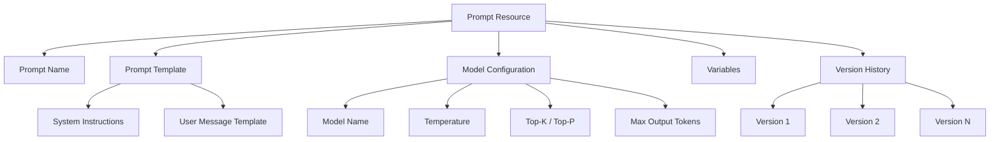

# How to Implement Prompt Management and Versioning with Vertex AI Prompt Registry

Author: [nawazdhandala](https://www.github.com/nawazdhandala)

Tags: GCP, Vertex AI, Prompt Management, Prompt Engineering, MLOps

Description: A hands-on guide to managing and versioning prompts using Vertex AI Prompt Registry for reproducible and collaborative prompt engineering workflows.

---

Prompts are the new code. Just like application code, they need version control, testing, and a structured workflow for updates. But most teams I have seen treat prompts as strings buried in application code, making them hard to iterate on, test, and collaborate around. Vertex AI Prompt Registry solves this by giving prompts a proper management layer.

In this post, I will walk through how to use the Prompt Registry to create, version, and manage prompts in a structured way that works for teams.

## The Problem with Prompts in Code

When prompts live as hardcoded strings in your application, you run into several issues. Changing a prompt requires a code deployment. You cannot A/B test different prompt versions easily. There is no audit trail of what changed and when. And multiple team members editing the same prompt in code leads to merge conflicts and lost context.

The Prompt Registry treats prompts as first-class artifacts with versioning, metadata, and an API for retrieval. Think of it as a model registry, but for prompts.

## Setting Up the Prompt Registry

The Prompt Registry is part of the Vertex AI SDK. Here is how to get started.

This code initializes the environment and creates your first prompt:

```python
import vertexai
from vertexai.preview.prompts import Prompt

# Initialize Vertex AI
vertexai.init(project="your-project-id", location="us-central1")

# Create a prompt with a name and template
my_prompt = Prompt.create(
    prompt_name="customer-support-classifier",
    prompt_data="Classify the following customer support ticket into one of "
                "these categories: billing, technical, account, general.\n\n"
                "Ticket: {ticket_text}\n\n"
                "Category:",
    model_name="gemini-2.0-flash",
    variables=[
        {
            "ticket_text": "I cannot log into my account and the password reset "
                          "email never arrives."
        }
    ]
)

print(f"Prompt created with ID: {my_prompt.prompt_id}")
print(f"Version: {my_prompt.version_id}")
```

## Understanding Prompt Structure

A prompt in the registry consists of several components that work together:



The template uses curly brace placeholders for variables. The model configuration is stored alongside the template, so you always know which model settings produced which results. Variables provide example values for testing.

## Creating Prompts with System Instructions

For more complex prompts, you can include system instructions that set the model's behavior.

This code creates a prompt with a detailed system instruction:

```python
# Create a prompt with system instructions and generation config
support_prompt = Prompt.create(
    prompt_name="support-response-generator",
    model_name="gemini-2.0-flash",
    system_instruction=(
        "You are a helpful customer support agent for a cloud hosting company. "
        "Respond in a professional but friendly tone. Keep responses under 200 words. "
        "If you are unsure about something, say so and offer to escalate."
    ),
    prompt_data="Customer message: {customer_message}\n\n"
                "Account tier: {account_tier}\n\n"
                "Generate a helpful response.",
    variables=[
        {
            "customer_message": "My website has been slow for the past two days.",
            "account_tier": "professional"
        }
    ],
    generation_config={
        "temperature": 0.3,
        "max_output_tokens": 500,
        "top_p": 0.8,
    }
)
```

## Versioning Prompts

Every time you update a prompt, a new version is created. This gives you a full history of changes and the ability to roll back if needed.

Here is how to update a prompt and work with versions:

```python
# Update the prompt - this creates a new version automatically
updated_prompt = Prompt.create(
    prompt_name="customer-support-classifier",
    prompt_data="Classify the following customer support ticket into exactly one "
                "of these categories: billing, technical, account, feature_request, "
                "general.\n\n"
                "Consider the main intent of the message, not just keywords.\n\n"
                "Ticket: {ticket_text}\n\n"
                "Respond with only the category name.",
    model_name="gemini-2.0-flash",
    variables=[
        {
            "ticket_text": "Can you add dark mode to the dashboard? "
                          "It would be easier on the eyes."
        }
    ]
)

print(f"New version: {updated_prompt.version_id}")
```

## Retrieving and Using Prompts

In your application code, you retrieve prompts from the registry by name and use them to generate content. This decouples your prompt logic from your application code.

This code shows how to fetch a prompt and generate a response:

```python
# Retrieve the latest version of a prompt
prompt = Prompt.get(prompt_name="customer-support-classifier")

# Or retrieve a specific version
prompt_v1 = Prompt.get(
    prompt_name="customer-support-classifier",
    version_id="1"
)

# Generate content using the prompt with variable substitution
response = prompt.generate_content(
    variables={
        "ticket_text": "I was charged twice for my last invoice."
    }
)

print(f"Classification: {response.text}")
```

## Listing and Managing Prompts

As your prompt library grows, you need to list and organize them.

```python
# List all prompts in the project
prompts = Prompt.list()

for p in prompts:
    print(f"Name: {p.prompt_name}")
    print(f"  Latest version: {p.version_id}")
    print(f"  Model: {p.model_name}")
    print()

# List all versions of a specific prompt
versions = Prompt.list_versions(prompt_name="customer-support-classifier")
for v in versions:
    print(f"Version {v.version_id}: created at {v.create_time}")
```

## Building a Prompt Testing Workflow

Before deploying a prompt update, test it against a set of known examples. Here is a pattern for prompt testing:

```python
def test_prompt(prompt_name, test_cases, version_id=None):
    """Run a prompt against test cases and report results."""
    if version_id:
        prompt = Prompt.get(prompt_name=prompt_name, version_id=version_id)
    else:
        prompt = Prompt.get(prompt_name=prompt_name)

    results = []
    passed = 0
    total = len(test_cases)

    for case in test_cases:
        # Generate response using the prompt
        response = prompt.generate_content(variables=case["variables"])
        actual = response.text.strip()

        # Compare with expected output
        match = actual.lower() == case["expected"].lower()
        if match:
            passed += 1

        results.append({
            "input": case["variables"],
            "expected": case["expected"],
            "actual": actual,
            "passed": match
        })

    print(f"Results: {passed}/{total} passed ({100*passed/total:.0f}%)")
    for r in results:
        status = "PASS" if r["passed"] else "FAIL"
        print(f"  [{status}] Expected: {r['expected']}, Got: {r['actual']}")

    return results

# Define test cases
test_cases = [
    {"variables": {"ticket_text": "I was double charged"}, "expected": "billing"},
    {"variables": {"ticket_text": "Server is down"}, "expected": "technical"},
    {"variables": {"ticket_text": "Reset my password"}, "expected": "account"},
    {"variables": {"ticket_text": "Add dark mode"}, "expected": "feature_request"},
]

test_prompt("customer-support-classifier", test_cases)
```

## A/B Testing Prompt Versions

In production, you might want to compare two prompt versions on live traffic. Here is a routing pattern:

```python
import random

class PromptRouter:
    """Route requests between prompt versions for A/B testing."""

    def __init__(self, prompt_name, version_a, version_b, traffic_split=0.5):
        self.prompt_a = Prompt.get(prompt_name=prompt_name, version_id=version_a)
        self.prompt_b = Prompt.get(prompt_name=prompt_name, version_id=version_b)
        self.traffic_split = traffic_split

    def generate(self, variables):
        """Route to a prompt version based on traffic split."""
        if random.random() < self.traffic_split:
            version_used = "A"
            prompt = self.prompt_a
        else:
            version_used = "B"
            prompt = self.prompt_b

        response = prompt.generate_content(variables=variables)

        return {
            "text": response.text,
            "version": version_used,
            "prompt_version_id": prompt.version_id
        }

# Set up 80/20 traffic split favoring the new version
router = PromptRouter(
    prompt_name="customer-support-classifier",
    version_a="1",  # baseline
    version_b="2",  # candidate
    traffic_split=0.2  # 20% goes to version A, 80% to version B
)
```

## Organizing Prompts by Environment

Use naming conventions to keep prompts organized across development, staging, and production:

```python
# Naming convention: {team}-{feature}-{environment}
ENVIRONMENTS = ["dev", "staging", "prod"]

def promote_prompt(prompt_name, from_env, to_env, version_id):
    """Promote a prompt version from one environment to another."""
    source_name = f"{prompt_name}-{from_env}"
    target_name = f"{prompt_name}-{to_env}"

    # Get the source prompt version
    source = Prompt.get(prompt_name=source_name, version_id=version_id)

    # Create the prompt in the target environment with the same config
    Prompt.create(
        prompt_name=target_name,
        prompt_data=source.prompt_data,
        model_name=source.model_name,
        system_instruction=source.system_instruction,
        generation_config=source.generation_config,
    )

    print(f"Promoted {source_name} v{version_id} to {target_name}")

# Example: promote from staging to prod
promote_prompt("support-classifier", "staging", "prod", version_id="3")
```

## Wrapping Up

Treating prompts as managed, versioned artifacts changes how your team works with generative AI. The Vertex AI Prompt Registry provides the infrastructure to create, version, test, and deploy prompts with the same rigor you apply to application code. Start by migrating your most critical prompts into the registry, set up a testing workflow, and then expand to A/B testing and environment-based promotion. Combined with monitoring from tools like OneUptime, you get full visibility into how prompt changes affect your application's behavior.
