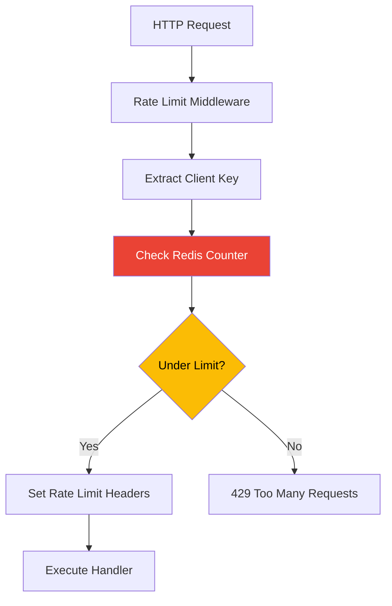

# How to Implement Rate Limiting in a Go Cloud Run Service Using Cloud Memorystore for Redis

Author: [nawazdhandala](https://www.github.com/nawazdhandala)

Tags: GCP, Cloud Run, Redis, Go, Rate Limiting, Cloud Memorystore

Description: Implement distributed rate limiting in a Go Cloud Run service using Cloud Memorystore for Redis with sliding window and token bucket algorithms.

---

Rate limiting is one of those things that seems simple until you have multiple service instances. When you have a single server, an in-memory counter works fine. But Cloud Run can scale to dozens of instances, and each one needs to share rate limit state. That is where Redis comes in.

Cloud Memorystore for Redis gives you a managed Redis instance that all your Cloud Run instances can talk to. In this post, I will show you how to implement two common rate limiting algorithms - sliding window and token bucket - using Redis and Go.

## Setting Up Memorystore

First, create a Redis instance and set up the VPC connector for Cloud Run.

```bash
# Create a Redis instance
gcloud redis instances create rate-limiter \
  --region=us-central1 \
  --tier=basic \
  --size=1 \
  --network=default

# Create a VPC connector for Cloud Run to reach Redis
gcloud compute networks vpc-access connectors create redis-connector \
  --region=us-central1 \
  --network=default \
  --range=10.8.0.0/28

# Get the Redis host IP
gcloud redis instances describe rate-limiter --region=us-central1 --format="value(host)"
```

## Go Dependencies

```bash
go get github.com/redis/go-redis/v9
```

## Redis Client Setup

```go
package main

import (
    "context"
    "fmt"
    "log"
    "net/http"
    "os"
    "strconv"
    "time"

    "github.com/redis/go-redis/v9"
)

// RateLimiter handles rate limiting using Redis as the backing store
type RateLimiter struct {
    client *redis.Client
}

// NewRateLimiter creates a new rate limiter connected to Redis
func NewRateLimiter(redisAddr string) *RateLimiter {
    client := redis.NewClient(&redis.Options{
        Addr:         redisAddr,
        Password:     "", // Memorystore does not use passwords by default
        DB:           0,
        DialTimeout:  5 * time.Second,
        ReadTimeout:  3 * time.Second,
        WriteTimeout: 3 * time.Second,
        PoolSize:     10,
        MinIdleConns: 3,
    })

    return &RateLimiter{client: client}
}

// Close shuts down the Redis connection
func (rl *RateLimiter) Close() {
    rl.client.Close()
}
```

## Sliding Window Rate Limiter

The sliding window approach counts requests within a rolling time window. It is more accurate than fixed windows because it does not have the burst problem at window boundaries.

```go
// SlidingWindowLimit checks if a request should be allowed using a sliding window
// key: unique identifier for the rate limit (e.g., user ID or IP)
// limit: maximum number of requests allowed in the window
// window: duration of the sliding window
func (rl *RateLimiter) SlidingWindowLimit(ctx context.Context, key string, limit int, window time.Duration) (bool, int, error) {
    now := time.Now().UnixMicro()
    windowStart := now - window.Microseconds()

    // Redis key for this rate limit
    redisKey := fmt.Sprintf("ratelimit:sw:%s", key)

    // Use a Lua script for atomicity
    // This removes old entries, adds the new one, and counts the total
    script := redis.NewScript(`
        -- Remove entries outside the window
        redis.call('ZREMRANGEBYSCORE', KEYS[1], '-inf', ARGV[1])
        -- Add the current request with the current timestamp as score
        redis.call('ZADD', KEYS[1], ARGV[2], ARGV[2])
        -- Count entries in the window
        local count = redis.call('ZCARD', KEYS[1])
        -- Set expiry on the key to clean up automatically
        redis.call('PEXPIRE', KEYS[1], ARGV[3])
        return count
    `)

    result, err := script.Run(ctx, rl.client, []string{redisKey},
        windowStart,                   // ARGV[1]: window start timestamp
        now,                           // ARGV[2]: current timestamp
        window.Milliseconds(),         // ARGV[3]: TTL in milliseconds
    ).Int()

    if err != nil {
        return false, 0, fmt.Errorf("rate limit check failed: %w", err)
    }

    remaining := limit - result
    if remaining < 0 {
        remaining = 0
    }

    // Allow the request if we are within the limit
    allowed := result <= limit
    return allowed, remaining, nil
}
```

## Token Bucket Rate Limiter

The token bucket algorithm is more flexible. It allows bursts while enforcing an average rate. Tokens are added to a bucket at a fixed rate, and each request consumes a token.

```go
// TokenBucketLimit implements the token bucket algorithm
// key: unique identifier for the rate limit
// capacity: maximum number of tokens in the bucket
// refillRate: tokens added per second
// tokensRequired: tokens consumed per request (usually 1)
func (rl *RateLimiter) TokenBucketLimit(ctx context.Context, key string, capacity int, refillRate float64, tokensRequired int) (bool, int, error) {
    redisKey := fmt.Sprintf("ratelimit:tb:%s", key)
    now := float64(time.Now().UnixMilli()) / 1000.0

    // Lua script for atomic token bucket operations
    script := redis.NewScript(`
        local key = KEYS[1]
        local capacity = tonumber(ARGV[1])
        local refill_rate = tonumber(ARGV[2])
        local now = tonumber(ARGV[3])
        local tokens_required = tonumber(ARGV[4])

        -- Get current state
        local bucket = redis.call('HMGET', key, 'tokens', 'last_refill')
        local tokens = tonumber(bucket[1])
        local last_refill = tonumber(bucket[2])

        -- Initialize if this is a new bucket
        if tokens == nil then
            tokens = capacity
            last_refill = now
        end

        -- Calculate tokens to add based on elapsed time
        local elapsed = now - last_refill
        local new_tokens = elapsed * refill_rate
        tokens = math.min(capacity, tokens + new_tokens)

        -- Check if we have enough tokens
        local allowed = 0
        if tokens >= tokens_required then
            tokens = tokens - tokens_required
            allowed = 1
        end

        -- Save the updated state
        redis.call('HMSET', key, 'tokens', tokens, 'last_refill', now)
        -- Expire the key after the bucket would be full
        local ttl = math.ceil(capacity / refill_rate) + 1
        redis.call('EXPIRE', key, ttl)

        return {allowed, math.floor(tokens)}
    `)

    result, err := script.Run(ctx, rl.client, []string{redisKey},
        capacity,
        refillRate,
        now,
        tokensRequired,
    ).Int64Slice()

    if err != nil {
        return false, 0, fmt.Errorf("token bucket check failed: %w", err)
    }

    allowed := result[0] == 1
    remaining := int(result[1])
    return allowed, remaining, nil
}
```

## HTTP Middleware

Wrap the rate limiter in HTTP middleware that extracts the client identifier and applies limits.

```go
// RateLimitMiddleware creates middleware that rate limits by client IP
func RateLimitMiddleware(rl *RateLimiter, limit int, window time.Duration) func(http.Handler) http.Handler {
    return func(next http.Handler) http.Handler {
        return http.HandlerFunc(func(w http.ResponseWriter, r *http.Request) {
            // Use the client IP as the rate limit key
            clientIP := r.Header.Get("X-Forwarded-For")
            if clientIP == "" {
                clientIP = r.RemoteAddr
            }

            allowed, remaining, err := rl.SlidingWindowLimit(r.Context(), clientIP, limit, window)
            if err != nil {
                log.Printf("Rate limit error: %v", err)
                // On error, allow the request but log the issue
                next.ServeHTTP(w, r)
                return
            }

            // Set standard rate limit headers
            w.Header().Set("X-RateLimit-Limit", strconv.Itoa(limit))
            w.Header().Set("X-RateLimit-Remaining", strconv.Itoa(remaining))
            w.Header().Set("X-RateLimit-Reset", strconv.FormatInt(
                time.Now().Add(window).Unix(), 10))

            if !allowed {
                w.Header().Set("Retry-After", strconv.Itoa(int(window.Seconds())))
                http.Error(w, "Too Many Requests", http.StatusTooManyRequests)
                return
            }

            next.ServeHTTP(w, r)
        })
    }
}

// APIKeyRateLimitMiddleware rate limits by API key instead of IP
func APIKeyRateLimitMiddleware(rl *RateLimiter, limit int, window time.Duration) func(http.Handler) http.Handler {
    return func(next http.Handler) http.Handler {
        return http.HandlerFunc(func(w http.ResponseWriter, r *http.Request) {
            apiKey := r.Header.Get("X-API-Key")
            if apiKey == "" {
                http.Error(w, "API key required", http.StatusUnauthorized)
                return
            }

            allowed, remaining, err := rl.SlidingWindowLimit(r.Context(), apiKey, limit, window)
            if err != nil {
                log.Printf("Rate limit error: %v", err)
                next.ServeHTTP(w, r)
                return
            }

            w.Header().Set("X-RateLimit-Limit", strconv.Itoa(limit))
            w.Header().Set("X-RateLimit-Remaining", strconv.Itoa(remaining))

            if !allowed {
                http.Error(w, "Rate limit exceeded", http.StatusTooManyRequests)
                return
            }

            next.ServeHTTP(w, r)
        })
    }
}
```

## Putting It Together

```go
func main() {
    redisAddr := os.Getenv("REDIS_HOST") + ":6379"

    limiter := NewRateLimiter(redisAddr)
    defer limiter.Close()

    // Verify Redis connection
    if err := limiter.client.Ping(context.Background()).Err(); err != nil {
        log.Fatalf("Failed to connect to Redis: %v", err)
    }

    mux := http.NewServeMux()
    mux.HandleFunc("/api/data", handleData)

    // Apply rate limiting: 100 requests per minute per IP
    handler := RateLimitMiddleware(limiter, 100, time.Minute)(mux)

    port := os.Getenv("PORT")
    if port == "" {
        port = "8080"
    }

    log.Printf("Server starting with rate limiting on port %s", port)
    log.Fatal(http.ListenAndServe(":"+port, handler))
}

func handleData(w http.ResponseWriter, r *http.Request) {
    w.Header().Set("Content-Type", "application/json")
    w.Write([]byte(`{"status": "ok"}`))
}
```

## Rate Limiting Flow



## Deploy to Cloud Run

```bash
gcloud run deploy my-api \
  --image gcr.io/YOUR_PROJECT/my-api \
  --region us-central1 \
  --vpc-connector redis-connector \
  --set-env-vars "REDIS_HOST=10.0.0.3" \
  --allow-unauthenticated
```

## Wrapping Up

Distributed rate limiting with Redis and Cloud Run gives you consistent enforcement across all instances. The sliding window algorithm is a good default for most APIs, and the token bucket is better when you want to allow controlled bursts. Either way, the Lua scripts ensure atomicity so you do not have race conditions between instances.

For monitoring your rate limiting and API usage patterns, OneUptime can help you track request volumes, identify abusive clients, and alert when rate limits are being hit frequently.
