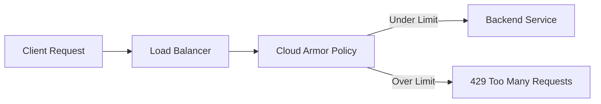

# How to Implement Rate Limiting per Client on Google Cloud External Application Load Balancer

Author: [nawazdhandala](https://www.github.com/nawazdhandala)

Tags: GCP, Rate Limiting, Load Balancer, Cloud Armor, Google Cloud Security

Description: A practical guide to implementing per-client rate limiting on Google Cloud External Application Load Balancer using Cloud Armor security policies.

---

Rate limiting is one of those features you do not think about until you need it desperately. Maybe a misbehaving client is hammering your API with thousands of requests per second, or a bot is scraping your site and eating up backend capacity. Whatever the case, having per-client rate limiting on your Google Cloud External Application Load Balancer gives you control over traffic before it ever hits your backends.

In this guide, I will show you how to set up rate limiting using Cloud Armor security policies, which integrate directly with the external Application Load Balancer.

## How Rate Limiting Works on GCP

Google Cloud does not have a standalone rate limiting service. Instead, rate limiting is a feature of Cloud Armor, Google's DDoS protection and web application firewall service. Cloud Armor security policies attach to backend services behind your load balancer, and rate limiting rules evaluate before traffic reaches your backends.

The flow looks like this:



Cloud Armor supports two rate limiting enforcement modes: throttle (which limits the rate and drops excess requests) and rate-based ban (which blocks the client entirely after exceeding a threshold).

## Creating a Cloud Armor Security Policy

Start by creating a security policy that will hold your rate limiting rules:

```bash
# Create a new Cloud Armor security policy for rate limiting
gcloud compute security-policies create rate-limit-policy \
    --description="Per-client rate limiting policy for API endpoints"
```

## Adding Per-Client Rate Limiting Rules

Now add a rate limiting rule that restricts each client IP to a specific number of requests:

```bash
# Add a rate limiting rule that allows 100 requests per minute per client IP
# Requests exceeding this rate receive a 429 response
gcloud compute security-policies rules create 1000 \
    --security-policy=rate-limit-policy \
    --expression="true" \
    --action=throttle \
    --rate-limit-threshold-count=100 \
    --rate-limit-threshold-interval-sec=60 \
    --conform-action=allow \
    --exceed-action=deny-429 \
    --enforce-on-key=IP
```

Let me break down the important parameters:

- **rate-limit-threshold-count=100** - The maximum number of requests allowed in the interval.
- **rate-limit-threshold-interval-sec=60** - The time window in seconds for counting requests.
- **conform-action=allow** - What to do with requests under the limit (allow them through).
- **exceed-action=deny-429** - What to do with requests over the limit (return 429).
- **enforce-on-key=IP** - Rate limit per source IP address.

## Rate Limiting by Different Client Identifiers

Limiting by IP address works for many cases, but sometimes you need more granularity. Cloud Armor supports several enforcement keys:

```bash
# Rate limit by HTTP header value (useful for API key-based limiting)
# Each unique X-API-Key value gets its own rate limit bucket
gcloud compute security-policies rules create 1001 \
    --security-policy=rate-limit-policy \
    --expression="request.path.matches('/api/.*')" \
    --action=throttle \
    --rate-limit-threshold-count=500 \
    --rate-limit-threshold-interval-sec=60 \
    --conform-action=allow \
    --exceed-action=deny-429 \
    --enforce-on-key=HTTP-HEADER \
    --enforce-on-key-name=X-API-Key
```

You can also rate limit by HTTP cookie, XFF IP (the client IP from X-Forwarded-For header), or a combination of these:

```bash
# Rate limit per user session using a cookie value
# Useful when multiple users share the same IP (corporate networks)
gcloud compute security-policies rules create 1002 \
    --security-policy=rate-limit-policy \
    --expression="request.path.matches('/app/.*')" \
    --action=throttle \
    --rate-limit-threshold-count=200 \
    --rate-limit-threshold-interval-sec=60 \
    --conform-action=allow \
    --exceed-action=deny-429 \
    --enforce-on-key=HTTP-COOKIE \
    --enforce-on-key-name=session_id
```

## Implementing Rate-Based Banning

For more aggressive protection, use rate-based banning. This completely blocks a client for a specified duration once they exceed the rate:

```bash
# Ban clients for 5 minutes if they exceed 1000 requests per minute
# This is useful for stopping automated abuse
gcloud compute security-policies rules create 900 \
    --security-policy=rate-limit-policy \
    --expression="true" \
    --action=rate-based-ban \
    --rate-limit-threshold-count=1000 \
    --rate-limit-threshold-interval-sec=60 \
    --ban-duration-sec=300 \
    --conform-action=allow \
    --exceed-action=deny-403 \
    --enforce-on-key=IP
```

The difference between throttle and rate-based ban is significant. Throttle just drops excess requests - the moment a client slows down, their requests go through again. Rate-based ban locks the client out entirely for the ban duration, even if they stop sending requests.

## Applying Different Limits to Different Endpoints

Real applications need different rate limits for different endpoints. Your health check endpoint might handle 10,000 requests per minute, while your payment endpoint should be limited to 10:

```bash
# Strict rate limit for sensitive payment endpoints
gcloud compute security-policies rules create 800 \
    --security-policy=rate-limit-policy \
    --expression="request.path.matches('/api/v1/payments.*')" \
    --action=throttle \
    --rate-limit-threshold-count=10 \
    --rate-limit-threshold-interval-sec=60 \
    --conform-action=allow \
    --exceed-action=deny-429 \
    --enforce-on-key=IP

# More generous limit for general API endpoints
gcloud compute security-policies rules create 900 \
    --security-policy=rate-limit-policy \
    --expression="request.path.matches('/api/v1/.*')" \
    --action=throttle \
    --rate-limit-threshold-count=500 \
    --rate-limit-threshold-interval-sec=60 \
    --conform-action=allow \
    --exceed-action=deny-429 \
    --enforce-on-key=IP
```

Rules are evaluated in priority order (lower number = higher priority), so the payment endpoint rule at priority 800 evaluates before the general API rule at priority 900.

## Terraform Configuration

For infrastructure-as-code setups, here is the Terraform equivalent:

```hcl
# Cloud Armor security policy with per-client rate limiting rules
resource "google_compute_security_policy" "rate_limit" {
  name        = "rate-limit-policy"
  description = "Per-client rate limiting for application load balancer"

  # Rate limit per IP for API endpoints - 100 req/min
  rule {
    action   = "throttle"
    priority = 1000
    match {
      expr {
        expression = "request.path.matches('/api/.*')"
      }
    }
    rate_limit_options {
      conform_action = "allow"
      exceed_action  = "deny(429)"
      enforce_on_key = "IP"
      rate_limit_threshold {
        count        = 100
        interval_sec = 60
      }
    }
  }

  # Rate-based ban for aggressive abuse - ban for 5 min after 1000 req/min
  rule {
    action   = "rate_based_ban"
    priority = 500
    match {
      expr {
        expression = "true"
      }
    }
    rate_limit_options {
      conform_action   = "allow"
      exceed_action    = "deny(403)"
      enforce_on_key   = "IP"
      ban_duration_sec = 300
      rate_limit_threshold {
        count        = 1000
        interval_sec = 60
      }
    }
  }

  # Default allow rule
  rule {
    action   = "allow"
    priority = 2147483647
    match {
      versioned_expr = "SRC_IPS_V1"
      config {
        src_ip_ranges = ["*"]
      }
    }
  }
}

# Attach the security policy to the backend service
resource "google_compute_backend_service" "api" {
  name            = "api-backend-service"
  security_policy = google_compute_security_policy.rate_limit.id
  # ... other backend service configuration
}
```

## Attaching the Policy to Your Backend Service

Once your security policy is ready, attach it to the backend service behind your load balancer:

```bash
# Attach the rate limiting policy to your backend service
gcloud compute backend-services update my-api-backend \
    --security-policy=rate-limit-policy \
    --global
```

## Custom Response Bodies

You can configure a custom response body so clients get a meaningful message when rate limited:

```bash
# Add a custom response body for rate-limited requests
gcloud compute security-policies update rate-limit-policy \
    --json-custom-content-types="application/json"

# The exceed-action can use a custom error page
# Configure the custom error response in the backend service
gcloud compute backend-services update my-api-backend \
    --custom-response-headers="Retry-After:60" \
    --global
```

## Monitoring Rate Limiting in Action

Cloud Armor logs every rate limiting decision to Cloud Logging. Query these logs to understand your traffic patterns:

```bash
# View recent rate-limited requests in Cloud Logging
gcloud logging read 'resource.type="http_load_balancer" AND jsonPayload.enforcedSecurityPolicy.outcome="DENY"' \
    --limit=50 \
    --format="table(timestamp, jsonPayload.enforcedSecurityPolicy.name, httpRequest.remoteIp, httpRequest.requestUrl)"
```

Set up alerts for when rate limiting kicks in frequently:

```bash
# Create a monitoring alert for high rate of denied requests
gcloud monitoring policies create \
    --display-name="Rate Limiting Alert" \
    --condition-display-name="High rate of 429 responses" \
    --condition-filter='resource.type="https_lb_rule" AND metric.type="loadbalancing.googleapis.com/https/request_count" AND metric.labels.response_code="429"'
```

## Tips From Production Experience

**Start with monitoring mode.** Before enforcing rate limits, run your policy in preview mode to see what would be blocked. Add `--preview` to your rule creation commands to enable this.

**Account for shared IPs.** Users behind corporate NATs or VPNs share IP addresses. If you rate limit purely by IP, you might block an entire office. Consider using API keys or session cookies as the enforcement key for authenticated endpoints.

**Set rate limits higher than you think.** Single-page applications can generate many API calls during normal usage. Instrument your frontend to understand actual per-user request rates before setting limits.

**Use different policies for different backend services.** Your public API and your internal admin panel have very different traffic patterns. Apply separate Cloud Armor policies to each backend service.

Rate limiting is a balancing act between protecting your infrastructure and not blocking legitimate users. Start with generous limits, monitor the data, and tighten gradually. The goal is to stop abuse, not to punish your best customers.
