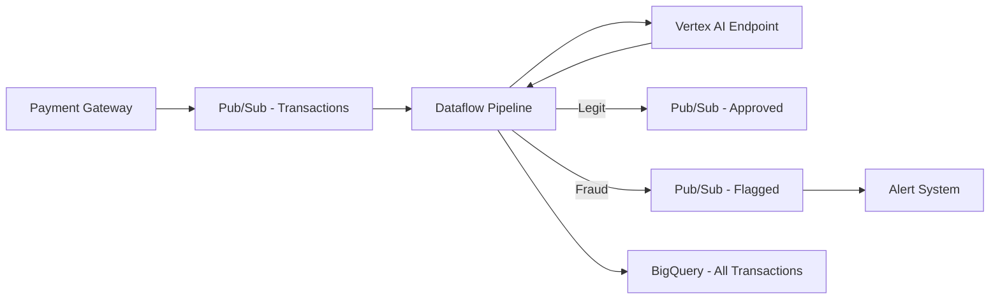

# How to Implement Real-Time Fraud Detection with Vertex AI AutoML Tables and Dataflow

Author: [nawazdhandala](https://www.github.com/nawazdhandala)

Tags: GCP, Vertex AI, AutoML, Dataflow, Fraud Detection, Machine Learning, Google Cloud

Description: Build a real-time fraud detection pipeline using Vertex AI AutoML Tables for model training and Apache Beam on Dataflow for streaming predictions.

---

Fraud does not wait for your batch job to finish. Every minute a fraudulent transaction goes undetected costs money and erodes customer trust. In this post, I will walk you through building a real-time fraud detection system on GCP that uses Vertex AI AutoML Tables for training a classification model and Dataflow for processing transactions as they happen.

## System Architecture

The pipeline processes transactions in real time. Each transaction flows through Dataflow, gets scored by the deployed AutoML model, and triggers appropriate actions based on the fraud probability.



## Step 1: Prepare Training Data

AutoML Tables needs structured tabular data with a target column indicating fraud. Load your historical transaction data into BigQuery:

```sql
-- Create the training dataset table
CREATE TABLE `your-project.fraud_detection.training_data` AS
SELECT
    transaction_id,
    amount,
    currency,
    merchant_category,
    -- Time-based features are critical for fraud detection
    EXTRACT(HOUR FROM transaction_time) AS hour_of_day,
    EXTRACT(DAYOFWEEK FROM transaction_time) AS day_of_week,
    -- Geographic features
    country_code,
    -- Behavioral features computed from historical data
    transactions_last_hour,
    avg_amount_last_30_days,
    distinct_merchants_last_24h,
    time_since_last_transaction_seconds,
    -- Target variable: 1 for fraud, 0 for legitimate
    is_fraud
FROM `your-project.fraud_detection.historical_transactions`
WHERE transaction_time BETWEEN '2025-01-01' AND '2026-01-01';
```

Feature engineering matters a lot for fraud detection. The most predictive features are typically behavioral ones - how does this transaction compare to the customer's normal patterns?

## Step 2: Train with AutoML Tables

Create and train an AutoML Tables model using the Vertex AI SDK:

```python
import vertexai
from google.cloud import aiplatform

vertexai.init(project="your-project-id", location="us-central1")

# Create a tabular dataset from the BigQuery table
dataset = aiplatform.TabularDataset.create(
    display_name="fraud-detection-training-data",
    bq_source="bq://your-project.fraud_detection.training_data",
)

# Start the AutoML training job
# AutoML will automatically handle feature engineering, model selection,
# and hyperparameter tuning
job = aiplatform.AutoMLTabularTrainingJob(
    display_name="fraud-detection-model-v1",
    optimization_prediction_type="classification",
    optimization_objective="maximize-au-prc",  # Better than AUC-ROC for imbalanced datasets
)

model = job.run(
    dataset=dataset,
    target_column="is_fraud",
    # Tell AutoML which columns to exclude from training
    column_specs={
        "transaction_id": "categorical",  # Will be auto-excluded as ID
    },
    training_fraction_split=0.8,
    validation_fraction_split=0.1,
    test_fraction_split=0.1,
    budget_milli_node_hours=2000,  # Training budget in milli-node-hours
    model_display_name="fraud-detection-model-v1",
)

print(f"Model trained: {model.resource_name}")
```

Training takes a few hours depending on your data size and budget. AutoML will try multiple algorithms and architectures to find the best performer.

## Step 3: Deploy the Model

Deploy the trained model to an endpoint for online predictions:

```python
# Create a prediction endpoint
endpoint = aiplatform.Endpoint.create(
    display_name="fraud-detection-endpoint",
)

# Deploy the model with traffic splitting if needed
model.deploy(
    endpoint=endpoint,
    deployed_model_display_name="fraud-model-v1",
    machine_type="n1-standard-4",
    min_replica_count=2,       # Minimum instances for availability
    max_replica_count=10,      # Auto-scale based on traffic
    traffic_percentage=100,
)

print(f"Endpoint ready: {endpoint.resource_name}")
```

Use at least 2 replicas for production fraud detection - you cannot afford downtime on this pipeline.

## Step 4: Build the Dataflow Streaming Pipeline

Now create the Dataflow pipeline that processes transactions in real time:

```python
# fraud_pipeline.py - Streaming fraud detection pipeline
import apache_beam as beam
from apache_beam.options.pipeline_options import PipelineOptions, StandardOptions
from google.cloud import aiplatform
import json

class ScoreTransaction(beam.DoFn):
    """Calls the Vertex AI endpoint to score each transaction for fraud."""

    def setup(self):
        """Initialize the endpoint client once per worker.
        This runs when the DoFn is first initialized on the worker."""
        aiplatform.init(project="your-project-id", location="us-central1")
        self.endpoint = aiplatform.Endpoint(
            endpoint_name="projects/your-project-id/locations/us-central1/endpoints/YOUR_ENDPOINT_ID"
        )

    def process(self, transaction):
        """Score a single transaction and yield the result."""
        # Prepare the feature dictionary for prediction
        features = {
            "amount": transaction["amount"],
            "currency": transaction["currency"],
            "merchant_category": transaction["merchant_category"],
            "hour_of_day": transaction["hour_of_day"],
            "day_of_week": transaction["day_of_week"],
            "country_code": transaction["country_code"],
            "transactions_last_hour": transaction["transactions_last_hour"],
            "avg_amount_last_30_days": transaction["avg_amount_last_30_days"],
            "distinct_merchants_last_24h": transaction["distinct_merchants_last_24h"],
            "time_since_last_transaction_seconds": transaction["time_since_last_transaction_seconds"],
        }

        # Get the prediction from Vertex AI
        prediction = self.endpoint.predict(instances=[features])
        fraud_probability = prediction.predictions[0]["scores"][1]  # Probability of fraud class

        # Add the score to the transaction record
        transaction["fraud_probability"] = fraud_probability
        transaction["fraud_flag"] = fraud_probability > 0.8  # Threshold for blocking

        yield transaction


class RouteTransaction(beam.DoFn):
    """Routes transactions based on fraud score."""

    # Use tagged outputs to split the stream
    APPROVED = "approved"
    FLAGGED = "flagged"

    def process(self, transaction):
        if transaction["fraud_flag"]:
            yield beam.pvalue.TaggedOutput(self.FLAGGED, transaction)
        else:
            yield beam.pvalue.TaggedOutput(self.APPROVED, transaction)


def run_pipeline():
    """Build and run the streaming fraud detection pipeline."""

    options = PipelineOptions()
    options.view_as(StandardOptions).streaming = True

    with beam.Pipeline(options=options) as pipeline:
        # Read transactions from Pub/Sub
        transactions = (
            pipeline
            | "Read from Pub/Sub" >> beam.io.ReadFromPubSub(
                topic="projects/your-project-id/topics/transactions"
            )
            | "Parse JSON" >> beam.Map(lambda msg: json.loads(msg))
        )

        # Score each transaction with the ML model
        scored = transactions | "Score Transactions" >> beam.ParDo(ScoreTransaction())

        # Route based on fraud probability
        routed = scored | "Route" >> beam.ParDo(RouteTransaction()).with_outputs(
            RouteTransaction.FLAGGED,
            RouteTransaction.APPROVED,
        )

        # Write flagged transactions to the alert topic
        (
            routed[RouteTransaction.FLAGGED]
            | "Serialize Flagged" >> beam.Map(lambda t: json.dumps(t).encode("utf-8"))
            | "Publish Flagged" >> beam.io.WriteToPubSub(
                topic="projects/your-project-id/topics/flagged-transactions"
            )
        )

        # Write all transactions to BigQuery for analysis
        (
            scored
            | "Write to BigQuery" >> beam.io.WriteToBigQuery(
                table="your-project:fraud_detection.scored_transactions",
                schema="SCHEMA_AUTODETECT",
                write_disposition=beam.io.BigQueryDisposition.WRITE_APPEND,
                create_disposition=beam.io.BigQueryDisposition.CREATE_IF_NEEDED,
            )
        )


if __name__ == "__main__":
    run_pipeline()
```

## Step 5: Deploy to Dataflow

Launch the pipeline on Dataflow:

```bash
# Deploy the streaming pipeline to Dataflow
python fraud_pipeline.py \
    --runner=DataflowRunner \
    --project=your-project-id \
    --region=us-central1 \
    --temp_location=gs://your-bucket/dataflow/temp \
    --staging_location=gs://your-bucket/dataflow/staging \
    --job_name=fraud-detection-streaming \
    --num_workers=2 \
    --max_num_workers=10 \
    --autoscaling_algorithm=THROUGHPUT_BASED
```

## Tuning the Fraud Threshold

The 0.8 threshold in the routing logic is a starting point. You need to tune this based on your business requirements:

- Lower threshold (0.5-0.7): Catches more fraud but increases false positives, which means more legitimate transactions get blocked
- Higher threshold (0.8-0.95): Fewer false positives but some fraud slips through

Plot a precision-recall curve from your test data to find the sweet spot. Most payment platforms aim for a false positive rate under 1%.

## Model Retraining

Fraud patterns evolve constantly. Set up a retraining pipeline that runs monthly:

```python
# Schedule monthly retraining with the latest transaction data
# This ensures the model adapts to new fraud patterns
def retrain_model():
    new_dataset = aiplatform.TabularDataset.create(
        display_name=f"fraud-training-{datetime.now().strftime('%Y-%m')}",
        bq_source="bq://your-project.fraud_detection.training_data_latest",
    )

    job = aiplatform.AutoMLTabularTrainingJob(
        display_name=f"fraud-model-{datetime.now().strftime('%Y-%m')}",
        optimization_prediction_type="classification",
        optimization_objective="maximize-au-prc",
    )

    new_model = job.run(dataset=new_dataset, target_column="is_fraud")

    # Deploy with traffic splitting to validate before full rollover
    endpoint.deploy(
        model=new_model,
        traffic_percentage=10,  # Send 10% of traffic to the new model first
    )
```

## Monitoring

Use OneUptime to monitor the end-to-end latency of your fraud detection pipeline. Set alerts for when prediction latency exceeds your SLA threshold - for payments, you typically need sub-200ms scoring. Also monitor the fraud detection rate over time; a sudden drop might indicate model degradation or a new attack pattern the model has not seen before.

## Summary

Real-time fraud detection on GCP combines AutoML Tables for building accurate classification models with Dataflow for processing transaction streams at scale. The key is getting the feature engineering right, choosing the appropriate fraud threshold for your risk tolerance, and keeping the model fresh through regular retraining. Start with historical data, validate the model performance offline, and then deploy the streaming pipeline once you are confident in the model's accuracy.
