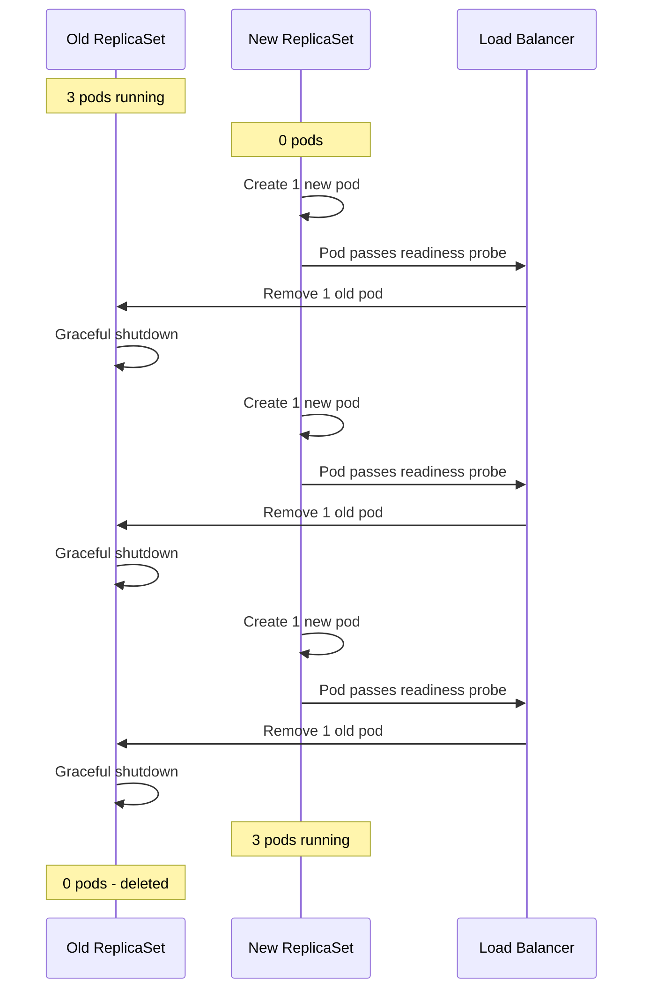

# How to Implement Rolling Update Deployment Strategy for GKE Workloads with Zero Downtime

Author: [nawazdhandala](https://www.github.com/nawazdhandala)

Tags: GCP, GKE, Kubernetes, Rolling Updates, Zero Downtime, Deployment Strategy

Description: A hands-on guide to configuring rolling update deployments on GKE that achieve true zero downtime using readiness probes, PodDisruptionBudgets, and proper configuration.

---

Rolling updates are the default deployment strategy in Kubernetes, and for good reason - they gradually replace old pods with new ones, keeping your application available throughout the process. But "available" and "zero downtime" are not the same thing. I have seen plenty of rolling updates that technically kept pods running but still dropped requests during transitions. This guide covers how to configure rolling updates on GKE that actually achieve zero downtime.

## How Rolling Updates Work

When you update a Deployment in Kubernetes, the controller creates a new ReplicaSet and slowly scales it up while scaling down the old one. The speed and behavior of this process is controlled by two parameters: `maxUnavailable` and `maxSurge`.



## Basic Rolling Update Configuration

Here is a Deployment with rolling update settings that work well for most applications:

```yaml
# deployment.yaml - Rolling update configuration for a web application
apiVersion: apps/v1
kind: Deployment
metadata:
  name: myapp
  namespace: production
spec:
  replicas: 3
  strategy:
    type: RollingUpdate
    rollingUpdate:
      maxUnavailable: 0    # Never reduce below desired count
      maxSurge: 1          # Add one extra pod at a time
  selector:
    matchLabels:
      app: myapp
  template:
    metadata:
      labels:
        app: myapp
        version: v2
    spec:
      containers:
        - name: myapp
          image: us-docker.pkg.dev/my-project/repo/myapp:v2
          ports:
            - containerPort: 8080
          resources:
            requests:
              cpu: "250m"
              memory: "256Mi"
            limits:
              cpu: "500m"
              memory: "512Mi"
```

The critical setting here is `maxUnavailable: 0`. This tells Kubernetes to never have fewer pods than the desired replica count during an update. Combined with `maxSurge: 1`, it means Kubernetes will create one new pod, wait for it to be ready, and only then terminate one old pod.

## Readiness Probes - The Foundation of Zero Downtime

Without a readiness probe, Kubernetes considers a pod "ready" as soon as its container starts. But your application might need seconds to initialize database connections, load configuration, or warm caches. Traffic hitting the pod during this window gets errors.

```yaml
          # Readiness probe - determines when the pod can receive traffic
          readinessProbe:
            httpGet:
              path: /healthz
              port: 8080
            initialDelaySeconds: 5     # Wait 5 seconds before first check
            periodSeconds: 5           # Check every 5 seconds
            successThreshold: 2        # Must pass twice to be considered ready
            failureThreshold: 3        # Three failures means not ready

          # Liveness probe - determines if the pod should be restarted
          livenessProbe:
            httpGet:
              path: /livez
              port: 8080
            initialDelaySeconds: 15    # Give the app time to start
            periodSeconds: 10
            failureThreshold: 3
```

The `successThreshold: 2` on the readiness probe is important. It requires the pod to pass two consecutive health checks before receiving traffic, which reduces the chance of routing requests to a pod that is not fully warmed up.

## Graceful Shutdown

When Kubernetes terminates an old pod, it sends a SIGTERM signal and waits for the pod to shut down gracefully. Your application needs to handle this correctly:

1. Stop accepting new connections
2. Finish processing in-flight requests
3. Close database connections and clean up resources
4. Exit

Here is a common pattern in a Node.js application:

```javascript
// server.js - Graceful shutdown handler for zero-downtime deployments
const server = app.listen(8080, () => {
  console.log('Server started on port 8080');
});

// Handle SIGTERM from Kubernetes
process.on('SIGTERM', () => {
  console.log('SIGTERM received, starting graceful shutdown');

  // Stop accepting new connections
  server.close(() => {
    console.log('All connections closed, exiting');
    process.exit(0);
  });

  // Force exit after 25 seconds if connections haven't closed
  setTimeout(() => {
    console.error('Forced shutdown after timeout');
    process.exit(1);
  }, 25000);
});
```

Configure the pod's termination grace period to match:

```yaml
    spec:
      terminationGracePeriodSeconds: 30  # Give pods 30 seconds to shut down
      containers:
        - name: myapp
          # ... container config ...
          lifecycle:
            preStop:
              exec:
                # Sleep briefly to allow load balancer to deregister the pod
                command: ["/bin/sh", "-c", "sleep 5"]
```

The `preStop` sleep is a crucial detail. When Kubernetes starts terminating a pod, it simultaneously sends SIGTERM and updates the Endpoints object. But the load balancer might not immediately pick up the Endpoints change, so requests could still arrive at the terminating pod for a few seconds. The sleep gives the load balancer time to catch up.

## PodDisruptionBudgets

A PodDisruptionBudget (PDB) protects your application during voluntary disruptions like node upgrades or cluster autoscaler scale-downs:

```yaml
# pdb.yaml - Ensures at least 2 pods are always running during disruptions
apiVersion: policy/v1
kind: PodDisruptionBudget
metadata:
  name: myapp-pdb
  namespace: production
spec:
  minAvailable: 2    # At least 2 pods must always be running
  selector:
    matchLabels:
      app: myapp
```

Without a PDB, a GKE node upgrade could drain all your pods simultaneously. With `minAvailable: 2` and 3 replicas, Kubernetes will only drain one pod at a time during node maintenance.

## Pod Anti-Affinity

Spreading pods across different nodes ensures a single node failure does not take down your entire application:

```yaml
    spec:
      affinity:
        podAntiAffinity:
          preferredDuringSchedulingIgnoredDuringExecution:
            - weight: 100
              podAffinityTerm:
                labelSelector:
                  matchExpressions:
                    - key: app
                      operator: In
                      values:
                        - myapp
                topologyKey: kubernetes.io/hostname
```

Using `preferredDuringScheduling` instead of `requiredDuringScheduling` means Kubernetes will try to spread pods but will not refuse to schedule them if it cannot find separate nodes. This is usually the right trade-off - you would rather have two pods on the same node than one pod total.

## Configuring the GKE Load Balancer

If you are using a GKE Ingress with a Google Cloud Load Balancer, configure the backend service health check to match your readiness probe:

```yaml
# backendconfig.yaml - Configure the Google Cloud Load Balancer health check
apiVersion: cloud.google.com/v1
kind: BackendConfig
metadata:
  name: myapp-backend-config
  namespace: production
spec:
  healthCheck:
    checkIntervalSec: 5
    timeoutSec: 3
    healthyThreshold: 2
    unhealthyThreshold: 3
    type: HTTP
    requestPath: /healthz
    port: 8080
  connectionDraining:
    drainingTimeoutSec: 30   # Allow 30 seconds for in-flight requests
```

Reference it from your Service:

```yaml
# service.yaml - Service with BackendConfig reference
apiVersion: v1
kind: Service
metadata:
  name: myapp
  namespace: production
  annotations:
    cloud.google.com/backend-config: '{"default": "myapp-backend-config"}'
spec:
  type: ClusterIP
  selector:
    app: myapp
  ports:
    - port: 80
      targetPort: 8080
```

The `connectionDraining.drainingTimeoutSec` setting is important - it tells the load balancer to keep existing connections alive for 30 seconds after a pod is removed from the endpoint list.

## Monitoring the Rollout

Watch the rollout in real time:

```bash
# Watch the rolling update progress
kubectl rollout status deployment/myapp -n production

# Check the rollout history
kubectl rollout history deployment/myapp -n production

# If something goes wrong, roll back
kubectl rollout undo deployment/myapp -n production
```

## Testing Zero Downtime

Do not just trust that your configuration is correct - test it. Run a load test during a deployment:

```bash
# In one terminal, generate continuous traffic
while true; do
  STATUS=$(curl -s -o /dev/null -w "%{http_code}" http://myapp.example.com/healthz)
  echo "$(date +%H:%M:%S) - Status: $STATUS"
  sleep 0.1
done
```

```bash
# In another terminal, trigger a deployment
kubectl set image deployment/myapp myapp=us-docker.pkg.dev/my-project/repo/myapp:v3 -n production
```

If you see any non-200 status codes during the rollout, something in your configuration needs adjustment.

## Common Pitfalls

1. Setting `maxUnavailable` to anything other than 0 will allow temporary capacity reduction during updates. For zero downtime, keep it at 0.

2. Forgetting the `preStop` hook causes requests to fail during the brief window between SIGTERM and load balancer deregistration.

3. Not setting resource requests means the scheduler might place too many pods on one node, causing resource contention during the surge phase.

4. Readiness probes that check external dependencies (like database connectivity) can cause cascading failures. Your readiness probe should only check if the application process itself is ready.

5. Setting `terminationGracePeriodSeconds` too low cuts off in-flight requests. Make sure it is longer than your longest expected request duration plus the preStop delay.

Rolling updates done right are invisible to your users. The key is making sure every piece - readiness probes, graceful shutdown, disruption budgets, and load balancer configuration - works together as a system rather than treating each as an independent setting.
