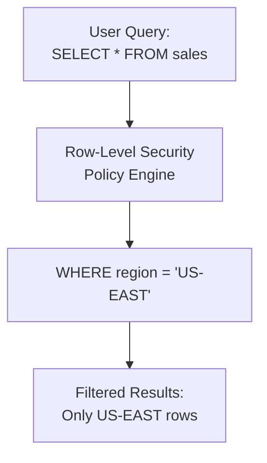

# How to Implement Row-Level Security Policies in BigQuery with Column-Level Access Controls

Author: [nawazdhandala](https://www.github.com/nawazdhandala)

Tags: GCP, BigQuery, Row-Level Security, Column-Level Security, Access Control, Data Governance

Description: Learn how to implement row-level security policies and column-level access controls in BigQuery to enforce fine-grained data access based on user identity and roles.

---

When multiple teams query the same BigQuery tables, not everyone should see everything. A regional sales manager should only see data for their region. A support agent should see customer names but not credit card numbers. An analyst should see aggregate trends but not individual user records.

BigQuery provides two mechanisms for this: row-level security (RLS) to restrict which rows a user can see, and column-level security (CLS) to restrict which columns are visible. Together, they give you fine-grained access control without duplicating data across multiple tables.

## How Row-Level Security Works

Row-level security uses access policies attached to a table. Each policy defines a filter expression and a list of users or groups who are subject to that filter. When a user queries the table, BigQuery automatically applies the relevant filter to their query results.



The user does not see the filter. Their query appears to run normally - they just only see the rows they are authorized to access.

## Step 1: Create a Sample Table

Let me set up a sales table with regional data for the examples.

```sql
-- Create a sales table with multi-region data
CREATE TABLE `analytics.sales` (
  sale_id STRING,
  customer_id STRING,
  customer_name STRING,
  customer_email STRING,
  region STRING,
  country STRING,
  amount FLOAT64,
  sale_date DATE,
  product STRING,
  payment_method STRING,
  card_last_four STRING
)
PARTITION BY sale_date
CLUSTER BY region;

-- Insert sample data
INSERT INTO `analytics.sales` VALUES
  ('s001', 'c100', 'Alice Smith', 'alice@example.com', 'US-EAST', 'US', 150.00, '2026-02-01', 'Widget Pro', 'credit_card', '4242'),
  ('s002', 'c101', 'Bob Jones', 'bob@example.com', 'US-WEST', 'US', 230.00, '2026-02-02', 'Widget Plus', 'credit_card', '1234'),
  ('s003', 'c102', 'Carlos Ruiz', 'carlos@example.com', 'EU-WEST', 'DE', 180.00, '2026-02-03', 'Widget Pro', 'bank_transfer', NULL),
  ('s004', 'c103', 'Diana Chen', 'diana@example.com', 'APAC', 'JP', 320.00, '2026-02-04', 'Widget Enterprise', 'credit_card', '5678');
```

## Step 2: Create Row-Level Security Policies

### Policy for Regional Access

Create a policy that restricts each regional manager to their own region's data.

```sql
-- Create a row access policy for US-EAST region managers
CREATE ROW ACCESS POLICY us_east_policy
ON `analytics.sales`
GRANT TO ('group:us-east-team@example.com')
FILTER USING (region = 'US-EAST');

-- Create a row access policy for US-WEST region managers
CREATE ROW ACCESS POLICY us_west_policy
ON `analytics.sales`
GRANT TO ('group:us-west-team@example.com')
FILTER USING (region = 'US-WEST');

-- Create a row access policy for EU region managers
CREATE ROW ACCESS POLICY eu_policy
ON `analytics.sales`
GRANT TO ('group:eu-team@example.com')
FILTER USING (region = 'EU-WEST');

-- Create a row access policy for APAC region managers
CREATE ROW ACCESS POLICY apac_policy
ON `analytics.sales`
GRANT TO ('group:apac-team@example.com')
FILTER USING (region = 'APAC');

-- Grant full access to the data team (they see all rows)
CREATE ROW ACCESS POLICY full_access_policy
ON `analytics.sales`
GRANT TO ('group:data-team@example.com')
FILTER USING (TRUE);
```

### How Policy Evaluation Works

When a user queries the table, BigQuery checks all policies on that table:

- If the user matches one or more policies, they see the union of rows matching all applicable policies
- If the user matches no policies, they see zero rows
- The table owner always has full access regardless of policies

This means a user who belongs to both `us-east-team` and `eu-team` would see rows from both regions.

## Step 3: Implement Column-Level Security

Column-level security uses policy tags from Data Catalog. You create a taxonomy of sensitivity levels, assign tags to columns, and then control who can see columns at each sensitivity level.

### Create a Policy Tag Taxonomy

```bash
# Create a taxonomy for data sensitivity levels
gcloud data-catalog taxonomies create \
  --location=us \
  --display-name="Data Sensitivity" \
  --description="Classification levels for column access control"
```

Note the taxonomy ID from the output, then create policy tags within it.

```bash
# Create policy tags for different sensitivity levels
TAXONOMY_ID="your-taxonomy-id"

# Public data - visible to everyone
gcloud data-catalog taxonomies policy-tags create \
  --taxonomy=$TAXONOMY_ID \
  --location=us \
  --display-name="Public"

# Internal data - visible to employees
gcloud data-catalog taxonomies policy-tags create \
  --taxonomy=$TAXONOMY_ID \
  --location=us \
  --display-name="Internal"

# Confidential data - restricted access
gcloud data-catalog taxonomies policy-tags create \
  --taxonomy=$TAXONOMY_ID \
  --location=us \
  --display-name="Confidential"

# Highly Confidential - very restricted
gcloud data-catalog taxonomies policy-tags create \
  --taxonomy=$TAXONOMY_ID \
  --location=us \
  --display-name="Highly Confidential"
```

### Apply Policy Tags to Columns

```sql
-- Update the table schema to apply policy tags to sensitive columns
ALTER TABLE `analytics.sales`
ALTER COLUMN customer_email
SET OPTIONS (
  policy_tags = 'projects/MY_PROJECT/locations/us/taxonomies/TAXONOMY_ID/policyTags/INTERNAL_TAG_ID'
);

ALTER TABLE `analytics.sales`
ALTER COLUMN card_last_four
SET OPTIONS (
  policy_tags = 'projects/MY_PROJECT/locations/us/taxonomies/TAXONOMY_ID/policyTags/CONFIDENTIAL_TAG_ID'
);

ALTER TABLE `analytics.sales`
ALTER COLUMN customer_name
SET OPTIONS (
  policy_tags = 'projects/MY_PROJECT/locations/us/taxonomies/TAXONOMY_ID/policyTags/INTERNAL_TAG_ID'
);
```

### Grant Column-Level Access

```bash
# Grant the support team access to internal-level columns
gcloud data-catalog taxonomies policy-tags add-iam-policy-binding \
  INTERNAL_TAG_ID \
  --taxonomy=TAXONOMY_ID \
  --location=us \
  --member="group:support-team@example.com" \
  --role="roles/datacatalog.categoryFineGrainedReader"

# Grant the finance team access to confidential columns
gcloud data-catalog taxonomies policy-tags add-iam-policy-binding \
  CONFIDENTIAL_TAG_ID \
  --taxonomy=TAXONOMY_ID \
  --location=us \
  --member="group:finance-team@example.com" \
  --role="roles/datacatalog.categoryFineGrainedReader"
```

Now when a user without the right permissions tries to select a restricted column, they get an access denied error for that specific column.

## Combining Row and Column Security

The real power comes from combining both levels. Consider a support agent in the US-EAST region:

- Row-level policy: They can only see rows where `region = 'US-EAST'`
- Column-level policy: They can see `customer_name` and `customer_email` but not `card_last_four`

```sql
-- What the support agent sees when querying
-- They submitted: SELECT * FROM analytics.sales
-- What they effectively get:
SELECT
  sale_id, customer_id, customer_name, customer_email,
  region, country, amount, sale_date, product, payment_method
  -- card_last_four is hidden
FROM `analytics.sales`
WHERE region = 'US-EAST'  -- row filter applied automatically
```

## Managing Policies at Scale

### List Existing Policies

```sql
-- List all row access policies on a table
SELECT *
FROM `analytics.INFORMATION_SCHEMA.ROW_ACCESS_POLICIES`
WHERE table_name = 'sales';
```

### Drop a Policy

```sql
-- Remove a row access policy
DROP ROW ACCESS POLICY us_east_policy ON `analytics.sales`;

-- Drop all policies on a table
DROP ALL ROW ACCESS POLICIES ON `analytics.sales`;
```

### Using Views as an Alternative

For more complex access patterns, authorized views can complement RLS:

```sql
-- Create a view that masks sensitive data for general access
CREATE VIEW `analytics.sales_public` AS
SELECT
  sale_id,
  region,
  country,
  amount,
  sale_date,
  product,
  -- Mask customer name to initials
  CONCAT(SUBSTR(customer_name, 1, 1), '. ',
    SUBSTR(customer_name, STRPOS(customer_name, ' ') + 1, 1), '.') AS customer_initials,
  -- Hash the email for pseudonymization
  TO_HEX(SHA256(customer_email)) AS customer_hash
FROM `analytics.sales`;
```

## Testing Your Security Policies

Always verify that your policies work as expected.

```sql
-- Test what a specific user sees (requires admin access)
-- Use the BigQuery Data Policy Troubleshooter in the console

-- Or verify by running queries as a test user
-- Method 1: Use service account impersonation
-- Method 2: Have a team member verify they see the correct subset
-- Method 3: Check the INFORMATION_SCHEMA for policy definitions

-- Verify policy count
SELECT
  table_name,
  COUNT(*) AS policy_count
FROM `analytics.INFORMATION_SCHEMA.ROW_ACCESS_POLICIES`
GROUP BY table_name;
```

## Performance Considerations

Row-level security does add overhead, but BigQuery optimizes it well:

- RLS filters are pushed down to the storage layer, so only matching rows are read
- If the RLS filter aligns with partitioning or clustering, the performance impact is minimal
- Column-level security has no performance impact - it is a pure access control check

The main performance tip is to make sure your RLS filter column is a clustering column on the table. This way, BigQuery can skip blocks that do not match the filter.

## Wrapping Up

Row-level and column-level security in BigQuery let you share one table across multiple teams without exposing data they should not see. RLS handles the "which rows" question, CLS handles the "which columns" question, and together they cover most fine-grained access control needs. The biggest advantage over the traditional approach of creating separate tables or views per team is simplicity: there is one source of truth, one set of ETL pipelines, and one place to update the schema. The security policies layer on top without changing how the data is stored or processed.
