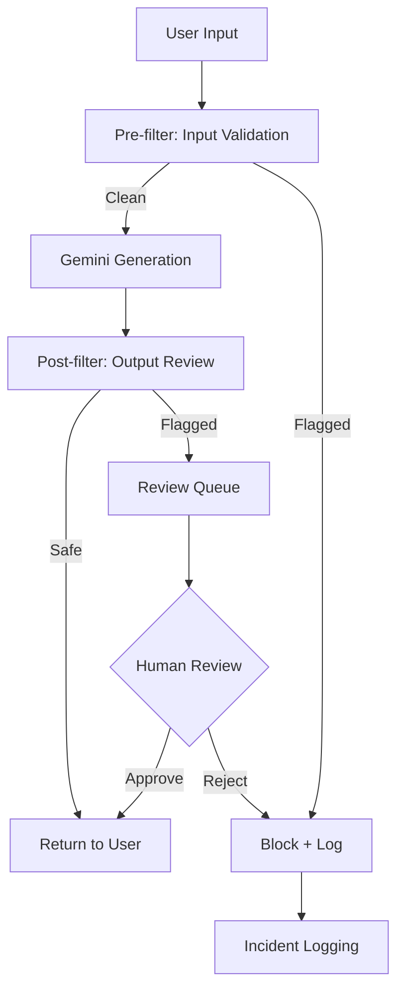

# How to Implement Safety Filters and Content Moderation with Gemini on Vertex AI

Author: [nawazdhandala](https://www.github.com/nawazdhandala)

Tags: GCP, Gemini, Vertex AI, Safety Filters, Content Moderation

Description: Learn how to configure safety filters and implement content moderation with Gemini on Vertex AI to build responsible and safe AI applications.

---

When you deploy a generative AI application to real users, safety is not optional. Users will test boundaries - sometimes innocently, sometimes deliberately. Gemini on Vertex AI includes built-in safety filters that you can configure, plus you can layer on your own content moderation logic. In this post, I will walk through the safety system and show you how to implement effective content moderation.

## How Gemini Safety Filters Work

Gemini evaluates both inputs and outputs against several safety categories. When content is flagged, the response includes safety ratings that tell you why. The categories cover harassment, hate speech, sexually explicit content, and dangerous content.

Each rating has a probability level: NEGLIGIBLE, LOW, MEDIUM, or HIGH. You can set thresholds to control how aggressive the filtering is. By default, Gemini blocks content rated MEDIUM or HIGH in any category.

## Configuring Safety Settings

You configure safety settings through the SafetySetting class. Each setting specifies a category and the threshold at which content should be blocked.

This code configures custom safety thresholds:

```python
import vertexai
from vertexai.generative_models import (
    GenerativeModel,
    HarmCategory,
    HarmBlockThreshold,
    SafetySetting,
)

# Initialize Vertex AI
vertexai.init(project="your-project-id", location="us-central1")

# Define safety settings - customize per category
safety_settings = [
    SafetySetting(
        category=HarmCategory.HARM_CATEGORY_HARASSMENT,
        threshold=HarmBlockThreshold.BLOCK_MEDIUM_AND_ABOVE,
    ),
    SafetySetting(
        category=HarmCategory.HARM_CATEGORY_HATE_SPEECH,
        threshold=HarmBlockThreshold.BLOCK_LOW_AND_ABOVE,  # Strictest
    ),
    SafetySetting(
        category=HarmCategory.HARM_CATEGORY_SEXUALLY_EXPLICIT,
        threshold=HarmBlockThreshold.BLOCK_MEDIUM_AND_ABOVE,
    ),
    SafetySetting(
        category=HarmCategory.HARM_CATEGORY_DANGEROUS_CONTENT,
        threshold=HarmBlockThreshold.BLOCK_MEDIUM_AND_ABOVE,
    ),
]

# Create model with custom safety settings
model = GenerativeModel(
    "gemini-2.0-flash",
    safety_settings=safety_settings,
)
```

## Understanding Safety Ratings in Responses

Every response from Gemini includes safety ratings, even when content is not blocked. Inspecting these ratings helps you understand how the model assesses different inputs.

Here is how to read safety ratings:

```python
# Generate content and inspect safety ratings
response = model.generate_content("Explain network security best practices.")

# Print the response text
print("Response:", response.text)

# Inspect safety ratings for the response
print("\nSafety ratings:")
for rating in response.candidates[0].safety_ratings:
    print(f"  Category: {rating.category}")
    print(f"  Probability: {rating.probability}")
    print(f"  Blocked: {rating.blocked}")
    print()
```

## Handling Blocked Content

When content is blocked by safety filters, the response will not contain text. Your application needs to handle this gracefully.

```python
def safe_generate(model, prompt):
    """Generate content with safety blocking handled."""
    try:
        response = model.generate_content(prompt)

        # Check if the response was blocked
        if not response.candidates:
            return {
                "text": None,
                "blocked": True,
                "reason": "No candidates returned - content was blocked",
                "feedback": str(response.prompt_feedback) if response.prompt_feedback else None
            }

        candidate = response.candidates[0]

        # Check finish reason
        if candidate.finish_reason and candidate.finish_reason.name == "SAFETY":
            return {
                "text": None,
                "blocked": True,
                "reason": "Response blocked due to safety filters",
                "safety_ratings": [
                    {
                        "category": r.category.name,
                        "probability": r.probability.name,
                        "blocked": r.blocked
                    }
                    for r in candidate.safety_ratings
                ]
            }

        return {
            "text": candidate.text,
            "blocked": False,
            "safety_ratings": [
                {
                    "category": r.category.name,
                    "probability": r.probability.name,
                    "blocked": r.blocked
                }
                for r in candidate.safety_ratings
            ]
        }

    except Exception as e:
        return {
            "text": None,
            "blocked": True,
            "reason": f"Error during generation: {str(e)}"
        }

# Use the safe generation function
result = safe_generate(model, "Tell me about cybersecurity threats.")
if result["blocked"]:
    print(f"Content blocked: {result['reason']}")
else:
    print(f"Response: {result['text']}")
```

## Building a Content Moderation Pipeline

For production applications, you want a multi-layer moderation pipeline that goes beyond Gemini's built-in filters. Here is the architecture:



## Pre-Filtering User Input

Before sending user input to Gemini, run it through a pre-filter to catch obvious violations and reduce unnecessary API calls.

```python
import re

class InputFilter:
    """Pre-filter user inputs before sending to the model."""

    def __init__(self):
        # Patterns that should be blocked outright
        self.blocked_patterns = [
            r"ignore\s+(previous|all)\s+instructions",
            r"pretend\s+you\s+are",
            r"act\s+as\s+if\s+you\s+have\s+no\s+restrictions",
        ]
        self.compiled_patterns = [
            re.compile(p, re.IGNORECASE) for p in self.blocked_patterns
        ]

    def check(self, text):
        """Check if input passes the pre-filter."""
        # Check for prompt injection patterns
        for pattern in self.compiled_patterns:
            if pattern.search(text):
                return {
                    "allowed": False,
                    "reason": "Input contains a blocked pattern"
                }

        # Check input length
        if len(text) > 10000:
            return {
                "allowed": False,
                "reason": "Input exceeds maximum length"
            }

        # Check for excessive special characters (potential attack)
        special_ratio = sum(1 for c in text if not c.isalnum() and not c.isspace()) / max(len(text), 1)
        if special_ratio > 0.5:
            return {
                "allowed": False,
                "reason": "Input contains excessive special characters"
            }

        return {"allowed": True}

# Usage
input_filter = InputFilter()
user_input = "How do I set up a firewall on GCP?"
check = input_filter.check(user_input)
if check["allowed"]:
    result = safe_generate(model, user_input)
else:
    print(f"Input blocked: {check['reason']}")
```

## Post-Filtering Model Output

Even with safety settings, the model's output might contain content that does not meet your specific policies. Add a post-filter to catch anything the built-in filters miss.

```python
class OutputFilter:
    """Post-filter model outputs for additional safety checks."""

    def __init__(self, model):
        self.model = model
        # Use a separate model call for moderation
        self.moderator = GenerativeModel("gemini-2.0-flash")

    def moderate(self, original_prompt, model_response):
        """Check if the model response is appropriate."""
        moderation_prompt = f"""Review the following AI response for safety issues.

Original user question: {original_prompt}

AI response to review:
{model_response}

Check for:
1. Personal information disclosure
2. Medical or legal advice presented as fact
3. Instructions for harmful activities
4. Biased or discriminatory content
5. Misinformation about safety-critical topics

Respond with JSON:
{{"safe": true/false, "issues": ["list of issues found"], "severity": "none/low/medium/high"}}"""

        from vertexai.generative_models import GenerationConfig
        response = self.moderator.generate_content(
            moderation_prompt,
            generation_config=GenerationConfig(
                response_mime_type="application/json"
            )
        )

        import json
        return json.loads(response.text)

# Usage
output_filter = OutputFilter(model)
result = safe_generate(model, "What medications should I take for headaches?")

if not result["blocked"]:
    moderation = output_filter.moderate(
        "What medications should I take for headaches?",
        result["text"]
    )
    if moderation["safe"]:
        print(result["text"])
    else:
        print(f"Response flagged: {moderation['issues']}")
```

## Logging and Monitoring Safety Events

Track all safety-related events for auditing and improvement. Log blocked inputs, flagged outputs, and safety rating distributions.

```python
import logging
from datetime import datetime

# Configure safety event logging
safety_logger = logging.getLogger("safety_events")
safety_logger.setLevel(logging.INFO)

class SafetyMonitor:
    """Monitor and log safety events."""

    def __init__(self):
        self.events = []

    def log_event(self, event_type, details):
        """Log a safety event."""
        event = {
            "timestamp": datetime.utcnow().isoformat(),
            "type": event_type,
            "details": details
        }
        self.events.append(event)
        safety_logger.info(f"Safety event: {event}")

    def log_blocked_input(self, user_input, reason):
        self.log_event("input_blocked", {
            "input_preview": user_input[:100],
            "reason": reason
        })

    def log_blocked_output(self, prompt, reason, safety_ratings):
        self.log_event("output_blocked", {
            "prompt_preview": prompt[:100],
            "reason": reason,
            "ratings": safety_ratings
        })

    def log_flagged_output(self, prompt, response, issues):
        self.log_event("output_flagged", {
            "prompt_preview": prompt[:100],
            "response_preview": response[:100],
            "issues": issues
        })

    def get_summary(self):
        """Get a summary of safety events."""
        from collections import Counter
        types = Counter(e["type"] for e in self.events)
        return {
            "total_events": len(self.events),
            "by_type": dict(types)
        }

monitor = SafetyMonitor()
```

## Adjusting Thresholds Per Use Case

Different applications need different safety levels. A children's educational app needs stricter filters than an internal developer tool. Here is a pattern for environment-specific safety configs:

```python
SAFETY_PROFILES = {
    "strict": [
        SafetySetting(category=HarmCategory.HARM_CATEGORY_HARASSMENT,
                     threshold=HarmBlockThreshold.BLOCK_LOW_AND_ABOVE),
        SafetySetting(category=HarmCategory.HARM_CATEGORY_HATE_SPEECH,
                     threshold=HarmBlockThreshold.BLOCK_LOW_AND_ABOVE),
        SafetySetting(category=HarmCategory.HARM_CATEGORY_SEXUALLY_EXPLICIT,
                     threshold=HarmBlockThreshold.BLOCK_LOW_AND_ABOVE),
        SafetySetting(category=HarmCategory.HARM_CATEGORY_DANGEROUS_CONTENT,
                     threshold=HarmBlockThreshold.BLOCK_LOW_AND_ABOVE),
    ],
    "moderate": [
        SafetySetting(category=HarmCategory.HARM_CATEGORY_HARASSMENT,
                     threshold=HarmBlockThreshold.BLOCK_MEDIUM_AND_ABOVE),
        SafetySetting(category=HarmCategory.HARM_CATEGORY_HATE_SPEECH,
                     threshold=HarmBlockThreshold.BLOCK_MEDIUM_AND_ABOVE),
        SafetySetting(category=HarmCategory.HARM_CATEGORY_SEXUALLY_EXPLICIT,
                     threshold=HarmBlockThreshold.BLOCK_MEDIUM_AND_ABOVE),
        SafetySetting(category=HarmCategory.HARM_CATEGORY_DANGEROUS_CONTENT,
                     threshold=HarmBlockThreshold.BLOCK_MEDIUM_AND_ABOVE),
    ],
    "permissive": [
        SafetySetting(category=HarmCategory.HARM_CATEGORY_HARASSMENT,
                     threshold=HarmBlockThreshold.BLOCK_ONLY_HIGH),
        SafetySetting(category=HarmCategory.HARM_CATEGORY_HATE_SPEECH,
                     threshold=HarmBlockThreshold.BLOCK_ONLY_HIGH),
        SafetySetting(category=HarmCategory.HARM_CATEGORY_SEXUALLY_EXPLICIT,
                     threshold=HarmBlockThreshold.BLOCK_ONLY_HIGH),
        SafetySetting(category=HarmCategory.HARM_CATEGORY_DANGEROUS_CONTENT,
                     threshold=HarmBlockThreshold.BLOCK_ONLY_HIGH),
    ],
}

def create_model_with_profile(profile_name):
    """Create a Gemini model with a predefined safety profile."""
    settings = SAFETY_PROFILES.get(profile_name, SAFETY_PROFILES["moderate"])
    return GenerativeModel("gemini-2.0-flash", safety_settings=settings)
```

## Wrapping Up

Safety filters and content moderation are essential for any production generative AI application. Gemini's built-in safety system gives you a strong foundation, but you should layer on pre-filtering, post-filtering, and monitoring for a complete solution. Start with moderate thresholds, monitor the results, and adjust based on what you see in production. Use OneUptime or similar tools to set up alerts on safety event spikes so you can respond quickly when issues arise.
