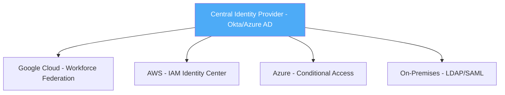
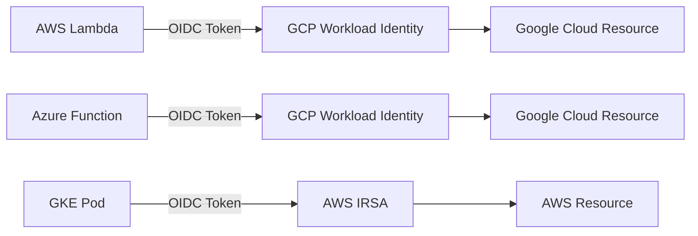

# How to Implement SAML and OIDC-Based Federation for Multi-Cloud Identity

Author: [nawazdhandala](https://www.github.com/nawazdhandala)

Tags: GCP, SAML, OIDC, Identity Federation, Multi-Cloud, IAM

Description: Learn how to implement SAML and OIDC-based identity federation for multi-cloud environments, enabling single identity management across Google Cloud, AWS, and Azure.

---

Managing separate user accounts across Google Cloud, AWS, and Azure is a recipe for security incidents and operational overhead. Identity federation solves this by letting you use a single identity provider to authenticate users across all your cloud platforms. Both SAML 2.0 and OpenID Connect (OIDC) are standards that enable this, but they work differently and each has trade-offs.

This guide covers how to implement both SAML and OIDC federation from a central identity provider to Google Cloud, with practical considerations for multi-cloud environments.

## SAML vs OIDC: When to Use Which

Before diving into implementation, here is a quick comparison:

| Feature | SAML 2.0 | OIDC |
|---------|----------|------|
| Protocol | XML-based | JSON/REST-based |
| Token format | XML assertions | JWT tokens |
| Mobile support | Limited | Good |
| API access | Indirect | Native |
| Adoption | Enterprise legacy | Modern applications |
| Complexity | Higher | Lower |

In practice, OIDC is the preferred choice for new implementations. SAML is necessary when integrating with enterprise identity providers that only support SAML or when your organization has existing SAML infrastructure.

## Setting Up OIDC Federation

OIDC federation is the simpler of the two protocols. Here is how to set up Workload Identity Federation using OIDC for multi-cloud service-to-service authentication.

### OIDC from AWS to Google Cloud

This allows AWS workloads to access Google Cloud resources without service account keys.

```bash
# Create a Workload Identity Pool for AWS workloads
gcloud iam workload-identity-pools create aws-workloads \
  --location=global \
  --display-name="AWS Workloads" \
  --description="Federation for services running in AWS" \
  --project=my-gcp-project

# Create an OIDC provider for AWS
gcloud iam workload-identity-pools providers create-oidc aws-provider \
  --workload-identity-pool=aws-workloads \
  --location=global \
  --issuer-uri="https://sts.amazonaws.com" \
  --attribute-mapping="google.subject=assertion.sub,attribute.aws_role=assertion.arn.extract('assumed-role/{role}/')" \
  --attribute-condition="assertion.arn.startsWith('arn:aws:sts::AWS_ACCOUNT_ID:assumed-role/')" \
  --allowed-audiences="sts.googleapis.com" \
  --project=my-gcp-project
```

Grant the AWS role access to a Google Cloud service account.

```bash
# Allow the specific AWS role to impersonate a GCP service account
gcloud iam service-accounts add-iam-policy-binding gcp-workload@my-gcp-project.iam.gserviceaccount.com \
  --member="principalSet://iam.googleapis.com/projects/PROJECT_NUMBER/locations/global/workloadIdentityPools/aws-workloads/attribute.aws_role/my-aws-role" \
  --role="roles/iam.workloadIdentityUser"
```

### OIDC from Azure to Google Cloud

Similar setup for Azure workloads using Azure AD managed identity tokens.

```bash
# Create a Workload Identity Pool for Azure workloads
gcloud iam workload-identity-pools create azure-workloads \
  --location=global \
  --display-name="Azure Workloads" \
  --description="Federation for services running in Azure" \
  --project=my-gcp-project

# Create an OIDC provider for Azure AD
gcloud iam workload-identity-pools providers create-oidc azure-provider \
  --workload-identity-pool=azure-workloads \
  --location=global \
  --issuer-uri="https://sts.windows.net/AZURE_TENANT_ID/" \
  --attribute-mapping="google.subject=assertion.sub,attribute.tid=assertion.tid" \
  --attribute-condition="assertion.tid=='AZURE_TENANT_ID'" \
  --allowed-audiences="api://YOUR_AZURE_APP_ID" \
  --project=my-gcp-project
```

## Setting Up SAML Federation

SAML federation requires more configuration because of the XML-based protocol and certificate management.

### Configuring SAML with an Enterprise IdP

Here is how to set up SAML federation for workforce access using a generic SAML identity provider.

```bash
# Create a Workforce Identity Pool
gcloud iam workforce-pools create saml-workforce-pool \
  --organization=123456789 \
  --location=global \
  --display-name="SAML Workforce Pool" \
  --session-duration=28800s

# Create a SAML provider
gcloud iam workforce-pools providers create-saml saml-provider \
  --workforce-pool=saml-workforce-pool \
  --location=global \
  --display-name="Corporate SAML IdP" \
  --idp-metadata-path=idp-metadata.xml \
  --attribute-mapping="google.subject=assertion.subject,google.display_name=assertion.attributes.displayName[0],google.groups=assertion.attributes.groups" \
  --attribute-condition="assertion.attributes.department[0]!='external'"
```

The `idp-metadata.xml` file comes from your SAML identity provider and contains the SSO URL, entity ID, and signing certificate.

### SAML Provider in Terraform

```hcl
# Workforce pool with SAML provider
resource "google_iam_workforce_pool" "saml" {
  workforce_pool_id = "saml-workforce-pool"
  parent            = "organizations/123456789"
  location          = "global"
  display_name      = "SAML Workforce Pool"
  session_duration  = "28800s"
}

resource "google_iam_workforce_pool_provider" "saml_provider" {
  workforce_pool_id = google_iam_workforce_pool.saml.workforce_pool_id
  location          = google_iam_workforce_pool.saml.location
  provider_id       = "corporate-saml"
  display_name      = "Corporate SAML IdP"

  attribute_mapping = {
    "google.subject"      = "assertion.subject"
    "google.display_name" = "assertion.attributes.displayName[0]"
    "google.groups"       = "assertion.attributes.groups"
  }

  attribute_condition = "assertion.attributes.department[0] != 'contractors'"

  saml {
    idp_metadata_xml = file("idp-metadata.xml")
  }
}
```

## Multi-Cloud Identity Architecture

In a multi-cloud environment, the identity architecture typically follows one of these patterns.

### Hub-and-Spoke Model

One central identity provider federates to all cloud platforms.



### Service-to-Service Federation

Cloud platforms trust each other's identity tokens for workload communication.



## Implementing Token Exchange for Multi-Cloud

When a workload in one cloud needs to access resources in another, it uses token exchange. Here is how a Python application in AWS authenticates to Google Cloud.

```python
# AWS Lambda function accessing Google Cloud Storage using federation
import json
import urllib.request
import google.auth
from google.auth import identity_pool
from google.cloud import storage

def lambda_handler(event, context):
    """Access Google Cloud Storage from AWS Lambda using federation."""

    # Create credentials using workload identity federation
    # The credential config file is generated by gcloud
    credentials = identity_pool.Credentials.from_info({
        "type": "external_account",
        "audience": "//iam.googleapis.com/projects/PROJECT_NUMBER/locations/global/workloadIdentityPools/aws-workloads/providers/aws-provider",
        "subject_token_type": "urn:ietf:params:aws:token-type:aws4_request",
        "token_url": "https://sts.googleapis.com/v1/token",
        "credential_source": {
            "environment_id": "aws1",
            "region_url": "http://169.254.169.254/latest/meta-data/placement/availability-zone",
            "url": "http://169.254.169.254/latest/meta-data/iam/security-credentials",
            "regional_cred_verification_url": "https://sts.{region}.amazonaws.com?Action=GetCallerIdentity&Version=2011-06-15"
        },
        "service_account_impersonation_url": "https://iamcredentials.googleapis.com/v1/projects/-/serviceAccounts/gcp-workload@my-gcp-project.iam.gserviceaccount.com:generateAccessToken"
    })

    # Use the federated credentials to access Google Cloud Storage
    client = storage.Client(credentials=credentials, project='my-gcp-project')
    bucket = client.bucket('my-data-bucket')
    blob = bucket.blob('data/report.json')

    return {
        'statusCode': 200,
        'body': json.loads(blob.download_as_string())
    }
```

## Credential Configuration File Generation

Google Cloud provides a tool to generate credential configuration files for different external platforms.

```bash
# Generate credential config for AWS workloads
gcloud iam workload-identity-pools create-cred-config \
  projects/PROJECT_NUMBER/locations/global/workloadIdentityPools/aws-workloads/providers/aws-provider \
  --service-account=gcp-workload@my-gcp-project.iam.gserviceaccount.com \
  --aws \
  --output-file=gcp-credential-config.json

# Generate credential config for Azure workloads
gcloud iam workload-identity-pools create-cred-config \
  projects/PROJECT_NUMBER/locations/global/workloadIdentityPools/azure-workloads/providers/azure-provider \
  --service-account=gcp-workload@my-gcp-project.iam.gserviceaccount.com \
  --azure \
  --app-id-uri=api://YOUR_AZURE_APP_ID \
  --output-file=gcp-credential-config.json
```

## Security Best Practices for Multi-Cloud Federation

1. **Use attribute conditions** - always restrict which external identities can access your Google Cloud resources. Without conditions, any identity from the external provider can attempt authentication.

2. **Prefer workload identity over service account keys** - federation eliminates the need for long-lived credentials that can be stolen.

3. **Audit federation activity** - monitor token exchange requests for anomalies.

```bash
# Monitor token exchange requests in audit logs
gcloud logging read 'protoPayload.serviceName="sts.googleapis.com" AND protoPayload.methodName="google.identity.sts.v1.SecurityTokenService.ExchangeToken"' \
  --project=my-gcp-project \
  --limit=20 \
  --format="table(timestamp, protoPayload.authenticationInfo.principalEmail, protoPayload.status)"
```

4. **Rotate SAML certificates** - SAML signing certificates expire. Set up reminders and update them before expiration.

5. **Use short-lived tokens** - configure access token lifetimes to be as short as practical for your workloads.

Multi-cloud identity federation is not optional for organizations running workloads across multiple cloud providers. The alternative - managing separate credentials in each platform - is both an operational burden and a security liability. OIDC for modern integrations, SAML where legacy requirements demand it, and Workload Identity Federation to eliminate service account keys wherever possible.
