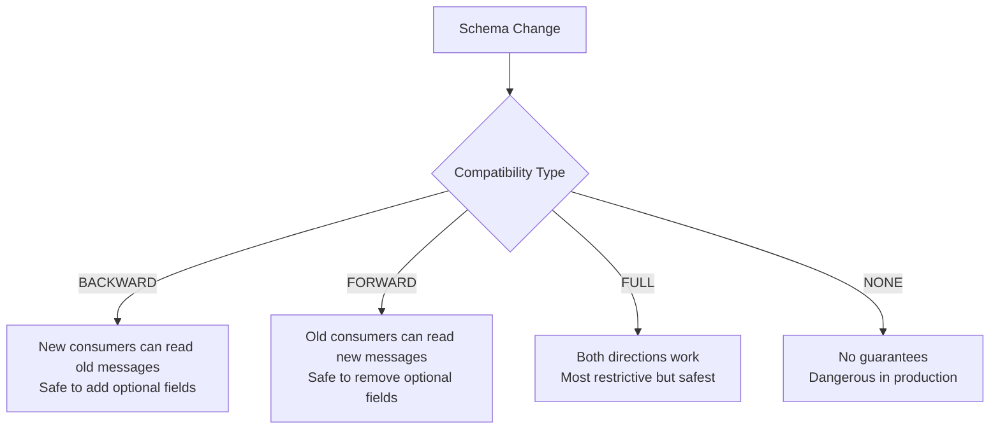

# How to Implement Schema Evolution and Backward Compatibility in GCP Data Pipelines Using Avro and Pub/Sub

Author: [nawazdhandala](https://www.github.com/nawazdhandala)

Tags: GCP, Pub/Sub, Avro, Schema Evolution, Data Pipelines, Schema Registry, Data Engineering

Description: Learn how to handle schema evolution and maintain backward compatibility in GCP data pipelines using Avro schemas with Pub/Sub Schema Registry for reliable message processing.

---

Schemas change. Fields get added, types get modified, and old fields get deprecated. In a simple application, you update the code and redeploy. In a distributed data pipeline with multiple producers and consumers, a schema change without proper handling can break everything downstream. Avro's schema evolution capabilities combined with Pub/Sub's Schema Registry give you a way to make schema changes safely. Here is how to set it up.

## The Schema Evolution Problem

Imagine you have a Pub/Sub topic that multiple services publish to and multiple consumers read from. The message format looks like this today:

```json
{
  "user_id": "u123",
  "event_type": "purchase",
  "amount": 49.99,
  "timestamp": "2026-02-17T10:00:00Z"
}
```

Now you need to add a `currency` field. If you start publishing messages with the new field, will old consumers that do not know about `currency` break? If some producers have not been updated yet, will new consumers that expect `currency` fail on old messages?

Avro solves this through schema compatibility rules that govern what changes are safe.

## Avro Compatibility Types



- Backward compatible: New schema can read data written with old schema (add fields with defaults)
- Forward compatible: Old schema can read data written with new schema (remove optional fields)
- Full compatible: Both backward and forward (safest for evolving schemas)

## Step 1: Create an Avro Schema

Define your initial schema in Avro format:

```json
{
  "type": "record",
  "name": "UserEvent",
  "namespace": "com.myapp.events",
  "fields": [
    {
      "name": "user_id",
      "type": "string",
      "doc": "Unique user identifier"
    },
    {
      "name": "event_type",
      "type": "string",
      "doc": "Type of event: purchase, view, click"
    },
    {
      "name": "amount",
      "type": ["null", "double"],
      "default": null,
      "doc": "Transaction amount, null for non-purchase events"
    },
    {
      "name": "timestamp",
      "type": {
        "type": "long",
        "logicalType": "timestamp-millis"
      },
      "doc": "Event timestamp in milliseconds since epoch"
    }
  ]
}
```

## Step 2: Register the Schema with Pub/Sub

Pub/Sub has a built-in Schema Registry that validates messages against registered schemas:

```bash
# Create the schema in the Pub/Sub Schema Registry
gcloud pubsub schemas create user-event-schema \
  --type=AVRO \
  --definition-file=schemas/user_event_v1.avsc \
  --project=my-project
```

Create a topic that enforces this schema:

```bash
# Create a topic with schema validation enabled
gcloud pubsub topics create user-events \
  --schema=user-event-schema \
  --message-encoding=JSON \
  --project=my-project
```

Now Pub/Sub will reject any message that does not conform to the schema. This prevents malformed data from entering your pipeline.

## Step 3: Publish Messages with Schema Validation

Here is how to publish schema-validated messages:

```python
# publisher.py - Publish Avro-validated messages to Pub/Sub
from google.cloud import pubsub_v1
from google.pubsub_v1.types import Encoding
import json
from datetime import datetime

publisher = pubsub_v1.PublisherClient()
topic_path = publisher.topic_path('my-project', 'user-events')

def publish_event(user_id, event_type, amount=None):
    """Publish a user event with schema validation."""
    event = {
        "user_id": user_id,
        "event_type": event_type,
        "amount": amount,  # null/None for non-purchase events
        "timestamp": int(datetime.utcnow().timestamp() * 1000)
    }

    # Publish with JSON encoding (Pub/Sub validates against the schema)
    data = json.dumps(event).encode("utf-8")

    try:
        future = publisher.publish(topic_path, data=data)
        message_id = future.result()
        print(f"Published message {message_id}")
    except Exception as e:
        # This will catch schema validation errors
        print(f"Failed to publish: {e}")
        raise

# Publish some events
publish_event("user_001", "purchase", amount=49.99)
publish_event("user_002", "view")  # amount is null, which is valid
```

## Step 4: Evolve the Schema (Backward Compatible)

Now let us add a `currency` field. To maintain backward compatibility, the new field must have a default value:

```json
{
  "type": "record",
  "name": "UserEvent",
  "namespace": "com.myapp.events",
  "fields": [
    {
      "name": "user_id",
      "type": "string",
      "doc": "Unique user identifier"
    },
    {
      "name": "event_type",
      "type": "string",
      "doc": "Type of event: purchase, view, click"
    },
    {
      "name": "amount",
      "type": ["null", "double"],
      "default": null,
      "doc": "Transaction amount, null for non-purchase events"
    },
    {
      "name": "timestamp",
      "type": {
        "type": "long",
        "logicalType": "timestamp-millis"
      },
      "doc": "Event timestamp in milliseconds since epoch"
    },
    {
      "name": "currency",
      "type": ["null", "string"],
      "default": null,
      "doc": "ISO 4217 currency code, null defaults to USD"
    },
    {
      "name": "session_id",
      "type": ["null", "string"],
      "default": null,
      "doc": "Browser session identifier"
    }
  ]
}
```

Key rules for backward compatibility:
- New fields must have default values (typically `null` using a union type)
- You cannot remove existing required fields
- You cannot change field types (except widening, like int to long)

## Step 5: Validate and Commit the Schema Revision

Before updating the schema in production, validate compatibility:

```bash
# Validate that the new schema is compatible with the existing one
gcloud pubsub schemas validate-message \
  --schema=user-event-schema \
  --message-encoding=JSON \
  --message='{"user_id":"test","event_type":"view","amount":null,"timestamp":1708171200000}' \
  --project=my-project

# If validation passes, commit the new revision
gcloud pubsub schemas commit user-event-schema \
  --type=AVRO \
  --definition-file=schemas/user_event_v2.avsc \
  --project=my-project
```

The schema revision system means you can track the history of schema changes:

```bash
# List all revisions of a schema
gcloud pubsub schemas list-revisions user-event-schema \
  --project=my-project

# View a specific revision
gcloud pubsub schemas describe user-event-schema \
  --revision-id=REVISION_ID \
  --project=my-project
```

## Step 6: Handle Schema Evolution in Consumers

Consumers need to handle messages that might be written with either the old or new schema:

```python
# consumer.py - Consume messages handling schema evolution gracefully
from google.cloud import pubsub_v1
import json

subscriber = pubsub_v1.SubscriberClient()
subscription_path = subscriber.subscription_path('my-project', 'user-events-sub')

def process_message(message):
    """Process a message, handling both old and new schema versions."""
    data = json.loads(message.data.decode('utf-8'))

    user_id = data['user_id']
    event_type = data['event_type']
    amount = data.get('amount')  # Present in all versions
    timestamp = data['timestamp']

    # New fields - use defaults for old messages that lack these fields
    currency = data.get('currency', 'USD')  # Default to USD for old messages
    session_id = data.get('session_id')     # None if not present

    # Process the event
    print(f"Processing event: user={user_id}, type={event_type}, "
          f"amount={amount} {currency}, session={session_id}")

    # Acknowledge the message
    message.ack()


def callback(message):
    """Subscriber callback with error handling."""
    try:
        process_message(message)
    except KeyError as e:
        print(f"Missing required field: {e}")
        # If a required field is missing, the message is malformed
        message.nack()
    except Exception as e:
        print(f"Error processing message: {e}")
        message.nack()

# Start consuming
streaming_pull_future = subscriber.subscribe(subscription_path, callback=callback)
print(f"Listening for messages on {subscription_path}")

try:
    streaming_pull_future.result()
except KeyboardInterrupt:
    streaming_pull_future.cancel()
    streaming_pull_future.result()
```

## Step 7: Schema Evolution in Dataflow Pipelines

For Dataflow pipelines that consume Pub/Sub, handle schema evolution in your parsing logic:

```python
# dataflow_consumer.py - Dataflow pipeline with schema evolution handling
import apache_beam as beam
from apache_beam.io.gcp.pubsub import ReadFromPubSub
import json

class ParseWithSchemaEvolution(beam.DoFn):
    """Parse messages handling multiple schema versions."""

    # Define the expected schema with defaults for optional/new fields
    FIELD_DEFAULTS = {
        'currency': 'USD',
        'session_id': None,
    }

    def process(self, element):
        try:
            data = json.loads(element.decode('utf-8'))

            # Apply defaults for any missing fields
            for field, default in self.FIELD_DEFAULTS.items():
                if field not in data:
                    data[field] = default

            # Validate required fields
            for required in ['user_id', 'event_type', 'timestamp']:
                if required not in data:
                    raise ValueError(f"Missing required field: {required}")

            yield data

        except (json.JSONDecodeError, ValueError) as e:
            # Route bad messages to a dead letter queue
            yield beam.pvalue.TaggedOutput('dead_letter', {
                'raw': str(element),
                'error': str(e)
            })


# In the pipeline
with beam.Pipeline() as pipeline:
    messages = (
        pipeline
        | 'Read' >> ReadFromPubSub(subscription='projects/my-project/subscriptions/events-sub')
        | 'Parse' >> beam.ParDo(ParseWithSchemaEvolution())
            .with_outputs('dead_letter', main='parsed')
    )
```

## Step 8: Schema Evolution in BigQuery

When your pipeline writes to BigQuery, handle schema changes there too:

```python
# bigquery_schema_update.py - Automatically add new fields to BigQuery tables
from google.cloud import bigquery

client = bigquery.Client()

def evolve_bigquery_schema(table_id, new_fields):
    """Add new columns to an existing BigQuery table."""
    table = client.get_table(table_id)
    original_schema = list(table.schema)

    # Add new fields that do not already exist
    existing_field_names = {field.name for field in original_schema}
    schema_changed = False

    for field in new_fields:
        if field.name not in existing_field_names:
            original_schema.append(field)
            schema_changed = True
            print(f"Adding field: {field.name} ({field.field_type})")

    if schema_changed:
        table.schema = original_schema
        client.update_table(table, ['schema'])
        print(f"Updated schema for {table_id}")
    else:
        print("No schema changes needed")


# Example: Add currency and session_id columns
new_fields = [
    bigquery.SchemaField("currency", "STRING", mode="NULLABLE",
                         description="ISO 4217 currency code"),
    bigquery.SchemaField("session_id", "STRING", mode="NULLABLE",
                         description="Browser session identifier"),
]

evolve_bigquery_schema('my-project.analytics.user_events', new_fields)
```

## Best Practices for Schema Evolution

1. Always make new fields optional with defaults. This is the single most important rule for backward compatibility. If a new field is required, old messages will fail validation.

2. Never remove fields; deprecate them instead. Stop writing to them, but keep them in the schema so old consumers do not break.

3. Never change a field's type. If you need a different type, add a new field with the new type and deprecate the old one.

4. Use schema versioning in your message metadata. Include a `schema_version` field so consumers can branch logic based on the version.

5. Test schema changes in staging before production. Run both old and new producers and consumers simultaneously to verify compatibility.

6. Document every schema change in a changelog. Include the date, what changed, why it changed, and any consumer updates needed.

Schema evolution is fundamentally about coordination between producers and consumers. Avro provides the rules, Pub/Sub Schema Registry provides the enforcement, and good engineering practices provide the reliability. Get this right and your data pipelines will handle change gracefully instead of breaking at every schema update.
