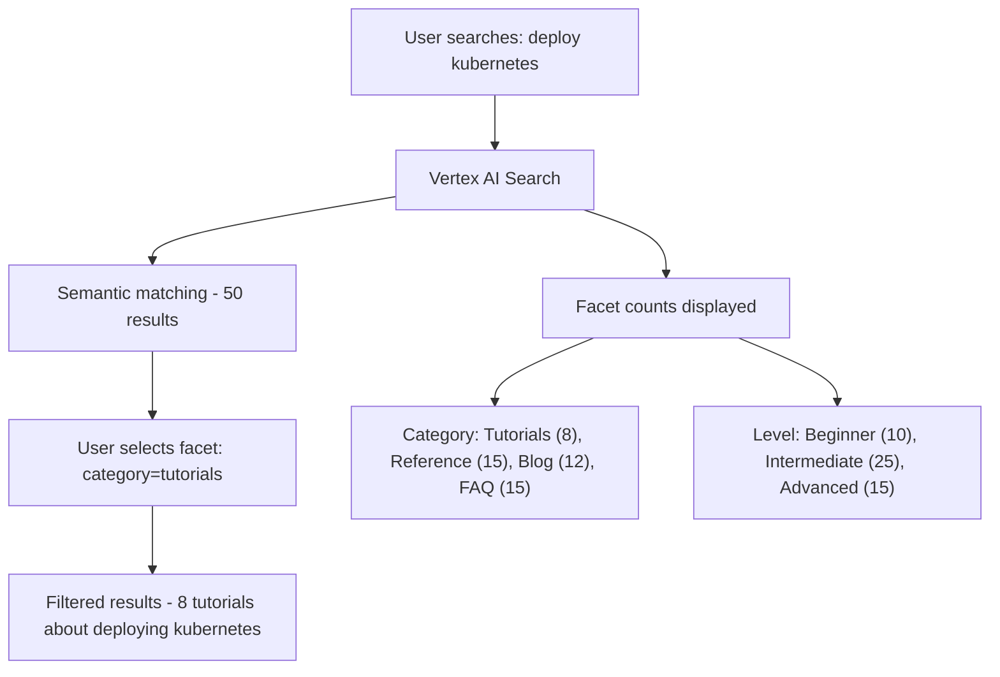

# How to Implement Search Filtering with Metadata Facets in Vertex AI Search

Author: [nawazdhandala](https://www.github.com/nawazdhandala)

Tags: GCP, Vertex AI Search, Metadata, Facets, Search Filtering

Description: Implement metadata-based search filtering and faceted navigation in Vertex AI Search to let users narrow results by category, date, type, and custom attributes.

---

Good search is not just about finding relevant results - it is about letting users narrow those results quickly. Metadata facets make this possible. They let users filter search results by category, date range, content type, author, department, or any other attribute you attach to your documents. When combined with Vertex AI Search's semantic understanding, faceted filtering gives users both the intelligence of AI-powered search and the precision of structured filtering.

This guide covers how to define metadata schemas, attach metadata to documents, configure facets, and build a search experience with filtering.

## Understanding Metadata and Facets

**Metadata** is structured data attached to each document - things like category, author, publish date, or department. It does not affect how the document's content is indexed for semantic search, but it enables filtering and sorting.

**Facets** are the filter options shown to users in the search interface. Each facet corresponds to a metadata field. When a user clicks a facet value (like "category: Tutorials"), the results are filtered to only show documents with that metadata value.



## Prerequisites

- Vertex AI Search engine with a data store
- Python 3.9+

```bash
pip install google-cloud-discoveryengine
```

## Defining a Metadata Schema

Before importing documents, define what metadata fields your documents will have. This schema tells Vertex AI Search which fields are filterable and facetable.

```python
from google.cloud import discoveryengine_v1 as discoveryengine

def update_schema(
    project_id: str,
    location: str,
    data_store_id: str,
):
    """Define the metadata schema for the data store."""
    client = discoveryengine.SchemaServiceClient()

    schema_name = (
        f"projects/{project_id}/locations/{location}"
        f"/collections/default_collection/dataStores/{data_store_id}"
        f"/schemas/default_schema"
    )

    # Define the schema with filterable and facetable fields
    schema = discoveryengine.Schema(
        name=schema_name,
        struct_schema={
            "$schema": "https://json-schema.org/draft/2020-12/schema",
            "type": "object",
            "properties": {
                "category": {
                    "type": "string",
                    "keyPropertyMapping": "category",
                    "retrievable": True,
                    "indexable": True,
                    "dynamicFacetable": True,
                    "searchable": True,
                },
                "content_type": {
                    "type": "string",
                    "retrievable": True,
                    "indexable": True,
                    "dynamicFacetable": True,
                },
                "author": {
                    "type": "string",
                    "retrievable": True,
                    "indexable": True,
                    "dynamicFacetable": True,
                },
                "department": {
                    "type": "string",
                    "retrievable": True,
                    "indexable": True,
                    "dynamicFacetable": True,
                },
                "publish_date": {
                    "type": "string",
                    "retrievable": True,
                    "indexable": True,
                },
                "difficulty_level": {
                    "type": "string",
                    "retrievable": True,
                    "indexable": True,
                    "dynamicFacetable": True,
                },
                "tags": {
                    "type": "array",
                    "items": {"type": "string"},
                    "retrievable": True,
                    "indexable": True,
                },
            },
        },
    )

    operation = client.update_schema(schema=schema)
    result = operation.result(timeout=300)
    print(f"Schema updated: {result.name}")
    return result
```

## Importing Documents with Metadata

### Structured Data Import

For structured data, include metadata fields alongside the content.

```python
import json

def prepare_structured_documents():
    """Prepare documents with metadata in JSONL format for import."""
    documents = [
        {
            "id": "doc-001",
            "content": {
                "mimeType": "text/plain",
                "uri": "gs://your-bucket/docs/k8s-deploy-guide.pdf",
            },
            "structData": {
                "title": "Kubernetes Deployment Guide",
                "category": "tutorials",
                "content_type": "guide",
                "author": "DevOps Team",
                "department": "Engineering",
                "publish_date": "2026-01-15",
                "difficulty_level": "intermediate",
                "tags": ["kubernetes", "deployment", "containers"],
            },
        },
        {
            "id": "doc-002",
            "content": {
                "mimeType": "text/plain",
                "uri": "gs://your-bucket/docs/security-policy.pdf",
            },
            "structData": {
                "title": "Security Policy Handbook",
                "category": "policy",
                "content_type": "handbook",
                "author": "Security Team",
                "department": "Security",
                "publish_date": "2026-02-01",
                "difficulty_level": "all",
                "tags": ["security", "compliance", "policy"],
            },
        },
        {
            "id": "doc-003",
            "content": {
                "mimeType": "text/plain",
                "uri": "gs://your-bucket/docs/cloud-run-faq.pdf",
            },
            "structData": {
                "title": "Cloud Run FAQ",
                "category": "faq",
                "content_type": "reference",
                "author": "Platform Team",
                "department": "Engineering",
                "publish_date": "2026-02-10",
                "difficulty_level": "beginner",
                "tags": ["cloud-run", "serverless", "faq"],
            },
        },
    ]

    # Write as JSONL for import
    jsonl_path = "/tmp/documents.jsonl"
    with open(jsonl_path, "w") as f:
        for doc in documents:
            f.write(json.dumps(doc) + "\n")

    print(f"Prepared {len(documents)} documents at {jsonl_path}")
    return jsonl_path
```

### Importing with the API

```python
def import_structured_documents(
    project_id: str,
    location: str,
    data_store_id: str,
    gcs_jsonl_uri: str,
):
    """Import documents with metadata from a JSONL file."""
    client = discoveryengine.DocumentServiceClient()

    parent = (
        f"projects/{project_id}/locations/{location}"
        f"/collections/default_collection/dataStores/{data_store_id}"
        f"/branches/default_branch"
    )

    gcs_source = discoveryengine.GcsSource(
        input_uris=[gcs_jsonl_uri],
        data_schema="document",  # Use "document" for structured imports
    )

    request = discoveryengine.ImportDocumentsRequest(
        parent=parent,
        gcs_source=gcs_source,
        reconciliation_mode=discoveryengine.ImportDocumentsRequest.ReconciliationMode.FULL,
    )

    operation = client.import_documents(request=request)
    result = operation.result(timeout=600)
    print(f"Import complete")
    return result
```

## Searching with Facets

### Requesting Facet Counts

```python
def search_with_facets(
    project_id: str,
    location: str,
    engine_id: str,
    query: str,
):
    """Search and get facet counts for building filter navigation."""
    client = discoveryengine.SearchServiceClient()

    serving_config = (
        f"projects/{project_id}/locations/{location}"
        f"/collections/default_collection/engines/{engine_id}"
        f"/servingConfigs/default_search"
    )

    # Define which facets to return
    facet_specs = [
        discoveryengine.SearchRequest.FacetSpec(
            facet_key=discoveryengine.SearchRequest.FacetSpec.FacetKey(
                key="category",
            ),
            limit=10,  # Maximum number of facet values to return
        ),
        discoveryengine.SearchRequest.FacetSpec(
            facet_key=discoveryengine.SearchRequest.FacetSpec.FacetKey(
                key="department",
            ),
            limit=10,
        ),
        discoveryengine.SearchRequest.FacetSpec(
            facet_key=discoveryengine.SearchRequest.FacetSpec.FacetKey(
                key="difficulty_level",
            ),
            limit=5,
        ),
        discoveryengine.SearchRequest.FacetSpec(
            facet_key=discoveryengine.SearchRequest.FacetSpec.FacetKey(
                key="content_type",
            ),
            limit=10,
        ),
    ]

    request = discoveryengine.SearchRequest(
        serving_config=serving_config,
        query=query,
        page_size=10,
        facet_specs=facet_specs,
        content_search_spec=discoveryengine.SearchRequest.ContentSearchSpec(
            snippet_spec=discoveryengine.SearchRequest.ContentSearchSpec.SnippetSpec(
                return_snippet=True,
            ),
        ),
    )

    response = client.search(request)

    # Display facet counts
    print(f"Search: '{query}' - {response.total_size} results\n")

    print("Available Filters:")
    for facet in response.facets:
        print(f"\n  {facet.key}:")
        for value in facet.values:
            print(f"    {value.value} ({value.count})")

    # Display results
    print(f"\nResults:")
    for result in response.results:
        doc_data = result.document.derived_struct_data
        print(f"  {doc_data.get('title', 'N/A')} [{doc_data.get('category', 'N/A')}]")

    return response

# Search and see available facets
search_with_facets(
    project_id="your-project-id",
    location="global",
    engine_id="your-engine-id",
    query="how to deploy applications",
)
```

### Applying Facet Filters

```python
def search_with_filter(
    project_id: str,
    location: str,
    engine_id: str,
    query: str,
    filters: dict,
):
    """Search with metadata filters applied."""
    client = discoveryengine.SearchServiceClient()

    serving_config = (
        f"projects/{project_id}/locations/{location}"
        f"/collections/default_collection/engines/{engine_id}"
        f"/servingConfigs/default_search"
    )

    # Build the filter expression from the active filters
    filter_parts = []
    for key, value in filters.items():
        if isinstance(value, list):
            # Multiple values for the same field (OR logic)
            values_str = ", ".join(f'"{v}"' for v in value)
            filter_parts.append(f'{key}: ANY({values_str})')
        else:
            filter_parts.append(f'{key}: ANY("{value}")')

    filter_expression = " AND ".join(filter_parts) if filter_parts else None

    # Request with facets so the sidebar updates with filtered counts
    facet_specs = [
        discoveryengine.SearchRequest.FacetSpec(
            facet_key=discoveryengine.SearchRequest.FacetSpec.FacetKey(key="category"),
            limit=10,
        ),
        discoveryengine.SearchRequest.FacetSpec(
            facet_key=discoveryengine.SearchRequest.FacetSpec.FacetKey(key="difficulty_level"),
            limit=5,
        ),
    ]

    request = discoveryengine.SearchRequest(
        serving_config=serving_config,
        query=query,
        page_size=10,
        filter=filter_expression,
        facet_specs=facet_specs,
        content_search_spec=discoveryengine.SearchRequest.ContentSearchSpec(
            snippet_spec=discoveryengine.SearchRequest.ContentSearchSpec.SnippetSpec(
                return_snippet=True,
            ),
        ),
    )

    response = client.search(request)

    print(f"Filtered results for '{query}':")
    print(f"  Filters: {filters}")
    print(f"  Total: {response.total_size} results\n")

    for result in response.results:
        doc_data = result.document.derived_struct_data
        title = doc_data.get("title", "N/A")
        category = doc_data.get("category", "N/A")
        level = doc_data.get("difficulty_level", "N/A")
        print(f"  [{category}] [{level}] {title}")

    return response

# Search with a single filter
search_with_filter(
    project_id="your-project-id",
    location="global",
    engine_id="your-engine-id",
    query="deployment guide",
    filters={"category": "tutorials"},
)

# Search with multiple filters
search_with_filter(
    project_id="your-project-id",
    location="global",
    engine_id="your-engine-id",
    query="deployment guide",
    filters={
        "category": "tutorials",
        "difficulty_level": "beginner",
        "department": "Engineering",
    },
)

# Search with multiple values for one field
search_with_filter(
    project_id="your-project-id",
    location="global",
    engine_id="your-engine-id",
    query="security",
    filters={
        "category": ["policy", "tutorials"],  # Match either category
    },
)
```

## Building a Faceted Search API

Here is a complete API that supports faceted search for a frontend application.

```python
from fastapi import FastAPI, Query
from typing import Optional, List

app = FastAPI()

@app.get("/api/search")
async def faceted_search(
    q: str = Query(..., description="Search query"),
    category: Optional[List[str]] = Query(None, description="Filter by category"),
    department: Optional[List[str]] = Query(None, description="Filter by department"),
    level: Optional[str] = Query(None, description="Filter by difficulty level"),
    page: int = Query(1, ge=1),
    page_size: int = Query(10, ge=1, le=50),
):
    """Search with faceted filtering support."""
    # Build filters from query parameters
    filters = {}
    if category:
        filters["category"] = category
    if department:
        filters["department"] = department
    if level:
        filters["difficulty_level"] = level

    response = search_with_filter(
        project_id="your-project-id",
        location="global",
        engine_id="your-engine-id",
        query=q,
        filters=filters,
    )

    # Format for the frontend
    return {
        "query": q,
        "total_results": response.total_size,
        "active_filters": filters,
        "facets": {
            facet.key: [{"value": v.value, "count": v.count} for v in facet.values]
            for facet in response.facets
        },
        "results": [
            {
                "title": r.document.derived_struct_data.get("title", ""),
                "category": r.document.derived_struct_data.get("category", ""),
                "snippets": [s.get("snippet", "") for s in r.document.derived_struct_data.get("snippets", [])],
            }
            for r in response.results
        ],
    }
```

## Metadata Best Practices

Keep your metadata consistent across documents. Use controlled vocabularies for facet fields - if you have both "tutorial" and "tutorials" as category values, they show up as separate facets. Normalize values during import to avoid this.

Limit the number of facets displayed to what is useful. Showing 20 filter categories overwhelms users. Start with 3-5 key facets and add more based on user feedback.

For date-based filtering, consider creating range facets (this month, last quarter, this year) rather than individual dates, which produce too many distinct values.

## Summary

Metadata facets transform Vertex AI Search from a simple search box into a navigable search experience. Users can quickly narrow results to exactly what they need by combining semantic search with structured filters. Define a clean metadata schema upfront, be consistent with metadata values across your document collection, and build your faceted navigation around the attributes that your users actually care about. The effort in organizing metadata pays off significantly in search usability.
