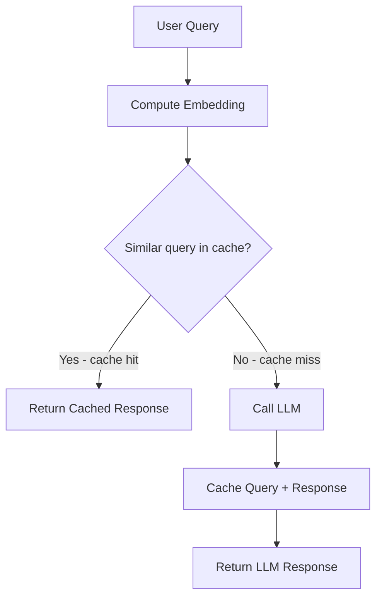

# How to Implement Semantic Caching with LangChain and Memorystore for Redis on GCP

Author: [nawazdhandala](https://www.github.com/nawazdhandala)

Tags: GCP, LangChain, Redis, Semantic Caching, Memorystore

Description: Reduce LLM costs and latency by implementing semantic caching with LangChain and Google Cloud Memorystore for Redis in your AI applications.

---

Every call to a large language model costs money and takes time. If your application receives similar questions repeatedly, you are paying for the same computation over and over. Traditional caching with exact string matching helps, but it misses semantically equivalent queries. "What is the price of the pro plan?" and "How much does the pro tier cost?" mean the same thing but would cache miss with exact matching.

Semantic caching solves this by comparing query embeddings instead of raw strings. If a new query is semantically close enough to a cached query, you return the cached response without calling the LLM. Google Cloud Memorystore for Redis gives you a fast, managed cache store, and LangChain has built-in support for semantic caching with Redis.

## How Semantic Caching Works

The process is straightforward:

1. When a query arrives, compute its embedding
2. Search the cache for any stored embeddings within a similarity threshold
3. If a match is found, return the cached response instantly
4. If no match, call the LLM, cache the query embedding and response, then return



## Prerequisites

- Google Cloud project with Memorystore for Redis API enabled
- A Memorystore for Redis instance
- Python 3.9+
- Network connectivity to the Redis instance (VPC or Serverless VPC connector)

```bash
# Install required packages
pip install langchain langchain-google-vertexai langchain-community redis google-cloud-aiplatform
```

## Setting Up Memorystore for Redis

If you do not have a Redis instance, create one through gcloud:

```bash
# Create a Memorystore for Redis instance
gcloud redis instances create semantic-cache \
    --size=1 \
    --region=us-central1 \
    --redis-version=redis_7_0 \
    --project=your-project-id

# Get the instance details including the IP address
gcloud redis instances describe semantic-cache \
    --region=us-central1 \
    --project=your-project-id
```

Note the `host` and `port` from the output - you will need them to connect.

## Implementing Semantic Cache with LangChain

### Basic Setup

```python
from langchain_google_vertexai import ChatVertexAI, VertexAIEmbeddings
from langchain.cache import RedisSemanticCache
from langchain.globals import set_llm_cache

# Initialize the embedding model for cache similarity matching
embeddings = VertexAIEmbeddings(
    model_name="text-embedding-004",
    project="your-project-id",
)

# Set up the semantic cache backed by Memorystore for Redis
# Replace the host with your Memorystore instance IP
set_llm_cache(
    RedisSemanticCache(
        redis_url="redis://10.0.0.3:6379",  # Your Memorystore IP and port
        embedding=embeddings,
        score_threshold=0.85,  # Similarity threshold - higher means stricter matching
    )
)

# Initialize the LLM - all calls through this model will use the cache
llm = ChatVertexAI(
    model_name="gemini-1.5-pro",
    project="your-project-id",
    location="us-central1",
    temperature=0.2,
)
```

### Testing the Cache

```python
import time

# First call - this will be a cache miss and call the LLM
start = time.time()
response1 = llm.invoke("What are the benefits of using Cloud Run?")
elapsed1 = time.time() - start
print(f"First call ({elapsed1:.2f}s): {response1.content[:100]}...")

# Second call with the exact same query - exact cache hit
start = time.time()
response2 = llm.invoke("What are the benefits of using Cloud Run?")
elapsed2 = time.time() - start
print(f"Same query ({elapsed2:.2f}s): {response2.content[:100]}...")

# Third call with semantically similar but different wording - semantic cache hit
start = time.time()
response3 = llm.invoke("What advantages does Cloud Run offer?")
elapsed3 = time.time() - start
print(f"Similar query ({elapsed3:.2f}s): {response3.content[:100]}...")

print(f"\nSpeedup: {elapsed1/elapsed3:.1f}x faster with semantic cache")
```

## Tuning the Similarity Threshold

The `score_threshold` parameter controls how similar two queries need to be for a cache hit. This is the most important parameter to tune.

```python
# Conservative threshold - only very similar queries match
conservative_cache = RedisSemanticCache(
    redis_url="redis://10.0.0.3:6379",
    embedding=embeddings,
    score_threshold=0.95,  # Very strict - nearly identical queries only
)

# Balanced threshold - good default for most use cases
balanced_cache = RedisSemanticCache(
    redis_url="redis://10.0.0.3:6379",
    embedding=embeddings,
    score_threshold=0.85,  # Catches paraphrases while avoiding false matches
)

# Aggressive threshold - caches more broadly, risk of wrong matches
aggressive_cache = RedisSemanticCache(
    redis_url="redis://10.0.0.3:6379",
    embedding=embeddings,
    score_threshold=0.75,  # Broader matching - watch for false positives
)
```

Here is a rough guide for choosing thresholds:

- **0.90-0.95**: Safe for production with sensitive data. Only near-identical queries match.
- **0.85-0.90**: Good balance for most applications. Catches common rephrasings.
- **0.75-0.85**: Aggressive caching. Good for reducing costs, but test thoroughly for false matches.

## Cache Management

### Clearing the Cache

```python
import redis

def clear_semantic_cache(redis_url: str):
    """Clear all entries from the semantic cache."""
    r = redis.from_url(redis_url)
    # Delete all keys matching the cache pattern
    keys = r.keys("cache:*")
    if keys:
        r.delete(*keys)
        print(f"Cleared {len(keys)} cache entries")
    else:
        print("Cache is already empty")

clear_semantic_cache("redis://10.0.0.3:6379")
```

### Cache with TTL

Add time-to-live so stale entries automatically expire.

```python
from langchain.cache import RedisSemanticCache

# Create a cache with TTL - entries expire after 1 hour
cache_with_ttl = RedisSemanticCache(
    redis_url="redis://10.0.0.3:6379",
    embedding=embeddings,
    score_threshold=0.85,
    ttl=3600,  # Cache entries expire after 3600 seconds (1 hour)
)

set_llm_cache(cache_with_ttl)
```

## Selective Caching

Not every query should be cached. For example, you might want to skip caching for queries that include real-time data or user-specific information.

```python
from langchain_google_vertexai import ChatVertexAI

# Create two model instances - one with cache, one without
cached_llm = ChatVertexAI(
    model_name="gemini-1.5-pro",
    project="your-project-id",
    location="us-central1",
    temperature=0.2,
    cache=True,  # Use the global cache
)

uncached_llm = ChatVertexAI(
    model_name="gemini-1.5-pro",
    project="your-project-id",
    location="us-central1",
    temperature=0.7,
    cache=False,  # Skip caching for this model
)

def handle_query(query: str, is_cacheable: bool = True):
    """Route queries to cached or uncached model based on context."""
    if is_cacheable:
        return cached_llm.invoke(query)
    else:
        return uncached_llm.invoke(query)

# General knowledge query - cacheable
handle_query("What is Kubernetes?", is_cacheable=True)

# User-specific query - do not cache
handle_query("What are my recent deployments?", is_cacheable=False)
```

## Monitoring Cache Performance

Track cache hit rates to understand the effectiveness of your caching strategy.

```python
import redis
import json

class CacheMonitor:
    """Monitor semantic cache hit rates and performance."""

    def __init__(self, redis_url: str):
        self.redis_client = redis.from_url(redis_url)
        self.hits = 0
        self.misses = 0

    def record_hit(self):
        self.hits += 1
        self.redis_client.incr("cache_stats:hits")

    def record_miss(self):
        self.misses += 1
        self.redis_client.incr("cache_stats:misses")

    def get_stats(self) -> dict:
        hits = int(self.redis_client.get("cache_stats:hits") or 0)
        misses = int(self.redis_client.get("cache_stats:misses") or 0)
        total = hits + misses
        hit_rate = hits / total if total > 0 else 0.0

        return {
            "total_queries": total,
            "cache_hits": hits,
            "cache_misses": misses,
            "hit_rate": f"{hit_rate:.2%}",
        }

monitor = CacheMonitor("redis://10.0.0.3:6379")
print(json.dumps(monitor.get_stats(), indent=2))
```

## Network Configuration

Memorystore for Redis runs in a VPC, so your application needs network access to reach it. For Cloud Run or Cloud Functions, set up a Serverless VPC Access connector.

```bash
# Create a VPC connector for serverless services
gcloud compute networks vpc-access connectors create redis-connector \
    --region=us-central1 \
    --network=default \
    --range=10.8.0.0/28 \
    --project=your-project-id

# Deploy a Cloud Run service with the VPC connector
gcloud run deploy my-ai-service \
    --vpc-connector=redis-connector \
    --region=us-central1 \
    --project=your-project-id
```

## Cost Impact

The cost savings from semantic caching can be significant. Gemini API charges are based on input and output tokens. If your application handles 10,000 queries per day and achieves a 40% cache hit rate, you avoid 4,000 LLM calls daily. At typical token costs, that adds up quickly.

Memorystore for Redis costs are relatively low - a 1GB instance in us-central1 runs about $35/month, which is likely less than the LLM costs you save in a single day with a decent hit rate.

## Summary

Semantic caching with LangChain and Memorystore for Redis is one of the simplest optimizations you can add to an LLM-powered application. It reduces latency from seconds to milliseconds for cache hits, cuts API costs proportionally to your hit rate, and requires minimal code changes. Start with a similarity threshold of 0.85, add a TTL that matches how frequently your data changes, and monitor your hit rate to tune the threshold over time. The investment in a small Redis instance pays for itself quickly.
