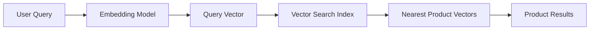

# How to Implement Semantic Search for E-Commerce with Vertex AI Vector Search

Author: [nawazdhandala](https://www.github.com/nawazdhandala)

Tags: GCP, Vertex AI, Vector Search, Semantic Search, E-Commerce, Embeddings, Google Cloud

Description: Build a semantic search engine for e-commerce product catalogs using Vertex AI Vector Search and text embeddings for better search relevance.

---

Traditional keyword search fails e-commerce in predictable ways. A customer searches for "comfortable work from home chair" and gets zero results because no product listing contains that exact phrase. Meanwhile, the "ergonomic lumbar support office chair" that is exactly what they want sits undiscovered. Semantic search fixes this by matching on meaning rather than keywords. In this guide, I will walk you through building a semantic search system for an e-commerce catalog using Vertex AI Vector Search.

## How Semantic Search Works

The core idea is simple. Instead of matching keywords, you convert both the search query and your product catalog into numerical vectors (embeddings) that capture meaning. Products with similar meanings have vectors that are close together in the embedding space. When a customer searches, you convert their query to a vector and find the nearest product vectors.



## Prerequisites

```bash
# Enable required APIs
gcloud services enable \
    aiplatform.googleapis.com \
    storage.googleapis.com \
    --project=your-project-id
```

Install the Python dependencies:

```bash
# Install the Vertex AI SDK and supporting libraries
pip install google-cloud-aiplatform pandas numpy
```

## Step 1: Generate Product Embeddings

First, you need to convert your product catalog into embeddings. Here is how to do it with the Vertex AI text embedding model:

```python
import vertexai
from vertexai.language_models import TextEmbeddingModel
import pandas as pd
import json
import numpy as np

# Initialize Vertex AI
vertexai.init(project="your-project-id", location="us-central1")

# Load the text embedding model
embedding_model = TextEmbeddingModel.from_pretrained("text-embedding-005")

# Sample product catalog - in practice, load this from your database
products = [
    {
        "id": "prod-001",
        "name": "Ergonomic Lumbar Support Office Chair",
        "description": "Adjustable office chair with built-in lumbar support, breathable mesh back, and padded armrests. Perfect for long work sessions.",
        "category": "Furniture",
        "price": 299.99,
    },
    {
        "id": "prod-002",
        "name": "Wireless Noise-Cancelling Headphones",
        "description": "Over-ear Bluetooth headphones with active noise cancellation, 30-hour battery life, and premium sound quality.",
        "category": "Electronics",
        "price": 179.99,
    },
    # ... your full catalog
]

def create_product_text(product):
    """Combine product fields into a single text string for embedding.
    Including category and key attributes improves search relevance."""
    return f"{product['name']}. {product['description']}. Category: {product['category']}"

def generate_embeddings_batch(texts, batch_size=250):
    """Generate embeddings in batches to respect API limits.
    The embedding model accepts up to 250 texts per call."""
    all_embeddings = []

    for i in range(0, len(texts), batch_size):
        batch = texts[i:i + batch_size]
        embeddings = embedding_model.get_embeddings(batch)
        all_embeddings.extend([e.values for e in embeddings])
        print(f"Processed {min(i + batch_size, len(texts))}/{len(texts)} products")

    return all_embeddings

# Generate the text representations and their embeddings
product_texts = [create_product_text(p) for p in products]
embeddings = generate_embeddings_batch(product_texts)

print(f"Generated {len(embeddings)} embeddings, each with {len(embeddings[0])} dimensions")
```

## Step 2: Prepare Data for Vector Search

Vertex AI Vector Search expects embeddings in a specific JSON Lines format stored in Cloud Storage:

```python
from google.cloud import storage

def prepare_for_vector_search(products, embeddings, bucket_name, blob_path):
    """Format embeddings as JSON Lines and upload to Cloud Storage.
    Each line contains an id, embedding vector, and restricts for filtering."""

    lines = []
    for product, embedding in zip(products, embeddings):
        record = {
            "id": product["id"],
            "embedding": embedding,
            # Restricts allow you to filter results by category, price range, etc.
            "restricts": [
                {"namespace": "category", "allow": [product["category"]]},
            ],
        }
        lines.append(json.dumps(record))

    # Upload to Cloud Storage
    client = storage.Client()
    bucket = client.bucket(bucket_name)
    blob = bucket.blob(blob_path)
    blob.upload_from_string("\n".join(lines))

    print(f"Uploaded {len(lines)} records to gs://{bucket_name}/{blob_path}")

# Upload the formatted embeddings
prepare_for_vector_search(
    products, embeddings,
    bucket_name="your-embeddings-bucket",
    blob_path="product_embeddings/embeddings.json"
)
```

## Step 3: Create the Vector Search Index

Now create the index that will power your search:

```python
from google.cloud import aiplatform

aiplatform.init(project="your-project-id", location="us-central1")

# Create the Vector Search index
# tree_ah_config uses the ScaNN algorithm for fast approximate nearest neighbor search
index = aiplatform.MatchingEngineIndex.create_tree_ah_index(
    display_name="product-search-index",
    contents_delta_uri="gs://your-embeddings-bucket/product_embeddings/",
    dimensions=768,  # Must match the embedding model's output dimensions
    approximate_neighbors_count=50,
    distance_measure_type="DOT_PRODUCT_DISTANCE",
    shard_size="SHARD_SIZE_SMALL",  # Use SMALL for catalogs under 1M products
    description="Product catalog semantic search index",
)

print(f"Index created: {index.resource_name}")
```

Index creation takes 30-60 minutes depending on the data size. You can check progress in the Cloud Console.

## Step 4: Deploy the Index to an Endpoint

The index needs to be deployed to a Vector Search endpoint to serve queries:

```python
# Create an endpoint for serving search queries
endpoint = aiplatform.MatchingEngineIndexEndpoint.create(
    display_name="product-search-endpoint",
    public_endpoint_enabled=True,  # Makes it accessible via REST API
)

# Deploy the index to the endpoint
endpoint.deploy_index(
    index=index,
    deployed_index_id="product-search-deployed",
    display_name="product-search-deployed",
    machine_type="e2-standard-2",  # Choose based on expected QPS
    min_replica_count=1,
    max_replica_count=4,  # Autoscales based on traffic
)

print(f"Endpoint deployed: {endpoint.resource_name}")
```

## Step 5: Query the Search Index

With everything deployed, you can now run semantic searches:

```python
def semantic_search(query_text, num_results=10, category_filter=None):
    """Search the product catalog using natural language queries.
    Optionally filter by product category."""

    # Convert the search query to an embedding vector
    query_embedding = embedding_model.get_embeddings([query_text])[0].values

    # Build optional category filter
    restricts = []
    if category_filter:
        restricts.append(
            aiplatform.matching_engine.matching_engine_index_endpoint.Namespace(
                name="category",
                allow_tokens=[category_filter],
            )
        )

    # Query the Vector Search endpoint
    response = endpoint.find_neighbors(
        deployed_index_id="product-search-deployed",
        queries=[query_embedding],
        num_neighbors=num_results,
        filter=restricts if restricts else None,
    )

    # Map the results back to product data
    results = []
    for match in response[0]:
        product_id = match.id
        similarity_score = match.distance
        # Look up full product info from your database
        product = next((p for p in products if p["id"] == product_id), None)
        if product:
            results.append({
                "product": product,
                "relevance_score": similarity_score,
            })

    return results

# Try some natural language searches
results = semantic_search("comfortable chair for working from home all day")
for r in results:
    print(f"{r['relevance_score']:.3f} - {r['product']['name']}")
```

## Step 6: Build the Search API

Wrap the search in a Cloud Run service for production use:

```python
# app.py - Cloud Run search service
from flask import Flask, request, jsonify
import vertexai
from vertexai.language_models import TextEmbeddingModel
from google.cloud import aiplatform

app = Flask(__name__)

# Initialize once at startup
vertexai.init(project="your-project-id", location="us-central1")
embedding_model = TextEmbeddingModel.from_pretrained("text-embedding-005")

# Connect to the deployed endpoint
endpoint = aiplatform.MatchingEngineIndexEndpoint(
    index_endpoint_name="projects/your-project-id/locations/us-central1/indexEndpoints/YOUR_ENDPOINT_ID"
)

@app.route("/search", methods=["GET"])
def search():
    """Handle search queries from the frontend."""
    query = request.args.get("q", "")
    limit = int(request.args.get("limit", 20))
    category = request.args.get("category")

    if not query:
        return jsonify({"error": "Query parameter 'q' is required"}), 400

    # Generate query embedding
    query_embedding = embedding_model.get_embeddings([query])[0].values

    # Search the index
    response = endpoint.find_neighbors(
        deployed_index_id="product-search-deployed",
        queries=[query_embedding],
        num_neighbors=limit,
    )

    # Format results
    results = [
        {"product_id": match.id, "score": float(match.distance)}
        for match in response[0]
    ]

    return jsonify({"query": query, "results": results})
```

## Keeping the Index Fresh

Product catalogs change constantly. Use streaming updates to keep the index current:

```python
# Add or update products in the index without rebuilding
index.upsert_datapoints(
    datapoints=[
        aiplatform.matching_engine.matching_engine_index_endpoint.IndexDatapoint(
            datapoint_id="prod-new-001",
            feature_vector=new_product_embedding,
        )
    ]
)
```

For large catalog updates, batch the changes and apply them during low-traffic periods.

## Monitoring Search Quality

Track search metrics like click-through rate, zero-result rate, and average result position to measure how well the semantic search performs compared to your previous keyword search. Use OneUptime to monitor the Vector Search endpoint availability and latency so you can catch performance degradation before it affects customers.

## Summary

Semantic search with Vertex AI Vector Search gives your e-commerce platform the ability to understand what customers mean, not just what they type. The combination of high-quality embeddings and fast approximate nearest neighbor search handles catalogs with millions of products at low latency. Start by embedding your catalog, deploy the index, and run it alongside your existing keyword search to compare the results before fully switching over.
