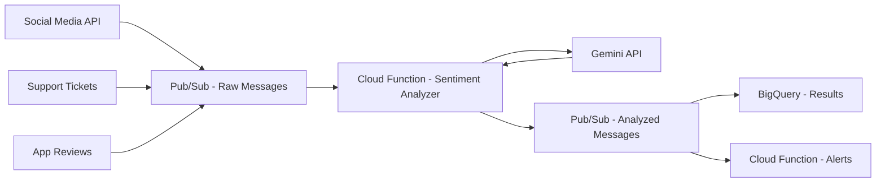

# How to Implement Sentiment Analysis at Scale with Gemini and Pub/Sub on GCP

Author: [nawazdhandala](https://www.github.com/nawazdhandala)

Tags: GCP, Gemini, Pub/Sub, Sentiment Analysis, NLP, Streaming, Google Cloud

Description: Build a scalable streaming sentiment analysis pipeline using Gemini for text classification and Pub/Sub for message ingestion on Google Cloud.

---

When you are processing thousands of social media mentions, support tickets, or product reviews per hour, you need sentiment analysis that keeps up with the data flow. Running Gemini calls synchronously against a database table works for small datasets, but at scale you need a streaming pipeline. This guide shows you how to build one using Pub/Sub for message ingestion, Cloud Functions for processing, and Gemini for the actual sentiment classification.

## The Pipeline Design

Messages come into Pub/Sub from various sources, get processed by Cloud Functions that call Gemini for sentiment analysis, and the results land in BigQuery for analysis and dashboarding.



## Prerequisites

```bash
# Enable the required APIs
gcloud services enable \
    pubsub.googleapis.com \
    cloudfunctions.googleapis.com \
    aiplatform.googleapis.com \
    bigquery.googleapis.com \
    --project=your-project-id
```

## Step 1: Set Up Pub/Sub Topics and Subscriptions

Create the messaging infrastructure:

```bash
# Create the input topic where raw messages arrive
gcloud pubsub topics create raw-messages

# Create the output topic for analyzed messages
gcloud pubsub topics create analyzed-messages

# Create a BigQuery subscription that automatically writes to BigQuery
gcloud pubsub subscriptions create analyzed-to-bigquery \
    --topic=analyzed-messages \
    --bigquery-table=your-project:sentiment_analysis.results \
    --use-topic-schema
```

Define the schema for structured message passing:

```bash
# Create a schema for the analyzed messages
gcloud pubsub schemas create sentiment-result-schema \
    --type=AVRO \
    --definition='{
        "type": "record",
        "name": "SentimentResult",
        "fields": [
            {"name": "message_id", "type": "string"},
            {"name": "source", "type": "string"},
            {"name": "original_text", "type": "string"},
            {"name": "sentiment", "type": "string"},
            {"name": "sentiment_score", "type": "float"},
            {"name": "emotion", "type": "string"},
            {"name": "topics", "type": {"type": "array", "items": "string"}},
            {"name": "analyzed_at", "type": "string"}
        ]
    }'
```

## Step 2: Build the Sentiment Analysis Function

This Cloud Function processes messages from the raw-messages topic:

```python
# main.py - Sentiment analysis Cloud Function
import functions_framework
from google.cloud import pubsub_v1
import vertexai
from vertexai.generative_models import GenerativeModel
import json
import base64
from datetime import datetime

# Initialize at module level for reuse across invocations
vertexai.init(project="your-project-id", location="us-central1")
model = GenerativeModel("gemini-2.0-flash")
publisher = pubsub_v1.PublisherClient()
PROJECT_ID = "your-project-id"
OUTPUT_TOPIC = f"projects/{PROJECT_ID}/topics/analyzed-messages"

# The prompt template for consistent sentiment analysis
ANALYSIS_PROMPT = """Analyze the sentiment of this text. Return ONLY a JSON object with:
- sentiment: "positive", "negative", "neutral", or "mixed"
- sentiment_score: float from -1.0 (very negative) to 1.0 (very positive)
- emotion: primary emotion detected (e.g., "joy", "anger", "frustration", "satisfaction", "confusion")
- topics: array of 1-3 topic keywords mentioned in the text
- confidence: float from 0.0 to 1.0

Text: {text}"""


@functions_framework.cloud_event
def analyze_sentiment(cloud_event):
    """Process a single message from Pub/Sub and publish the analysis result."""

    # Decode the incoming Pub/Sub message
    message_data = base64.b64decode(cloud_event.data["message"]["data"])
    message = json.loads(message_data)

    text = message.get("text", "")
    message_id = message.get("message_id", "unknown")
    source = message.get("source", "unknown")

    # Skip empty or very short messages
    if len(text.strip()) < 5:
        return

    try:
        # Call Gemini for sentiment analysis
        response = model.generate_content(
            ANALYSIS_PROMPT.format(text=text),
            generation_config={
                "temperature": 0.1,       # Low temperature for consistent classification
                "max_output_tokens": 256,  # Sentiment output is small
            }
        )

        # Parse the JSON response from Gemini
        result = json.loads(response.text)

        # Build the output record
        output = {
            "message_id": message_id,
            "source": source,
            "original_text": text[:500],  # Truncate long texts for storage
            "sentiment": result.get("sentiment", "unknown"),
            "sentiment_score": float(result.get("sentiment_score", 0.0)),
            "emotion": result.get("emotion", "unknown"),
            "topics": result.get("topics", []),
            "analyzed_at": datetime.utcnow().isoformat(),
        }

        # Publish the result to the output topic
        publisher.publish(
            OUTPUT_TOPIC,
            json.dumps(output).encode("utf-8"),
        )

    except json.JSONDecodeError:
        # Gemini sometimes returns malformed JSON - log and skip
        print(f"Failed to parse Gemini response for message {message_id}")
    except Exception as e:
        print(f"Error analyzing message {message_id}: {str(e)}")
```

Deploy the function:

```bash
# Deploy the sentiment analysis function triggered by Pub/Sub
gcloud functions deploy analyze-sentiment \
    --gen2 \
    --runtime=python311 \
    --region=us-central1 \
    --source=./sentiment-function \
    --entry-point=analyze_sentiment \
    --trigger-topic=raw-messages \
    --memory=512MB \
    --timeout=60s \
    --max-instances=100 \
    --min-instances=1
```

Setting `min-instances=1` keeps one instance warm to avoid cold start latency. The `max-instances=100` limit prevents runaway scaling if there is a sudden burst of messages.

## Step 3: Handle High Throughput with Batching

For very high message volumes, process messages in batches to reduce the number of Gemini API calls:

```python
# batch_analyzer.py - Process messages in batches for higher throughput
import functions_framework
from google.cloud import pubsub_v1
import vertexai
from vertexai.generative_models import GenerativeModel
import json
import base64
from concurrent.futures import ThreadPoolExecutor, as_completed

vertexai.init(project="your-project-id", location="us-central1")
model = GenerativeModel("gemini-2.0-flash")
publisher = pubsub_v1.PublisherClient()

BATCH_PROMPT = """Analyze the sentiment of each text below. For each one, return a JSON object on its own line with:
- index: the number shown before the text
- sentiment: "positive", "negative", "neutral", or "mixed"
- sentiment_score: float from -1.0 to 1.0
- emotion: primary emotion
- topics: array of 1-3 keywords

Texts:
{texts}

Return one JSON object per line, nothing else."""


def analyze_batch(messages):
    """Analyze a batch of messages in a single Gemini call.
    This is more efficient than individual calls for high volumes."""

    # Format the batch with numbered indices
    texts = "\n".join(
        f"{i}: {msg['text'][:300]}" for i, msg in enumerate(messages)
    )

    response = model.generate_content(
        BATCH_PROMPT.format(texts=texts),
        generation_config={"temperature": 0.1, "max_output_tokens": 2048}
    )

    # Parse each line as a separate JSON result
    results = []
    for line in response.text.strip().split("\n"):
        line = line.strip()
        if line:
            try:
                results.append(json.loads(line))
            except json.JSONDecodeError:
                continue

    return results
```

## Step 4: Set Up the Alerting Function

Create a function that watches for negative sentiment spikes and triggers alerts:

```python
# alert_function.py - Alert on negative sentiment spikes
import functions_framework
from google.cloud import bigquery
import json
import base64
from datetime import datetime, timedelta

bq_client = bigquery.Client()

@functions_framework.cloud_event
def check_sentiment_alert(cloud_event):
    """Check if negative sentiment has spiked above the threshold."""

    # Query recent sentiment data from BigQuery
    query = """
    SELECT
        COUNT(*) AS total_messages,
        COUNTIF(sentiment = 'negative') AS negative_count,
        AVG(sentiment_score) AS avg_score
    FROM `your-project.sentiment_analysis.results`
    WHERE analyzed_at > TIMESTAMP_SUB(CURRENT_TIMESTAMP(), INTERVAL 1 HOUR)
    """

    results = list(bq_client.query(query).result())
    if not results:
        return

    row = results[0]
    negative_ratio = row.negative_count / max(row.total_messages, 1)

    # Alert if more than 40% of recent messages are negative
    if negative_ratio > 0.4 and row.total_messages > 50:
        alert_message = {
            "alert": "Negative sentiment spike detected",
            "negative_ratio": round(negative_ratio, 2),
            "total_messages": row.total_messages,
            "avg_score": round(row.avg_score, 3),
            "timestamp": datetime.utcnow().isoformat(),
        }
        # Send to your alerting channel (Slack, PagerDuty, etc.)
        print(f"ALERT: {json.dumps(alert_message)}")
```

## Step 5: BigQuery Views for Dashboards

Create views for Looker Studio or your preferred dashboard tool:

```sql
-- Hourly sentiment trend view for dashboarding
CREATE OR REPLACE VIEW `your-project.sentiment_analysis.hourly_trends` AS
SELECT
    TIMESTAMP_TRUNC(PARSE_TIMESTAMP('%Y-%m-%dT%H:%M:%S', analyzed_at), HOUR) AS hour,
    source,
    COUNT(*) AS message_count,
    AVG(sentiment_score) AS avg_sentiment,
    COUNTIF(sentiment = 'positive') AS positive,
    COUNTIF(sentiment = 'negative') AS negative,
    COUNTIF(sentiment = 'neutral') AS neutral
FROM `your-project.sentiment_analysis.results`
GROUP BY 1, 2
ORDER BY 1 DESC;
```

## Performance Tuning Tips

- Keep the Gemini prompt short and focused - longer prompts mean higher latency and cost per message
- Use `gemini-2.0-flash` instead of the Pro model for sentiment classification - it is fast enough and much cheaper
- Set appropriate Cloud Function concurrency limits based on your Vertex AI API quota
- For messages that need sub-second processing, consider using the Natural Language API instead of Gemini

## Monitoring

Monitor your pipeline throughput and latency using Cloud Monitoring. Track the Pub/Sub subscription backlog to ensure your Cloud Functions are keeping up with the message volume. Use OneUptime to set up end-to-end monitoring that alerts you when the pipeline falls behind or the analysis quality degrades.

## Summary

Building sentiment analysis at scale on GCP comes down to three things: reliable message ingestion with Pub/Sub, scalable processing with Cloud Functions, and intelligent classification with Gemini. The streaming architecture ensures you can handle traffic spikes without dropping messages, and the batching pattern helps control costs at high volumes. Start with the basic single-message pipeline, validate the sentiment accuracy against manually labeled samples, and then optimize with batching as your volume grows.
